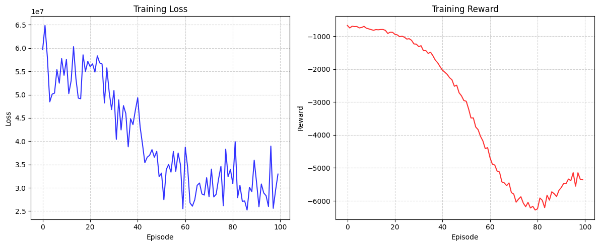

##### 2025-11-09 反事实共振情况

**实验**配置规范化反事实流程

1. 先验观测学习, 以经纬度为条件变分推断观测信号
2. 利用观测信号得到智能体在当前时步所有动作的 $r_t + \gamma v(s')$
3. 计算全动作估计器, 或是单动作估计器, 进行优化

- 奖励震荡, 或是崩溃式下降, 没有有效学习

- 引入反事实推断并增加数据量后, 虽然奖励在下降, 但是*相当平滑*

**另外**有一个奇异的现象: 当不进行反事实推断, 而是只对数据集动作进行优化, 且对智能体施加偏移惩罚

- $$
  D_{KL}(\pi(A \mid H) ~||~ p^D(A))
  $$

  则, *奖励会迅速增加且变为nan*, 似乎是一种类似*「共振」*的现象发生

- 共振现象揭示了数据集中 *存在分布偏移* 的有力现象, 值得讨论

**关于**视野问题

- 注意到我们是 *离线环境*, 因此需要发挥出离线的优势, 在阅读论文` Counterfactual Multi-Agent Policy Gradients, Jakob N. Foerster1`时, 注意到 *「视野」* 一词, 这相当重要: 我们使用AC框架就是因为, C可以引入非因果的额外信息, 类似于开挂, 而A则接受这些额外信息进行训练, 然而, A是实际执行者, 它不受开挂影响, 这样它实际使用时时正常的, 类似于用外挂标准来训练一个玩家

  由于在一次评估时, 星图和现场 $E(t)$ 是已知的, 只是无法获得当时现场的非因果情况, 例如 $E(t+dt) \rarr O(t)$, 这种就需要预测推断了, 如果我们认为: 观测不过是对一种上层的大分布进行一次条件采样
  $$
  \hat{o} \sim p(o \mid c)
  $$
  我们就可以对这种分布进行拟合

- 一种用法就是, 在当前时步评估时, 我们仍然利用A-star算法, 计算出多条其他路径, 这个不需要观测, 且由于现场是已知的, 我们可以以一种真正「反事实」的方式开挂获取智能体「假如」采取的行动后果, 这样可以大大提高Critic的准确度

  - 这样的问题就是, 算法不具备方法泛化性, 即我们必须实现实现数据集的规划器 $\lambda$

  -  一种可行的泛化方法是: 利用一种图泛化的神经网络(即, 可以输入任意尺寸的图数据), 并拟合这种规划行为, 得到后验规划器 $\hat{\lambda}$, 那么假设我们具有了一个模仿的规划器

  - 或是进行模仿学习, 即先模仿数据集中的规划器得到一个策略

**讨论**数据集中分布偏移问题

- 利用A-star或是其他任何算法搜集数据, 它都是有偏的

  找到完全客观的地方: 动作策略. 数据集由策略完全支配
  $$
  p^{\pi_\beta}(s, a) = d^{\pi_\beta}(s)\pi_\beta(a \mid s)
  $$
  因此我们实际计算 
  $$
  \nabla J = \mathbb{E}[\nabla \ln \pi(A_t \mid S_t)(q(S_t, A_t)-v(S_t))]
  $$
  或者
  $$
  \nabla J = \mathbb{E}[\sum_{a \in \mathcal{A}} \nabla \pi(A_t \mid S_t)q(S_t, a_t))]
  $$
  时, **这里的动作和状态分布根本不是由动作策略达成的, 而是由数据集动作达成**, 这存在分布偏移

  简单说, 就是不同的概率密度是不可能导出相同的数学期望的, 那么 **我们对策略梯度的估计就是完全错误的**

- 反事实推断时, 发生了什么?

  首先, 在 t 时刻, 做出反事实推断, 我们认为, 此刻的环境由先前所有的动作和动作的结果构成
  $$
  E(t) = f(H(t)) = f(\{x_0, a_0, y_0, x_1, a_1, y_1,...\})
  $$
  随后, 假如我们做出了不一样的动作 $a'$, 那么我们也会在环境的基础上, 获得应有的反馈
  $$
  y_t' = f(a_t', E(t))
  $$
  包括我们计算的轨迹回报, 这些都没有问题, 关键在于:
  $$
  \nabla J(\pi) = \mathbb{E}[\sum_{a \in \mathcal{A}} \nabla \pi(A_t \mid S_t)q(S_t, a_t))]
  $$
  中, 我们必须给出造就该环境的 $\pi(A \mid S)$, 否则, 我们计算的期望就是错误的, 回顾动作值函数的定义:
  $$
  q_\pi(s, a) = r(s, a)+\gamma \sum_{s^{\prime} \in S} p\left(s^{\prime} \mid s, a\right) v_{\pi}\left(s^{\prime}\right)
  $$
  其中, 值函数定义为
  $$
  v_\pi(s') =\sum_{a \in A} \pi(a \mid s')\left(r(s', a)+\gamma \sum_{s'' \in \mathcal{S}} p\left(s'' \mid s', a\right) v_{\pi}\left(s''\right)\right)
  $$
  可以看到, **动作值函数-值函数系统, 是由动作策略支配下的自举系统**

  那么, **决定策略梯度估计的关键就是策略分布**, 例如, 我们分别从环境中得到了四个动作的值函数 $[q_1,q_2,q_3, q_4]$, 但如果数据的采集者根本不是 $\pi$, 那么, 我们计算的 $q$ 和 $\nabla J$ 就完全不正确

- 解决这种分布偏移问题

  关键在于: 我们必须正确计算 $q(s,a)$, 回顾定义
  $$
  q_\pi(s,a) = \mathbb{E}_{A_t, S_t \sim p(S, A)}[\sum_{k \ge t}\gamma^{k-t}r_k \mid S_t = s, A_t=a]
  $$
  即, 它应当是在策略 $\pi$ 支配下, 采集的轨迹回报之和

  简单来说, 值函数和策略是一一对应的, 这也是 $q_\pi$ 的下标 $\pi$ 的含义, 如果策略改变, 那么值函数不再适用

  另外, 在计算策略梯度时, 也注意到指标 $J(\pi)$ 中的自变量, 表明必须使用配套的策略分布进行加权

  

  回顾: 值函数的自举能否正确反映数据集中的值函数?
  $$
  \omega = \arg \min_\omega ||r +\gamma \max_{a'} q_\omega(s', a') - q_\omega(s,a) ||
  $$
  
  - $q_\omega(s,a)$: 数据集中已存在的状态对
  - $\max_{a'} q_\omega(s', a')$: 经 $(s,a) \rarr s'$ 转移后的最优动作

