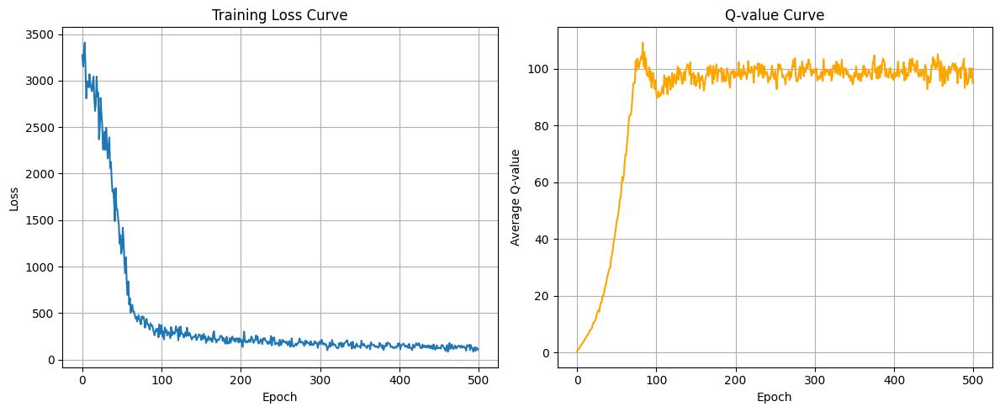
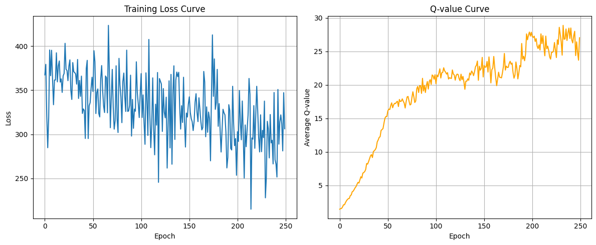
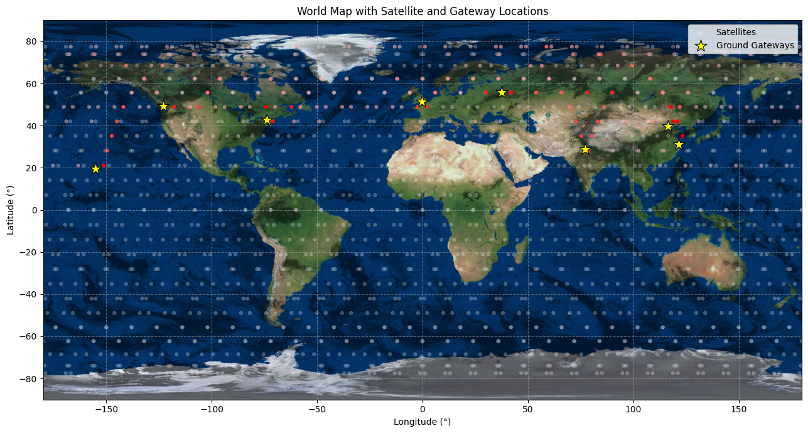

##### 2025-11-12 新的实验结果

**实验现象**

- 离线DQN在反事实引导下学习的较好, 关键在于:
  $$
  q(x,a) \larr r_t+ \gamma \max_a q(x', a)
  $$
  中的目标最大q是不需要进行梯度下降的, 那么它就可以通过反事实查询得出

**问题**

离线反事实的工作结果并不好

它显著地增大了时延, 以及丢包率

包流动倾向于随机, 虽然有数个包可以到达目标, 这表明了DQN学习到了一定的方向, 但是其整体仍然倾向于随机流动

**问题分析**

- 分支1: 

  由于DQN的工作严格依赖于协变量x, 这个协变量是通过统计一个时隙内的节点平均值得到的, 在这个 *环境* 下DQN进行了学习

  然而, 在实际工作场景中, 如果让DQN完全决策, 那么它所塑造的环境就不是A-star塑造的, 那么它就无法根据实际协变量决策

  关键在于: DQN是否学习到了依据协变量进行**客观决策**的能力

  **解决方案:** 考虑将节点状态*定格并恢复*, 再看看DQN的工作结果

- 分支2:

  数据量过少, 并不是指一个时隙内的数据量过少, 而是没有搜集多个时隙的数据

  在单一时隙内学习的DQN, 只能根据当前的环境上下文学习, 这使得其难以学习到客观知识

  即, 它并不清楚实际是应该走负载低的路线, 而是从其他地方取巧提升了Q值

  **解决方案:** 考虑搜集多个时隙的数据, 并轮次训练DQN, 使其总体Q最大

- 分支3:

  DQN并不完全忠实于A-star的结果, 它学习的不够客观

  能否改进奖励模型, 使其能够强化根据坐标的引导学习, 至少能够先学会把数据包送到目标节点, 即实现A-star的克隆

  需要注意的是, DQN的工作结果严格依赖于协变量, 这表明其工作环境必须严格依赖于数据集分布

  **解决方案:** 当初始环境中, 大多数节点的协变量都是0时, DQN显然不能很好工作

另一些扩展方案:

- 讨论1:

  由于目前的反事实框架已经相当完备, 实际上可以尝试其他方法

  就目的论而言, 方法并不是死的, DQN只是一种尝试

  诸如离线AC也可以尝试, 因为我们的反事实框架实际上就是在离线环境中模拟真实情况

  故事反正也讲好了

- 讨论2:

  或许可以让DQN或者一个Actor给出一个真正的「反事实」情况, 即, 如果不采取数据集中的动作, 那么是否能获得更高的回报

  或许可以输出一个二分类概率, 使得A-star在路由规划时, 同时根据协变量进行推断是否要走路由推荐的路径

  如果为否, 那么就根据具体的策略或是随机地选择其他路径

  将问题简化为了二分类问题

  **2025-11-12 note: 或许这个才是最佳的答案** 

- 讨论3:

  不行就造呗, 大不了梭哈

##### 2025-11-13 尝试

今天会尝试两种思路

1. 尝试恢复节点状态, 随后再执行训练好的DQN, 让DQN误以为自己还在当时的环境中

2. 尝试Astar引导方案

   - 方案1: 

     DQN架构, 需要我们在训练时将非反事实的奖励用真实的数据搜集, 而反事实路径则用反事实数据进行

     在实际决策时, 会同时参考两个算法的意见

   - 方案2:

     转为AC架构, Actor给出是否要参考AC方法

###### 问题简化

今日对于问题的理解又有了新的进展, 

即, 将问题简化为: 条件路径规划算法

在Astar的基础上, 为每一个节点施加一定的属性, 这个属性就是观测属性, 卫星除了要走捷径, 还要兼顾所走过的节点的积累属性

类似于变分问题, 我们将一个时隙内的节点平均冻结, 视作每个节点的属性

**观察**

1. 如果使用DQN自举优化, 会发现奖励越来越少, 但如果使用AStar反事实优化, 则会产生幻觉

2. 给AStar加入一定的随机性会降低时延, 这是因为降低了热点地区的系统延迟

3. 将网络简化为1500星(30*50)会发现, DQN其实还是学习到东西了的, 只是仍然逃不过踩坑以及绕远问题

   我将这种现象理解为, DQN仍然没有学习到某种有效知识, 或许是状态空间表示的不好? 还是奖励函数引导的不好

**尝试**

当务之急: 需要将中心节点的信息也加入到观测变量中, 因为AStar的引导就是通过中心算出来的

另外, AStar的引导参量也可以加入到其中, 例如到当前节点的累积成本等

