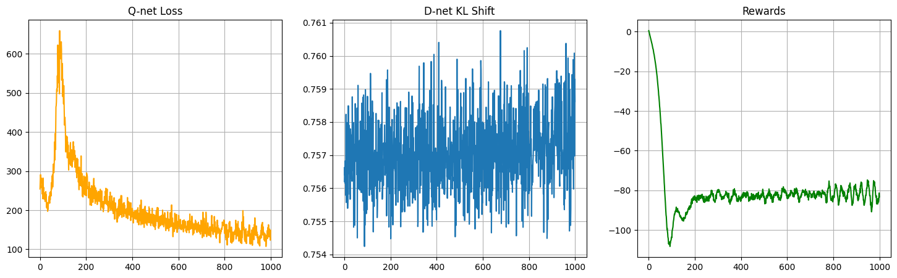
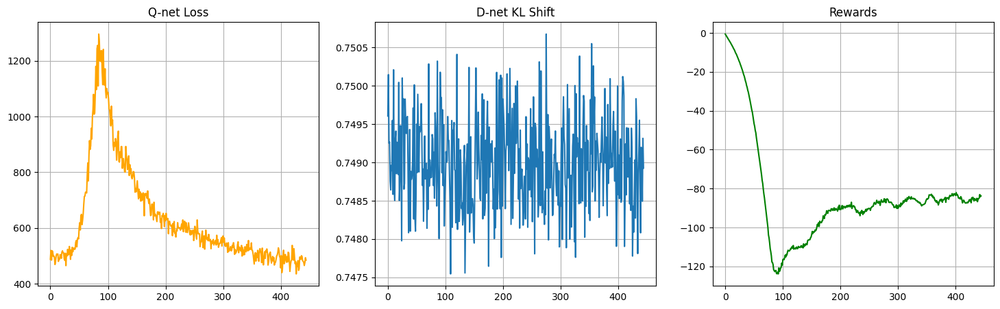

##### 2025-11-20 跑通了, 奖励也在上升

###### 关于后期出现拉扯情况的分析

无论参数怎么调整, 后期都会出现拉锯战, 即虽然loss均值还是下降的, 但是奖励开始在一个恒定基线上下波动

其原因或许是提升性能的根本

猜想1: 数据量不够

这里指的不是数据的数目, 而是数据覆盖的范围不够

因为Astar搜集的数据的动作是有限的, 即它是固定策略的, 因此, 对于各种协变量, 动作a几乎是固定的

那么, $Q(x,a)$ 做出的反事实查询 $Q(x', a'), (x', a') \notin \mathcal{D}$ 是不准确的

我们可以看到, 后期loss是有波动的, 奖励也随着波动, 因为轨迹回报是根据Q估计出来的, 由于数据覆盖范围小, 导致Q的反事实查询会受到小范围数据的干扰, 那么它的反事实查询值就会波动

那么其估计出的奖励也会波动

猜想2: 终端奖励没有回传

另外, 还有一个重要的因素, 就是终端奖励问题, 我发现一个现象, 就是无论终端奖励设置为多少, 似乎学习出来的奖励曲线都会稳定在-80左右,

那么这就意味着, 终端奖励没有被学习, 算法没有学习到合适的动作分布

###### 关于扰动的合理性

为什么采用扰动, BCQ是为连续情况下设定的, 扰动是为了在避免分布偏移的情况下, 尽可能探索分布周边的动作

如果动作分布远离数据集的动作分布, 那么数据集中的状态访问分布就不匹配, 估计出来的Q或者V都是错误的

那么我们的扰动思路其实也差不多, 就是在离散的基础上让它有一点点变化?

其实不对

如果离散分布非零, 那么只要勤于采样, 我们一定能访问到所有动作, 这和连续情况是不一样的, 连续情况下, 每个动作的概率都是0, 但总体具有分布

这才引出了扰动, 即如果某个动作出现了, 他周围的动作大概会以相同的概率出现

但如果是离散分布, 就没必要扰动, 我们只需要处理Astar的静态决策问题, 即它会产生一个 $\exist x_i \sim X, p(x_i)=0$ 的分布, 这导致有些动作无法访问到, 如果我们强行访问这些动作, 那么我们的状态访问分布就会发生改变

定义:「支撑集」

随机变量 $X \sim p$ 的所有可能取值为 $\mathcal{X}$,  则支撑集 $\mathcal{S} \subseteq \mathcal{X}, ~ \forall x_i \in \mathcal{S}, p(x_i) > 0$

即, 如果采取的动作不在策略支撑集内, 则会产生分布偏移, 而静态方法会产生很小的支撑集, 关键就是如何查询支撑集外的动作值

###### 明确 $Q(x',a')$ 就是在进行反事实查询

这是解决支撑集外值函数查询问题的关键

对于静态的策略方法, 即对于特定的状态 $x$, 它执行一个确定性的动作 $a$, 就分布而言, 它产生支撑集为1的分布

虽然这对于传统RL的探索是一个灾难, 但是对于反事实框架却是一个好事情

假设数据集中, 确定性策略依赖的状态的支撑集较大, 或者说, 是全集, 即我们可以得到任何一个状态, 都可以导出它的策略

那么对于该确定性策略, 如果选择一个支撑集外动作, 那么我们可以知道状态会转移为怎么样

且一定要假设这个状态是非马尔科夫的, 即不会因动作而变化的, 称「静态假设」, 例如Astar根据地理信息决定跳转, 地理信息不会因为动作而改变

那么, 我们可以在新的状态下计算得到新的路径, 这样的反事实路径可以得到一个回报, 这样, 我们就成功访问到了支撑集外的动作

**2025-11-21 克隆模型的验证证实了一项猜想**

静态假设下, 例如由AStar做出的动作集合是可以由地理信息唯一确定的

地理信息(中心经纬, 目标经纬, 邻居经纬)这16维向量可以作为克隆动作的查询器, 且理论上能够达到100%的克隆率

震荡的根源就是反事实查询已经超过数据集的支撑了

在多年前见过这个现象, 利用LSTM对时序数据进行预测, 如果预测步数过长, 就会开始震荡

我对奖励函数的修改是相当起作用的, 震荡现象虽然有, 但是好很多了, 而且奖励其实还是在逐步上升的

