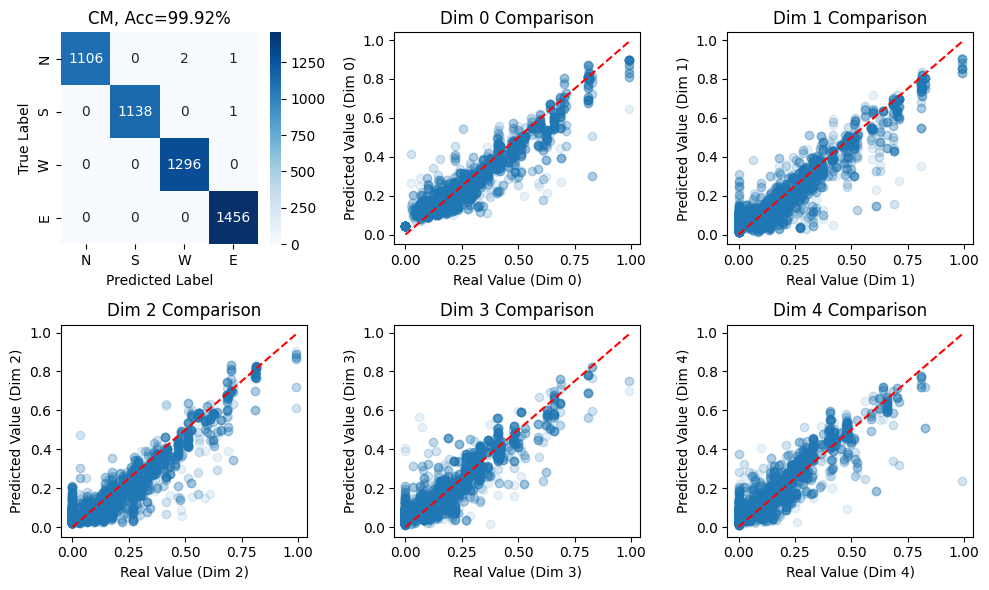
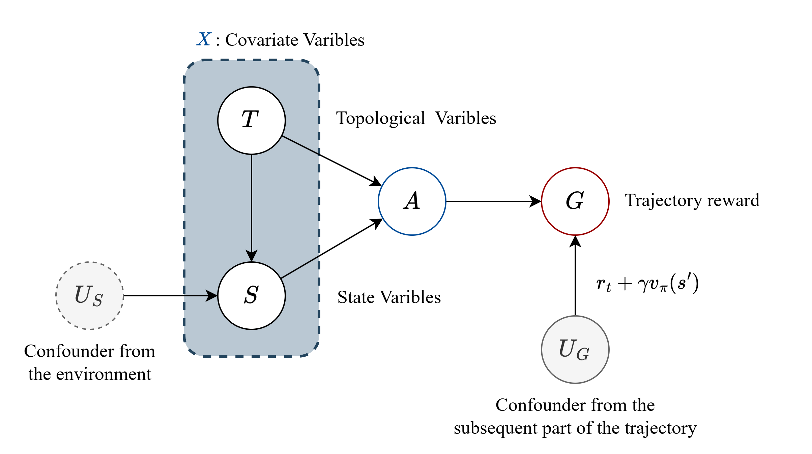
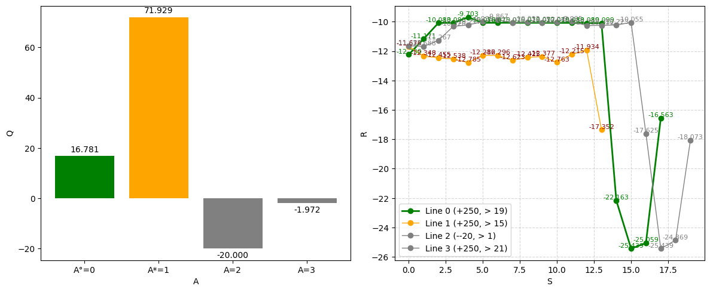

##### 2025-11-24 对于状态向量的预测

残差模型是目前学习的最好的

我可以尝试引入VAE用于噪声推断, 但本质而言, 还是靠经纬度查询起作用

##### 2025-11-21 必须清楚训练的是什么

我们不论是反事实也好, 还是扰动也好

一切都先从克隆模型出发, 因为它是目前唯一证明是对的东西

###### 因果图

我们目前的认为是: 拓扑/位置信息可以唯一决定静态动作, 事实证明拓扑协变量中含有100%的动作信息

现在的背景是:

- 存在一个新的维度: 状态协变量, 它同时需要去影响动作
- 在单一时隙中, 我们认为状态协变量由噪声和拓扑协变量同时决定

问题: **找到一种最佳影响方式, 使得状态协变量可以对拓扑影响下的动作进行影响, 以达到更高的指标**

目前给出的扰动方式为: 超概率叠加

- 克隆模型的最后一步是四维特征向量, 称为超概率

- 其经过softmax后变为实际的概率选择, 扰动模型将其四维输出叠加到超概率上, 随后softmax得到扰动后概率分布

- 在实际做出动作时, 会经过采样后做出动作

  必须采样而不是取最大, 因为在没有状态变量时, 我们是假设状态变量的扰动是一个均匀分布

###### 反事实路径长什么样

- 图中绿色为原始路径, 而黄色为反事实路径
- 反事实路径比原始路径走了更少的跳数, 且获得了比原始路径更高的回报

**关于 $Q$ 函数的学习目标, 我仍然是理解不到位**

- 细看它的输出: $Q(s,a)$, 是一个 $B \times 4$ 的张量输出, 它告诉我们, 在状态 $s$ 下执行动作 $a$ 能拿到的最优/期望回报

- 这里表明了, 动作 $a$ 是已经执行了, 是不可能改变了的, 因此, 拟合目标是
  $$
  Q(s,a) \larr r(s,a) + \gamma \max_{a'} Q(s', a')
  $$
  即, $r$ 无论怎么优化, 它已经是必然得到了的, 如果想让 $Q(s,a)$ 最大, 只能让它获得 $r$ 后续的轨迹得到最大

- 因此, 离线强化学习本质还是监督学习, 探索环境与否, **都是在给出神经网络的监督信号而已**

##### 2025-11-28 一些问题

###### 关于扰动网络给出的结果和Q网络最优结果不同

到底采用谁的结论呢?

或许实验可以给出结论

是否需要一个概率门? 以控制其接受修改的阈值

