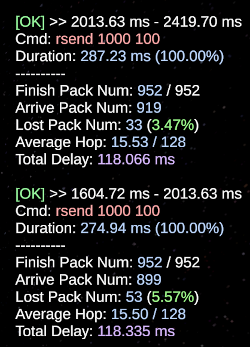

# 首次完全击败Astar

我, 只是个普通的学生

在2025年12月5日 11:40:04, 我首次从数据上完全击败了Astar

我哑然, 但我的确明白我的喜悦

我知道, 真正的科研, 现在才开始

##### 2025-12-08

此后的工作

大体已经打通, 现在有一个关键问题

即, 仅通过一跳邻居的上下文, 我们很难让智能体做出提前规避

最早也只是能够规避一跳, 所以尽管对于丢包率的下降效果很好, 但是时延并没有很好地作用

因此, 我们希望用某种开环的方法, 使得智能体能够学习到某种模式, 而这种模式又可以在实际环境中很好地执行

1. 尝试信息素方法: 

   若卫星路由方向发生过更改, 则根据强度留下信息素

   根据扰动前后的概率向量计算概率方位角, 随后得到叠加信息素
   $$
   h_{t+1} = \rho \cdot h_t + \sum_i \Delta h_i = \rho \cdot h_t + \sum_i \Delta h_c \cdot\frac{1-\cos(\theta_i)}{2}
   $$

2. 负载卷积方法

   通过邻居卷积方法, 将负载信息传播给邻居, 以达到提前感知的目的

