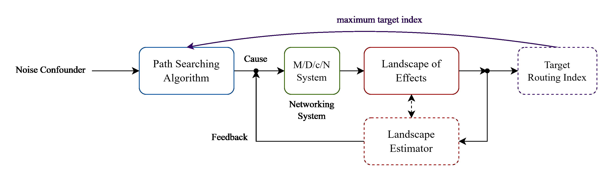

# Gaussian Process/Graph Routing - Research Proposal

#####  Abstract

本工作基于先前路由规划方法的研究, 提出一种基于高斯图/高斯过程的路由启发方法

- 其专注于对卫星路由过程中产生的负载的**地形估计**, 并在此地形上进行路径规划
- 我们不再使用复杂的路由算法, 而是使用Astar作为求解器
- 我们主要目的是, 通过对于特定指标的地形估计, 并闭环控制Astar的启发函数, 从而优化路径
- 最终形成一个闭环控制问题

##### Introdcution

由路由需求作为源噪声, 经过路径搜索方法在排队网络中的作用, 得到负载地形图, 地形图表示在星座网格中, 负载的分布

我们并不能直接得到这样的全局地形图, 然而, M/D/c/N 排队网络天然地构成了局部马尔科夫图, 即高斯图, 因此, 我们可以用高斯过程来拟合多跳邻居的负载分布, 从而得到一个局部的地形估计

在这样局部的地形估计上, 我们将会反馈给路径搜索算法, 或是控制其启发式函数, 以对求解器进行扰动反馈, 并以实现最优化某种指标为无监督训练目标

所需要用到的技术如下:

###### 高斯图模型

高斯图处理多元随机变量(高维随机向量)

当我们关注每个维度之间具有部分的条件独立时, 问题就转化为了高斯图问题

高斯图模型是伊辛模型的连续化

关注两个问题

- 在给定高斯图的情况下, 对于边权重的似然估计
- 潜在高斯图模型的学习问题

###### 玻尔兹曼分布

和高斯图模型具有强关联

###### Astar搜索算法

其搜索方式主要由代价函数和启发函数决定

控制启发函数

