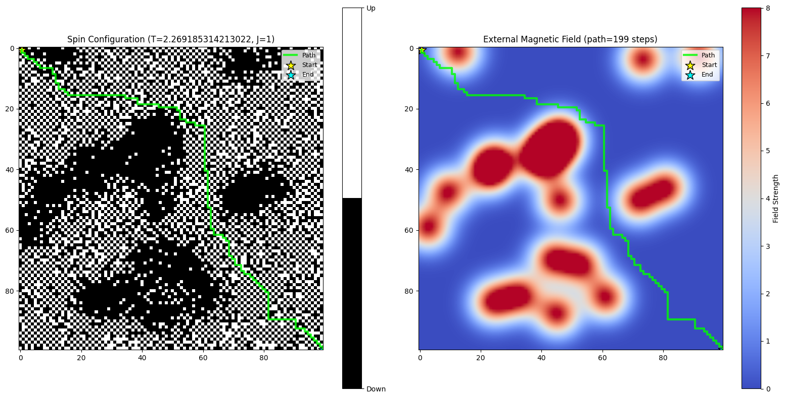
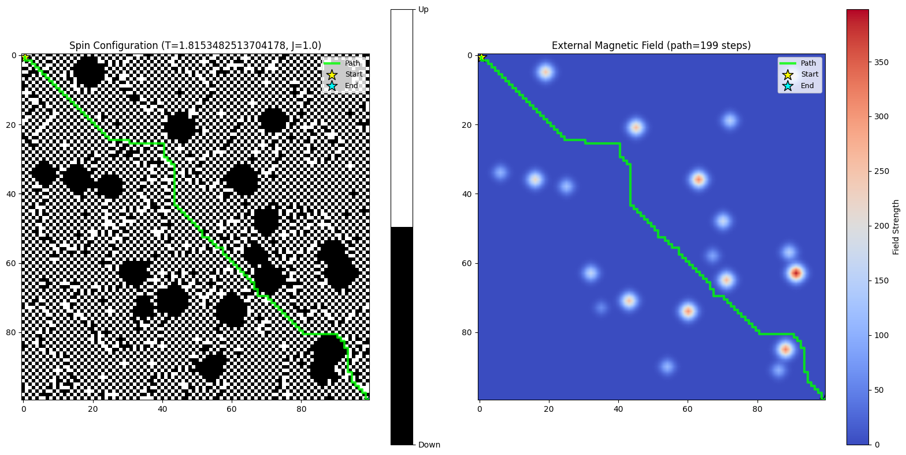
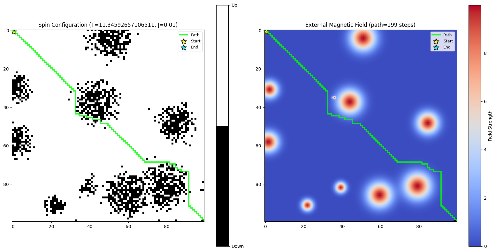

##### 基于局部Ising交互的路由模型

###### Ising 理论构造

*全局构型*

考虑二维格点晶格构造, N个磁针, 具有自旋 $\sigma_i \in \{-1, +1\}$

 设 $\sigma_i$ 表示格点i构型指向的单位矢量, 则哈密顿量:
$$
H(\sigma) = -J \sum_{<i,j>} \sigma_i \cdot \sigma_j - h \sum_i \sigma_i
$$
其构型的联合概率分布服从
$$
P(\sigma) = \frac{1}{Z} e^{-\frac{1}{T} H}
$$
当该分布取最大时, 或哈密顿能量最小化时, 可以正确描述外加指向时的构型分布, 其中, $Z$ 为分配函数, 表示所有构型的指数形态求和, 复杂度 $2^N$
$$
\sigma^* = \arg \max_v P(\sigma)
$$

*局部作用理论*

由于Ising的联合分布中, 分配函数是一个非常巨大的求和, 即对 $2^N$ 个指数进行求和, 这是非常复杂的

从局部而言, Ising模型描述了一种等价的局部表述: **平均场近似**

对于磁针 i, 其邻居的联合作用表述为: 
$$
\bar{H}_i = -J \sum_{j \in Ne(i)} \sigma_i \sigma_j - h \sigma_i
$$
其中：

- 第一项是邻居磁针的耦合贡献, $J>0$ 时倾向于对齐
- 第二项是外磁场的作用。

根据该哈密顿能量计算出玻尔兹曼分布, 表征该磁针的分布概率, 利用拒绝采样方法模拟

*二维Ising模型配合A-star计算路径*

- 问题: 背景噪声会干扰路径计算

  解决方案: 能否使背景均匀, 而磁场作用的区域分布噪声

*二维Ising模型的两种工作模式*

**模态1 [$T^-S^±$]:**

- 这种模态下, 温度低, 初始状态随机

  在磁场作用下, 磁场区域的排列会趋于整齐, 而没有磁场区域的排列会趋于随机

  这是由于, 哈密顿能量在同相排列以及顺磁场排列时更低, 没有磁场作用的区域因为热涨落趋于混乱, 在这样混乱的背景能量(≈0)下, 顺磁场的地方能量更低, 且因为相互作用, 磁场区域的排列会趋于同相(引导作用)

**模态2 [$T^+S^+$]:**

- 在这种模态下, 温度高, 初始状态全部+1

  在磁场作用下, 磁场区域的排列区域随机, 而没有磁场区域的排列为稳定初始状态

  这是由于, 初始同相排列的部分已经处于低能量, 然而由于磁场的作用, 会导致部分磁针翻转, 这种翻转在热涨落下很快扩散为局部的混乱

> 这种局部的混乱可以理解为一种**编码**

*联合扩散方程的场计算*

带衰减的负载场方程, 设场强最大为1, 扩散算子 $\rho(x,y)$
$$
\frac{\part h}{\part t} = \nabla \cdot (\rho(x,y) \cdot \nabla h) - \rho(x,y) \cdot h
$$
离散化扩散方程
$$
h_{t+1}(x, y) = \left(1 - \rho(x,y)\right)\cdot h_t(x, y) + \frac{1}{4} \sum_{(x',y') \in N_4(x,y)} \rho(x',y') \cdot h_t(x',y')
$$
扩散稳定后, 进行Ising更新, 计算局部场
$$
H_{x,y} = -J(\sigma_{x-1,y}+\sigma_{x+1,y}+\sigma_{x,y-1}+\sigma_{x,y+1}) - h_{x,y}
$$
计算能量变化, 当自旋从 $\sigma_{i,j}$ 翻转到 $-\sigma_{i,j}$ 时：

$$
\Delta E_{x,y} = E_{\text{new}} - E_{\text{old}} = 2\sigma_{x,y} \cdot H_{x,y}
$$
Metropolis更新规则
$$
P(\uarr\darr \sigma_{x,y}) = \min\left(1, e^{-\Delta E_{x,y} / T}\right)
$$

###### 路径理论构造

考虑路由请求, 在 $t$ 时刻发起从起点 $a$ 到终点 $b$ 的下一跳请求, 网格拓扑

考虑可能的路径 $L$, 有指标
$$
\mathcal{L}[L] = \int_L (-\mu \cdot(\mathbf{x}^T J \mathbf{x} + \mathbf{h}^T\mathbf{x})+ \lambda) \cdot dl
$$

