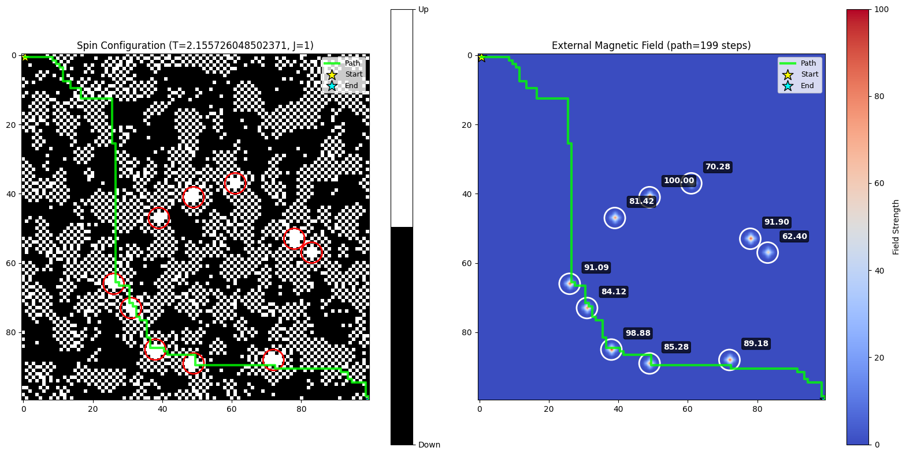
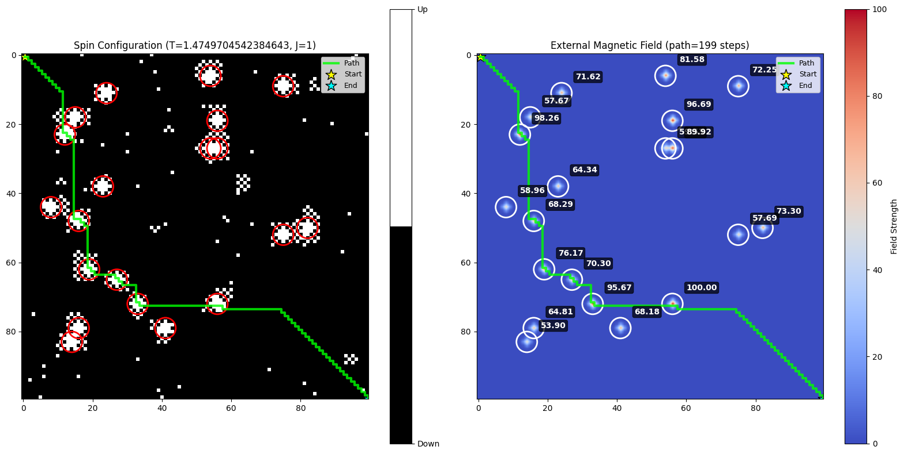
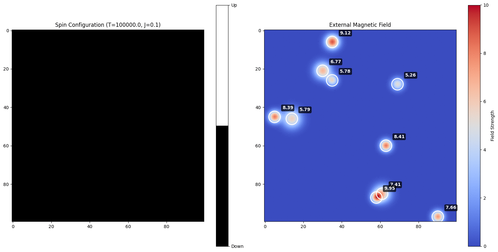
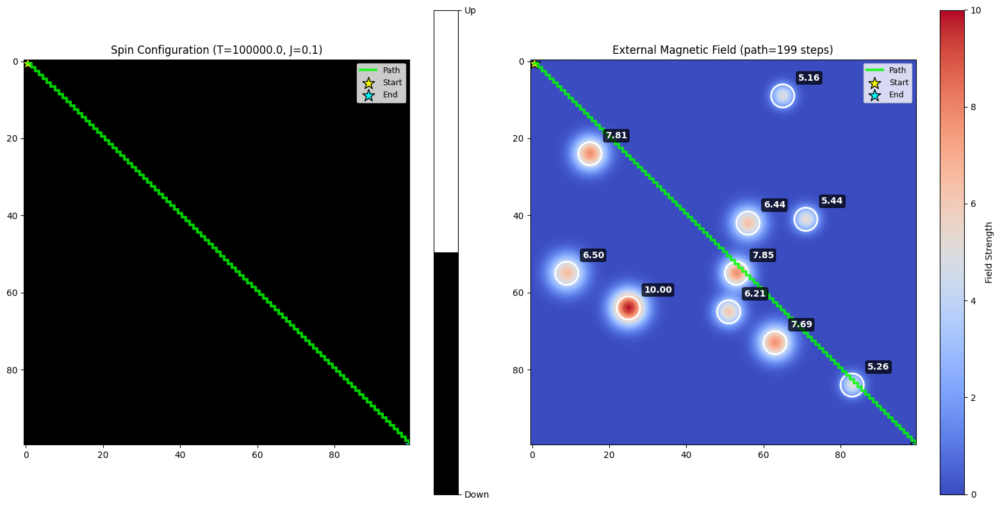

##### Agent架构

*2026-01-22 编写*

我们的架构: 针对低轨卫星星座路由问题, 在星座的卫星节点网格上, 进行分布式路由转发

利用Dueling-DQN架构, 在线学习感知值函数 $v(s)$ 以及优势函数 $A(s,a)$, 利用值函数在每一点处激励一个冲激磁场, 并向周围邻居进行单向扩散, 随后, 这个磁场将会激励网格节点上每颗卫星所维护的磁针状态, 形成Ising模型.

退火阶段, 温度从居里温度逐渐下降, 从一开始的相变状态逐渐转移到单点激活状态, 我们将用Ising局部交互能量来干涉Q函数, 形成策略分布

在Q奖励的基础上, 增加局部能量正则化项:
$$
\pi(a | s) = \frac{e^{\beta[ q(s,a)-\sum_{<i,j>}C \sigma_i \sigma_j}]}{\sum_{a' \in \mathcal{A}}e^{\beta[ q(s,a')-\sum_{<i,j>}C \sigma_i \sigma_j}]}
$$

这表明, 智能体倾向于向更高值函数的其他智能体发送路由数据, 因为高值的地方表示性能更好的地方官

这可以确保智能体收到稠密而非稀疏的奖励信号, 从而在Ising模型启发引导下进行快速的学习.

###### Ising-热扩散 状态传递模型

该部分**利用Ising的局部-全局扩散效应**, 将单点局部的Q状态利用简单的交互作用扩散到周围节点

首先, 其感知周围环境信息, 得到观测向量 $o_t \in \mathbb{R}^{\mathcal{X}}$, 将其投射到动作值输出 $q_t(x_t,a) \in \mathbb{R}^\mathcal{A}$, 可以使用Dueling架构, 同时产生值函数 $v_t(x_t)$

投射sigmiod激活输出 $d_t \in \mathbb{R}^\mathcal{X}$, 计算自注意力, 通过共享参数提取特征并投射到softmax输出 $p_t \in \mathbb{R}^\mathcal{X}$

值函数作为冲激磁场值, 自注意力内积得到单点扩散系数
$$ { }
\delta^h_t(x,y) = v_t(x_t) , ~~~~ \alpha_t(x,y) = \mathbf{p}_t^T\mathbf{d}_t
$$
该冲激磁场对周围邻居在每一时隙内进行热扩散

带衰减的负载场方程, 扩散系数 $\alpha(x,y)$
$$
\frac{\part h}{\part t} = \nabla \cdot (\alpha(x,y) \cdot \nabla h) - \alpha(x,y) \cdot h
$$
离散化扩散方程
$$
h_{t+1}(x, y) = \left(1 - \alpha_t(x,y)\right)\cdot h_t(x, y) + \frac{1}{4} \sum_{(x',y') \in N_4(x,y)} \alpha_t(x',y') \cdot h_t(x',y')
$$
初始边界条件: $h_{t'=t}(x,y) = \delta^h_t(x,y)$

扩散稳定后, 进行Ising更新, 计算局部场
$$
H_{x,y} = -J(\sigma_{x-1,y}+\sigma_{x+1,y}+\sigma_{x,y-1}+\sigma_{x,y+1}) - h_{x,y}
$$
计算能量变化, 当自旋从 $\sigma_{i,j}$ 翻转到 $-\sigma_{i,j}$ 时：

$$
\Delta E_{x,y} = E_{\text{new}} - E_{\text{old}} = 2\sigma_{x,y} \cdot H_{x,y}
$$
Metropolis更新规则, 根据翻转概率进行拒绝采样, 随机对粒子进行翻转
$$
P(\uarr\darr \sigma_{x,y}) = \min\left(1, e^{-\Delta E_{x,y} / T}\right)
$$

###### Dueling-DQN, Ising Regularization 架构

Q网络输出值函数和优势函数, 相加得到动作值函数
$$
Q_{\eta, \alpha, \beta}(s, a)=V_{\eta, \alpha}(s)+A_{\eta, \beta}(s, a)-\frac{1}{|\mathcal{A}|} \sum_{a^{\prime}} A_{\eta, \beta}\left(s, a^{\prime}\right)
$$
选择动作时, 联合动作分布服从玻尔兹曼分布
$$
\pi(a_i | x_t) = \frac{e^{\beta[q_t(x_t, a_i) - \sum_{k \in N_4(a_i)}\lambda \sigma_i \sigma_k)]}}{\sum_{a_j \in \mathcal{A}} e^{\beta[q_t(x_t, a_j) - \sum_{k \in N_4(a_j)}\lambda \sigma_j \sigma_k)]}}
$$
这样的目的是, 使智能体在选择动作时, 能够被局部高Q的智能体吸引, 进而将选择高Q的下一跳智能体

##### 今天的实质性进展

*2026-01-22*

- 实现了参数传递的高斯波包, life=15即可实现比较完美的传递

  实际实现中, 不必用这种方法

- 发现了Ising实现的错误, 最终实现了单位冲激磁场进行扩散

  采用局部高斯效果更加, 只需要1次迭代交互

  Ising传递这种场的效果, 并形成局部状态集合, 寻路算法会被吸引

  代价函数中Clip一下, 就可以让算法忽略孤立的点

- **正式定义参数C和参数B**, Ising-DQN的参数组为 $<J,T,C,B>$

  其中:

  - $J$: 耦合强度, 当 $J>0$ 时, 磁针趋于和周围磁针对齐, 称铁磁耦合
  - $T$: 温度, 温度越高, 热力学涨落越明显, 当 $T_c \approx 2.269J$ 称为 **居里温度**, 此时磁针排布发生 **相变** 
  - $C$: 排布系数: 表示路径上排布能量对Q值进行影响的程度
  - $B$: 排布基态: 表示路径上计算磁针排布能量时对磁针状态的偏移

  关于C和B具有的模态: C<0, 表示在路径上总会被中心区吸引, B>1增加这种吸引程度, B=0表示无视涌现区, B<1表示避开涌现区

  

  

*2026-01-21*

- 验证了退火过程, 随着温度从极高到一个临界值, 高Q区域会开始涌现
- 验证了磁场强度 h_max 会影响Ising扩散过程
- 给策略选择部分加入Ising局部交互能量的正则修正项
- **我的ising模拟是错误的**

