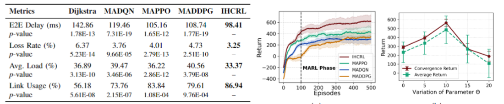

我们评估了IHCRL以及baseline算法在以下路由以及强化学习指标上的表现. 1) 强化学习部分: Episode Return以及随扰动参数 $\Theta$ 变化的Return收敛值以及平均收敛值, 用以比较强化学习收敛性以及参数灵敏度. 2) 路由Qos部分: 随最大到达率 $\lambda_\text{max}$ 变化下的E2E时延, 排队时延, 丢包率, 平均负载以及链路利用率. 结果展示在图1, 表1, 图2

如图1(a)所示, 收敛性实验将会进行50 episodes的预先训练, 此阶段内智能体不会交互以积累原始经验, 随后将启动各个MARL方法的交互. 实验表明the proposed IHCRL achieves higher returns, and the learned policy yields superior cumulative rewards over long-term operation. This indicates that IHCRL exhibits competitive performance in overall training efficacy, effectively optimizing agent behavior in multi-agent tasks such as routing in LEO satellite constellations.

如图1(b)所示参数灵敏性表明, 当 $\Theta=0$ 时, Ising-Field的作用完全被消融, 其效果相当于MADQN及MADDPG之间; 较小的 $\Theta$ 会减弱智能体之间的协同作用, 而Q网络仅靠经验回放是不足以理解POMDP过程并难以收敛至最优; 较大的 $\Theta$ 会增加智能体之间的噪声, 使得训练难以收敛.

表2所示的Routing Qos指标表明IHCRL实现了较为稳定且更好的性能, 其能够保持较低的E2E时延以及丢包率, 并提升链路利用率以及维持较低的负载.

如图2(a)所示, IHCRL在不同的流量注入率情况下实现了最低的端到端延迟, 值得注意的是Queue Delay的占比, 其直接相关于负载并在拥塞时剧烈上升, 而IHCRL仍能实现最小的Queue Delay, 这归功于其路由策略, 通过选择合理的下一跳以及协同效应, 实现了热点区域的负载均衡.

如图2(b)所示, IHCRL实现了最小的丢包率, 从而提升了通信网络整体的可靠性, 尤其是在较大的流量需求下, baseline方法的丢包率剧烈上升, 而IHCRL具有更强的丢包率抑制能力, 表明其具有很强的一致性和鲁棒性。

如图2(c)所示, IHCRL始终能够保持最高的链路利用率, 这和其主动进行负载均衡并将流量从热点区域分散到路由网络的空闲部分有关, 与之对应的则是IHCRL实现了最小的平均负载. 而实现这种全局的负载均衡则需要IHCRL引导下的多智能体之间密切的协同合作. 这些结果验证了IHCRL在动态的低地球轨道(LEO)卫星网络中平衡效率和可靠性的能力。