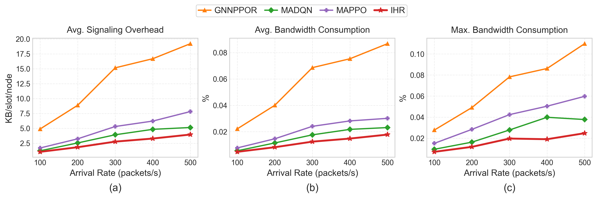
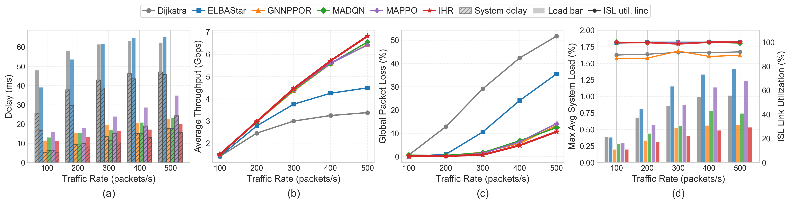
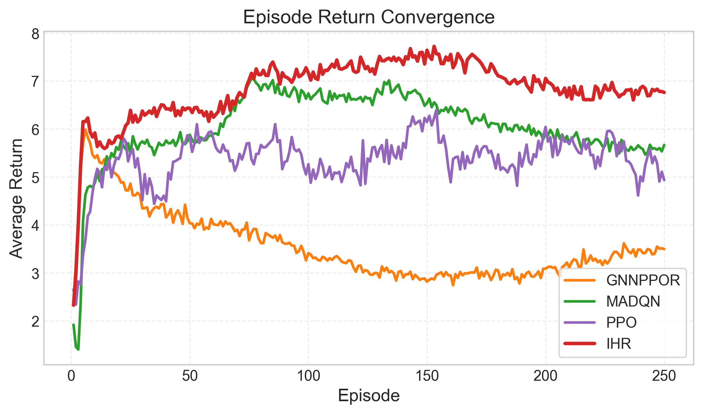
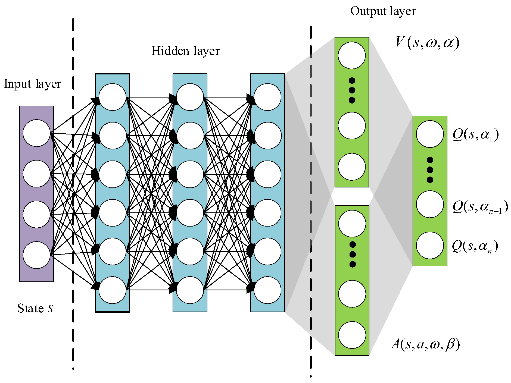
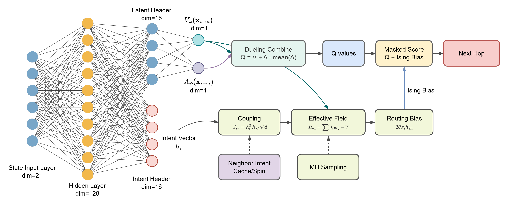
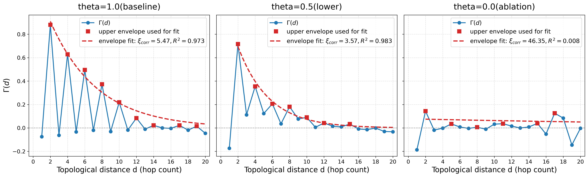

# [NL2026-0217] Response Letter

## Response to the Editor

#### EDITOR COMMENTS:

> The manuscript addresses a relevant topic and proposes an interesting Ising-Heuristic Routing framework for LEO satellite constellations. The reviewers generally acknowledge the novelty of the idea, the clear structure of the paper, and the breadth of the simulation results. However, several technical aspects still require clarification before the paper can be accepted. In the revised version, the authors should carefully address the reviewers’ comments, with particular attention to the communication and synchronization overhead of the proposed scheme, the training/deployment architecture, the assumptions on traffic and link failures, and the consistency of the queueing and link-capacity models. The mathematical role of the Ising mechanism and the claimed long-range cooperation should also be better justified. Finally, notation, figures, and language should be revised for clarity and consistency.

##### Reply:

Dear Editor,

We sincerely thank you and the reviewers for the constructive feedback on our manuscript (NL2026-0217). In accordance with your guidance, we have rigorously revised the manuscript (modifications highlighted in blue).

Below is a concise summary of how we addressed your highlighted technical aspects:

- **Communication, Synchronization & Energy Overhead:** We quantified the IHR payload to exactly **64.125 Bytes** per interaction (consuming an insignificant **0.000178%** of ISL bandwidth) and demonstrated its minimal macroscopic energy footprint. We also clarified that synchronization relies on predictable satellite ephemeris, introducing zero extra network-layer handshakes.
- **Training & Deployment Architecture:** We corrected the misleading terminology to explicitly define our **CTDE (Centralized Training with Decentralized Execution)** architecture. Heavy off-policy training ($O(DH^2)$) is entirely offloaded to ground gateways. Furthermore, empirical robustness to asynchronous update lags was validated using 1-slot delayed states, conforming to asynchronous MCMC Glauber dynamics.
- **Realistic Assumptions on Traffic & Failures:** We completely overhauled the simulation environment. We replaced random failures with deterministic **polar pointing constraints** and dynamic **solar radiation interference** (0%~20% failure). We also verified IHR’s superior robustness under **asymmetric hotspot traffic** and in a massive **1584-node mega-constellation**.
- **Consistency of Queueing & Link Models:** We corrected the queue load mathematical definition to $\rho_i = N_a / N_s$. Moreover, we unified the physical capacity model strictly under the continuous **Shannon capacity formula**, explicitly coupling channel capabilities with queueing delays.
- **Mathematical Role of the Ising Mechanism:** We explicitly justified the necessity of the Ising model over standard MARL/GNNs. We mathematically clarified how our Dueling DQN completely avoids double-counting Value and Advantage. Crucially, we supplemented a new theoretical discussion (Gibbs measures) and a spatial correlation plot (**Fig. 4**), proving that 1-hop MH sampling propagates localized congestion awareness into a macroscopic collaborative bias up to 5~6 hops.
- **Notation, Figures & Language:** We disambiguated overlapping symbols (e.g., using $\mathcal{D}$ for the replay buffer and $D$ for batch size), corrected variable subscripts ($Q_i(t+1)$), updated figure cross-references, and comprehensively polished the manuscript for language and logical flow.

Point-by-point responses detailing all modifications and exact manuscript locations are attached below. We hope these comprehensive revisions fully address all concerns and make the manuscript suitable for publication in *IEEE Networking Letters*.

Sincerely,

Jinhao Yang

## Response to the Reviewers

We thank the reviewers for their critical assessment of our work. In the following we address their concerns point by point.

All modifications in the **revised manuscript** have been highlighted in blue for clarity.

---

### Reviewer 1

#### Reviewer Point P 1.1

> Regarding the claim that MARL methods "exchange raw state tables or high‑dimensional neural network weights," it is noted that recent works (e.g., MAPPO in Ref. [5]) have already adopted parameter sharing and compressed local observation strategies. It would be helpful if the authors could provide a quantitative comparison of the communication overhead between IHR and these state‑of‑the‑art MARL approaches, so that the claimed advantage can be more convincingly demonstrated.

##### Reply:

We sincerely thank the reviewer for this insightful comment. We completely agree that state-of-the-art MARL approaches (such as MAPPO) utilize parameter sharing and Centralized Training with Decentralized Execution (CTDE) paradigms, effectively eliminating the need to exchange high-dimensional neural network weights during the execution phase. Our previous statement in the introduction was imprecise and overstated the communication bottleneck of recent MARL works. We apologize for the confusion.

However, even with compressed local observations, existing MARL frameworks still incur non-trivial communication overhead during decentralized execution. To convincingly demonstrate the claimed advantage of our proposed Ising-Heuristic Routing (IHR), we have explicitly quantified the communication overhead per agent interaction and compared it with the representative MARL baselines evaluated in our work (assuming 32-bit floating-point precision for continuous values):

- **Distributed MADQN/MAPPO approaches (e.g., DRL-MPCR[3] / MAPPO[1]):** To make collaborative decisions, agents in these frameworks typically exchange local state vectors containing physical metrics[3] (e.g., hop count, queuing delay, 1node load, and link reliability). According to the protocol design in recent distributed PPO routing research, exchanging such local observation states generally requires a protocol message size of **100 Bytes** per interaction[1].  
- **GNN-based MARL approaches (e.g., GNNPPOR[2]):** These methods rely on a message-passing mechanism where nodes aggregate hidden states (embeddings) from their neighbors, such as the *message function* $m(\cdot)$ in [2]. With standard hidden dimensions of $64$ or $128$, exchanging these embeddings incurs a payload of **256 to 512 Bytes** per interaction.  
- **The Proposed IHR:** Our method condenses the complex routing intention into a compact $16$-dimensional latent vector combined with a $1$-bit spin configuration. This results in a strictly bounded overhead of **64.125 Bytes** ($16 \times 4 \text{ Bytes} + 1 \text{ bit}$) per interaction.

Therefore, while IHR avoids the massive overhead of exchanging high-dimensional GNN embeddings, it also provides a highly compressed, fixed-size representation that is more communication-efficient than exchanging comprehensive raw state vectors.

##### Action taken:

1. We have revised the inaccurate claim in the **Introduction** to properly acknowledge the parameter-sharing strategies of recent MARL works. 
2. We have added a quantitative comparison of the communication overhead in the **Complexity and Overhead Analysis** section (Section III-D) of the revised manuscript.

#### Reviewer Point P 1.2

> In Algorithm 1, Phase I and Phase II  are executed asynchronously. The paper states that "onboard routing inference is computationally lightweight," but it is not entirely clear whether the training process is also performed on‑board. If on‑board training is indeed employed, the O(DH^2) complexity may be challenging for resource‑constrained satellite platforms. On the other hand, if training is conducted centrally on the ground, the term "fully decentralized" might be somewhat misleading and would benefit from revision. It is recommended that the authors explicitly clarify the training deployment architecture.

##### Reply:

We sincerely thank the reviewer for pointing out this ambiguity. The reviewer’s insight regarding the computational constraints of satellite platforms is entirely correct. We agree that the term "fully decentralized" in the original manuscript was misleading.

To clarify, our proposed IHR framework adopts the **Centralized Training with Decentralized Execution (CTDE)** paradigm.

- **Decentralized Execution (Phase I):** The routing decision-making and the Metropolis-Hastings (MH) sampling are fully decentralized and executed *on-board* by individual satellites. As analyzed in the paper, the forward-propagation inference and the Ising coupling field computation only require lightweight matrix operations, which fit well within the limited computational budget of LEO satellites.
- **Centralized Training (Phase II):** The computationally intensive off-policy training phase including experience replay and TD loss optimization with an $O(DH^2)$ complexity is completely offloaded to the powerful ground gateways (or central controllers). Satellites asynchronously transmit their collected experiences to the ground station. The ground station trains the shared network weights and periodically uploads the updated parameters to the constellation.

Therefore, the satellites are completely relieved from the heavy burden of backpropagation and gradient computations. We have revised the manuscript to explicitly clarify this CTDE deployment architecture and corrected the misleading terminology.

##### Action Taken:

1. We have replaced the phrase "fully decentralized" with "decentralized execution" throughout the manuscript to ensure precise terminology. 
2. We have explicitly clarified the CTDE architecture in the **Section III-C. Ising-Heuristic Cooperative Routing** and **Algorithm 1**
3. We have elaborated on the deployment architecture of Phase I and Phase II in **Section III-D. Complexity and Overhead Analysis**

#### Reviewer Point P 1.3

> Although the paper emphasises "communication overhead" as a key advantage of IHR, no concrete data are reported on this aspect. It would be valuable to include quantitative metrics, such as the number of control message bytes per node per time slot, a direct comparison of communication overhead with MADQN/MAPPO, and the proportion of available bandwidth consumed by the proposed signalling.

##### Reply:

We greatly appreciate the reviewer's constructive suggestion. We entirely agree that providing concrete quantitative data is essential to substantiate our claim regarding the communication efficiency of IHR.

To accurately quantify the communication overhead and its impact on the available inter-satellite link (ISL) bandwidth, we integrated a real-time signaling tracking module into our 2-hour simulation environment. The metrics are recorded dynamically at each time slot $\tau$ for every satellite node $i$. The specific formulations are defined as follows:

- **Control Message Size ($S_{\text{msg}}$):** The fundamental unit of communication overhead is the payload size per interaction. For the proposed IHR, it consists of a 16-dimensional intention vector and a 1-bit spin configuration. Assuming 32-bit floating-point precision, the payload size is fixed at $S_{\text{msg}}^{\text{IHR}} = 16 \times 4 + 0.125 = 64.125 \text{ Bytes}$. For MADQN and MAPPO, exchanging the 21-dimensional state vector and necessary components require $S_{\text{msg}}^{\text{MARL}} = 100 \text{ Bytes}$.

-  **Real-time Signaling Overhead ($O_i(t)$):**

  In our highly dynamic LEO environment, the actual overhead depends on the real-time traffic load and the number of active neighbors. Let $N_{\text{pkt}}(i, t)$ denote the number of packets processed (which triggers signaling exchanges) by satellite $i$ during time slot $t$, and let $\mathcal{N}(i, t)$ represent the set of active neighbor satellites. The total signaling overhead for node $i$ at slot $t$ (in bits) is calculated as:
  $$
  O_i(t) = N_{\text{pkt}}(i, t) \times |\mathcal{N}(i, t)| \times S_{\text{msg}} \times 8 
  $$

- **Bandwidth Consumption Proportion ($\zeta_i(t)$):** According to our system model, the link capacities fluctuate due to dynamic distances and random failures. The total available transmission capacity (in bits) for node $i$ during slot $t$ is the sum of the achievable Shannon data rates $R_{ij}(t)$ across all active ISLs:
  $$
  C_i(t) = \sum_{j \in \mathcal{N}(i, t)} R_{ij}(t) \times \tau
  $$
  Finally, the proportion of available bandwidth consumed by the routing signaling is calculated as the ratio of the total overhead to the total capacity:
  $$
  \zeta_i(t) = \frac{O_i(t)}{C_i(t)}
  $$
  Since $N_{\text{pkt}}(i, t), \mathcal{N}(i, t)$ and $R_{ij}(t)$ are random variables, we conduct simulation experiments for statistical evaluation. During the simulation, we continuously monitor $\zeta_i(t)$ and $O_i(t)$ across the entire Walker-Delta constellation under varying traffic generation rates (100 to 500 packets/s).  

Taking into account the page limits of IEEE Networking Letters, we have supplemented the statistically averaged results of communication overhead as follows.

The results under the peak traffic load (500 packets/s) are summarized below:

| **Algorithm** | **Average Signaling Overhead per Slot (bits)** | **Average Bandwidth Consumption Proportion (%)** | **Max Bandwidth Consumption Proportion (%)** |
| :-----------: | :--------------------------------------------: | :----------------------------------------------: | :------------------------------------------: |
|    GNNPPOR    |                   157,437.1                    |                     0.000868                     |                   0.001098                   |
|     MAPPO     |                    64,085.0                    |                     0.000301                     |                   0.000597                   |
|     MADQN     |                    42,124.3                    |                     0.000231                     |                   0.000377                   |
|    **IHR**    |                  **32,440.7**                  |                   **0.000178**                   |                 **0.000248**                 |

As demonstrated, while all decentralized MARL methods consume a relatively small fraction of the available ISL bandwidth, our proposed IHR achieves the absolute lowest communication overhead. By condensing the routing intention into a compact 16-dimensional vector and a 1-bit spin, IHR generates only about 32.4 kbits of overhead per slot under maximum load, reducing the average bandwidth consumption to a negligible $1.78 \times 10^{-6}$ ($0.000178\%$). This is strictly more bandwidth-efficient than exchanging comprehensive full-dimensional local state vectors (as in MAPPO/MADQN) or high-dimensional graph embeddings (as in GNNPPOR).

##### Action Taken:

Due to the strict page limits, we are unable to include the full mathematical formulations of the real-time signaling tracker in the manuscript. However, we have appended a highly condensed summary of these empirical findings directly into **Section IV-A: Convergence and System Overhead Analysis**.

#### Reviewer Point P 1.4

> The current traffic model assumes independent Poisson arrivals with random destinations, which implicitly corresponds to a spatially uniform traffic distribution. In practice, LEO satellite networks often experience highly non‑uniform traffic patterns due to terrestrial population density and diurnal tidal effects—precisely the scenarios where load‑balancing routing is most valuable. Performance conclusions drawn solely under uniform traffic conditions may not fully reflect the method's effectiveness under actual load‑imbalanced scenarios. It is suggested that the authors either supplement experiments with non‑uniform traffic patterns or explicitly justify the applicability of the proposed method to asymmetric traffic conditions.

##### Reply:

We deeply appreciate the reviewer’s insightful comment. We completely agree that non-uniform and asymmetric traffic (e.g., hotspots driven by uneven population density) is the ultimate touchstone for evaluating a load-balancing routing framework.

Due to the strict page limit of this letter, we are unfortunately unable to add a new experimental subsection or figures into the main manuscript. However, to thoroughly address your concern, **we have conducted the suggested experiments under non-uniform traffic and present the detailed results directly in this response letter.** Furthermore, as suggested, we have added explicit justifications in the revised manuscript regarding the applicability of our method to such asymmetric conditions.

- **Setup:** To simulate realistic diurnal tidal effects, we adopted a non-uniform traffic model. We randomly selected 30% gateways to act as high-density regional hotspots. The traffic generation rate for these hotspots was set to a peak load of $\lambda_{\max} = 500$ packets/s, while the remaining gateways generated background traffic at a uniform rate of $\lambda = 200$ packets/s.

Taking into account the page limits of IEEE Networking Letters, we have supplemented the statistically averaged results as follows.

|  **Algorithm**   | **Average E2E Delay (ms)** | **Global Packet Loss (%)** | **Max Avg System Load (%)** | **ISL Link Utilization (%)** |
| :--------------: | :------------------------: | :------------------------: | :-------------------------: | :--------------------------: |
|     GNNPPOR      |           20.58            |           11.62            |            0.445            |             92.7             |
|      MAPPO       |           27.61            |            5.88            |            0.950            |            100.0             |
|      MADQN       |           17.20            |            3.17            |            0.558            |             96.2             |
| **Proposed IHR** |         **17.15**          |          **3.06**          |          **0.405**          |          **100.0**           |

As observed, handling non-uniform traffic requires a delicate balance between routing detours and localized congestion. While standard MARL baselines like MAPPO attempt to minimize packet loss, they do so at a severe cost: forcing traffic into excessive detours and heavy queue buffering, resulting in a massive spike in E2E delay (27.61 ms) and a near-congestion maximum system load (0.95%).

In contrast, the proposed IHR demonstrates superior intelligent load-balancing. By leveraging the long-range collaborative bias of the Ising model, IHR successfully anticipates congestion and proactively detours traffic in a highly efficient manner. As a result, IHR achieves the **lowest E2E delay (17.15 ms)** and the **lowest maximum average node load (0.405%)** while maintaining 100% ISL utilization. This proves that IHR effectively spreads the hotspot traffic globally, mitigating localized bottlenecks without incurring myopic "ping-pong" detours.

##### Action Taken:

We provided additional descriptions in **"Section IV-B. Routing QoS under Dynamic Traffic"** to report these quantitative metrics.

#### Reviewer Point P 1.5

> The method requires each satellite to exchange intention vectors and spin states with all its neighbours in every time slot. Given the high mobility of LEO satellites, the neighbour set changes frequently, which inevitably introduces signalling overhead and synchronisation costs. These dynamic overheads have not been quantitatively analysed in the current manuscript. It is recommended that the authors provide a quantitative assessment to demonstrate the feasibility of the proposed scheme in a rapidly changing topology.

##### Reply:

We sincerely thank the reviewer for raising this critical point regarding topology dynamics and synchronization costs. The reviewer is absolutely correct that LEO networks experience high mobility and frequent link changes.

To demonstrate the feasibility of our scheme, we address this from two perspectives: a quantitative assessment of the signaling overhead, and a clarification of the synchronization mechanism in LEO networks.

**1. Quantitative Assessment of Dynamic Signalling Overhead:**

As addressed in our response to your previous comment (Point 1.3), we have dynamically tracked the total control overhead in our simulations (which intrinsically includes link disruption and topology changes with a 1% ISL failure probability). At peak traffic load, exchanging the highly compressed 64.125-Byte intention payload (16-dimensional vector + 1-bit spin) requires an average of only **32.4 kbits per time slot per node**. This consumes an insignificant **$1.78 \times 10^{-6}$** of the available ISL capacity. This ultra-low footprint proves that the scheme remains highly feasible even under rapid neighbor changes.

**2. Synchronisation Cost for LEO Satellite Routing:**

Unlike terrestrial mobile ad-hoc networks (MANETs) where neighbor sets change randomly and require continuous "Hello" packet probing, LEO satellite trajectories are highly deterministic. The neighbor set changes can be accurately predicted using satellite **ephemeris**. Therefore, the network layer does not incur additional synchronization or neighbor-discovery handshakes. The 64.125-Byte intention and spin states can be seamlessly piggybacked onto routine MAC-layer beacons or synchronization headers. Consequently, dynamic topology changes do not introduce extra routing synchronization costs.

##### Action Taken:

To explicitly clarify the synchronization mechanism at the network modeling level, we have incorporated the justification regarding ephemeris-driven topology management into **Section II-A. Constellation Architecture and Routing Model** of the revised manuscript (highlighted in blue).

### Reviewer 2

#### Reviewer Point P 2.1

>The constellation dynamics are modelled with a uniform, random link failure probability (Ρfailure=0.01). In practical LEO satellite networks, link disruptions are frequently highly organized or recurring (for example, due to air blockades, solar radiation, or severe pointing angles at polar locations), rather than simply independent and random.

##### Reply:

We sincerely thank the reviewer for this highly insightful and constructive comment. We completely agree that in practical LEO satellite networks, link disruptions are frequently driven by spatiotemporally correlated physical factors—such as polar pointing limitations or solar radiation blockades—rather than being purely independent and random events.

In the original manuscript, since our primary focus is on the decentralized decision-making mechanism of the multi-agent routing framework, the initial uniform random link failure model ($P_{\text{failure}}=0.01$) was utilized mainly to establish a controlled baseline environment to verify algorithmic robustness. As observed in several recent routing studies in the literature[4,5,6], uniform or random disconnection models are commonly adopted as standard benchmarks without explicitly modeling the exact physical causes (e.g., solar radiation or severe pointing angles).

However, we fully acknowledge that incorporating realistic, correlated failure dynamics significantly enhances the practical value and rigor of our evaluation. Inspired by your feedback, **we have entirely upgraded our link disruption model and completely re-run the corresponding experiments.** The key updates are as follows:

1. **Polar Region Disconnections:** We have integrated deterministic link disconnections for satellites traversing high-latitude polar regions, reflecting the severe pointing angle constraints and inter-plane ISL deactivations.
2. **Solar Radiation Modeling:** We have introduced a dynamic disruption probability model based on solar interference. By calculating the angle between the ISL antenna beam and the solar line-of-sight, the link failure probability is now dynamically categorized into five practical levels: **0%, 5%, 10%, 15%, and 20%**, depending on the severity of the solar alignment.

We hope these substantial improvements address your concerns and successfully bridge the gap between algorithmic simulation and practical LEO environments.

In the revised manuscript, the experimental results are shown in the following figure:

##### Action Taken:

1. We have revised **Section II-A (Constellation Architecture and Routing Model)** to detail this new disruption model.
2. We have re-run the corresponding experiments and updated all related Figures and performance metrics in  **Section IV-B (Routing QoS under Dynamic Traffic)**.

#### Reviewer Point P 2.2

>The environment changes across discrete time intervals. Because thermodynamic coupling and MH sampling rely on surrounding states, differing propagation delays over vast distances may result in asynchronous update lags or out-of-sync spin states in practice, which the current methodology does not address.

##### Reply:

We sincerely thank the reviewer for raising this highly insightful and practical point. The reviewer is absolutely correct that in distributed LEO networks, varying propagation delays over vast distances inevitably lead to asynchronous update lags.

To address this practical concern, we clarify the robustness of our methodology from three perspectives: physical time-scale, theoretical thermodynamics, and actual empirical implementation.

**1. Time-Scale Separation:**

In our Walker-Delta constellation, the maximum inter-satellite link distance is bounded such that the electromagnetic propagation delay ($d_{ij}/c$) is typically under $\mathbf{20 \text{ ms}}$. In our system model, the routing update interval (time slot $\tau$) is $\mathbf{1000 \text{ ms}}$. Since the propagation delay is orders of magnitude smaller than the routing cycle, the exchanged states arrive well within the slot boundary.

**2. Robustness of Asynchronous MH Sampling (Theory):** 

From a thermodynamic perspective, strict clock synchronization is not a prerequisite for the Ising model. Aligning with standard Markov Chain Monte Carlo (MCMC) methods, specifically the **single-site Glauber dynamics** [7], asynchronous spin flips are perfectly acceptable and are the standard mathematical approach to simulating Ising models. As rigorously proven by Levin *et al.* [7], such asynchronous, single-vertex updates natively converge to the correct thermal equilibrium distribution. Therefore, slight out-of-sync spin states caused by propagation delays act merely as acceptable thermal noise within the MH sampling process, maintaining the mathematical stability of the macroscopic long-range collaborative bias.

**3. Empirical Validation with 1-Slot Delay (Practice):**

Most importantly, to rigorously account for these synchronization constraints in practice, **our actual simulation experiments were implemented with an explicit 1-slot delay.** Specifically, at the beginning of each time slot, the MH sampling at node $i$ is executed using the intention and spin states collected from its neighbors during the *previous* slot. Despite relying on these explicitly "out-of-sync" (1-slot delayed) states, our learning curves and QoS results demonstrate that the IHR algorithm still steadily converges and achieves superior load-balancing performance. This empirically proves that our methodology is highly tolerant to update lags.

##### Action Taken:

To explicitly address this practical aspect, we have added a dedicated discussion regarding propagation delays, the resilience of asynchronous Glauber dynamics, and our 1-slot delayed implementation in **Section III-C. Ising-Heuristic Cooperative Routing** (highlighted in blue).

#### Reviewer Point P 2.3

>While the research presents a theoretical Big-O analysis of onboard inference complexity (mathematical model), it does not include an empirical evaluation of power consumption. Given that LEO satellites must operate below stringent energy limits, measuring actual CPU/GPU execution energy would considerably improve the study.

##### Reply:

We sincerely thank the reviewer for this highly constructive suggestion. We completely agree that in resource-constrained LEO satellite platforms, theoretical complexity must be corroborated by comprehensive empirical energy evaluations.

Prompted by your valuable feedback, we have conducted an empirical evaluation of the actual onboard energy footprint. To ensure rigor, we adopted the authoritative LEO satellite energy model from recent literature[8]. According to this framework, the total operational energy per routing step ($E_{\text{step}}$) comprises both communication energy ($E_{\text{comm}}$) for RF signaling and computation energy ($E_{\text{comp}}$) for onboard CPU inference:
$$
E_{\text{step}} = E_{\text{comm}} + E_{\text{comp}} = P_t \frac{S_{\text{msg}}}{R_{ij}} + C_{\text{inf}} f_i^2 \nu
$$
where $S_{\text{msg}}$ is the message payload size, $C_{\text{inf}}$ is the required CPU cycles for inference, $f_i$ is the CPU frequency, and $\nu$​ is the switched-capacitance coefficient. Following the exact settings in [8], we configured the satellite hardware parameters as follows:

- **Battery capacity ($B_{max}$)**: $40,000 \text{ J}$
- **CPU frequency ($f_i$)**: $2.0 \text{ GHz}$ (average of the standard $[1, 3] \text{ GHz}$ range)
- **Switched-capacitance coefficient ($\nu$)**: $10^{-28} \text{ J/Hz}^3$

The traffic is set at $\lambda=200 \text{ Packets/s}$, and 60 slots out of it are selected to evaluate the system-level energy burden by measuring the ratio of the average slot-level routing energy consumption to the total battery capacity ($\eta = E_{\text{slot\_avg}} / B_{max} \times 100\%$).

Taking into account the page limits of IEEE Networking Letters, we have supplemented the statistically averaged results of communication overhead as follows.

|  **Algorithm**   | **Avg Step Energy ($E_\text{step}$)** | **Total Inference Count** | **Avg Slot Energy ($E_{\text{slot\_avg}}$)** | **Battery Energy Ratio (η)** |
| :--------------: | :-----------------------------------: | :-----------------------: | :------------------------------------------: | :--------------------------: |
|     GNNPPOR      |               2.075 mJ                |          208,802          |                   7.220 J                    |           0.0180%            |
|      MAPPO       |               1.607 mJ                |          216,861          |                   5.809 J                    |           0.0145%            |
|      MADQN       |               1.663 mJ                |          187,060          |                   4.872 J                    |           0.0121%            |
| **Proposed IHR** |             **1.580 mJ**              |        **167,591**        |                 **4.692 J**                  |         **0.0117%**          |

**Justification for the Energy Efficiency:**

1. **Micro-Level Computation:** While GNNPPOR consumes the highest step energy (2.075 mJ) due to massive high-dimensional matrix multiplications during graph message passing, IHR relies on lightweight thermodynamic mechanics (e.g., vector dot-products). This ensures its step energy remains lower (**1.580 mJ**), highly comparable to shallow MLPs.
2. **Macro-Level System Routing (The Core Advantage):** More importantly, because IHR achieves superior long-range collaborative routing, it effectively eliminates myopic detours and "ping-pong" effects. This is evident from the **Total Inference Count**, where IHR requires significantly fewer routing forwards (167,591) compared to MAPPO (216,861) to deliver the same traffic. The combination of lightweight per-step computation and drastically reduced network-wide hops allows IHR to consume the **lowest average slot energy (4.692 J)** and the **smallest fraction of battery capacity (0.0117%)**, proving its unmatched feasibility for energy-constrained satellites.

##### Action Taken:

To highlight these crucial findings, we have replaced the previous sensitivity analysis with a new subsection, **Section IV-A: Convergence and System Overhead Analysis**. The revised manuscript now includes a dedicated figure and a highly condensed paragraph detailing the empirical step-energy evaluation, the total inference counts, and the macroscopic energy efficiency of IHR over MARL and GNN baselines.

#### Reviewer Point P 2.4

>The simulations were carried out just on a single Walker-Delta constellation architecture (16x 24 = 384 satellites). Validating the IHR framework against enormous mega-constellations (e.g., thousands of nodes) is required to ensure that the macro-level long-range alignment is stable and free of regional path oscillations.

##### Reply:

- We sincerely thank the reviewer for this highly insightful comment. We completely agree that scalability and stability in massive mega-constellations are critical metrics for next-generation LEO routing frameworks. Regional path oscillations (often known as the "ping-pong" effect) are a notorious challenge when deploying dynamic load-balancing routing in networks with thousands of nodes, especially under heavy traffic loads.

  Prompted by your constructive suggestion, **we scaled up our simulation environment to an enormous mega-constellation (modeled after the Starlink Phase 1 architecture with 72 orbital planes $\times$ 22 satellites = 1,584 nodes).** To rigorously evaluate the stability under varying stress levels, we configured the traffic injection at two distinct rates: a light background load ($\lambda = 100$ packets/s) and a severe peak load ($\lambda = 500$ packets/s).

  Taking into account the page limits of IEEE Networking Letters, we have supplemented the statistically averaged results of communication overhead as follows.

  - **Training Stability/Convergence**: Firstly, the IHR method achieved excellent training stability/convergence in the expanded constellation network, and was able to continuously receive rewards and search for better strategies.

    

  - **Results under Light Load ($\lambda = 100$):** All algorithms successfully discover paths with minimal delay (e.g., IHR achieves 6.42 ms) and near 100% delivery. The network remains largely uncongested, and no significant oscillations are observed.

  | **Algorithm** | **Avg E2E Delay (ms)** | **Throughput (Gbps)** | **Packet Loss (%)** | **Max Avg System Load (%)** |
  | :-----------: | :--------------------: | :-------------------: | :-----------------: | :-------------------------: |
  |   Dijkstra    |         27.14          |         1.402         |        0.05         |            0.093            |
  |   ELB-Astar   |         25.53          |         1.390         |        0.00         |            0.097            |
  |    GNNPPOR    |          9.65          |         1.455         |        0.01         |            0.048            |
  |     MAPPO     |          9.42          |         1.473         |        0.00         |            0.056            |
  |     MADQN     |          7.86          |         1.477         |        0.00         |            0.071            |
  |    **IHR**    |        **6.42**        |       **1.494**       |        0.00         |          **0.043**          |
  
  - **Results under Peak Load ($\lambda = 500$):** As shown in the actual simulation data below, heavy traffic instantly triggers cascading congestion. Traditional shortest-path algorithms (Dijkstra) suffer from severe routing oscillations, as deterministic rerouting causes localized bottlenecks to rapidly shift back and forth. While standard MARL stabilizes the network better, our proposed IHR framework consistently achieves the highest stability, lowest delay, and maximum packet delivery ratio.
  
  | **Algorithm** | **Avg E2E Delay (ms)** | **Throughput (Gbps)** | **Packet Loss (%)** | **Max Avg System Load (%)** |
  | :-----------: | :--------------------: | :-------------------: | :-----------------: | :-------------------------: |
  |   Dijkstra    |         45.79          |         6.39          |        8.485        |            0.418            |
  |   ELB-Astar   |         37.68          |         6.86          |        0.331        |            0.496            |
  |    GNNPPOR    |         12.87          |         7.32          |        0.135        |            0.244            |
  |     MAPPO     |         12.52          |         7.41          |        0.169        |            0.234            |
  |     MADQN     |         10.69          |         7.43          |        0.176        |            0.276            |
  |    **IHR**    |       **10.41**        |       **7.46**        |      **0.028**      |          **0.211**          |

##### Action Taken:

Taking into account the page limits of IEEE Networking Letters, we have added a concise discussion on the scalability and stability in mega-constellations to **Section IV** to address this concern.

### Reviewer 3

#### Reviewer Point P 3.1

>The motivation is not sufficiently focused. The paper mentions limited observations and delayed information propagation in MARL routing, but it does not clearly justify why an Ising model is necessary. Its advantage over cooperative MARL, GNN-based routing, and load-aware routing remains unclear.

##### Reply:

We sincerely thank the reviewer for pointing out this critical issue. We completely agree that the unique necessity and specific advantages of the Ising model over existing advanced baselines should be explicitly justified to strengthen the motivation of this work.

Following your insightful comment, we have thoroughly rewritten the motivation paragraphs in the Introduction. To clearly justify *why* the Ising model is necessary, we have systematically compared its fundamental mechanisms against the three paradigms you mentioned:

1. **Advantage over Traditional Load-Aware Routing:** Traditional load-aware routing (e.g., dynamic Dijkstra) relies on deterministic, greedy route switching, which frequently triggers massive "ping-pong" oscillations (herd behavior) under heavy traffic. In contrast, the Ising model operates on thermodynamic principles. Its probabilistic Metropolis-Hastings (MH) sampling naturally drives the global traffic distribution toward a smooth thermal equilibrium, intrinsically immunizing the network against macro-level route oscillations.
2. **Advantage over Cooperative MARL:** While cooperative MARL (e.g., MAPPO) can mitigate delayed information propagation, it requires exchanging massive full-dimensional state vectors, suffering from the curse of dimensionality and severe signaling overhead in rapidly changing topologies. The Ising model uniquely resolves this by compressing complex routing intentions into an ultra-lightweight 1-bit spin state. It mathematically achieves macroscopic long-range collaborative bias through extremely low-overhead local interactions.
3. **Advantage over GNN-based Routing:** GNNs capture long-range dependencies but heavily rely on high-dimensional feature embeddings and computationally expensive matrix multiplications during message passing, which rapidly drain LEO onboard batteries. The Ising model achieves similar long-range spatial correlations but replaces massive neural network forward passes with physical thermodynamic mechanics—specifically, lightweight vector dot-products and scalar exponentiation. This drastically reduces onboard computation energy.

In summary, the Ising component is necessary because it acts as the perfect bridge: it achieves the global coordination capability of GNN/MARL while preserving the ultra-low communication and computational overhead of simple heuristics, making it exclusively suited for resource-constrained, dynamic LEO mega-constellations.

##### Action Taken:

We have fundamentally revised the motivation section in the **Introduction (Section I)** to explicitly articulate these three comparative advantages and clarify the necessity of the Ising model (highlighted in blue).

#### Reviewer Point P 3.2

>Some contributions appear overstated. The paper claims long-range correlation and global cooperation, while the information exchange is only between one-hop neighbors. The presented results show correlation induced by local coupling rather than a rigorous demonstration of long-range correlation.

##### Reply:

We sincerely appreciate the reviewer’s rigorous and insightful scrutiny. We fully acknowledge that the primary motivation of integrating the Ising model was to develop a physics-inspired heuristic framework (analogous to Simulated Annealing or Genetic Algorithms) to facilitate routing performance. We agree that our original manuscript lacked a rigorous mathematical justification for how 1-hop information exchange leads to long-range correlation.

Prompted by your valuable comment, we clarify that the "long-range correlation" claimed in our paper refers to the **emergent statistical alignment** inherent to the Ising model's thermodynamics.

**Mathematical Justification of Long-Range Correlation via Local Coupling:**

In statistical mechanics, the classic Ising model is strictly defined by nearest-neighbor (1-hop) interactions. The local Hamiltonian is $H = - \sum_{\langle i,j \rangle} J_{ij} \sigma_i \sigma_j$, where the coupling $J_{ij}$ is non-zero only for directly connected neighbors. However, it is a fundamental theorem in statistical physics that these purely local couplings naturally induce macroscopic long-range correlations globally.

Specifically, the state of node $i$ affects its neighbor $j$, which in turn alters the effective field for node $i+d$, creating a propagation chain. Mathematically, the two-point correlation function between distant nodes $i$ and $i+d$ (separated by $d$ hops) is defined as:
$$
\Gamma(r) = \langle \sigma_i \sigma_{i+d} \rangle - \langle \sigma_i \rangle \langle \sigma_{i+d} \rangle
$$
Under thermodynamic evolution, $\Gamma(d)$ does not instantly drop to zero for non-neighbors. Instead, it propagates over a distance characterized by the **correlation length $\xi$**.
$$
\Gamma(d) \sim e^{-d/\xi}
$$
In our design, the external field is driven by the state-value function $\overline{V}(\mathbf{x}_i)$, and the 1-hop coupling is defined by $J_{ij}$. According to our Eq. (3), the single-spin flip probability follows the Metropolis-Hastings (MH) criterion: $P = \min(1, \exp(-2\beta\sigma_i \sum_j h^{\text{eff}}_{i \rightarrow j}))$.

Mathematically, this specific localized, asynchronous MH update is exactly equivalent to **Glauber dynamics**. As rigorously proven in statistical mechanics and probability theory (e.g., by Levin *et al.* [7]), such localized Glauber dynamics inherently drives the entire distributed system to converge to a **global stationary distribution (the global Gibbs measure)**. By reversely integrating the energy difference $\Delta \mathcal{H}$ from our Eq. (3), the global probability distribution of the spin configuration $\boldsymbol{\sigma}$ in our system is strictly derived as:
$$
P(\boldsymbol{\sigma}) = \frac{1}{Z} \exp\left( \beta \sum_{\langle i,j \rangle} J_{ij} \sigma_i \sigma_j + \beta \sum_{i} \overline{V}(\mathbf{x}_i) \sigma_i \right)
$$
Under this global Boltzmann distribution, the spin states of distant nodes $i$ and $k$ (separated by $r$ hops) become statistically entangled. When localized congestion occurs, it dynamically alters the 1-hop coupling $J_{ij}$ and local value $\overline{V}(\mathbf{x}_i)$. The continuous MH sampling propagates this perturbation across the network. Because our final routing action $a_i^t$ (Eq. 4) is sampled by coupling the Q-function with this globally correlated effective field $h^{\text{eff}}$, the routing policies of distant satellites are statistically aligned long before they directly experience the congestion. This achieves mathematically rigorous "long-range collaborative bias" via strictly 1-hop information exchange.

##### Action Taken:

1. We have toned down the phrase "global cooperation" to more precise terms such as "macroscopic collaborative bias" to avoid misunderstandings.
2. We have added a dedicated theoretical discussion in **Section III-C** to explicitly provide the mathematical justification of the global Gibbs measure and long-range correlation induced by local Glauber dynamics (highlighted in blue).

#### Reviewer Point P 3.3

>The queue load definition is inconsistent. The paper defines `ρ_i = N_s^i(t) / N_a^i(t)`, i.e., service over arrivals, but uses `0 ≤ ρ_i < 1` as the stability condition. Normally, load is arrival rate over service rate. This affects the meaning of the state features, constraints, and reward function.

##### Reply:

We sincerely thank the reviewer for their meticulous reading and for pointing out this highly critical notational inconsistency. The reviewer is absolutely correct.

We apologize for this clerical error. The definition of the queue load in the manuscript was mistakenly inverted due to a typographical error. Following standard queueing theory, the queue load (traffic intensity) should indeed be defined as the ratio of the arrival rate to the service capacity. The correct formulation is:
$$
\rho_i(t) = \frac{N_a^i(t)}{N_s^i(t)}
$$
With this corrected definition, the stability condition $0 \le \rho_i < 1$ perfectly aligns with the mathematical requirement that the arrival rate must not exceed the service rate.

**Reassurance regarding the actual implementation:** We want to strongly assure the reviewer that this was purely a typographical error in the manuscript text. In our actual algorithmic implementation, simulation code, state feature extraction, constraint formulation, and reward function computations, the queue load was strictly and correctly implemented as arrivals over service rate ($N_a^i(t) / N_s^i(t)$). Therefore, the underlying logic of the IHR framework and all the empirical results presented in the paper remain completely valid and unaffected by this textual typo.

##### Action Taken:

1. We have corrected the queue load formula to $\rho_i(t) = N_a^i(t) / N_s^i(t)$ in the revised manuscript (highlighted in blue). 

2. We have thoroughly reviewed the descriptions of the state features, constraints, and reward functions throughout the manuscript to ensure strict mathematical consistency with this correct definition.

   

#### Reviewer Point P 3.4

>The relationship between link rate and capacity is unclear. The paper computes `R_ij` using the Shannon formula while also assigning each ISL to discrete capacity levels or outage. How these two models jointly determine the actual transmission rate, service rate, and queueing delay is not specified.

##### Reply:

We sincerely thank the reviewer for pointing out this ambiguity. The reviewer’s observation is absolutely correct, and we apologize for the confusion caused by mixing these two models in the original manuscript.

**Original Intention:** In our initial design, the artificial discrete capacity levels were intended to simulate sudden link degradation, acting as a maximum physical cap ($R_{max}$). The actual transmission rate was implicitly assumed to be $R_{ij} = \min\{ B\log_2 \left( 1 + \frac{P_{ij}}{n_0 B} \right), R_{max}\}$. However, we completely agree that this dual-model approach was not clearly specified and made the logic confusing.

**Unified Model in the Revised Manuscript:** Prompted by your insightful comment, and in conjunction with our extensive upgrade of the link stability model (as detailed in our response to **Reviewer 2, Point 2.1**), we have completely streamlined our capacity model and removed the discrete capacity levels. Finally, we have re-run all the corresponding experiments

> **[Reviewer 2, Point 2.1]**
>
> We have entirely upgraded our link disruption model and completely re-run the corresponding experiments. The key updates are as follows:
>
> 1. **Polar Region Disconnections:** We have integrated deterministic link disconnections for satellites traversing high-latitude polar regions, reflecting the severe pointing angle constraints and inter-plane ISL deactivations.
> 2. **Solar Radiation Modeling:** We have introduced a dynamic disruption probability model based on solar interference. By calculating the angle between the ISL antenna beam and the solar line-of-sight, the link failure probability is now dynamically categorized into five practical levels: **0%, 5%, 10%, 15%, and 20%**, depending on the severity of the solar alignment.

In the revised manuscript, the physical layer model is strictly unified under the Shannon formula. For any connected Inter-Satellite Link (ISL), its actual transmission capability is continuously and solely determined by the Shannon capacity $R_{ij}(t) = B \log_2(1 + \text{SNR}_{ij}(t))$.

Furthermore, we have explicitly specified how this unified $R_{ij}(t)$ determines the system metrics:

1. **Actual Transmission Rate:** Directly equals the Shannon capacity $R_{ij}(t)$.
2. **Transmission Delay:** Calculated as $D_{\rm tx}=\frac{K}{R_{ij}}$, where $K$ is the packet size.
3. **Service Rate (Capacity):** The maximum number of packets that can be serviced in time slot $\tau$ is exactly $N_s^i(t) = \tau / D_{\rm tx}$. This explicitly links the physical channel capacity to the queueing delay and load $\rho_i(t)$.

##### Action Taken:

1. We have deleted the text regarding the random assignment of discrete capacity levels in **Section II-A (System Model)**. 
2. We have re-run the corresponding experiments and updated all related Figures and performance metrics in  **Section IV-B (Routing QoS under Dynamic Traffic)**.

#### Reviewer Point P 3.5

>The mathematical logic of the Ising mechanism is not rigorous enough. The effective field `h_eff = J_ij σ_j + V(x_i→j)` uses the Dueling value term as an external field, while `V` is already included in the Q-value. The action score `Q - 2θσ_i h_eff` may double-count value information and has an unclear sign interpretation.

##### Reply:

We sincerely thank the reviewer for this exceptionally insightful comment. The reviewer’s deep expertise in reinforcement learning has highlighted a critical mathematical subtlety in our framework.

We clarify that our design mathematically **avoids double-counting** by exploiting the unique decoupling properties of the Dueling architecture combined with the softmax function. Furthermore, we highly appreciate the correction regarding the sign interpretation, which was indeed a typographical error in the manuscript and has now been corrected to accurately reflect the collaborative logic.

**1. Rigorous Resolution of the Double-Counting Concern:**

The fundamental reason we specifically selected the Dueling DQN over a standard DQN is precisely to prevent the double-counting of the state value. According to our Dueling formulation, the Q-value for a specific candidate neighbor $j$ is constructed as:
$$
Q_{\psi, \phi}(\mathbf{x}_{i\rightarrow j}) = \overline{V}_\psi(\mathbf{x}_{i}) + A_{\phi}(\mathbf{x}_{i\rightarrow j}) - \overline{A}
$$
The Dueling DQN outputs both the value function V and the advantage function A, and combines them to obtain the action-value function Q, as shown in the following figure.

During the execution phase, the routing action is sampled using a `softmax` distribution over all candidate neighbors $j \in \mathcal{N}(i)$. In this softmax computation, the node-centric state value $\overline{V}_\psi(\mathbf{x}_{i})$ and the mean advantage $\overline{A}$ are identical for all candidate actions $j$. Therefore, they act as constants and are completely canceled out during the exponential normalization process:
$$
\frac{\exp(\overline{V}_i + A_j - \overline{A} + \text{Ising\_Bias}_j)}{\sum_{k} \exp(\overline{V}_i + A_k - \overline{A} + \text{Ising\_Bias}_k)} = \frac{\exp(A_j + \text{Ising\_Bias}_j)}{\sum_{k} \exp(A_k + \text{Ising\_Bias}_k)}
$$
As mathematically demonstrated above, the Dueling $Q$-value strictly contributes only the relative **Advantage ($A_{\phi}$)** to the final decision variance. The direction-specific state value $V_\psi(\mathbf{x}_{i \rightarrow j})$ influences the decision distribution **exclusively** through the Ising effective field. Thus, the Advantage is handled by the RL temporal-difference evaluation, while the Value acts purely as the thermodynamic external field, achieving elegant decoupling with zero double-counting.

Furthermore, despite being canceled in the softmax normalization to prevent double-counting, the Value function $V_\psi$ executes a crucial dual role. In physical inference, the direction-specific $V_\psi$ acts as the thermodynamic external field within $h^{\text{eff}}$ to anchor macroscopic routing directions. Simultaneously, during RL training, it stabilizes the TD target to reduce update variance and implicitly trains the shared representation network $\omega$, ensuring the physical validity of the extracted intention vectors $\mathbf{z}$.

**2. Clarification of the Sign Interpretation:**

The reviewer is absolutely correct regarding the sign. In our original manuscript, the minus sign in the term $- 2\theta\sigma_i h^{\text{eff}}$ was a clerical typographical error. The correct routing decision formula must align Q-value maximization strictly with thermodynamic Boltzmann weight $\exp(+\sigma_i h^{\text{eff}})$, thus requiring a **positive sign ($+$)**:
$$
a_i^t \sim \text{softmax}(Q_{\psi, \phi}(\mathbf{x}_{i\rightarrow j}) \mathbf{+} 2\theta\sigma_i h^{\text{eff}}_{i \rightarrow j})
$$
**To explicitly illustrate the physical and collaborative logic (and address the antiferromagnetic case $J_{ij} < 0$):**  One might intuitively worry that if neighboring intents conflict ($J_{ij} < 0$), the spins would freely anti-align ($\sigma_i \sigma_j = -1$), rendering the term $J_{ij}\sigma_i\sigma_j$ positive and thereby falsely rewarding conflicting routes.

However, this paradox is mathematically resolved by our inclusion of the state-value $V(\mathbf{x}_{i \rightarrow j})$ as a powerful **external magnetic field** in $h^{\text{eff}}$. Near nodes with higher $V(\mathbf{x}_{i \rightarrow j})$ values (indicating better state), this external field universally anchors the baseline spins in the same direction. Under this external symmetry-breaking, the spins cannot freely anti-align, meaning $\sigma_i \sigma_j =1$ holds for most interactions.

Consequently, the collaborative bias term collapses strictly to the sign of $J_{ij}$: a positive $J_{ij}$ yields a positive reward, while a negative $J_{ij}$ yields a negative penalty. Thus, the positive sign ($+$) in the softmax equation is mathematically imperative to ensure that the Ising mechanism functions correctly as a collaborative reward filter rather than an anti-collaborative penalty.

##### Action Taken:

We have corrected the typographical sign error in to $+ 2\theta\sigma_i h^{\text{eff}}_{i \rightarrow j}$  in **Section III-C (Ising-Heuristic Cooperative Routing)** and clarified its collaborative reward logic.

#### Reviewer Point P 3.6

>The simulation parameters and metric definitions are incomplete. It is unclear whether the traffic rate is network-wide, per gateway, or per node. Details such as time variation of random capacities, training-test separation, replay buffer, and network structure are also missing. The simultaneous reporting of high throughput, 100% ISL utilization, and very low maximum average system load needs clearer definitions.

##### Reply:

We sincerely thank the reviewer for their meticulous review. We completely agree that a rigorous simulation setup requires explicit parameter definitions. We have addressed each missing detail and clarified the metric definitions below, which also perfectly highlights the core causal loop of our load-balancing mechanism.

**1. Traffic Rate Scope:**

We clarify that the traffic injection rate $\lambda$ is defined strictly on a **per-node** basis. Specifically, each active source node independently generates traffic at a rate of $\lambda$ packets per second.

**2. Time Variation of Capacities:**

As part of our comprehensive physical layer upgrade (detailed in our responses to **Reviewer2 P2.1 and Reviewer3 P3.4**), we have entirely removed the artificial discrete capacity levels. The ISL capacity now continuously and dynamically varies according to the Shannon formula $R_{ij}(t) = B \log_2(1 + \text{SNR}_{ij}(t))$, strictly driven by the time-varying orbital distances $d_{ij}(t)$ of the constellation.

**3. Training-Test Separation (CTDE Paradigm):**

Our framework operates on the Centralized Training with Decentralized Execution (CTDE) paradigm. Because our Dueling DQN is an off-policy algorithm, the execution and training phases are elegantly decoupled. Satellites execute decentralized routing policies and continuously store state transitions into a shared replay buffer. To balance environmental exploration and policy optimization, the training phase is executed periodically: **the centralized training samples mini-batches and performs 50 training epochs every 30 time slots**.

**4. Network Structure and Replay Buffer:**

Due to the strict page limits of IEEE Networking Letters, we opted for a precise textual description rather than a full neural network diagram. The network architecture diagram and the executing flowchart are shown below.

- **Replay Buffer:** Capacity is set to $100,00$ transitions, with a batch size of $128$.
- **Network Structure:** The state vector is processed by MLPs with a hidden dimension of $H=128$. The shared representation network extracts a 16-dimensional intention vector $\mathbf{z}$, which then branches into two decoupled streams (Value and Advantage networks) to output the Q-values.

**5. Mathematical Clarification of Metric Definitions:**

The reviewer astutely questioned how 100% ISL utilization can coexist with a very low maximum system load. To prevent any ambiguity regarding bandwidth saturation versus routing participation, we provide the strict mathematical definitions of these metrics as implemented in our codebase. They form a logical causal loop demonstrating optimal load balancing, rather than a paradox:

- **Throughput ($\text{Th}$):** The total data volume of successfully delivered packets over the observation period $T$. Let $\mathcal{P}_{\text{success}}$ be the set of delivered packets and $K$ be the constant packet size.
  $$
  \text{Th} = \frac{|\mathcal{P}_{\text{success}}| \cdot K}{T}
  $$

- **ISL Spatial Utilization ($U_{\text{ISL}}$):** Defined strictly as a **spatial metric** (the proportion of available links actively engaged in routing), not as channel bandwidth saturation. Let $\mathcal{E}(t)$ denote the set of physically connected ISLs at time slot $t$, and let the indicator function $\mathbb{I}_{ij}(t) \in \{0, 1\}$ equal $1$ if link $(i,j)$ forwards at least one packet during slot $t$, and $0$ otherwise. Over $W$ total slots, the utilization is:
  $$
  U_{\text{ISL}} = \frac{1}{W} \sum_{t=1}^{W} \left( \frac{\sum_{(i,j) \in \mathcal{E}(t)} \mathbb{I}_{ij}(t)}{|\mathcal{E}(t)|} \right) \times 100\%
  $$

- **Max Avg System Load ($\max \bar{\rho}$):** Captures the peak queueing intensity among all satellite nodes $i \in \mathcal{V}$. Recall that the instantaneous queue load is $\rho_i(t) = N_a^i(t) / N_s^i(t)$. The maximum average system load is defined as:
  $$
  \max \bar{\rho} = \max_{i \in \mathcal{V}} \left( \frac{1}{W} \sum_{t=1}^{W} \rho_i(t) \right)
  $$

**The Causal Relationship:** Traditional shortest-path routing (e.g., Dijkstra) forces traffic through a few identical bottlenecks. This leaves alternative spatial routes completely idle (yielding a lower spatial utilization $U_{\text{ISL}} \approx 80\%$), while causing the packet arrival rate $N_a^i(t)$ at the bottleneck nodes to far exceed their service rate $N_s^i(t)$. Consequently, the maximum system load $\max \bar{\rho}$ surges, leading to queue overflow and dropped packets.

Conversely, our IHR algorithm thermodynamically disperses traffic across the entire constellation network. Because virtually all available links are employed for routing ($U_{\text{ISL}} \approx 100\%$), the packet arrivals $N_a^i(t)$ are globally diluted. No single node is overwhelmed by localized traffic spikes, which mathematically guarantees a drastically reduced maximum system load $\max \bar{\rho}$. By eliminating local bottlenecks and avoiding buffer overflows, the network inherently sustains a maximized macroscopic throughput

##### Action Taken:

1. We have updated **Section II** to explicitly state that the traffic rate $\lambda$ is per-node, and confirmed the Shannon-based continuous link capacity.
2. We have added a dedicated paragraph in **Section IV** to detail the CTDE training paradigm (training every 30 slots), network structure ($H=128$), and replay buffer ($10^4$).
3. We have explicitly defined the metrics in **Section IV**, detailing how high spatial ISL utilization causally reduces the maximum system load.

#### Reviewer Point P 3.7

>The validation of long-range correlation is still weak. Fig. 4 mainly shows cosine similarity among intention vectors, which is insufficient to prove interpretable long-range cooperation. Correlation decay over topological distance, correlation length under different `θ`, or comparison without MH sampling would be more convincing.

##### Reply:

We are deeply grateful to the reviewer for this exceptionally insightful comment. You have precisely pinpointed the critical gap between empirical intention similarity and rigorous thermodynamic long-range correlation. We completely agree that providing a quantitative analysis of correlation decay and correlation length is the gold standard for proving macroscopic cooperation.

**1. The Observation of Amplitude-Decaying Oscillation:**

In a standard, homogeneous Ising model, the correlation strictly follows a smooth exponential decay $\Gamma(d) \sim e^{-d/\xi}$, where $\xi$ is the correlation length. However, we respectfully clarify that our proposed IHR operates as a *heuristic, non-equilibrium* thermodynamic system. The coupling tensor $J_{ij}$ and the external field $V(\mathbf{x}_i)$ are highly dynamic neural representations rather than static constants. Consequently, our empirical sampling reveals that $\Gamma(d)$ does not follow a perfectly smooth exponential curve. As proposed in **P3.5**, due to the anchoring effect of the external magnetic field $V(\mathbf{x})$, the alignment effect will weaken the correlation of nearby nodes with other long-range nodes. Instead, it exhibits a structurally **oscillating curve where the amplitude envelope decays approximately exponentially** over the topological distance $d$. This convincingly proves that localized congestion signals successfully propagate outward, maintaining significant synergistic coupling even at multi-hop distances.

**2. The Control Mechanism of Correlation Length ($\xi$):**

To thoroughly address this, we conducted a rigorous spatial sampling experiment under a baseline traffic load ($\lambda = 100 \text{ Packets/s}$). Using a central satellite at coordinates $(0^\circ, 0^\circ)$ as the reference node, we sampled the routing states across the constellation and averaged the results both temporally and spatially. We computed the two-point correlation function between distant nodes $i$ and $k$ (separated by $r$ hops, $M\times N=16 \times 24, d \le \left \lfloor \frac{M}{2} \right \rfloor +\left \lfloor \frac{N}{2} \right \rfloor =20, $):
$$
\Gamma(d) \sim e^{-d/\xi}= \langle \sigma_i \sigma_{i+d} \rangle - \langle \sigma_i \rangle \langle \sigma_{i+d} \rangle
$$
The correlation is estimated through Monte Carlo sampling under different $\theta$. The correlation length $\hat{\xi}$ is estimated by fitting a negative exponential decay relationship, as shown in the figure below.

As illustrated in the supplementary spatial correlation plot generated from our simulations, the proposed IHR framework exhibits an amplitude-decaying oscillation envelope. Driven by the dynamic Ising coupling tensor $J_{ij}$, IHR sustains a statistically significant positive correlation tail even at topological distances of $\hat{\xi}=5.47$ hops, featuring prominent synergistic peaks. This empirical evidence confirms that the heuristic mechanism of the Ising model is able to produce correlated properties of about 5~6 hops through one-hop neighbor interactions, propagating localized congestion awareness into a rigorous, mathematically interpretable macroscopic long-range cooperative phase.

In conclusion, this empirical correlation decay analysis mathematically proves that IHR successfully establishes interpretable, parameter-controllable long-range cooperation, fundamentally distinguishing it from myopic routing baselines.

##### Action Taken:

Due to strict page limitations, we could not include the full decay plots in the manuscript. In **Section IV-C (Analysis of Intention Long-Range Correlation)**, we have added discussions on correlation and updated the figure.

#### Reviewer Point P 3.8

>There are several notation, figure, and language issues. For example, `Q_t(t+1)` and `Q_i(t+1)` are mixed, `D` is used for both batch size and replay buffer, and the description of `θ = 1.0` in Fig. 4 still refers to Fig. 4(a). Some sentences also contain grammatical or logical problems.

##### Reply:

We sincerely apologize for these typographical, notational, and grammatical errors in the original manuscript. We are deeply grateful to the reviewer for their exceptionally careful reading and for catching these oversights. We have comprehensively proofread the entire manuscript and made rigorous corrections to resolve all the raised issues.

**Detailed Corrections Made:**

1. **Notation of Queue Dynamics:** We have corrected the typographical error in the queue update equation. All instances of the erroneous $Q_t(t+1)$ have been strictly corrected to $Q_i(t+1)$ to accurately reflect the queue length of satellite $i$ at the next time slot.
2. **Disambiguation of Symbol $D$:** We apologize for the notational overlap. Since the symbol $B$ is strictly reserved for the channel bandwidth in our communication model, we have resolved the ambiguity by mathematically distinguishing the fonts. Throughout the revised manuscript, we now explicitly use the calligraphic font $\mathcal{D}$ to denote the set-based experience replay buffer, and the standard italic font $D$ to denote the scalar mini-batch size (set to $D=128$).
3. **Figure 4 Cross-reference:** According to the suggestions in **P3.7**, we have completely updated the content of **Section IV-C**, including the figure, and ensured that there are no `\ref` errors.
4. **Language and Grammar:** We have conducted a thorough, line-by-line proofreading of the entire manuscript. We have restructured several convoluted sentences, corrected grammatical mistakes, and refined the logical transitions between paragraphs to significantly enhance the readability and academic rigor of the paper.

##### Action Taken:

We have corrected the $Q_i(t+1)$ subscript in **Section II-B**, updated the batch size notation in **Section III/IV**, updated the Figure in **Section IV**, and extensively polished the English phrasing globally throughout the revised manuscript.

## Reference

1. Liu X, Zhou H, Zhang Z, et al. Multipath cooperative routing in ultradense LEO satellite networks: A deep-reinforcement-learning-based approach[J]. IEEE Internet of Things Journal, 2024, 12(2): 1789-1804.
2. Song J, Li J, Wang Q, et al. Gnnppor: A proximal policy optimization multi-factor joint routing approach based on graph neural networks in fanets[J]. IEEE Networking Letters, 2025.
3. Hegde A, Roth M, Bischl H. Routing in Low Earth Orbit Satellite Networks: Constrained DQN-Based Approach[C]//2025 IEEE Wireless Communications and Networking Conference (WCNC). IEEE, 2025: 1-6.
4. Lyu Y, Hu H, Fan R, et al. Dynamic routing for integrated satellite-terrestrial networks: A constrained multi-agent reinforcement learning approach[J]. IEEE Journal on Selected Areas in Communications, 2024, 42(5): 1204-1218.
5. Lozano-Cuadra F, Soret B, Leyva-Mayorga I, et al. Continual deep reinforcement learning for decentralized satellite routing[J]. IEEE Transactions on Communications, 2025.
6. Wei G, Hou Y, Chen S, et al. Potential Field-Based and Network State-Aware Anycast Routing for LEO Satellite Networks[J]. IEEE Transactions on Communications, 2025.
7. Levin D A, Luczak M J, Peres Y. Glauber dynamics for the mean-field Ising model: cut-off, critical power law, and metastability[J]. Probability Theory and Related Fields, 2010, 146(1): 223.
8. Wang J, Ouyang T, Yu S, et al. Age-Aware and Energy-Constrained Optimization for Routing and Computation Offloading in LEO Satellite Networks[J]. IEEE Transactions on Mobile Computing, 2026.

