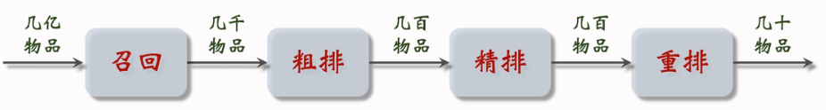
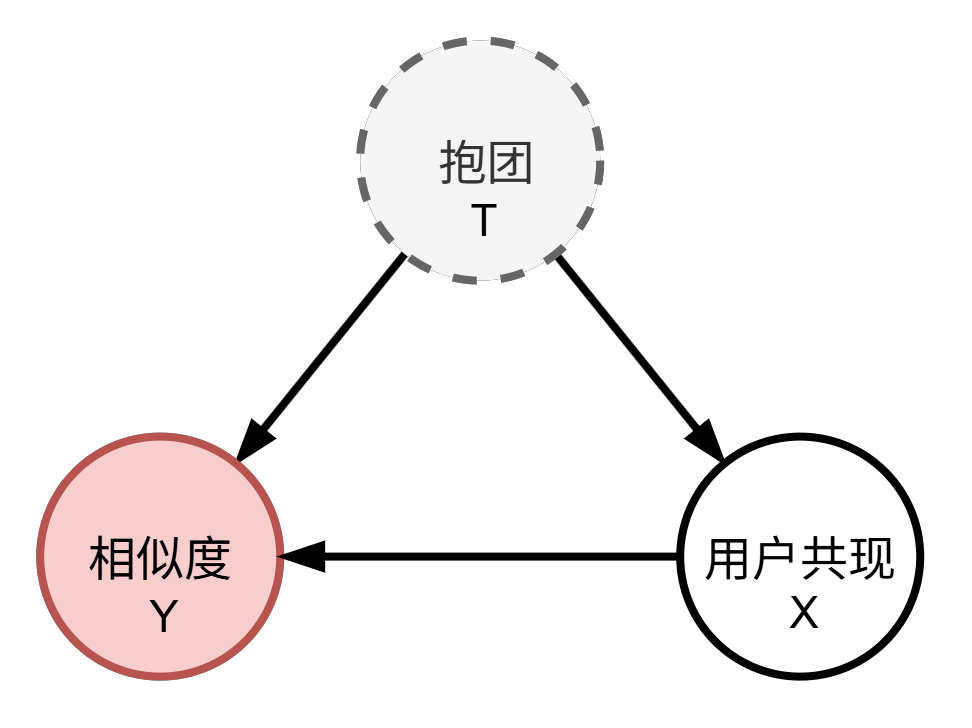
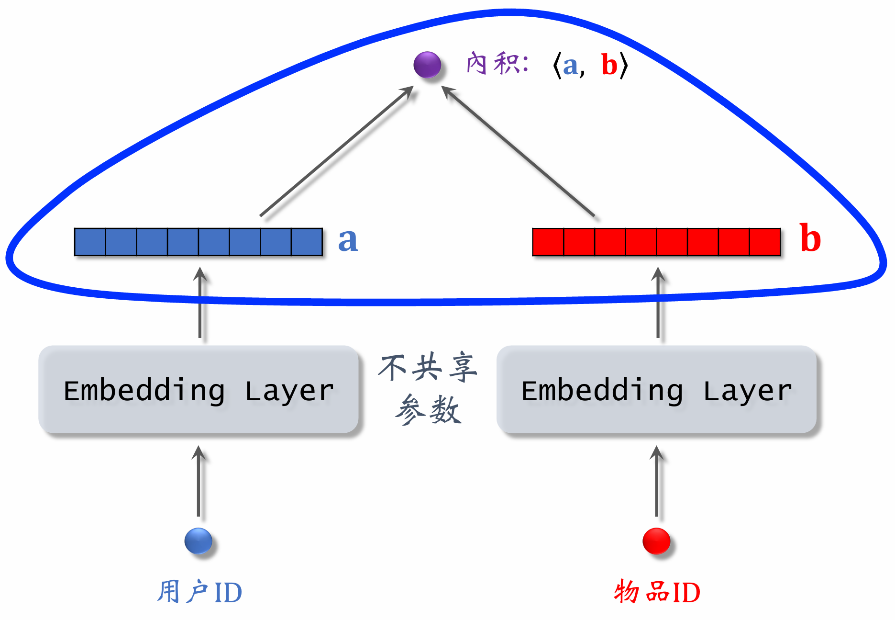
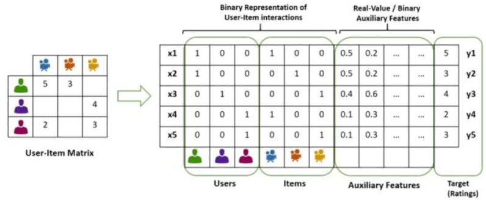
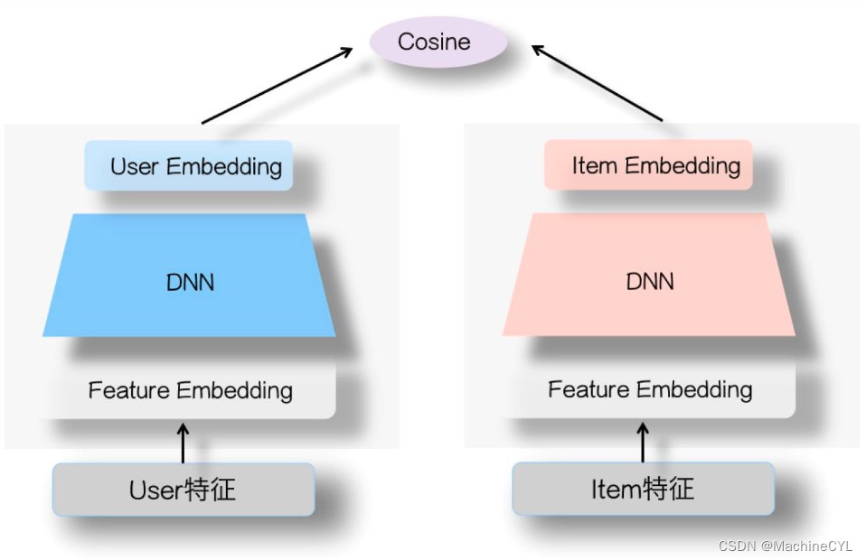

# 搜索、推荐、广告

学习路线: 

1. 王树森基础 -> [C:\Users\23993\Desktop\RecommenderSystemNotes-main](C:\Users\23993\Desktop\RecommenderSystemNotes-main)
2. 进阶路线 -> https://datawhalechina.github.io/fun-rec/chapter_0_introduction/index.html
3. 前沿 -> https://arthurchiao.art/blog/large-generative-recommendation-tokenization-perspective-notes-zh/#14-%E4%B8%BA%E4%BB%80%E4%B9%88%E8%A6%81%E5%81%9A%E7%94%9F%E6%88%90%E5%BC%8F%E6%8E%A8%E8%8D%90
4. 因果推断和搜广推 -> 
   https://www.cnblogs.com/orion-orion/p/15378912.html
   https://zhuanlan.zhihu.com/p/553279676
   https://juejin.cn/post/7413194176005865523
5. 上下文多臂老虎机
   https://cosx.org/2017/05/bandit-and-recommender-systems/

## 全链路模型

当用户打开App或发起一次搜索/推荐请求时，系统会自底向上经过以下四个核心阶段：

- **召回层 (Recall)**：负责“从千万级到千量级”的粗筛。强调极高的速度和较高的召回率。通常采用多路召回策略并轨运行，例如：协同过滤召回、用户标签召回、双塔向量检索召回，以及搜索业务中特有的倒排索引召回。
  - 召回: 即用户/面向用户的请求将可能的 **物品** 召回.
  - 倒排索引(Inverted Index, 逆索引): **词->物品** 的映射方式, 词需要用分词器进行划分

- **粗排层 (Pre-ranking)**：负责“从千量级到百量级”的过渡。当多路召回合并后的候选集依然很大，直接进入精排会耗尽算力时，粗排会充当“减负者”。它通常使用稍微复杂但推理极快的模型（如**轻量级双塔模型**）进行快速打分截断。
  - 目的: 打分、排序、截断/过滤

- **精排层 (Ranking)**：整个架构的“大脑”，负责“从百量级到几十量级”的精准排序。这里会汇聚最细致的特征（用户画像、物品属性、实时上下文、交叉特征），并使用最复杂的深度学习模型（如 DeepFM、DIN 或多目标 MMOE），精准预估用户的点击率（CTR）、转化率（CVR）或停留时长。

- **重排与策略层 (Re-ranking/Mixing)**：负责最终的“业务规则干预与展示”。**不完全依赖模型分数，而是加入产品逻辑**，例如：相似内容打散以保证**多样性、频率控制、强制插入广告**（搜广推混排）、以及已读内容的过滤，最终生成呈现给用户的有序列表。
  - 多臂老虎机, 汤普森采样, A/B, 因果推断, 强化学习

## 召回层

多路召回: 常见的召回通道有：协同过滤、双塔模型、关注的作者、等等
**系统对召回通道返回的所有结果进行融合和过滤**

### 基于内容的召回方法

#### **u2i (User-to-Item)：直接匹配，强个性化**

- **核心逻辑**：将用户和物品映射到同一个多维向量空间（Embedding空间）中。在这个空间里，如果用户向量和物品向量靠得很近，就说明该用户大概率喜欢该物品。现代的双塔模型（Two-Tower）就是 u2i 的典型代表。

- **数学公式**：

  最常见的是通过点积（Dot Product）**或**余弦相似度（Cosine Similarity）来计算用户 $u$ 对物品 $i$ 的偏好得分 $\hat{y}_{u,i}$。

  假设用户隐向量为 $P_u \in \mathbb{R}^k$，物品隐向量为 $Q_i \in \mathbb{R}^k$（$k$ 为隐向量维度）：
  $$
  \hat{y}_{u,i} = P_u \cdot Q_i = \sum_{f=1}^{k} p_{u,f} q_{i,f}
  $$
  如果是矩阵分解（MF），模型的目标就是最小化真实评分 $y_{u,i}$ 与预测评分 $\hat{y}_{u,i}$ 之间的误差：
  $$
  \min_{P,Q} \sum_{(u,i)} (y_{u,i} - P_u \cdot Q_i)^2 + \lambda(\vert{}\vert{}P_u\vert{}\vert{}^2 + \vert{}\vert{}Q_i\vert{}\vert{}^2)
  $$

#### **u2tag2i (User-to-Tag-to-Item)：基于标签/特征的泛化**

- **核心逻辑**：引入一个中间媒介“**Tag（标签）**”。用户喜欢某些标签（如“赛博朋克”、“喜剧”），物品身上也打着这些标签。通过标签进行桥接。这种方法**冷启动效果极好**，因为新物品只要打上标签就能被召回。

- **数学公式**：

  得分为用户对标签的偏好权重与物品身上该标签权重的乘积之和：
  $$
  Score(u, i) = \sum_{t \in Tag(i)} weight(u, t) \cdot weight(t, i)
  $$

  - $weight(u, t)$：用户 $u$ 对标签 $t$ 的偏好度（通常是历史统计值，结合时间衰减，如最近点过几次该标签的视频）。
  - $weight(t, i)$：物品 $i$ 包含标签 $t$ 的权重（如该关键词在文章中的 TF-IDF 值，或者分类的置信度）。

> **多路召回融合**
>
> 在实际系统中，这四路（甚至十几路）召回会同时运行。比如 u2i 拿回 500 个，i2i 拿回 300 个，u2tag2i 拿回 200 个。最终系统需要对这些结果进行去重，然后按一定的策略（如配额限制、或者简单的打分融合）拼成一个 1000 个左右的候选集，送入粗排/精排层。
>
> 对于召回，一般都是多路召回，每一路去把握query和item不同方面的相似度。例如youtube next-video watch这个问题，我们根据一个seed video去找到用户可能感兴趣的其他内容，这就是一个i2i问题。那么，我们可以根据这个video的一些tag，去召回有相同tag的item；也可以通过item协同过滤，去找到user-item矩阵分解中，和item隐向量相似的那些item（intuition是，“受众相似的item也相似”）。

### **经典协同过滤** CF

CF的核心概念就是“利用群体的智慧来进行个性化推荐”**。它完全不关心物品本身的客观属性（比如这首歌是谁唱的、这部电影是科幻还是喜剧），而是单纯依赖**用户与物品的历史交互行为（如点击、购买、评分）来寻找潜在的相似性。

协同过滤主要建立在两个直觉假设上：**“物以类聚”, “人以群分”**

#### **i2i (Item-to-Item)：基于物品的协同过滤 (ItemCF)**

- **核心逻辑**：**物以类聚**, 计算物品之间的相似度，然后根据用户历史交互过的N物品（Seed Items），对于每个物品能够找到相似度最大的K个物品, 构成NK个待选物品

- **数学公式**：

  分为两步：

  第一步，计算物品 $i$ 和物品 $j$ 的相似度 $w_{ij}$。工业界常基于“用户共现”来计算（余弦相似度），即多少人同时交互了这两个物品：
  $$
  w_{ij} = \frac{\vert{}N(i) \cap N(j)\vert{}}{\sqrt{\vert{}N(i)\vert{} \vert{}N(j)\vert{}}}
  $$

  - 其中 $N(i)$ 表示交互过物品 $i$ 的用户集合。

    > - 公式没有考虑喜欢的程度$like(user,item)$
    >
    > - 加入喜欢程度的余弦相似度(cosine similarity):
    >   $$
    >   sim(i_{1},i_{2})=\frac{\sum \limits_{v\in V}like(v,i_{1})\cdot like(v,i_{2})}{\sqrt{\sum\limits _{u_{1}\in W_{1}}like^{2}(u_{1},i_{1})}\cdot \sqrt{\sum \limits_{u_{2}\in W_{2}}like^{2}(u_{2},i_{2})}}
    >   $$
    >   

  第二步，对用户$u$近期的N个种子物品, 每个找出top-K相似的邻居物品 $j$, 全部进行打分 $O(NK)$
  $$
  Score(u, j) = \sum_{i \in H(u)} w_{ij} \cdot r_{ui}
  $$

  - 其中, $r_{ui}$ 为当前用户对其种子物品的交互评分, 例如 购买5, 购物车3, 点击1

**ItemCF 召回的完整流程**

1. 事先做离线计算

   1. 建立“用户->种子物品”的索引

   2. 建立“物品->物品”的索引
   
2. 线上作推荐

   1. 给定⽤户 ID，找出近期感兴趣的N个物品
   2. 对于取回的物品, 对于每个找出其相似度topK的相似物品
   3. 打分推荐

#### **u2u2i (User-to-User-to-Item)：基于用户的协同过滤 (UserCF)**

- **核心逻辑**：**人以群分**, 先找到和你兴趣相似的一批K个用户, 再访问他们近期感兴趣的N个种子物品, 用这NK个物品作为推荐候选

- **数学公式**：

  同样分两步：

  1. 计算用户 $u$ 和用户 $v$ 的相似度 $w_{uv}$：
     $$
     w_{uv} = \frac{\vert{}N(u) \cap N(v)\vert{}}{\sqrt{\vert{}N(u)\vert{} \vert{}N(v)\vert{}}}
     $$

     - *其中 $N(u)$ 表示用户 $u$ 交互过的物品集合。*

  2. 取回用户 $u$ 的topK相似度的用户 $v$, 访问每个用户的N个种子物品 $i$, 全部进行打分 $O(NK)$
     $$
     Score(u, i) = \sum_{v \in S(u, K)} w_{uv} \cdot r_{vi}
     $$

     - 其中, $r_{vi}$ 表示选中用户和其种子物品的交互得分
     
     > 举例: 星级评价：用户购买后给出的 1 到 5 星。此时 $r_{vi}$ 的取值就是 $1, 2, 3, 4, 5$。点赞/踩：例如在一些商品问答区或买家秀中，点赞算 1 分，点踩算 -1 分，无操作算 0 分。曝光未点击：0 分 点击/浏览详情页：1 分 收藏商品：2 分 加入购物车：3 分 成功购买：5 分

**UserCF 召回的流程**

1. 事先做离线计算

   1. 建立“用户->种子物品”的索引

   2. 建立“用户->用户”的索引
   
2. 线上作推荐

   1. 给定⽤户 ID，通过“⽤户->用户”索引，找到 top-k 相似用户。
   2. 对于每个 top-k 相似用户，通过“用户->种子物品”的索引，找到用户N个感兴趣物品
   3. 打分推荐

#### Swing 模型 (阿里) 的提出是为了降低用户小圈子聚集带来的误差

- 传统 ItemCF 的核心思想是：“有多少个用户同时喜欢了这两个物品？”它将每个用户的贡献视为独立的。
- Swing 算法的核心思想是：“同时喜欢这两个物品的用户们，他们**彼此之间有多陌生**？”

**选择偏差**: 在传统 ItemCF 中，如果物品 $i_1$ 和 $i_2$ 被 100 个同属一个特定饭圈群体的用户同时点击，系统会认为这两个物品极其相似。**但这 100 个人本来就喜欢抱团行动**（即你的公式中 $overlap(u_1,u_2)$ 非常大），这属于混淆

- 我们想得到的是: $ \mathbb{E}[Y \mid \text{do}(X=x)]$, 而不是 $ \mathbb{E}[Y \mid X]  $

**Swing 模型的计算过程**

- ⽤户$u_1$喜欢的物品记作集合$J_1$, ⽤户$u_2$喜欢的物品记作集合$J_2$, 类似于ItemCF的分子

- 定义两个用户的重合度：$overlap(u_{1},u_{2})=\left|J_{1}\cap J_{2}\right|$

- ⽤户$u_1$和$u_2$的重合度⾼，则他们可能来⾃⼀个⼩圈子，要降低他们的权重

- 喜欢物品$i_1$的⽤户记作集合$W_1$, 喜欢物品$i_2$的⽤户记作集合$W_2$

- 定义交集$V=W_{1}\cap W_{2}$

- 两个物品的相似度：$sim(i_1,i_2)=\sum\limits_{u_1\in V}\sum\limits_{u_2\in V}\frac{1}{\alpha+overlap(u_1,u_2)}$

  > $\alpha$是人工设置的参数，需要后期调节

### 矩阵补充方法

> 双塔的雏形, 矩阵补充方法试图将用户和物品都做一个嵌入Embedding, 并通过计算嵌入空间的相似度来匹配样本. 
>
> 现在的搜广推架构中，**纯粹的线性矩阵补充已经很少作为最终的精排模型使用了**。因为它的表达能力仅限于简单的内积，无法做复杂的特征交叉（如引入上下文、年龄、时间等）。 如今，矩阵补充的思想已经进化成了**召回层的双塔模型（Two-Tower）**，以及**排序层的因子分解机（FM, Factorization Machines）**。

矩阵补充: 用户-物品交互矩阵（比如 1 亿用户 $\times$ 1000 万商品）是极度稀疏的，99.99% 的位置都是空白。矩阵补充的目的，就是**利用那 0.01% 已知的交互数据，推测出全矩阵中所有空白位置的数值**，从而完成推

- 设 $n$ 个用户的特征组为 $P_{n\times k}$, $m$ 个物品的特征组为 $Q_{m\times k}$, 其中, $k$ 表示嵌入维度

- 实际的线上交互数据为: $R_{n \times m}=[R_{ij}], R_{ij}=\mathbb{1}\cdot r_{ij}$ 表示交互得分矩阵, 则问题阐述为:
  $$
  \arg \min_{P,Q} ||R-PQ ||
  $$
  即期望寻找这两个矩阵逼近实际的稀疏矩阵

##### 解法和部署

- 随机梯度下降 (SGD / FunkSVD)

  这是 Netflix 推荐大赛中大放异彩的经典方法（由 Simon Funk 提出）。它不强求对整个矩阵做严格的奇异值分解，而是直接通过梯度下降去拟合已知的评分数据。
  $$
  \min_{P,Q} \sum_{(u,i) \in \text{Observed}} (r_{ui} - p_u^T q_i)^2 + \lambda(\vert{}\vert{}p_u\vert{}\vert{}^2 + \vert{}\vert{}q_i\vert{}\vert{}^2)
  $$

  - **优势**：极其灵活，可以很容易地把“用户偏置项（User Bias）”和“物品偏置项（Item Bias）”加到公式里；内存占用小，适合流式更新。
  - **局限**：在极其庞大的数据集上，传统的单机 SGD 难以并行化。

- 交替最小二乘法 (ALS, Alternating Least Squares)

  这是大数据时代（如 Spark MLlib 框架下）工业界最爱用的矩阵补充算法，专门为了**分布式并行计算**而生。

  - **核心逻辑**：目标函数中有 $P$ 和 $Q$ 两个未知矩阵相乘，这不是一个凸优化问题。ALS 的策略是“退而求其次”：**先固定 $Q$ 不变，把方程变成关于 $P$ 的二次函数求导解最优；然后再固定 $P$ 不变，去解 $Q$。** 两者交替进行，直到收敛。
  - **隐式反馈**：著名的隐式反馈 ALS (Implicit ALS) 引入了置信度权重矩阵。用户没点过商品，不代表不喜欢，内置的置信度公式能完美处理这类二值化的海量隐式反馈数据。

##### 矩阵补充的缺点

1. 仅⽤ IDembedding，没利⽤物品、⽤户属性
   - 物品属性：类⽬、关键词、地理位置、作者信息
   - ⽤户属性：性别、年龄、地理定位、感兴趣的类⽬
   - 双塔模型可以看做矩阵补充的升级版
2. 负样本的选取⽅式不对
   - 样本：⽤户—物品的⼆元组，记作$(u,i)$
   - 正样本：曝光之后，有点击、交互。(正确的做法)
   - 负样本：曝光之后，没有点击、交互。(错误的做法)
3. 做训练的⽅法不好
   - 內积$\left \langle a_i,b_i \right \rangle$不如余弦相似度
   - ⽤平⽅损失(回归)，不如⽤交叉熵损失(分类)

### 因子分解机 FM

在纯粹的 MF 中，我们只有两个维度：**User ID** 和 **Item ID**, 预测用户 $u$ 对物品 $i$ 的偏好Score 

FM 是 MF 的泛化扩展。它能将年龄、地域、上下文等 Side Info 全部转化为 Embedding 融入模型参与两两交叉。
$$
\hat{y} = w_0 + \sum_{i=1}^n w_i x_i + \sum_{i=1}^n \sum_{j=i+1}^n \langle v_i, v_j \rangle x_i x_j
$$

- $x = [0, 1, 0, 0, 0, 1, 0]$ 假设系统共有 3 个用户、4 个物品。当“用户2”点击“物品3”时，FM 会通过 One-Hot 编码将这条数据变成一个 7 维向量：（前三个位置代表 User ID，后四个位置代表 Item ID）

- **$v_i$**：第 $i$ 个特征的隐向量。在 FM 眼里，它不关心你是用户还是物品，它给特征向量的每一列都分配了一个 $k$ 维隐向量。**线性部分**：$w_0 + \sum_{i=1}^n w_i x_i$ 处理一阶特征权重。

- **交叉部分**：$\langle v_i, v_j \rangle x_i x_j$ 是 FM 的灵魂。它为每个特征 $i$ 学习一个 $k$ 维隐向量 $v_i$。两个特征的交叉权重不再是一个独立的参数 $w_{ij}$，而是两个隐向量的内积
- **$O(kN)$ 复杂度**: 上述公式可以化为: $\frac{1}{2} \sum_{f=1}^k \left( \left( \sum_{i=1}^n v_{i,f} x_i \right)^2 - \sum_{i=1}^n v_{i,f}^2 x_i^2 \right)$ 实现一次遍历计算

对于每个用户以及每个物品，我们可以利用步骤一中的方法，将每个用户的兴趣向量离线算好，存入在线数据库中比如Redis（用户ID及其对应的embedding），把物品的向量逐一离线算好，存入Faiss(Facebook开源的embedding高效匹配库)数据库中，进行knn索引，然后高效检索。

当用户登陆或者刷新页面时，可以根据用户ID取出其对应的兴趣向量embedding，然后和Faiss中存储的物料embedding做内积计算，按照得分由高到低返回得分Top K的物料作为召回结果。

### 神经网络方法/双塔模型 - 召回阶段

左边的塔用来提取用户的特征，右边的塔用来提取物品的特征
余弦相似度的分子是用户向量$a$与物品向量$b$的内积
分母是用户向量$a$的二范数与物品向量$b$的余弦距离

> **余弦相似度关注“方向”**：它衡量的是两个向量在多维空间中指向的一致性
>
> - 在推荐系统中，这代表了用户与物品在“兴趣偏好”或“语义特征”上的趋势是否一致
> - 无论一个用户是非常活跃（如点击量大）还是偶尔活跃，只要其点击物品的特征向量方向与某物品的属性向量方向一致，余弦相似度就能捕捉到这种相似性
>
> **欧氏距离关注“数值绝对差异”**：它计算的是空间中两点间的直线距离
>
> - 如果用户A和用户B对同一类物品的喜好程度在数值量级上存在巨大差异（例如一个习惯打高分，一个习惯打低分），即使他们的品味偏好完全一致，欧氏距离也会判定他们相距很远
> - 随着向量维度增加（Embedding 通常为数百至数千维），欧氏距离面临严重的“距离集中现象”（即所有点到查询点的欧氏距离趋于一致），导致区分度下降

双塔的特征:

- **离线与在线的完美解耦**：这是双塔结构最大的魔力。因为左右塔在底层没有任何交叉，物品的特征变化频率较低，所以可以**离线批量跑完右塔**，将千万级物品的 Embedding 提前存入向量数据库（如 FAISS、Milvus）。

- **毫秒级在线响应**：当用户发起请求时，线上服务器只需要实时跑一次左塔生成用户向量 $u$，然后拿着 $u$ 去向量数据库中进行近似最近邻（ANN）检索。这使得系统能在几十毫秒内从海量候选集中捞出上千个物品。
- **特征交叉太晚 (Late Crossing)**：用户特征和物品特征在各自的塔内自娱自乐，直到最后输出向量时，才做了一个极其简单的点积碰撞。这种结构注定无法捕捉复杂的二阶或高阶组合特征（例如：用户A只有在晚上才喜欢看类别B的视频）。这就注定了双塔只能胜任“大浪淘沙”的粗筛工作。

#### 双塔模型的训练

##### 正负样本的选择

1. 训练方法：
   - Pointwise：独⽴看待每个正样本、负样本，做简单的⼆元分类
   - Pairwise：每次取⼀个正样本、⼀个负样本
   - Listwise：每次取⼀个正样本、多个负样本
2. 正负样本的选择
   - 正样本：⽤户点击的物品
   - 负样本：
     - 没有被召回的
     - 召回但是被粗排、精排淘汰的
     - 曝光但是未点击的

##### 正负样本严重失衡怎么办

负样本降采样(减少负样本的数量)称为: **精细化负样本**. 普通的随机降采样会导致一个致命问题：**模型学不到真本事**。

> 假设你要训练一个模型来识别“苹果”（正样本）。
>
> - **普通随机降采样**：你给模型看的负样本是“汽车”、“大楼”、“狗”。模型只要学到“有红颜色的就是苹果”，就能轻易拿满分（Loss 迅速降为 0）。但这没有意义，模型一上线就废了。
> - **精细化负采样**：你特意给模型挑的负样本是“红色的西红柿”、“红色的桃子”、“青苹果”。模型发现仅仅用“红色”区分不开了，它**被迫**去学习更深层的特征，比如“表皮纹理”、“形状”、“是否有蒂”。模型的鉴别能力（决策边界）因此被极大地拓宽了。

1. **批内负采样的底层机制 (In-batch Negative Sampling)**

   在双塔模型中，由于直接使用全局负采样效率极低，通常采用“批内复用”的策略：

   - **正样本构造**：在一个 Batch 内，有 $n$ 个用户，每个用户与其点击过的一个物品构成 $n$ 个正样本（前提是每个入选的用户至少有一次点击）。

   - **负样本裂变**：对于 Batch 内的某一个用户，除了他自己点击的那 1 个物品，Batch 内剩下的 $n-1$ 个物品全部被当作他的负样本。

   - **数学规模**：一次 Batch 训练，直接产生了 $n(n-1)$ 个负样本，矩阵运算效率极高。

   - **样本定性**：这些被称为**简单负样本 (Easy Negatives)**。因为 Batch 内的其他物品本质上是从大盘中随机抽取的，该用户大概率本来就不喜欢，所以模型很容易区分开。

     

2. **热门打压与 LogQ 纠偏公式 - 样本选择偏差**

   这是批内负采样带来的最大副作用，也是面试官极爱深挖的考点。

   - **偏差产生的原因**：一个物品出现在 Batch 内的概率 $p_i$，与它的真实点击次数成正比。但在理想的 Word2Vec 或推荐系统理论中，为了给长尾物品机会，负样本的抽样概率应该正比于 $(\text{点击次数})^{0.75}$。

   - **导致的后果**：因为直接使用了批内采样，热门物品成为负样本的概率被严重放大了。这就导致模型对热门物品进行了“过度惩罚”（热门打压过头了）。

   - **公式纠偏 (LogQ Trick)**：

     - 设用户向量为 $a$，物品向量为 $b_i$。

       - 原来的兴趣预估得分为余弦相似度：$\cos(a,b_i)$。
       - **训练时**：强行减去该物品出现概率的对数，公式调整为 $\cos(a,b_i) - \log p_i$。以此来抵消热门物品的高频惩罚。

       > 假如选择的因果量 $R = e^{\cos(a,b_i)}$, 那么, LogQ Trick本质是一种**逆概率加权**
       > $$
       > \hat{R} = \frac{1}{p_i} e^{\cos(a,b_i)}
       > $$

       - **线上召回时**：去掉惩罚项，恢复使用标准的 $\cos(a,b_i)$ 进行打分检索。

       

3. **困难负样本的挖掘 (Hard Negatives)**

   如果只用简单负样本，相当于让大学生一直做小学加减法（分类准确率极高，但学不到真本事）。必须引入困难负样本逼迫模型学习。

   在工业界，最好的困难负样本来源是**被后续排序阶段淘汰的物品**：

   - **中等困难 (Medium Hard)**：被“粗排”淘汰的物品。模型稍稍容易分错。

   - **极度困难 (Very Hard)**：通过了粗排，但在“精排”中分数靠后被淘汰的物品。这说明它们特征上极具迷惑性，模型极易分错。

     

4. **黄金训练配比：混合分布**

   不能全用困难样本，否则模型会“走火入魔”，失去对全局数据大盘的感知。
   工业界通常采用混合采样策略来构造训练数据：

   > **50% 简单负样本**：从全体物品中随机抽取（或直接依赖 In-batch），保证模型的基础分类能力和全局视野。
   >
   > - **20% 的 Easy Negatives (全局随机负采样)**
   >   - **做法**：从全局物品库里随便抽。
   >   - **目的**：让模型保持对全局的认知, 提升泛化能力, 避免过拟合
   > - **30% 的 In-batch Negatives (批内负采样)**
   >   - **做法**：当前 Batch 内，把推荐给用户 B 的正样本，当做用户 A 的负样本。
   >   - **目的**：最大化利用计算资源。这些物品通常是当前系统的热门物品，用它们做负样本，天然能起到压制“热门偏差（Popularity Bias）”的作用。
   >
   > **50% 困难负样本**：从粗排/精排淘汰的池子中抽取，用于拓宽模型的决策边界，提升精准度。逼迫双塔模型在最容易混淆的边界上进行学习，区分“用户真正喜欢的”和“仅仅是看起来相似的”

6. **高频坑点-召回和排序的因果关系决定了其负样本的选择**

   **召回模型，绝不用`曝光未点击`作为负样本！**

   - 因为召回的任务是“从千万里挑出一千”。一个物品能被曝光，说明它已经被前面的召回、粗排、精排层层筛选出来了，它对用户来说已经是高度相关的“优质品”了。如果你在召回阶段把它当负样本，模型会变得极其困惑（“为什么长得这么像正样本的东西你要我当负面教材？”），直接导致召回模型的性能崩溃。

   **排序模型，必须用`曝光未点击`作为负样本！**

   - 因为排序层面对的本来就是那一千个“优质品”，它的任务是“优中选优”。此时，“曝光未点击”才是最真实的负反馈，是训练 CTR（点击率）预估模型的最完美素材。

##### 双塔模型的非对称计算

双塔模型在Serving（线上服务）阶段的核心设计原则是“非对称计算”

- **离线构建物品库 (Item Tower)**

  - **动作**：提前利用物品塔计算出全量物品的特征向量 $b$。
  - **存储**：将 $\langle \text{特征向量} b, \text{物品 ID} \rangle$ 灌入高维向量数据库（如 FAISS、Milvus）。

  **在线实时检索 (User Tower)**

  - **动作**：用户发起请求时，线上服务器根据用户 ID **及其上下文特征**，实时跑用户塔生成当前的用户向量 $a$
  - **匹配**：将向量 $a$ 作为 Query，在向量数据库中进行近似最近邻 (ANN) 查找，瞬间召回 Top-K 物品。

> 为什么要非对称?
>
> **算力成本的鸿沟**：一次推荐请求只涉及 1 个用户，但面对的是几亿个候选物品。如果线上同时计算几亿个物品向量，延迟和算力消耗是系统绝对无法承受的。
>
> **动态与静态的权衡**：用户的兴趣和上下文（如当前时间、刚看过的几个视频）是**高频动态变化**的，如果离线算好用户向量就失去了实时推荐的能力；
> 而物品的属性（如视频的画面、标题、发布者）是**相对静态**的，极其适合离线预计算。

双塔模型会进行 全量更新 (Full Update) 和 增量更新 (Incremental Update / Online Learning) 来维护

- **全量更新 (Full Update)** 
  - **触发频率**：通常为天级（如每天凌晨跑一次）。
  - **数据范围**：使用过去一整天（甚至几天）的全量日志数据。
  - **训练方式**：在昨天模型参数的基础上（热启动，绝不是随机初始化）只做 1 个 epoch 的训练。
  - **发布产物**：更新并发布完整的**用户塔神经网络结构参数**以及全新的**全量物品向量库**。
  - **优势**：对系统架构和数据流的实时性要求极低，模型更新非常稳定。

- **增量更新 (Incremental Update / Online Learning)** 
  - **触发频率**：分钟级甚至秒级（实时流处理）。
  - **数据范围**：通过 Flink 等流处理引擎实时收集线上数据，生成 TFRecord。
  - **训练方式**：只做轻量级的参数更新。为了保证线上服务不崩溃，通常**冻结深层神经网络结构，只更新用户 ID 的 Embedding 层参数**（从而快速捕捉用户兴趣的突变）。
  - **发布产物**：实时下发最新的用户 ID Embedding 到线上。

> 为什么需要全量?
>
> 增量是严格按照“时间顺序（Chronological Order）”喂数据的。早上 8 点的用户群体和数据分布，与晚上 8 点截然不同（比如凌晨全在刷游戏直播，早高峰在刷新闻）。如果模型只跟着流式数据跑，会导致模型在不同时间段产生严重的“灾难性遗忘”和极端的局部偏差。

