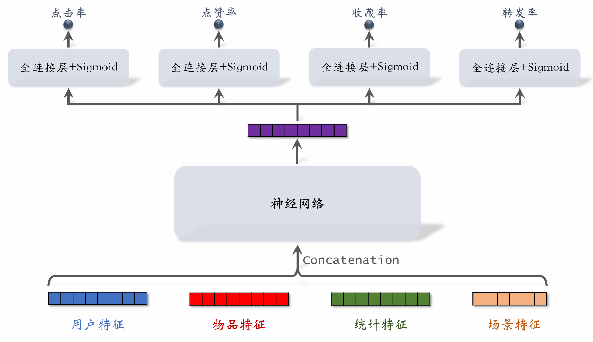
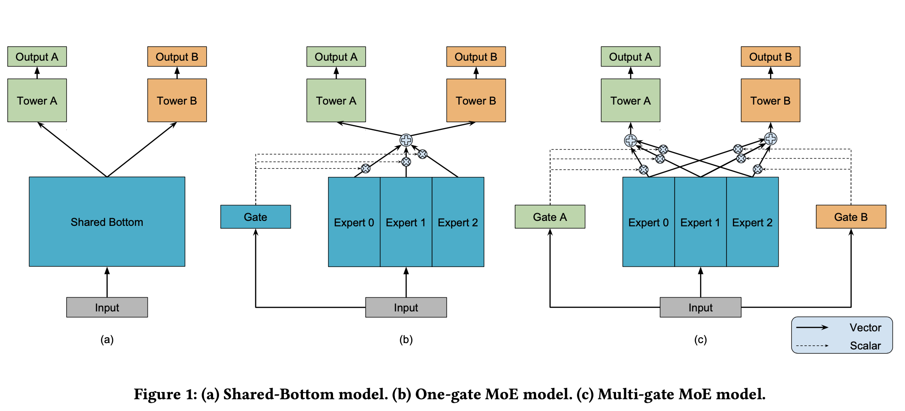
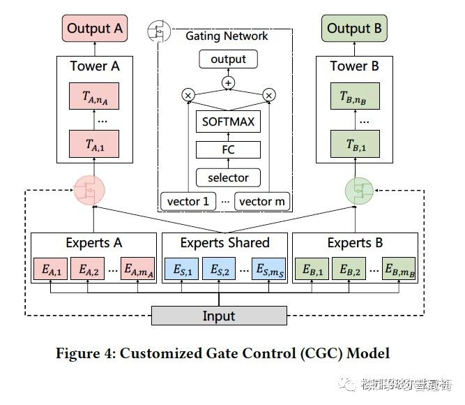
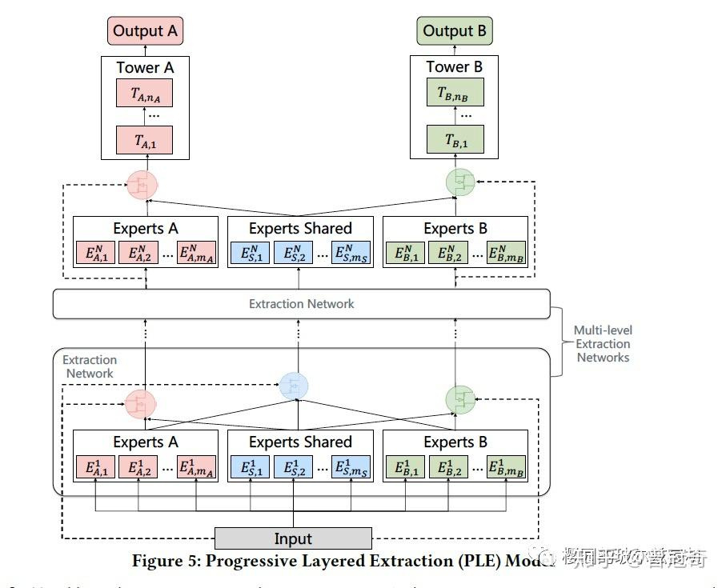
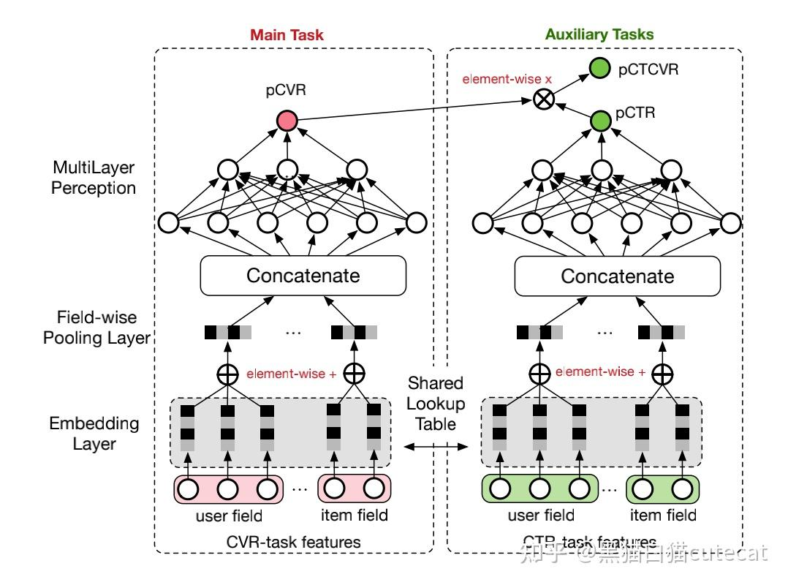
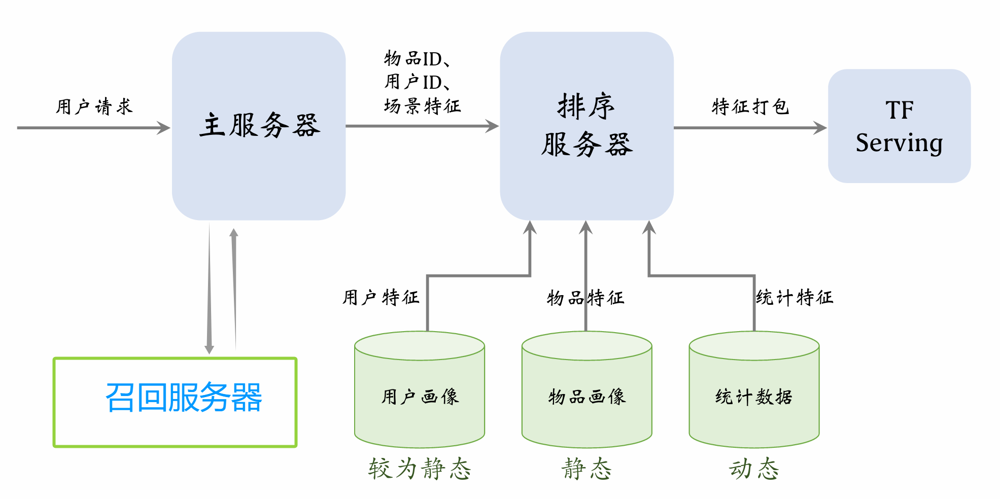

# 推荐系统 (三)

## 因果推断基础

### A/B实验

AB实验「坑」贼多？腾讯搜索实验有妙招！: https://hub.baai.ac.cn/view/34886

展博增长实验室 AB实验介绍: https://abtest.chat/posts/ab%E5%AE%9E%E9%AA%8C%E4%BB%8B%E7%BB%8D/

## 多目标排序模型

单一的点击率（CTR）预估已经无法满足复杂的商业诉求。现代推荐系统通常需要兼顾用户的互动活跃度（点赞、评论）以及平台的商业价值（转化、停留时长），因此多目标学习（Multi-Task Learning, MTL）成为了排序模型的核心标配。

### 问题建模

排序模型需要同时预估用户对物品的多种隐式或显式反馈概率，如：点击率 ($p_{ctr}$)、点赞率 ($p_{like}$)、收藏率 ($p_{fav}$)、转发率 ($p_{share}$)，甚至预估停留时长（回归问题）。

**线上融合公式 (Value Model)：**

预估出各项分数后，系统不会直接使用某单一分数，而是通过融合公式计算出一个最终的排序分（综合收益），并以此进行截断和排序。工业界常用的融合方式有两种：

1. **加权线性融合 (Weighted Sum)**：
   $$
   Score = w_1 \cdot p_{ctr} + w_2 \cdot p_{like} + w_3 \cdot p_{fav} + w_4 \cdot p_{share}
   $$
   *补充：此方法简单直观，权重 $w_i$ 通常由业务目标决定，或通过 A/B 实验得出。*

2. **指数乘法融合 (Multiplicative Form)**：
   $$
   Score = p_{ctr}^{w_1} \times p_{like}^{w_2} \times p_{fav}^{w_3} \times p_{share}^{w_4}
   $$
   *补充：在广告和推荐系统中更为常见。乘法天然具备“一票否决”的特性（例如 CTR 极低时，综合得分会严格被压制），且在概率预估上更符合逻辑推导。*

**基础架构：Shared-Bottom (共享底层架构)**

1. **特征拼接**：把用户特征、物品特征、统计特征、场景特征等通过 Embedding 映射后进行向量拼接 (Concatenation)。
2. **共享层**：输入到一个共享的神经网络 (Shared MLP) 中，提取出公共的底层表征向量。
3. **任务塔 (Task Towers)**：将共享向量分别输入到四个不同的全连接层 (FC + Sigmoid)，分别输出预测概率 $p_1, p_2, p_3, p_4$。

**损失函数的设计**

目标值 $y_i \in \{0, 1\}$，预测值 $p_i \in (0, 1)$。

单一任务的交叉熵损失：
$$
CrossEntropy(y_i, p_i) = - \left[ y_i \cdot \ln{p_1} + (1 - y_i) \cdot \ln{(1 - p_1)} \right]
$$
总损失函数通过超参数 $\alpha_i$ 进行加权：
$$
Loss_{total} = \sum_{i=1}^{4} \alpha_i \cdot CrossEntropy(y_i, p_i)
$$
*补充：对损失函数求梯度，通过反向传播做梯度下降更新参数。参数 $\alpha_i$ 可以是人工设定的常数，也可以通过不确定性加权 (Uncertainty Weighting) 等方法动态学习。*

> 传统的 Shared-Bottom 容易出现“跷跷板现象”（**负迁移/Negative Transfer**），即某个目标的提升导致另一个目标下降。为了解决任务冲突，工业界演进出了以下结构：
>
> - **MMoE (Multi-gate Mixture-of-Experts)**：将底层的共享全连接层替换为多个独立的“专家网络(Experts)”，并通过门控机制(Gate)为不同任务学习不同专家的权重，实现软路由。
> - **PLE (Progressive Layered Extraction)**：腾讯提出，显式分离了“共享专家”和“任务独有专家”，进一步缓解了复杂目标之间的干扰。

### 训练存在的问题

#### 挑战一：类别极度不平衡 (Class Imbalance)

- **现象**：正负样本比例极其悬殊。
  - 曝光到点击：每 100 次曝光，约 10 次点击，90 次无点击。
  - 点击到转化/收藏：每 100 次点击，约 10 次收藏，90 次无收藏。
- **解决方案**：**负样本降采样 (Down-sampling)**。人为抛弃一大部分毫无信息量的简单负样本，保留一小部分负样本。这不仅能让正负样本数量相对平衡，防止模型预测趋向于全 0，还能极大地节约计算资源。

#### 挑战二：样本选择偏差 (SSB) 与 数据稀疏 (DS)

- **现象**：收藏率、点赞率等动作是**发生点击之后**的后续行为。如果直接在“被点击的样本”上训练收藏预估模型，线上推理时面对的却是“全量曝光样本”，会导致预测分布产生严重偏差。
- **解决方案**：阿里提出的 **ESMM (全空间多任务模型)**。利用 $pCTCVR = pCTR \times pCVR$ 的概率链乘关系。模型不直接在点击样本上训练 CVR，而是用曝光样本同时训练 CTR 和 CTCVR（点击且转化），通过网络结构隐式学习出无偏的 CVR。

### 负样本降采样后的预估值校准 (Calibration)

由于正负样本分布不均, 对负样本做了降采样，导致训练集中的正样本比例被人为放大，此时模型输出的预估点击率 ($p_{pred}$) **一定会大于** 真实的点击率 ($p_{true}$)。 

如果排序仅是为了“比较大小”，绝对值的准确性无关紧要；但在工业界（尤其是计算预期收益如 eCPM = 预估点击率 $\times$ 出价），**预估分数的绝对值必须绝对精准**，因此必须进行保序的校准回归。

**校准公式推导：**

设真实场景中，正样本数量为 $n_+$，负样本数量为 $n_-$。

1. **真实点击率 (期望)**：
   $$
   p_{true} = \frac{n_+}{n_+ + n_-}
   $$

2. **降采样后的预估点击率 (期望)**：

   设定负样本的降采样率为 $\alpha \in (0, 1)$，即实际参与训练的负样本只有 $\alpha \cdot n_-$ 个。
   $$
   p_{pred} = \frac{n_+}{n_+ + \alpha \cdot n_-}
   $$
   推导过程:

$$
\begin{aligned} \frac{1}{p_{pred}} &= \frac{n_+ + \alpha \cdot n_-}{n_+} = 1 + \alpha \cdot \frac{n_-}{n_+} \\ \implies \frac{n_-}{n_+} &= \frac{1 - p_{pred}}{\alpha \cdot p_{pred}} \\ \frac{1}{p_{true}} &= \frac{n_+ + n_-}{n_+} = 1 + \frac{n_-}{n_+} \\ &= 1 + \frac{1 - p_{pred}}{\alpha \cdot p_{pred}} = \frac{\alpha \cdot p_{pred} + 1 - p_{pred}}{\alpha \cdot p_{pred}} \\ \therefore p_{true} &= \frac{\alpha \cdot p_{pred}}{1 - p_{pred} + \alpha \cdot p_{pred}} \end{aligned}
$$

**工程实现提示**：在模型线上 Serving 服务时，网络最后输出 Sigmoid 分数后，必须直接套用此公式将 $p_{pred}$ 还原为 $p_{true}$，然后再交给融合模块计算最终的排序分数。

## Multi-gate Mixture-of-Experts(MMoE, 谷歌)

在推荐系统的多目标排序（MTL）中，经典的 Shared-Bottom（共享底层）架构在面对**相关性较低的任务**（如“点击”和“转发”，前者是浅层交互，后者是深度高门槛交互）时，极易出现“跷跷板现象”（Negative Transfer / 负迁移）

Google 提出了 **MMoE 架构**，通过软路由（Soft Routing）机制实现了任务之间底层特征表示的解耦与动态共享。

### 网络结构

MMoE 的网络结构自下而上分为四个核心模块：

- **特征输入层 (Input Layer)**：将用户特征、物品特征、统计特征和场景特征等，经过 Embedding 处理后进行向量拼接 (Concatenation)，得到稠密输入向量 $x$。
- **专家网络层 (Expert Networks)**：构建多个并行的底层神经网络（统称为“专家”，数量一般为 4~8 个）。所有的专家网络接收相同的输入向量 $x$，各自进行非线性特征提取，并输出等长的隐向量。**这些专家是对所有任务共享的**。
- **多门控网络层 (Multi-Gate Networks)**：**这是 MMoE 的灵魂**。系统为每一个特定的预估任务配备一个专属的门控网络。门控网络实质是一个单层神经网络 + Softmax 层，它接收输入向量 $x$，输出一个维度等于“专家数量”的权重概率向量（各项在 0 到 1 之间，总和为 1）。
- **任务专属塔层 (Task-specific Towers)**：对于某一特定任务，首先使用其专属门控输出的“权重向量”对所有专家的“输出向量”进行**加权求和**。随后，将融合后的向量输入该任务专属的上层 Tower 网络中，最终输出预估值。

### MMOE解决的问题

- **灵活规避“跷跷板现象”（解决负迁移）**

  - **任务相关性高时**：各个门控网络学习到的权重分布会非常相似，MMoE 会自动退化为类似于 Shared-Bottom 的结构，享受多任务联合学习带来的参数更新增益。
  - **任务相关性低（或冲突）时**：不同任务的门控网络会学习到截然不同的路由策略。例如“点击任务”重度依赖专家 1 和 2，而“转发任务”仅依赖专家 3。在反向传播时，不同任务的梯度只会主要更新其所依赖的专家，从而实现了底层参数在不同任务间的物理隔离与解耦。

  **极致的算力优化**

  - 相比于为每个任务单独建一个完全独立的深度网络，MMoE 的绝大部分参数（庞大的专家网络）是完全共享的，只有极少量的门控网络和顶层塔是任务专属的。它在极小的计算增量下，实现了远超 Shared-Bottom 的模型容量与表达能力。

### MMOE的极化现象

在 MMoE 的实际工程训练中，门控网络的路由分配极易陷入“极化”陷阱，这也是导致模型效果不及预期的最常见原因。

- **现象表现**：特定任务的门控网络输出的权重向量异常尖锐。即**对某一个专家的权重分配接近于 1，而对其余所有专家的权重分配接近于 0**。
- **两大致命危害**：
  1. **模型结构退化**：当每个任务的门控都绝对依赖单一专属专家时，MMoE 的“软路由”与“底层共享”不复存在，实质上退化成了多个完全孤立的单目标模型，丧失了 MTL 的泛化增益。
  2. **专家网络闲置 (死节点)**：在极化分布下，某些专家的输出可能在所有任务中均未被有效选中（权重全为 0）。这些专家的参数无法得到有效的梯度回传与更新，造成严重的算力与参数浪费。

#### 方案: 门控输出级的 Dropout 机制

极化现象是Gate认准了某个专家, 输出模式坍缩. 为了强迫模型进行真正的“多专家联合混合”，工业界通常采用**在门控输出端施加 Dropout 扰动**的策略。

- **操作机制**：假设底层有 $n$ 个专家，在训练阶段，直接对门控 Softmax 层输出的 $n$ 维权重向量应用 Dropout（例如设定 10% 的丢弃概率）。这意味着在每次前向传播中，**每个专家被选中参与融合的概率都有 10% 被强制阻断 (Mask)**。
- **底层逻辑：防御性学习与打破“协同适应”**
  - **强制风险对冲 (Hedging Risk)**：如果门控网络发生极化（如 0.99 的权重全给专家 A），一旦当前 Batch 中专家 A 被随机 Mask 掉，融合特征将近乎清零，导致预测崩塌并产生巨大的 Loss 惩罚。为了规避这种“单点故障”，网络会被迫学会“分散投资”，促使 Softmax 更加平滑地将权重分配给多个专家。
  - **打破深层绑定**：Dropout 解决“过拟合”与“极化”在数学本质上是完全同源的——都是为了**打破神经网络对单一路径的过度依赖**。在 MMoE 中，极化现象正是任务塔和某个特定专家之间形成了深度的“协同适应”（任务塔只认该专家的输出），而门控 Dropout 强行切断了这种死板的绑定，提升了多专家特征融合的鲁棒性。

## Progressive Layered Extraction(PLE, 腾讯)

PLE (Progressive Layered Extraction) 是腾讯提出的一种改进型多任务学习（MTL）模型。它在 MMoE 的基础上，创造性地为每个任务引入了**专属专家（Specific Experts）**，从而实现了参数的显式解耦与渐进式路由，以极简的结构取得了卓越的多目标预估效果。

在多目标推荐系统（如同时预估点击率和转化率）中，不同的预估任务往往具有复杂的内在相关性，甚至存在竞争。这通常会导致以下两大难题：

| **现象**                           | **定义**                                                     | **表现结果**                                           |
| ---------------------------------- | ------------------------------------------------------------ | ------------------------------------------------------ |
| **跷跷板现象 (Seesaw Phenomenon)** | 优化或提升其中一个任务的性能时，会导致另一个或多个任务的性能下降。 | 任务之间此消彼长（有涨有跌），总性能无法实现全局最优。 |
| **负迁移 (Negative Transfer)**     | 引入辅助任务或进行多任务联合训练后，模型的整体效果或特定任务的泛化误差不如单任务单独训练的模型。 | 所有任务或部分关键任务的表现全面恶化。                 |

**已有架构的局限：**

- **Shared-Bottom 架构**：最简单，但也最容易受到负迁移问题的影响。
- **MMoE 架构**：虽然通过多门控机制在一定程度上缓解了上述问题，但其底层的专家网络是**所有任务无差别共享的**。在工业实践中，这种不加区分的参数共享往往无法捕捉复杂的任务相关性，并可能为某些任务带来有害的噪声，从而再次陷入跷跷板现象。

### 网络结构

为了解决 MMoE 专家不加区分导致的任务冲突，PLE 提出了一个单层基础网络结构：**CGC（定制门控控制）**。

#### 单层多任务网络结构(CGC)

CGC 的核心思想是**显式分离共享参数和任务特有参数**，彻底避免不同类型知识之间的干扰。

- **两类专家拆分**：底层专家模块被明确划分为两种：
  - **任务专属专家 (Task-specific Experts)**：每个任务拥有自己的一组独立专家，仅负责提取对当前任务有用的特征模式，**其参数更新仅受当前任务的梯度反向传播影响**。
  - **共享专家 (Shared Experts)**：负责提取所有任务共享的底层模式，其参数更新受到所有任务梯度的共同影响。
- **选择性门控融合 (Selective Gating)**：在每个任务专属的塔层（Tower）前，配备一个门控网络（Gate）。该门控网络**仅对“当前任务的专属专家”和“共享专家”进行加权融合**（彻底切断与其他任务专属专家的连接）。这既做到了专家网络在物理上的解耦，又能有效利用多任务共享底层辅助训练。

#### 多层多任务网络结构（PLE）

在深层多任务网络中，通常需要逐步塑造更深层次的语义表示。而在浅层，很难明确界定中间表示究竟是共享的还是任务特有的。为了解决这个问题，PLE 在 CGC 的基础上进行了泛化，引入了**多层提取网络（Multi-level Extraction Networks）**和**渐进分离路由（Progressive Separation Routing）**机制。

结构特点: 

1. **多层级提取**：PLE 纵向堆叠了多个层级的 Extraction Network。除最后一层直接连接 Task Tower 外，每一层都包含“任务专属专家模块”和“共享专家模块”。
2. **引入“共享层门控”**：在每一个中间层，除了为任务配备门控外，还在“共享专家模块”上方引入了一个**共享门控网络（Shared Gating Network）**。

3. **渐进式路由传递：**

   PLE 的精髓在于通过门控网络控制上一层信号如何流向下层专家。以任务 A 和任务 B 的双目标模型为例：

   1. **下层 $\to$ 上层任务 A 专属专家的信号流向**：
      - 上层任务 A 的专属门控，只融合下层的“任务 A 专属专家” + “共享专家”。
      - 其融合后的输出，作为下一层“任务 A 专属专家”的输入。
   2. **下层 $\to$ 上层共享专家的信号流向**：
      - 上层的共享门控网络，会融合下层的“所有专家”（即下层任务 A 专属专家 + 下层任务 B 专属专家 + 下层共享专家）。
      - 其融合后的输出，作为下一层“共享专家”的输入。
   3. **选择器 (Selector) 的逐层深化**：
      - 更高层级的门控网络在计算 Softmax 权重时，不再使用最原始的输入特征 $x$，而是**将低层级门控的融合结果作为选择器输入**，这使得模型能够在更高维度的语义空间中进行特征路由和提纯。

## Entire Space Multi-Task Model(ESMM, 阿里)

在电商推荐、广告系统中，用户的行为通常是一个级联的漏斗过程：**曝光 (Impression) $\to$ 点击 (Click) $\to$ 转化 (Conversion)**。 阿里在 2018 年提出的 ESMM 模型，其核心初衷就是为了解决传统 **CVR（转化率）预估模型**在这一级联漏斗下遭遇的两大严重阻碍

| **痛点**                                      | **现象定义**                                         | **具体表现**                                                 | **危害**                                                     |
| --------------------------------------------- | ---------------------------------------------------- | ------------------------------------------------------------ | ------------------------------------------------------------ |
| **样本选择偏差 (Sample Selection Bias, SSB)** | 模型的训练空间与线上推理空间存在巨大的分布差异。     | **训练集**：仅仅是 $\mathcal{X}_{click}$，即 {点击后未转化的负样本 + 点击后转化的正样本} **预估集**：线上排序时，是对所有的召回候选集 $\mathcal{X}_{impression}$ 进行打分（甚至是未曝光的 Request 空间）。 | 大量曝光未点击的样本成为了 CVR 模型的“暗物质”（看不见的数据）。训练空间只是真实预测空间的一个极小且有偏的子集，导致模型在线上泛化时，面对未曾见过的曝光样本极易给出严重偏差的预估分数。预估效果大打折扣。 |
| **数据稀疏性 (Data Sparsity, DS)**            | 由于漏斗效应，越往后的行为，能收集到的训练样本越少。 | 相比于 CTR（点击率）模型拥有海量的曝光日志作为训练集，CVR 模型只能拿到点击日志。在实际场景中，点击率通常只有百分之几（少几个量级）。 | 深度学习高度依赖海量数据来学习高维稀疏特征的 Embedding。训练样本的严重不足会导致 CVR 模型的 Embedding 层学习极不充分，尤其是对于长尾物品，极易发生严重的过拟合。 |

**CVR（转化率）预估的核心目标是计算条件概率**:
$$
pCVR = p(conversion \mid click, impression)
$$
即预估用户在看到商品并点击后，最终发生购买行为的概率。然而，传统的 CVR 建模方法直接照搬 CTR 模型，仅在“发生点击”的样本空间内进行训练，这在理论和工程上带来了极大的挑战。

#### ESMM数学原理

基于用户行为的序列依赖，我们可以利用概率链式法则得出以下关系：
$$
\underbrace{p(y=1, z=1 \mid x)}_{pCTCVR} =\underbrace{ p(y=1 \mid x)}_{pCTR} \times \underbrace{p(z=1 \mid y=1, x)}_{pCVR}
$$

- 其中 $x$ 为输入特征，$y$ 为是否点击，$z$ 为是否转化。
- $pCTR$ 和 $pCTCVR$ 的计算均是在**完整的曝光空间**上进行的, 而 $pCVR$ 传统的只能在**点击空间**上进行
- 我们可以在完整曝光空间中, 通过对其$pCTCVR$和$pCTR$, **隐式地**求解$pCVR$

#### ESMM模型结构

阿里提出的 ESMM（Entire Space Multi-Task Model）利用多任务学习的思想，将 $pCVR$ 作为一个**中间隐含变量**，通过拟合 $pCTR$ 和 $pCTCVR$ 两个辅助任务，彻底解决了 SSB 和 DS 问题。

主要包含三个部分：

- Shared Bottom：对于任意一个MTL模型来讲，最常见的就是不同任务之间的shared bottom部分，在ESMM中，两个任务共享底层的embedding layer，两个任务模型使用相同的输入特征，遵循常见的embedding concat方式，将所有的特征进行连接，并分别输入到两个任务的MLP层中；
- Main Task：ESMM中的主任务是CVR预估任务，其输出也是模型预估结果pCVR；
- Auxiliary Task：ESMM中的辅助任务是CTR预估任务，其直接预估目标也是pCTR。

#### 在完整样本空间建模（解决 SSB 痛点）

ESMM 的联合损失函数由 CTR 和 CTCVR 两个子任务的交叉熵损失组成：
$$
Loss = Loss_{CTR} + Loss_{CTCVR}
$$

- **CTR 任务的标签**：曝光且点击为 1，曝光未点击为 0。
- **CTCVR 任务的标签**：曝光、点击且转化为 1，其余（曝光未点击、点击未转化）统统为 0。

CVR 网络本身**没有直接的 Loss 监督信号**，而是通过 $Loss_{CTCVR}$ 反向传播计算梯度。

> 因为 CTR 和 CTCVR 任务的样本均覆盖了**全曝光空间**，这就迫使 CVR 网络的参数在整个训练过程中一直在全曝光空间下更新，从而完美消除了样本选择偏差。
>
> 这是一种**被动学习**, ESMM没有主动建模CVR, 实质上改变了问题的性质：
>
> - 它不再把 CVR 当作一个孤立的分类问题，而是把它当成了代数关系 $pCVR = \frac{pCTCVR}{pCTR}$ 的隐式求解过程。既然分子和分母都能在全曝光空间下无偏地学出来，那么作为商的 $pCVR$ 自然也就是无偏的。
> - 同时，因为底层采用乘法而非除法，完美避开了 $pCTR$ 极小时导致的数值溢出（Overflow）灾难。

#### 共享特征表示机制 (Shared Embedding)（解决 DS 痛点）

DS问题本质就是数据不够, 反馈不够, 因为点击空间的数据过于少了

- 在 ESMM 网络中，左侧的 CVR 网络和右侧的 CTR 网络共用一套底层 Embedding Lookup Table。

- 深度学习网络中，Embedding 层的参数往往占据了总参数量的 90% 以上。**由于 CTR 任务拥有海量的“曝光未点击”样本，通过共享机制，CVR 网络可以“蹭到” CTR 任务的丰富样本来进行底层特征的充分学习**。这极大地缓解了 CVR 任务数据高度稀疏导致的参数训练不充分问题。

## 排序模型使用的特征

| 特征模块                    | 特征维度                                                     |
| :-------------------------- | :----------------------------------------------------------- |
| **用户画像 (User Profile)** | **用户身份**：用户 ID **人口属性**：性别、年龄 **账号信息**：新老用户标识、活跃度等级 **兴趣偏好**：感兴趣的类目、关键词、品牌 |
| **物品画像 (Item Profile)** | **物品身份**：物品 ID、作者 ID **基础信息**：发布时间（或物品年龄）、GeoHash（经纬度编码）、所在城市 **文本与分类**：标题、类目、关键词、品牌 **结构化属性**：字数、图片数、视频清晰度、标签数 **质量属性**：内容信息量、图片美学分数 |
| **用户统计特征**            | **全局时间窗统计**：最近 30天/7天/1天/1小时 的曝光数、点击数、点赞数、收藏数等 **交叉分桶统计**： • 按照笔记**图文/视频**分桶（如：近 7 天视频点击率） • 按照笔记**类目**分桶（如：近 30 天美妆类/科技类点击率） |
| **笔记/作者统计特征**       | **笔记统计**：最近 30天/7天/1天/1小时 的全局消费指标（曝光、点击、点赞、收藏等） **笔记交叉分桶统计**：按用户性别、年龄分桶的消费表现 **作者统计**：作者发布笔记总数、粉丝数、作者名下全局消费指标 |
| **场景特征 (Context)**      | **时空场景**：用户实时定位 GeoHash、城市、当前时刻 **环境场景**：是否是周末、是否是节假日 **设备特征**：手机品牌、手机型号、操作系统 |

在将上述原始特征输入到深度神经网络（如多目标排序模型）之前，必须进行标准化的特征工程处理，以保证数值稳定性和模型学习效率：

*   **离散特征映射 (Embedding)**
    用户 ID、物品 ID、作者 ID、类别属性（类目、关键词、城市、手机品牌）、标识特征（性别、新老标识）等纯离散特征，通常直接映射为低维稠密向量（Embedding，如 32 维或 64 维）。
*   **连续特征离散化 (分桶/Bucketize)**
    对于具有非线性影响的连续型特征（如用户年龄、笔记字数、视频长度），以及时间特征（如“当前时刻”按早高峰、午休、深夜划分），通常先进行离散化分桶，再将其作为类别特征进行 Embedding 处理。
*   **绝对数值变换 (Log Transform)**
    对于各类统计周期内的绝对数值（曝光数、点击数、点赞数、粉丝数等），由于其往往呈现严重的“长尾分布”（少数极高，多数极低），通常采用 $\log(1+x)$ 进行平滑变换，以大幅压缩值域区间并减弱极端值对梯度的干扰。
*   **比值特征校准 (平滑处理)**
    在计算点击率、点赞率、转化率等比值（后验统计）特征时，遇到分母（曝光量）极小的样本会产生巨大的方差误导模型。因此，必须引入**平滑处理**（如贝叶斯平滑 / Laplace 平滑）进行先验校准。
*   **算法预估分数直接融合**
    对于“内容信息量”、“图片美学分数”等非原生数据，通常由上游独立的 CV/NLP 离线算法模型打出实数分数后，直接作为连续值特征拼接入当前排序网络的稠密层中。

### 数据服务

1. 当用户刷新软件时，会发送用户请求到推荐系统的主服务器上

2. 主服务器发起召回服务请求到召回服务器上，召回服务器将几十路的召回结果归并后发送回主服务器

3. 主服务器向排序服务器发送一个用户 ID，数千条物品 ID，还有当时的场景特征

4. 排序服务器分别向数据库请求用户画像、物品画像、统计数据

   > 用户画像数据库中的数据变化很小，需要很长时间才变化一次
   > 物品画像数据库中的数据变化更小，几乎可以认为是静止不动的，要求数据库读取速度快，因为每一次请求都要拉取上千条物品画像
   > 统计数据库中的数据变化很快，因为一旦用户与物品产生了互动，统计数据就会发生变化

5. 排序服务器获取到特征之后，会将特征打包后发送给 TF Serving，Tensor 会给物品打分，并将分数返回给排序服务器，排序服务器根据融合分数，多样性分数，业务规则进行排序

