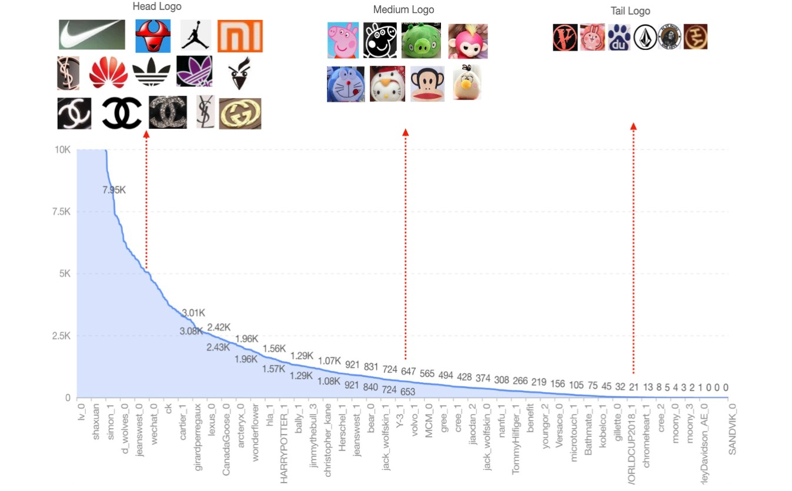
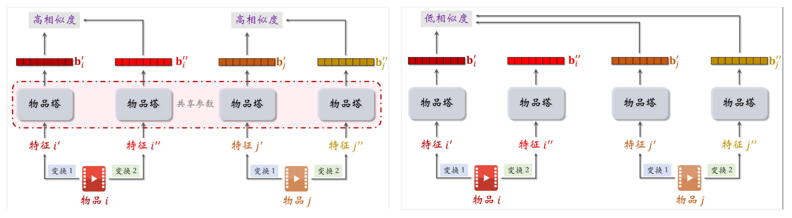
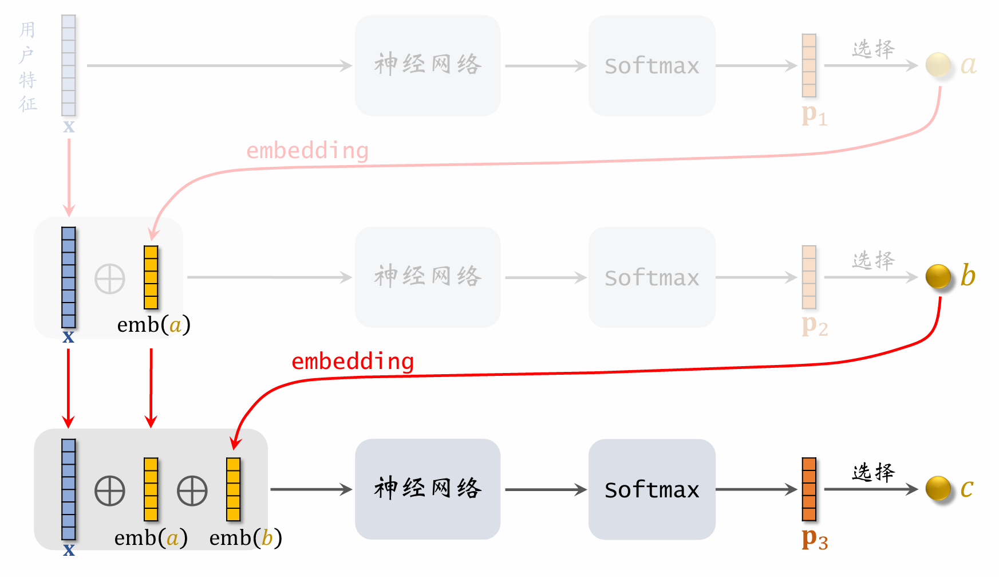
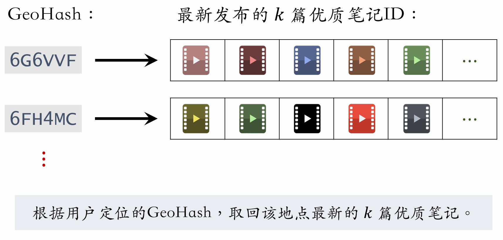
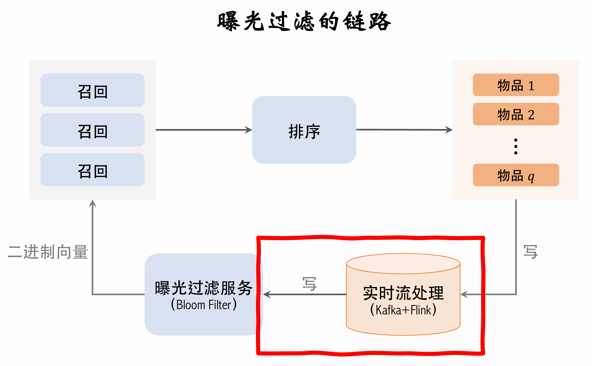

# 推荐系统 (二)

## 因果推断基础

### Rubin 因果估计量

考虑一组个体 $i \in \mathbb{N}_+$, 对每个个体施加二元处理 $T \in \{0,1\}$, 其中 1 表示处理，0表示控制组

对于单元 $i$， **在治疗之前**，观测一组 $p$ 维协变量 $X_i = \{X_1^i, X_2^i,...,X_p^i\}$, 协变量；**在治疗之后**，观测结果 $Y_i$

- **混淆因素**

  混淆因素指治疗前对于治疗及其结果有影响的量，可以是协变量的子集，也可以不是

**相关符号表示**

潜在结果（Potential Outcomes）指的是在**不同的处理分配下**个体可能呈现的结果集合 $\{Y(0), Y(1)\}$

- **事实结果（Factual）**：用户被曝光了（$T=1$），他点击了（$Y=1$），所以 $Y(1)=1$ 是事实。事实结果和处理 $T$ 有关

- **反事实结果（Counterfactual）**：如果该用户**当初没有被曝光**（执行 $T=0$），他是否会点击？这个未发生的 $Y(0)$ 才是反事实结果。

**因果估计量**：

因果效应是对**同一组单元**在**不同处理条件下**的**潜在结果**的对比

这种框架称为Rubin因果模型, RCM

- 个体处理效应 ITE：

  单元 i 接受处理和未接受处理时的潜在结果之差，衡量了对该单元的个体因果影响
  $$
  \text{ITE}_i = Y_i(T = 1) - Y_i(T = 0),
  $$

- 平均处理效应 ATE：

  所有单元个体处理效应的平均值，反映了处理对整个样本的平均影响
  $$
  \text{ATE} = \mathbb{E}_{i \in \mathcal{I}}[\text{ITE}_i] = \mathbb{E}[ Y_i(T = 1)] -  \mathbb{E}[Y_i(T = 0)]
  $$

- 条件平均处理效应 CATE：

  对于协变量X=x的亚组，个体结果的期望差
  $$
  \text{CATE} = \mathbb{E}_{i \in \mathcal{I}}[Y_{i}(1)-Y_{i}(0) \mid X_{i}=x]=\mathbb{E}[ Y_i(T = 1)|X=x] -  \mathbb{E}[Y_i(T = 0)|X=x]
  $$

### 因果推断的根本问题

#### 反事实推断

**<u>因果推断的根本问题是反事实推断</u>**. 任何脱离了个体实际分组 $T_i$ 去探讨的潜在结果，都属于反事实。**因果推断算法（如倾向得分匹配、因果树、Meta-Learners 等）的本质，就是利用统计手段去填补上述公式中那个无法观测到的“反事实”数值。**

##### ITE 中的反事实

在 $\text{ITE}_i = Y_i(1) - Y_i(0)$ 中，**必然有一项是事实，另一项是反事实，取决于个体实际接受了什么干预。**

- 如果个体 $i$ 实际接受了干预（$T_i = 1$）：$Y_i(1)$ 是事实，$Y_i(0)$ 是**反事实**。
- 如果个体 $i$ 实际在控制组（$T_i = 0$）：$Y_i(0)$ 是事实，$Y_i(1)$ 是**反事实**。
- **结论**：对任何单一个体，ITE 永远由“一个观测值减去一个反事实的缺失值”构成，因此 NITE 在现实中永远无法直接计算，只能通过模型去预测那个反事实的部分。

##### ATE 中的反事实

在 $\text{ATE} = \mathbb{E}_{i \in \mathcal{I}}[Y_i(1) - Y_i(0)]$ 中，**期望符号内的两项都各自包含了一半的反事实数据。** 就期望而言, 它是对 **参与实验的全部个体** 取期望, 以 $\mathbb{E}_{i \in \mathcal{I}}[Y_i(1)]$ 而言, 其等于
$$
\mathbb{E}_{i \in \mathcal{I}}[Y_i(1)] = \sum_{i \in \mathcal{I}} p_i Y_i(1) \approx \frac{1}{|\mathcal{I}|}  \sum_{i \in \mathcal{I}} Y_i(1)
$$
但实际上, **总体只能分为“实际接受干预的群体（$T=1$）”和“实际未受干预的群体（$T=0$）”**, 因此, 上述所谓“全体”中有一部分是接受了 $T=0$ 的干预, 因此本质上不存在 $Y_i(1)$, 所以这部分数据为反事实数据

- 在计算 $\mathbb{E}[Y_i(1)]$ 时：它不仅需要 $T=1$ 群体的真实 $Y_i(1)$，还需要推断出 **$T=0$ 群体如果接受干预时的 $Y_i(1)$（反事实）**。
- 在计算 $\mathbb{E}[Y_i(0)]$ 时：它不仅需要 $T=0$ 群体的真实 $Y_i(0)$，还需要推断出 **$T=1$ 群体如果没有接受干预时的 $Y_i(0)$（反事实）**。
- **结论**：ATE 是把总体全部拉去“强制干预”和“强制不干预”两个平行宇宙做对比。这两个平行宇宙中，都有一半的人（与现实分配相反的人）的数据是反事实的。

##### CATE 中的反事实

在 $\text{CATE}(x) = \mathbb{E}_{i \in \mathcal{I}}[Y_i(1) \mid X_i = x] - \mathbb{E}_{i \in \mathcal{I}}[Y_i(0) \mid X_i = x]$ 中，反事实的分布逻辑与 ATE 完全一致，只不过范围缩小到了**特征为 $X_i=x$ 的亚组**中。

- 即使在这个特定亚组里，依然有一部分人实际是 $T=1$，另一部分人实际是 $T=0$。
- **结论**：计算 $\mathbb{E}[Y_i(1) \mid X_i = x]$ 时，该亚组中 $T=0$ 用户的 $Y_i(1)$ 是反事实；计算 $\mathbb{E}[Y_i(0) \mid X_i = x]$ 时，该亚组中 $T=1$ 用户的 $Y_i(0)$ 是反事实。

#### 倾向得分和分配机制

要从存在选择偏差的观察性数据中识别因果效应，必须假设一个**可忽略的分配机制 (Ignorable Assignment Mechanism)**，包含以下两大核心假设：

- 假设 A：无混杂性 (Unconfoundedness / Conditional Exchangeability)
  $$
  T \perp \{Y(0), Y(1)\} \mid X
  $$

  无混杂性/条件可交换性具有两层含义:

  - **解释1**: 在给定协变量 $X$ 后, 处理 $T$ 和个体的潜在结果是独立的, 这表明潜在结果本身在实验前就已经确定了, 它是个体的属性, 而不是随干预变化的. 潜在结果就好比已经装好的信封, 而干预就是去拆信封.

  - **解释2**: 处理 $T$ 或是分组情况在控制协变量 $X$ 后和其他因素无关, 属于完全的抛硬币. 这种随机性也不能理解为“必须和任何事物都随机”, 无混杂性强调处理 $T$ (分组) 应当和潜在结果无关.
  
    > 例如, 根据身份证号最后一位的奇偶性分配某种新药物的实验组和对照组, 虽然这个过程并非随机过程, 甚至是确定性过程, 但是由于身份证号和药物治疗效果是独立的, 因此这种分配策略是合理的
    >
    > 无混杂性的另一个含义 **条件可交换性**, 由于分组不影响潜在结果, 因此, 交换实验组和对照组, 并不影响因果统计量的值
  
- 假设 B：正性假设 / 重叠性 (Positivity / Overlap)
  $$
  0 < e(x) = P(T=1 \mid X=x) < 1, \quad \forall x
  $$

  - **含义**：对于任何特征组合 $X=x$，个体都有大于 0 且小于 1 的概率被分配到处理组或对照组。

  - **倾向得分的引出**：公式中的 $e(x)$ 即为**倾向得分 (Propensity Score)**，表示在给定特征 $X$ 的条件下，个体接受处理的概率. 
  
    正定性也是假设A的一个必然结果, 如果 $\exist x, e(x) = 0/1$, 那么表明在给定某种协变量 $X=x$ 时, 存在被确定性分组的个体, 这违反了“分组应当独立”的假设.
  
  > **共同支撑集缺失**: 工程上, 发现某些特征组合下 $P(T=t \mid X=x) = 0$（即完全缺失某组数据）
  >
  > 1. 数据处理上: 考虑外推法、截断法(将群体退化)
  > 2. 数据降维: 倾向得分等于0往往是因为分类太细, 导致满足某种条件的人群为0
  > 3. 从ATE转换为ATT:受干预人群的干预效应, 即忽略极端的倾向得分, 只考虑重叠部分
  > 4. 从系统设计上避免: 加入随机扰动等, 确保倾向得分的正定性

##### 因果识别的核心等式

基于上述两个假设，我们可以将无法计算的“潜在结果期望”转化为观测数据中可计算的“条件期望”：
$$
\mathbb{E}_{i \in \mathcal{I}}[Y(t) \mid X=x] = \mathbb{E}_{i \in \mathcal{I}}[Y \mid T=t, X=x]
$$
无混淆性允许了条件等价的转化，正性假设确保了等式右边的样本真实存在且可估计。上式表明, 在控制$X$情况下, 再也没有混淆因子干扰分组$T$和结果$Y$了 

> 这个假设要求你收集的 $X$ 必须“包罗万象，绝无遗漏” (有效调整集)
>
> - 比如在医疗中，你控制了患者的年龄、性别、血压、过往病史（你的 $X$），你认为可以放心用这个等式了。
> - 但如果有医生通过“肉眼观察病人的精神状态（未记录在数据库中）”来决定是否给药，这个“精神状态”就是一个**未被观测到的混杂因子（Unmeasured Confounder, UC）**。
> - 只要存在这样一个没被放进 $X$ 里的因子，无混杂性假设就破产了，这个核心等式也就不再成立。

在满足假设下, 可以得到个体的干预效应为: 
$$
\begin{aligned}
\mathbb{E}[Y(t)] &\Leftrightarrow \mathbb{E}_{i \in \mathcal{I}}[Y \mid do(T=t)] \\
&= \mathbb{E}_X[\mathbb{E}_{i \in \mathcal{I}}[Y \mid T=t, X=x]] \\
&= \sum_x\mathbb{E}_{i \in \mathcal{I}}[Y \mid T=t, X=x]p(X=x)
\end{aligned}
$$
被称为 **后门调整定理**, 它表明, 干预 $\mathbb{E}[Y \mid do(T=t)]$ 在阻断后门变量 $X$ 时, 可以被识别. 后门调整定理属于Pearl提出的结构因果模型SCM范畴

## 双塔模型的自监督学习

### 双塔模型的问题

#### 特征交叉太晚

用户特征和物品特征在各自的塔内自娱自乐，直到最后输出向量时，才做了一个极其简单的点积碰撞。这种结构注定无法捕捉复杂的二阶或高阶组合特征（例如：用户A只有在晚上才喜欢看类别B的视频）。这就注定了双塔只能胜任“大浪淘沙”的粗筛工作。

换言之, 双塔模型的监督信号/梯度对于模型本身有些弱, 且其决策只有一步, 难以形成推理行为 (对比Deep Retrieval)

#### 长尾物品

召回阶段, 双塔模型对“是否要将物品曝光”做粗粒度预测, 而用户实际点击则为潜在结果. 召回模型实际上就是一个粗粒度的点击预估器, 它具有如下的问题

1. 推荐系统的头部效应严重
   - 少部分物品占据⼤部分点击
   - ⼤部分物品的点击次数不⾼
2. ⾼点击物品的表征学得好，长尾物品的表征学得不好

*如图为长尾分布的样例, 统计一个logo网站中被点击的logo的分布, 横轴为logo空间, 纵轴为点击率, 若按照50%概率分布进行划分, 则 $p>50\%$ 的仅有少量几种物品, 而大量物品则处于 $p< 50\%$ 的分布*

#### 为什么长尾特征导致双塔的学习问题

更深层的原因在于 **双塔模型的负采样机制**, 使得长尾物品的学习总是迟滞于热门物品

长尾物品在商业生态中是极具价值的核心资产；我们面对长尾物品的策略从来不是“避免训练”，而是“避免盲目的负向惩罚，增加有效的语义表征学习”

##### 正样本视角的比例失衡

**正样本的定义本身就是曝光后被点击的物品**

- 头部物品的特权：如图中左侧的 Head Logo（如耐克、香奈儿），点击量高达 7.95K 甚至 10K。这意味着在整个训练 Epoch 中，模型有上万次机会去调整这些物品的 Embedding，使其精准地靠近喜欢它们的用户群。

- 长尾物品失衡：右侧的 Tail Logo 点击量只有个位数（如 21、8、5 甚至 0）。在庞大的神经网络中，仅靠几次梯度更新，根本不足以将该物品的 Embedding 拉扯到向量空间中正确的位置。它们的 Embedding 往往还停留在随机初始化的状态附近。

也就是说, 即使对于正样本而言, 其本身并非均匀分布, 频繁出现的物品总是少数

##### 批内负采样 (In-batch Negatives) 导致的选择偏差

双塔模型为了工程效率，高度依赖批内负采样。而选择偏差对于批内负采样是致命的. 

> 对于一个用户而言, **负样本是物品**, 批内负采样的构造方式为: 一批内是 $n$ 个 (用户, 曝光被点击物品) 的二元组(去重), 对于一个用户而言, 剩下 $n-1$ 个物品就是批内负样本

批内本身就是被点击物品, 长尾物品因为点击少，极难被抽取到一个 Batch 内作为正样本

##### 全局随机采样的选择偏差

这是选择偏差作用最严重的地方. 全局随机采样相当于直接在长尾上进行采样
假设我们知道物品的点击率先验分布 $p(v)$, $v$ 是某个物品

1. **选择偏差:** 如果随机抽一个物品作为负样本，抽中某个特定长尾物品（比如图中的特定动漫 Logo）的概率依然是千万分之一
2. **马太效应:** 由于长尾物品本身大概率作为负样本(未被点击/批内负样本), 因此embedding学习将其进一步拒绝曝光, 其长尾效应加重

| **维度**         | **我们要极力避免的做法**                                     | **我们要全力增加的做法**                                     |
| ---------------- | ------------------------------------------------------------ | ------------------------------------------------------------ |
| **对待负样本**   | **避免**把长尾物品作为廉价的 Easy Negatives 大量塞给模型。如果系统在全局随机抽样中只给它“推远”的梯度，模型就会偷懒学成“只要是冷门内容就全打低分”。 | **使用 Focal Loss / Hard Negatives**：掐断简单长尾负样本的无用梯度，不让模型在长尾物品上乱刷惩罚经验。 |
| **对待表征学习** | **避免**仅依赖稀疏的 ID 特征（如纯 MF、纯 ID 双塔），导致长尾物品因缺乏点击而永远无法更新参数。 | **增加自监督学习与多模态学习**：利用长尾物品天然具备的标题、图像、标签等内容特征做 Data Augmentation，脱离点击标签也能把向量学透。 |
| **对待采样权重** | **避免**基于绝对点击率的残酷采样（这会让长尾物品连进入 Batch 参与训练的资格都没有）。 | **增加非均匀平滑抽样**：按照 $(\text{点击次数})^{0.75}$ 提升中长尾被采样的概率，人为给长尾物品争取曝光和更新梯度的机会。 |

### 自监督方法和流程

上一章说明了双塔模型主要受困于长尾分布带来的选择偏差, 尽管可以通过概率修正以获得打分的无偏估计量, 但是一个无法干预的事实为: **采样本身难以采样到长尾物品**

引入自监督学习（Self-Supervised Learning）的核心目的是**脱离对点击行为的单一依赖，辅助塔（Item Tower）学习到更高质量、更具鲁棒性的长尾物品向量表征**。

- **头部效应与长尾稀疏**：推荐系统中大部分点击行为被极少数热门爆款占据，绝大部分中长尾物品交互极少。
- **表征质量失衡**：热门物品凭借海量点击正样本，其向量表征被千锤百炼；长尾物品因为缺乏点击，得不到足够的梯度更新机会，导致 Embedding 表征模糊或退化。
- **破局思路**：引入自监督对比学习，通过对物品自身的属性做**特征数据增强（Data Augmentation）**，在无监督标签的情况下强行构造有效的对比训练信号。

#### 自监督对比学习

自监督任务仅作用于**物品塔**，与用户塔无关。

1. **无偏样本抽取**：从**全量物品库中均匀随机抽样** $m$ 个物品组成自监督 Batch（热门与冷门物品被抽取的概率完全均等，彻底消除流行度偏差）。

2. **特征变换（两路增强）**：

   - 物品 $i$ 的特征分别经过变换 $T_1$ 和 $T_2$，生成两个不同的特征视图 $x_i'$ 与 $x_i''$。
   - 两个视图分别送入同一个共享参数的物品塔，得到表征向量 $b_i'$ 与 $b_i''$。

3. **对比学习目标**：

   - **正样本对**：来自同一个物品的不同视图 $(b_i', b_i'')$，鼓励 $\cos(b_i', b_i'')$ 尽量大（语义一致性）。
   - **负样本对**：来自不同物品的视图 $(b_i', b_j'')$（其中 $j \neq i$），鼓励 $\cos(b_i', b_j'')$ 尽量小。

4. **自监督损失函数（InfoNCE 形式）**：
   $$
   L_{self}[i] = -\log \left( \frac{\exp(\cos(b_i', b_i'') / \tau)}{\sum_{j=1}^m \exp(\cos(b_i', b_j'') / \tau)} \right)
   $$

   - $\tau$ 为温度超参数。
   - 自监督总损失为：$\mathcal{L}_{self} = \frac{1}{m} \sum_{i=1}^m L_{self}[i]$

#### 四种自监督方法对比(Data Augmentation)

| **特征增强方法**                       | **具体操作**                                                 | **优缺点 / 适用场景**                                        |
| -------------------------------------- | ------------------------------------------------------------ | ------------------------------------------------------------ |
| **1. 随机掩蔽 (Random Mask)**          | 随机选择某一个离散特征（如类目），将其整体置为默认值 `default`。 *例：`类目={数码, 摄影}` $\to$ `类目={default}`* | **操作简单**，舍弃该特征槽位的全部取值。                     |
| **2. 特征丢弃 (Dropout)**              | 仅对**多值离散特征**生效，随机丢弃其中部分比例（如 50%）的取值。 *例：`类目={美妆, 摄影}` $\to$ `类目={美妆}`* | 迫使模型在**不完整属性标签**下依然能提取鲁棒表征。           |
| **3. 互补特征 (Complementary)**        | 将物品的全部特征集合随机切分成两个**互不相交的子集**，其余位置填充 `default` 生成两个视图。 *例：视图1保留 {ID, 关键词}，视图2保留 {类目, 城市}* | 强迫模型从**两组完全不同的信息维度**中对齐同一物品的深层语义。 |
| **4. 关联特征掩蔽 (MI-based Masking)** | 利用**互信息 (Mutual Information)** 离线计算特征间的相关性矩阵： $$MI(u,v) = \sum_{u} \sum_{v} p(u,v) \log \frac{p(u,v)}{p(u)p(v)}$$ 随机选一个种子特征，将其与其**强关联的 $k/2$ 维特征一同掩蔽**。 | **效果最好**。彻底阻断神经网络通过未掩蔽的强关联特征（如由“女性”推断出“美妆”）偷懒抄近道；但**离线计算复杂，维护成本高**。 |

工业界通常采用多任务联合训练的方式，将主任务与自监督任务融合进同一套梯度反向传播链路中：

- **数据流设计**：

  - 数据流 A：从用户点击日志中抓取 $n$ 个点击二元组，计算主任务损失 $\mathcal{L}_{main}$。

  - 数据流 B：从全局物品底池中均匀抓取 $m$ 个物品，经过**特征变换**计算自监督损失 $\mathcal{L}_{self}$。

    > 双塔模型是根据点击行为进行抽样，热门物品被抽样概率大
    > 自监督模型训练时，直接从全体物品中抽样，冷门和热门物品抽样概率相同，自监督模型只训练物品塔

    - 做两类特征变换，物品塔输出两组向量：$b_1',b_2',\cdots,b_m'$和$b_1'',b_2'',\cdots,b_m''$
    - 第 i 个物品的损失函数：$L_{self}[i]=-\log{(\frac{\exp(\cos(b_i',b_i''))}{\sum\limits_{j=1}^{m}\exp(\cos(b_i',b_j''))})}$

- **总损失函数 (Total Loss)**：
  $$
  \mathcal{L}_{total} = \mathcal{L}_{main} + \lambda \cdot \mathcal{L}_{self} = \frac{1}{n}\sum_{i=1}^n L_{main}[i] + \lambda \cdot \frac{1}{m}\sum_{j=1}^m L_{self}[j]
  $$

  - $\lambda$ 为平衡主任务与自监督任务力度的超参数。

- **参数更新逻辑**：

  - 用户塔：仅接受 $\mathcal{L}_{main}$ 的梯度回传。
  - 物品塔：同时接受 $\mathcal{L}_{main}$ 与 $\mathcal{L}_{self}$ 的双向梯度更新。在保证与用户兴趣对齐的同时，依靠 $\mathcal{L}_{self}$ 的泛化正则能力，将长尾物品拉入合理的几何空间中。

## Deep Retrieval 深度召回

**Deep Retrieval (DR)** 与**双塔模型 (Two-Tower)** 同属于工业界处理千万级候选池的**深度学习召回范式**，但 DR 的诞生初衷是为了**颠覆并替代传统的“双塔 + 向量数据库 (ANN)”链路**，将物品的“表征学习”与“索引构建”进行**端到端的联合优化**。  

**核心维度对比**

| **对比维度**   | **双塔模型 (Two-Tower + ANN)**                               | **Deep Retrieval (深度检索)**                                |
| -------------- | ------------------------------------------------------------ | ------------------------------------------------------------ |
| **检索空间**   | **连续高维向量空间**：将用户和物品分别映射为 Embedding。     | **离散编码/路径空间**：将每个物品编码为多层离散路径（如 $K$ 层的路径码 $c_1 \to c_2 \to c_D$）。 |
| **索引机制**   | **后置解耦**：模型训练好后，离线跑出物品向量，再单独建立外部 ANN 索引（如 FAISS、HNSW）。 | **内生一体化**：索引结构（路径分配矩阵）作为模型内部参数，与推荐网络**端到端联合训练**。 |
| **匹配计算**   | **单次浅层交互**：在线只通过一个点积或余弦相似度做粗筛（Late Crossing）。 | **多步深层路由**：在线根据用户状态，用复杂的神经网络逐步预测下一层离散路径码，沿着路径逐级裁剪候选集。 |
| **计算复杂度** | 依赖向量库的局部敏感哈希或图检索。                           | 束搜索 (Beam Search) 或路径前向预测，检索复杂度为对数级 $\mathcal{O}(D \cdot B)$。 |

**Deep Retrieval 针对双塔模型痛点的破局**

- **消除“表征与索引脱节”的精度损失**：在双塔体系中，模型优化的是点积损失，但线上 ANN 检索使用的是聚类/图裁剪等近似算法，本质为two-stage, 两者目标不一致会导致候选截断损失。DR 将物品的聚类与路由路径直接作为可学习参数，让索引结构完全服务于最终的召回目标。
- **突破“简单内积碰撞”的表达能力瓶颈**：双塔受限于非对称检索架构，用户与物品特征只能在最末端做极浅的内积。DR 允许在路径解码的每一层，让用户复杂的上下文、历史行为序列与候选结构进行深度的非线性交叉。  
- **兼顾大容量与高效率**：DR 通过多层离散编码的组合表达能力（例如 3 层、每层 100 个节点即可表达 $100^3 = 100$ 万物品），在不增加推理耗时的前提下极大地扩充了候选检索空间。

### 索引和预估 (Index and Prediction)

Deep Retrieval 抛弃了经典双塔模型“将用户和物品表示为连续向量进行最近邻查找”的范式，转而**将物品表征为离散路径 (Path)**，线上直接查找与用户最匹配的路径。其思想类似于阿里的 TDM 模型。

#### 核心数据结构：离散路径索引

假设定义一个深度为 $depth=3$、每层宽度为 $width=K$ 的树状/图状结构。

- **节点定义: ** 是系统凭空捏造出来的**抽象虚拟节点（Latent Nodes）**。它们既不是用户，也不是具体的物品，而是代表某种“潜在的语义聚类”或“兴趣特征”. 它们可以代表某种品类层级, 或是更加抽象的分类
  用户、物品都不属于节点, 用户是神经网络的输入 $x$, 而物品则是路径的解码 $v = f(x, \tau)$
- **路径定义**：一条路径由每一层选出的节点组成，例如用 3 个节点表示一条路径：$\tau = [a, b, c]$。
  路径用于隐式聚类, 例如 $10^6$ 个物品, 可以划分 $3 \times 100 (10^{2\times 3})$ 的图, 一条路径对应一个物品
- **多重表征**：一个物品可以表示为多条路径（例如 $\{[2,4,1], [4,1,1]\}$），以增强容错率和表达能力。
  多重、多步的编码比双塔的单步更能学习到细粒度的表征, 且类似于推理过程
- **双向映射索引**：
  - `item -> List<path>`：一个物品对应多条路径（主要用于离线训练）。
  - `path -> List<item>`：一条路径对应多个物品（主要用于线上召回）。

#### 路径预估模型 (自回归预测)

给定用户特征 $x$，预估用户对路径 $path = [a,b,c]$ 的兴趣，等价于计算条件概率的连乘：
$$
p(a,b,c\vert{}x) = p_1(a\vert{}x) \times p_2(b\vert{}a;x) \times p_3(c\vert{}a,b;x)
$$
**预估模型的具体执行过程（以前向传播为例）：**

1. **第一层**：提取用户特征向量 $x$，输入神经网络。通过 Softmax 层输出一个 $K$ 维打分向量 $p_1$，代表对第一层 $K$ 个结点的打分。选出结点 $a$，并获取其特征向量 $emb(a)$。

2. **第二层**：将用户特征 $x$ 和 $emb(a)$ 进行拼接 (Concatenation)，输入神经网络，得到下一层 $K$ 维打分向量 $p_2$。选出结点 $b$，获取 $emb(b)$。

3. **第三层**：将 $x$、$emb(a)$ 和 $emb(b)$ 拼接，输入神经网络，得到打分向量 $p_3$，选出结点 $c$。

   最终得到预估路径 $[a, b, c]$。

### 线上召回 (Online Recall/Retrieval)

线上召回的核心数据流是：**用户 $\to$ 路径 $\to$ 物品**

#### 召回执行步骤

1. **搜寻路径**：给定用户特征，利用 Beam Search（束搜索）召回一批高分路径。

2. **取回物品**：利用提前构建好的反向索引 `path -> List<item>`，将这批路径对应的所有物品取回，合并为一个候选集。

3. **截断打分**：如果召回物品数超过通道配额限制，则使用轻量级打分模型（如双塔模型）对该子集进行二次排序和截断。

   > **LeetCode 215**: 数组中的第 K 个最大元素, **LeetCode 347**: 前 K 个高频元素

#### Beam Search (束搜索) 剪枝机制

对于 $3$ 层、每层 $K$ 个节点的结构，共有 $K^3$ 条可能路径。如果让神经网络穷举打分计算量极大，因此必须采用 Beam Search 贪心算法来控制复杂度。

**机制讲解（以 $beam\_size = 4$ 为例）：**

- **第一层筛选**：根据 NN1 输出的打分向量 $p_1$，选出分数最高的 4 个结点。
- **第二层展开与筛选**：这 4 个结点各自向下一层的 $K$ 个结点展开。计算这 $4 \times K$ 条局部路径 $[a, b]$ 的联合兴趣分 $p_1(a\vert{}x) \times p_2(b\vert{}a;x)$。对这 $4K$ 个分数排序，**再次只保留分数最高的 top 4 路径**。
- **后续层级**：以此类推，每层扩展后都只保留最高分的 $beam\_size$ 条路径。
- **权衡**：$beam\_size$ 较小时计算量小但容易错过全局最优路径（因为本质是贪心算法）；$beam\_size$ 较大时结果准确但计算开销大。

### 离线训练 (Offline Training)

Deep Retrieval 需要**联合学习“神经网络参数”和“物品路径表征”**。训练过程仅依赖正样本，即用户真实点击行为（$click(user, item) = 1$）。

由于两者相互依赖，训练采用交替优化的类 EM 机制。

#### 学习神经网络参数 (固定物品表征)

**固定路径, 学习路径节点上的表征**

核心思想其实更贴近**极大似然估计 (MLE)**, 模型完全只依赖正样本（真实点击行为）进行训练，并没有显式地拿“没点的路径”作为标签 0 输入网络去计算分类损失

- **样本构造（纯正样本驱动）**：遍历用户的历史行为，提取所有的正样本对 $(x, \Pi)$，其中 $x$ 是用户特征，$\Pi = \{\tau_1, \tau_2, \dots, \tau_J\}$ 是该被点击物品当前在索引库中被分配的 $J$ 条离散路径。

- **优化目标（极大似然估计）**：既然用户真实点击了该物品，说明用户潜在的探索意图一定指向该物品所在的这 $J$ 条路径。因此，神经网络的唯一目标就是**最大化预测用户走到这 $J$ 条路径的概率之和**。
  $$
  \mathcal{L} = -\log \left( \sum_{\tau \in \Pi} p(\tau \mid x) \right)
  $$
  由于路径是多层的自回归生成（例如 $\tau = [a,b,c]$），根据条件概率公式，目标展开后即为：
  $$
  \mathcal{L} = -\log \left( \sum_{j=1}^J p_1(a_j\vert{}x) \times p_2(b_j\vert{}a_j;x) \times p_3(c_j\vert{}a_j,b_j;x) \right)
  $$

#### 学习物品表征 (固定神经网络)

**固定节点表征, 学习物品应表示为哪些路径.** 判断标准是“路径与物品的相关性得分”。

设 $u$ 为用户，$x_u$ 为用户特征，$v$ 为物品，$\tau$ 为单条树状/图状路径。

- **计算路径-物品相关性得分 $S(v, \tau)$**：
  $$
  S(v, \tau) = \sum_{u \in U} P(\tau \mid x_u) \cdot r_{u,v}
  $$
  其中，$P(\tau \mid x_u)$ 为在当前固定的神经网络参数下，预测用户 $u$ 走到路径 $\tau$ 的概率；$r_{u,v}$ 为用户 $u$ 与物品 $v$ 的真实交互得分。该公式通过用户的历史交互，将分数聚积到与物品高度相关的合理路径上。

- **构建物品分配损失 $\mathcal{L}(v, \Pi_v)$**：

  假设为物品 $v$ 选出 $J$ 条路径组成集合 $\Pi_v = \{\tau_1, \dots, \tau_J\}$，目标是最小化如下分配损失：
  $$
  \mathcal{L}(v, \Pi_v) = -\log \left( \sum_{\tau \in \Pi_v} S(v, \tau) \right)
  $$

- **引入拥挤度惩罚项 $\mathcal{R}(\tau)$ (关键)**：

  为防止大量物品坍缩聚集在少数几条“爆款路径”上，必须对路径的容量施加惩罚：
  $$
  \mathcal{R}(\tau) = N(\tau)^4
  $$
  其中，$N(\tau)$ 表示当前整个系统中被分配在路径 $\tau$ 上的物品总数。

- **贪心更新路径分配**：

  对于物品 $v$ 现有的 $J$ 条路径集合 $\Pi_v$，每次剥离其中 1 条待替换路径 $\tau_l$，将剩余固定的 $J-1$ 条路径记作子集 $\Pi_{v \setminus l} = \Pi_v \setminus \{\tau_l\}$, 随后，从全局候选路径中贪心地搜索出一条新路径 $\tau'$ 进行替换，以最小化带正则项的总体目标：
  $$
  \tau_l \gets \arg\min_{\tau'} \left( \mathcal{L}(v, \Pi_{v \setminus l} \cup \{\tau'\}) + \alpha \cdot \mathcal{R}(\tau') \right)
  $$
  其中，$\alpha$ 为控制路径拥挤度惩罚权重的超参数。

#### 训练全流程总结

在离线训练中，交替执行以下两步：

- **第一步**：利用 `item -> List<path>` 索引和用户的历史点击记录，更新神经网络参数，使其能更准地预测用户想走哪条路径。
- **第二步**：利用最新的神经网络打分结果，重新计算 $score(item, path)$，并通过带正则项的贪心算法，重新调整物品关联的 $J$ 条路径，确保物品与路径高度相关且路径分布均匀。

> 打分排序: 
>
> - **LeetCode 215**: 数组中的第 K 个最大元素 (Kth Largest Element in an Array) - 快速排序/快速选择
> - **LeetCode 347**: 前 K 个高频元素 (Top K Frequent Elements)  - 优先队列/桶排序

## 扩大召回的范围

### 地理位置召回

#### GeoHash

根据用户所处地理位置, 推荐内容

- GeoHash：对经纬度的编码，地图上⼀个长⽅形区域

- 索引：GeoHash->优质笔记列表(按时间倒排)

  > **边界截断问题**：GeoHash 本质是将地图划分为一个个矩形网格。如果用户恰好站在网格 A 的最右侧边缘，他物理距离上其实离网格 B 的物品更近，但如果只召回网格 A，就会导致严重的“灯下黑”。
  >
  > **九宫格召回策略**：工业界在通过 GeoHash 检索时，绝不会只查用户所在的 1 个网格，而是**同时查出该网格及其周围相邻的 8 个网格（共 9 个）**，合并后再根据真实的大圆距离进行距离排序或截断。
  >
  > **精度分级**：GeoHash 的字符串长度决定了精度。例如 `GeoHash-5` 边长约 $4.9 \text{km} \times 4.9 \text{km}$，适合找商圈；`GeoHash-6` 边长约 $1.2 \text{km} \times 0.6 \text{km}$，适合找附近的店。系统通常会建立多级精度的索引。

#### 多层级地理位置召回

- **POI 召回 (Point of Interest)**：比 GeoHash 更精细，直接基于具体的商场、地标或店铺（例如“三里屯太古里”）。索引为 `POI_ID -> 笔记列表`。

- **商圈/行政区召回**：填补 POI 和 城市之间的空白。

- **自适应降级**：如果用户在市中心（供给极度密集），只召回 GeoHash 或 POI；如果用户在偏远郊区（供给稀疏），系统会自动退化放大到“行政区”甚至“同城”召回，保证候选集充足。

  > **时间衰减**：新闻/本地事件随时间指数级降权（昨天的事今天就不关心了）。
  >
  > **空间衰减**：距离每增加 1 公里，分数按设定比例衰减。
  >
  > **融合公式**：$Score = \text{内容质量分} \times \exp(-\lambda_1 \cdot \Delta t) \times \exp(-\lambda_2 \cdot \Delta d)$，将距离差 $\Delta d$ 和时间差 $\Delta t$ 综合作为截断排序的依据。

#### 同城召回

- ⽤户可能对同城发⽣的事感兴趣
- 索引：城市->优质笔记列表(按时间倒排)
- 这条召回通道没有个性化, 现代召回会给同城通道注入个性化：
  - **双重组合索引 (Geo + Tag)**：建立 `City_ID + Tag_ID -> 笔记列表` 或 `GeoHash + Category -> 笔记列表` 的复合索引。
  - **召回逻辑**：不仅获取用户的定位，还获取用户的兴趣 Tag。例如，命中 `[北京市 + 探店]` 或者 `[朝阳区 + 户外]`，从而在保证同城属性的同时，满足强个性化需求。

### 作者召回

#### 关注作者召回 (Followed Author Recall, U2A2I)

这是强社交/强订阅关系下最基础、转化率最高的一路召回，代表用户的**显式确定性兴趣**。

- **核心逻辑**：用户对其主动关注的作者发布的新内容天然具备高点击意愿。
- **索引结构**：
  - `用户 -> 关注的作者列表` (User-to-Author)
  - `作者 -> 发布的笔记列表 (按时间倒排)` (Author-to-Item)
- **召回链路**：用户 $\to$ 关注的作者 $\to$ 最新的笔记。
- **【工程实践补充】**：
  - **时间窗口限制**：工业界绝不会召回作者一生的所有笔记，通常只拉取该作者**最近 3 到 7 天内**发布的新笔记，避免陈旧内容占用召回池算力。
  - **单作者配额打散 (Quota Limit)**：如果某个高产作者一天发了 50 篇笔记，绝对不能全部召回，否则用户的 Feed 流会被单一作者“霸屏”。必须对每个关注作者设置召回上限（例如最多取 2-3 篇）。
  - **推拉结合 (Push vs. Pull)**：对于超级大V（几千万粉丝），系统会在大V发文时直接将笔记 Push 到活跃粉丝的收件箱（写扩散）；对于普通用户，则在刷新时去拉取关注列表的新内容（读扩散）。

#### 有交互的作者召回 (Interacted Author Recall, U2Action2A2I)

当用户还没形成“关注”动作，但产生了深度消费时，这路召回用于捕捉用户的**隐式短期兴趣**。

- **核心逻辑**：如果用户对某篇笔记产生了正向反馈（点赞、收藏、转发、长停留），说明用户不仅喜欢这篇笔记，大概率也对该作者的创作风格或垂直领域感兴趣。
- **索引结构**：
  - `用户 -> 有交互的作者列表` (基于实时/近期的行为日志流)
  - `作者 -> 最新的笔记列表`
- **召回链路**：用户 $\to$ 有交互的作者 $\to$ 最新的笔记（需排除用户已经交互过的那篇）。
- **【工程实践补充】**：
  - **交互行为的权重区分**：不是所有交互都等价。算法通常会赋予不同行为不同的分值（例如：转发/分享 5分 > 收藏 3分 > 评论 2分 > 点赞 1分）。只有累计得分超过阈值的作者，才会被列入召回源。
  - **时间衰减机制**：用户的隐式兴趣极易漂移。昨天点赞的作者，其召回权重应远高于一个月前点赞的作者。通常会引入指数衰减公式控制有效生命周期。

#### 相似作者召回 (Similar Author Recall, U2A2A2I)

前两路召回只能推荐“已知的熟人”，容易导致信息茧房和候选集枯竭。相似作者召回则是为了**探索与泛化 (Exploration)**。

- **核心逻辑**：“粉以群分”。如果用户喜欢作者 A，那么用户很大概率也会喜欢与作者 A 处于同领域、同风格、粉丝群体高度重合的作者 B。

- **索引结构**：

  - `作者 -> 相似作者 (Top-k)` (Author-to-Author)
  - `作者 -> 发布的笔记列表`

- **召回链路**：用户 $\to$ 感兴趣的种子作者 ($n$ 个) $\to$ 找相似作者 ($n \times k$ 个) $\to$ 最新的笔记 ($n \times k \times m$ 篇)。

- **【工程实践补充】**：

  - **如何定义和计算“相似作者”？** 工业界通常有两种做法：

    1. **基于粉丝重合度 (AuthorCF)**：计算作者A和作者B的共现用户数量(使用类似 ItemCF/Swing 的算法), 计算作者间的协同过滤余弦相似度。
    2. **基于图表征 (Graph Embedding)**：利用 Node2Vec 等图神经网络技术，或者基于作者发布内容的文本/多模态 Embedding，在高维向量空间中进行聚类和最近邻检索。

  - **截断与打分**：由于裂变到了 $n \times k$ 个作者，召回的笔记数量极其庞大。此时必须通过公式打分进行截断：
    $$
    \text{最终得分} = \text{用户对种子作者的偏好度} \times \text{种子作者与相似作者的相似度} \times \text{新笔记的时效性权重}
    $$
    

### 缓存召回

精排层（Ranking）通常会消耗极其庞大的算力来对数百个物品进行精准打分。然而，由于下游策略的干预，**大量已经被证明是用户高度感兴趣的物品最终并没有展现给用户**

缓存召回的想法: 接复用前 $n$ 次推荐请求中精排层产生的高质量历史结果

#### 业务背景与痛点：算力浪费与漏斗损耗

- **精排的算力投入**：精排模型（如复杂的多目标 MMOE）对传入的几百篇笔记进行了极其精细的特征交叉与打分预估，得出了高度个性化的候选列表。
- **重排的残酷淘汰**：这**几百篇**高分笔记被送入重排层与策略层后，由于系统需要强制执行**多样性打散（抽样）、强制频控、穿插广告**等产品逻辑，最终只有**几十篇**笔记能真正脱颖而出，获得曝光。(精排: 几百->几十)
- **高分未曝光的“遗珠”**：这意味着精排产生的一大半（甚至 80% 以上）优质结果根本没有机会在用户端曝光，其背后消耗的昂贵算力被白白浪费。

#### 缓存召回通道的构建逻辑

为了挽回这部分算力与优质内容，系统会单独开辟一条无须经过复杂检索的特殊召回通道：**缓存通道**。

- **截取规则**：在每次推荐请求结束后，将精排打分排在 **Top 50** 以内、且**最终未能曝光**的优质笔记提取出来。
- **缓存存储**：将这些笔记存入基于用户 ID 的 Redis 等高速缓存中。
- **复用召回**：当用户下一次发起下拉刷新或新的推荐请求时，系统直接从该用户的缓存队列中读取这批笔记，作为一路独立的召回源，与其他（如双塔、U2A 等）召回结果汇合，再次送入粗排/精排阶段。

#### 缓存退场机制 (Cache Eviction Policies)

用户的兴趣是流动的，且缓存空间大小固定，如果只进不出，缓存很快会被过时内容塞满。因此，缓存召回必须配合极其严格的**多维度生命周期管理（退场机制）**：

- **1. 曝光即退场（正向消耗）**：这是最核心的规则。一旦缓存中的某篇笔记在后续的某次请求中成功突围并真实曝光给了用户，它就完成了历史使命，必须立即从缓存中删除，避免重复推荐。
- **2. 容量溢出退场（FIFO 淘汰）**：为每个用户分配的缓存池大小是固定的（例如最多存 200 篇）。当新一轮未曝光的优质笔记写入，导致总数超出上限时，系统采用先进先出（First-In-First-Out）的策略，将最早期进入缓存的笔记挤出淘汰。
- **3. 召回次数上限（疲劳度控制）**：如果一篇笔记一直躲在缓存里，每次都被召回，但在精排或重排中连续 10 次都被打败且未能曝光，说明它可能存在某些硬伤（如多样性与当前场景冲突）。设定**最多被召回 10 次**的上限，达到即强制清退。
- **4. 时效生命周期（TTL 淘汰）**：内容存在时效性，推荐也讲究新鲜感。设定绝对的时间阈值（Time-To-Live），**每篇笔记在缓存中最多存活 3 天**。超过 3 天未被曝光的笔记，无论分数多高、召回次数多少，都会自动过期销毁。

## 召回系统的后处理

### 曝光过滤问题

在推荐系统的完整链路中，为了保证用户体验，系统必须确保**不向用户重复推荐其已经看过的物品**。这一环节被称为“曝光过滤”（Exposure Filtering）。

- **规则定义**：针对每个用户，系统需要记录其近期的曝光历史（例如小红书仅保留最近 1 个月的曝光记录，因为召回池本身也会过滤太旧的笔记）。对于每次召回产生的新候选集，必须与该历史记录比对，剔除已曝光物品。
- **计算瓶颈**：假设一个活跃用户近期已经看过了 $n$ 个物品，本次系统召回了 $r$ 个候选物品。如果采用最朴素的暴力遍历比对（比如查哈希表或数组），需要消耗 $\mathcal{O}(nr)$ 的时间复杂度。在毫秒级响应的线上系统中，这种耗时是不可接受的。

### Bloom Filter

为了解决海量数据的去重与判定问题，工业界通常采用 **布隆过滤器 (Bloom Filter)**。它是一种极度节省空间且高效的概率型数据结构。

#### 核心机制

- 它将用户的曝光物品集合压缩并表征为一个长度为 $m$ 维的二进制向量，每一位只占 1 个 bit，初始全为 0。
- 分配 $k$ 个独立的哈希函数，每个哈希函数能将物品 ID 映射为 $0$ 到 $m-1$ 之间的一个位置索引。

**判定逻辑（绝对的否定与不绝对的肯定）：**

- **一定没看过 (No)**：如果判断结果为 No，则该物品**一定不在**已曝光集合中。
- **可能看过 (Yes)**：如果判断结果为 Yes，则该物品**很可能**在集合中。存在误伤（False Positive）的可能，即错误地把未曝光的新物品判定为已曝光并过滤掉。

**想法推演**

1. 每个哈希函数可以将物品映射到 0 ~ m-1, 这必然有哈希碰撞, 因为物品是无穷的

2. 当物品的二进制向量位为0, 则一定没有被看过, 但是如果向量位为1, 那不能保证它被看过(因为碰撞)

3. k 多重验证就是为了降低误伤, 使用 k 个不同的哈希函数。物品曝光后，会将向量中的 k 个位置同时置为 1。新召回的物品进来查验时，必须 k 个位置**全部是 1**，才会被判定为已曝光（存在一定误伤）；**只要有任何 1 个位置是 0**，就绝对说明该物品未曝光。

   > 简单的反证法思想, 但k和m是有制约关系的, 并非单个变量越大越好

#### 数学基础与最优参数配置

Bloom Filter 的误伤概率 $\delta$ 受曝光物品总数 $n$、向量维度 $m$、哈希函数个数 $k$ 的共同影响。

**误伤率公式：**
$$
\delta \approx \left(1 - \exp\left(-\frac{kn}{m}\right)\right)^k
$$

- **$n$ 越大**：塞入的物品越多，向量中被染成 1 的位置就越密集，新物品来查验时恰好 $k$ 个位置全碰上 1 的概率就越大（误伤率升高）。

- **$m$ 越大**：向量越长，位置越宽裕，哈希碰撞的概率越低（误伤率降低），但内存开销变大。

- **$k$ 的权衡**：$k$ 太小，一次碰撞就误伤；$k$ 太大，每个物品会占用过多 bit，导致向量迅速填满，误伤率反而急剧飙升。

  > 1. 当 $n>m$ 时, $\exist k$ 使得误伤率最小, 且随着 $m$ 的增加, 最小误伤率减小
  > 2. 当 $n \le m$ 时, 随着 $k$ 增加, 误伤率单调递减, $\lim_{k \rarr \infty} \delta_k = 0$

**最优参数设计：**

在工程中，我们通常先设定一个业务可容忍的极限误伤概率 $\delta$（例如 $0.01$），然后推导出所需的最优参数配置：

- 最优哈希函数个数：
  $$
  k = -1.44 \cdot \ln{\delta}
  $$

- 最优二进制向量长度：
  $$
  m = -2n \cdot \ln{\delta}
  $$
  

#### 工业曝光过滤链路

1. **推荐**：推荐系统使用不同的召回通道，召回物品，并通过粗排、精排、重排，将一部分物品推荐给用户

2. **曝光过滤**：推荐给用户的这部分物品，使用实时流处理(Kafka+Flink)，将物品写入 Kafka 对话序列，然后使用 Bloom Filter 处理，修改向量。

   > 这一步处理的速度必须非常快，否则在用户快速连续刷新的情况下，系统可能会给用户推荐重复物品

3. **推荐**：在召回完成之后，系统调用曝光过滤服务，将已曝光的物品剔除，剩下的物品再进入排序

#### 布隆过滤器的缺点

Bloom Filter 最大的缺点在于：**它只支持插入，绝对不支持删除**。

- **因果限制**：当你想从集合中移除一个物品时，你不能直接把它的 $k$ 个哈希位置翻转回 0。因为这些位置的 1 很可能也是被其他曝光物品共享（哈希碰撞）出来的。如果强行清 0，会导致其他原本已曝光的物品被误认为未曝光。
- **业务痛点**：随着时间推移，很多超龄物品（例如超过 1 个月的笔记）已经不可能被系统召回了，它们本来没必要继续占着坑位。如果能把它们从集合中删掉，就能降低 $n$，从而降低误伤率。但在标准 Bloom Filter 下，无法消除它们对向量留下的永久污染。

