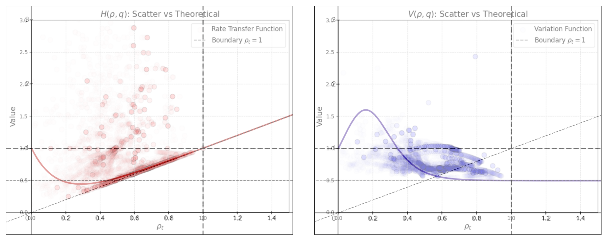
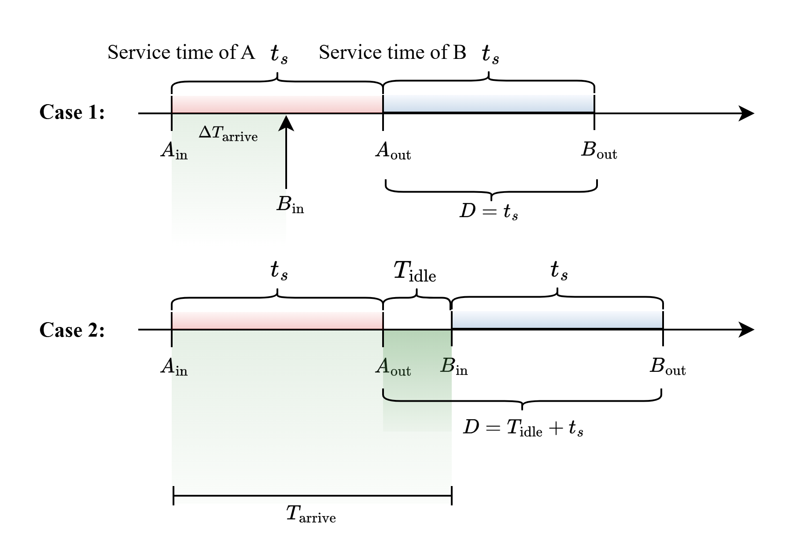
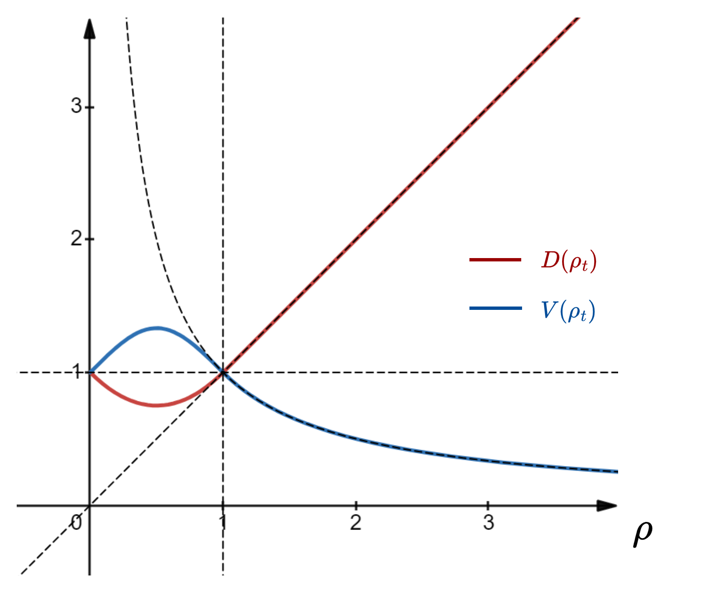
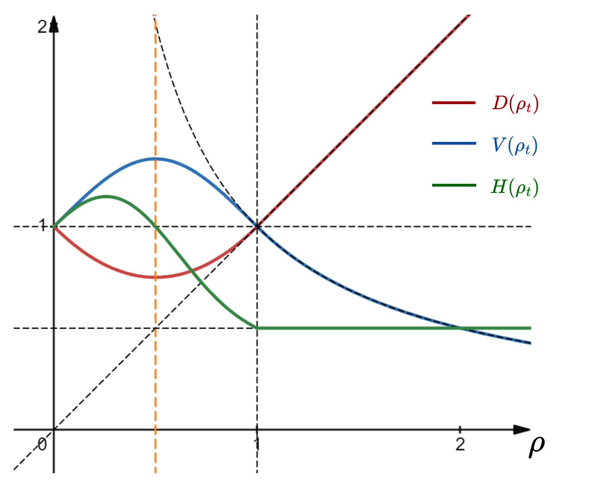
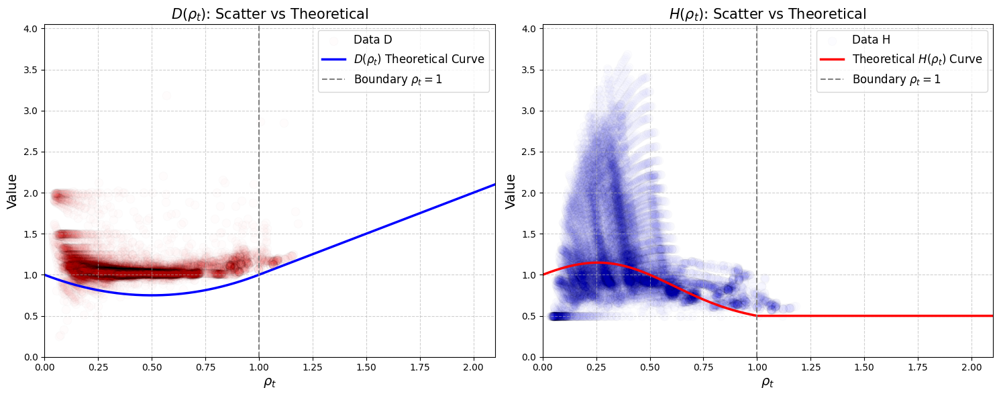
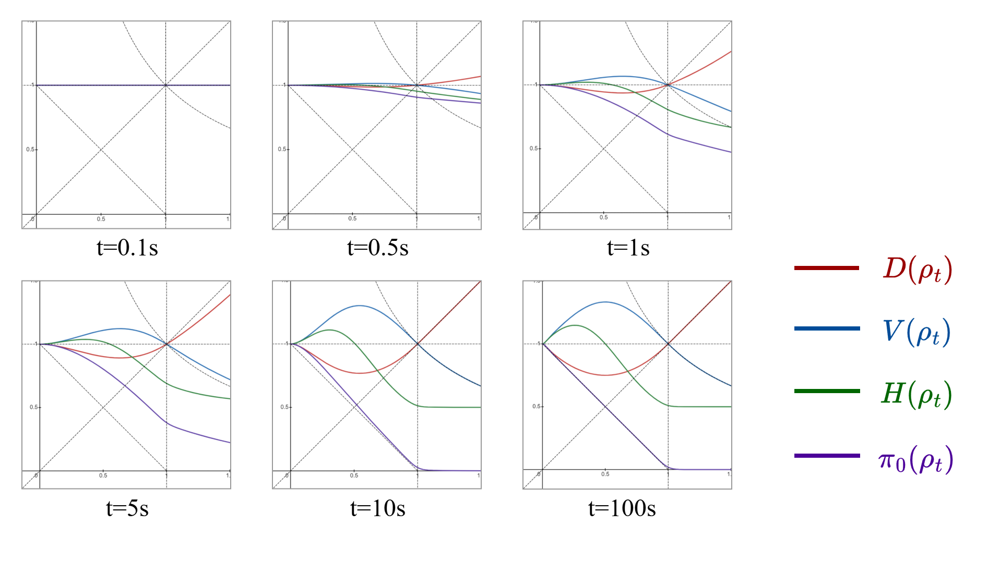
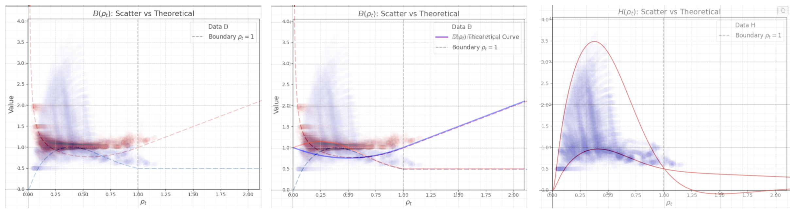

# 记录一些废除的推导

##### 2025-10-30 不急着弄伪代码

在**时域**上, 智能体的任务就是保持一个良好的决策, 使得周边邻居的负载情况不要恶化, 因此, 历经信息直接反映动作的好坏

定义即刻奖励
$$
r(S_t, A_t) = r(A_t, X_{t+1}) = r_t
$$
表明, 在智能体做出动作后, 环境根据其动作所导致的历经直接给出一个奖励, 以衡量其对于周边环境的维护贡献

在当前策略下, 智能体的长期行为应当最大化, 以保证其平均而言做出了最好的策略

定义时域值函数
$$
v^\text{TD}_\pi(s_t) = \mathbb{E}[\sum_{k=t}^\infty \gamma^{k-t}r_k \mid S_t = s_t]
$$
定义动作值函数
$$
\begin{align*}
q_\pi^\text{TD}(s_t, a_t) &=  \mathbb{E}[\sum_{k=t}^\infty \gamma^{k-t}r_k \mid S_t = s_t, A_t = a_t] \\
&= r_t + \gamma v_\pi^\text{TD}(s_{t+1})
\end{align*}
$$

###### 空域信用分配

在空域上, 产生空域轨迹, 即多智能体协作使得任务完成或结束, 定义终端奖励

> 定义 [终端奖励]
>
> 空域轨迹是一个生灭过程, 具有确定的起点和终点, 在轨迹结束时所产生的结果反馈称为终端奖励
> $$
> G(\tau) = G_T
> $$
> 表明, 轨迹 $\tau$ 是一个长度 $T$, 且具有终端奖励 $G_T$ 

在 $T$ 时刻, 产生终端奖励后, 该奖励会根据一个分布分配给协作完成任务的一切智能体身上, 称为「信用」

定义信用 $\eta_t(i)$
$$
r_i(S_t, A_t) = r_t + \eta_t(i) G_{t+T}(\tau)
$$
表明, 在 $t + T$ 时刻任务完成, $T$ 是随机变量, 智能在 $t$ 时刻除了即刻奖励外, 还获得了一个非因果的分配奖励, 按照 $\eta_t(i)$ 分配

- 如果智能体不属于轨迹上, 则信用为 0; 对于同一轨迹上的智能体, 信用和为 1
- 对于不同的轨迹, 其分配变量相互独立

在 T 时刻, 映射 $i_t$表明在 $t \le T$ 时刻轨迹到达的智能体索引, 沿着轨迹 $\tau = \{i_1, i_2, ...i_T\}$ 进行奖励的积累

对具体动作而言, 具有奖励积累
$$
q^\text{SD}(s_t, a_t) = r_t + \mathbb{E}_\tau[\sum_{k=t+1}^T \beta^{k-t} r_{i_k}(s_k, a_k) \mid S = s_{t+1}]
$$
如果在 $t$ 时刻, 做出不同动作, 会导致不同的轨迹, 对于所有可能的动作, 有
$$
v^\text{SD}(s_t) = \mathbb{E}_{A_t, \tau \sim \Tau(s_t, A_t)}[\rho_{i_t}(s_t, A_t) \mid S = s_t]
$$
定义动作的空域优势函数
$$
\begin{align*}
A^\text{SD}(s_t, a_t) &= q^\text{SD}(s_t, a_t)  -  v^\text{SD}(s_t) \\
&= r_t + \beta v^\text{SD}(s_{t+1}) - v^\text{SD}(s_t)
\end{align*}
$$

> 定理 [终端分配定理]
>
> 

##### 伪代码

*2025-10-27_154315, 整合上述两部分, 进行CAF-AC优化*

> - 时隙内噪声学习, 初始化残差模型Res $f_\phi$, 噪声模型 CVAE $\psi$, 执行多轮:
>
>   - 采样一定数量的 $(h_t, o_t, a_t, r_{t}, x_{t+1})$
>
>   - 对于观测 $o_t$, 利用排队论预测基线 $o_t \rarr \bar{s}_{t+1}$
>
>   - 利用一种残差模型 $f_\phi$, 通过 $\bar{x}_{t+1}$ 预测 $x_{t+1}$
>
>     - 残差投射结构: $x \rarr f(x) = x+ u(x)$, 若 $f(\bar{x}_{t+1})=x_{t+1}$, 则 $u(\bar{x}_{t+1}) = x_{t+1}-\bar{x}_{t+1}$ 恰为噪声
>     - 转移状态预测 $\hat{x}_{t+1} = f(\bar{x}_{t+1})$
>
>     得到其中的残差结构, 能够利用 $\bar{x}_{t+1}$ 投射加性噪声 $u_\phi(\bar{x}_{t+1})$
>
>   - 参数更新 $\phi \larr \arg\min_\phi ||x_{t+1} - \hat{x}_{t+1}||$
>
>   - ----------------------------------------------------------------------------------------------
>
>   - 利用一种MLP, 残差模型 $g_\psi$, 通过 $\hat{x}_{t+1}$ 预测 $\hat{r}_t$
>
>     -  $r_\psi(h_t, a_t, \hat{x}_{t+1}) = \hat{r}_t$
>
>     -  $g_\psi(\hat{r}_t) = \hat{r}_t + u_\psi(\hat{r}_t) = r_t \Rarr  u_\psi(\hat{r}_t) = r_t - \hat{r}_t $
>
>   - 噪声编码 $(\mu, \sigma)^U = \text{Encoder}_\psi(h,  p^D(a|h))$, 其中 $h$ 表示节点的知识
>
>   - 噪声解码 $p^U(a|h) = \text{Decoder}_\psi(h, z), \quad z \sim \mathcal{N}(\mu, \sigma)^U $
>
>   - 更新噪声模型 $\psi \larr \arg\min_\psi D_{KL}(p^U(a|h) ~||~ p^D(a|h)) + D_{KL}(\mathcal{N}(\mu, \sigma)^U, \mathcal{N}(0,I))$
>
>     此处, 噪声模型需要学习数据集中动作概率的先验知识, 即数据集是如何通过知识做出动作的
>
> 
>
> - 时隙内轨迹学习, 初始化值函数 RNN $v_\omega(s_t)$, 策略函数 $\pi_\theta(a_t | h_t)$, 执行多轮:
>
> 
>
>   - 采集一定数量的轨迹 $\tau=\{(s_t, o_t, a_t, r_{t+1}, s_{t+1})\}$, 每条轨迹具有轨迹回报 $G(\tau)$
>
>   - 从轨迹最后一个倒着进行, 在边缘节点处有固定奖励 $r_\text{done}$
>
>   - 值函数更新
>     - 对于当前转移有明确奖励函数 $R: (s_t, o_t, a_t, s_{t+1}) \rarr \mathbb{R}^+$ 
>     - 
>
> 
>
>
> - 时隙内策略优化, 初始化策略函数 $\pi_\theta$, 执行多轮:
>   - 采集一定数量的轨迹 $\tau=\{(o_t, a_t, r_{t+1}, s_{t+1})\}$, 
>  - 根据邻居观测 $o_t$, 进行基线查询 $o_t \rarr \bar{s}_{t+1}$, 随后进行反事实查询 $\hat{s}_{t+1} = \bar{s}_{t+1} + u_\phi(\bar{s}_{t+1}) $
>   - 生成多个当前动作分布 $p^U_i(a|o_t) = \text{Decoder}_\psi(o_t, z_i), \quad z_i \sim \mathcal{N}^U$
>    - 计算反事实基线 $v^\text{CF}(o_t) = \sum_{a \in \mathcal{A}}p^U_i(a|o_t)[r^\text{CF}_{t+1} + \gamma v_\omega(\hat{s}_{t+1})]$ 
>      - 对动作 $a_t$ 计算CAF函数 $\delta_t= r_{t+1} + \gamma v(s_{t+1} ) - v^\text{CF}(s_t) $
>    - 给定策略分布 $\pi_\theta(a \mid s_t)$
>      - 更新参数 $\theta_{i+1} = \theta_i + \alpha_\theta \delta_t\nabla_\theta \ln \pi(a | s) - \beta \nabla_\theta D_{KL}(\pi_\theta ~||~ p^U_i )$

###### 空间泛化性质

理论上来说, 由于值函数预训练的性质, 它应当对于每个节点都不是异质性的

即: 我们不需要为每一个节点单独训练一个智能体, 而是训练出一个策略, 每个智能体都能根据这个策略执行正确的动作

##### 2025-10-29对于POMDP理解仍然有误

更进一步地:

- **$v_\pi(s)$ 本身暗含「转移」**, 它是以当前节点为起点, 对未来的估计

  仍从基本公式(1)出发, $v_\pi(s)$ 本质是 $q_\pi(s,a)$ 的加权, 即暗含「动作A的未来影响的加权」

  那么, 值函数锚点 $s$ 一定应当能够导出 $a$, 否则 $q_\pi(s,a)$ 无意义

- 在POMDP中, 我们无法感知到状态 $s$, 当数据包到达当前节点后, 有「历经」$x_t$, 随后智能体进行观测 $o_t$ 后进行动作 $a_t$, 发生历经 $x_{t+1}$

  历经 $x_{t+1}$ 表征动作的真正影响, 而 $o_t$ 和之前的知识 $h_{t-1}$ 构成动作的决定因素, 因此, 值函数应当是如下形式
  $$
  v_\pi(h_{t}) = \mathbb{E}_{A \sim \pi(A | \tilde{h}_{t})}[\mathbb{E}[G \mid H=\tilde{h}_{t}, A]]
  $$
  其中, $\tilde{h}_{t}$ 知识过渡态, 其先包含观测以诱导动作分布, 随后在做出动作后成为定态 $h_t$

定义值函数, 包含5层含义
$$
\left \{
\begin{align*}
\tilde{H}_{t} &= f(H_{t-1}, O_t)\\
A_t &\sim \pi(A \mid \tilde{H}_{t}) \\
H_t &= g(\tilde{H}_{t}, A_t, X_{t+1}) \\
q_\pi(\tilde{H}_t, A_t) &= \mathbb{E}_G[G \mid \tilde{H}_t \rarr H_t] \\
v_\pi(H_{t}) &= \mathbb{E}_A[q_\pi(H_t, A_t) ]
\end{align*}
\right.
$$
重新考虑优势函数的表达式
$$
\begin{align*}
A_\pi(s_t, a_t) &= r_{t+1} + \gamma v_\pi(s_{t+1}) -v_\pi(s_t)  \tag{2} \\
&= Q_\pi(s_t, a_t) - v_\pi(s_t)   \tag{3}\\
\end{align*}
$$

- 式(2)需要我们知道下一个节点的 $s$, 然而, $s$ 必须由节点的体验和观测导出, 不利于反事实推断
- 我们已知可以导出反事实的「历经」信息 $\bar{x}_{t+1}$, 因此, 优势函数估计需要从过渡态到定态的过程入手

> 按如下步骤进行基线值函数的反事实推断
>
> 1. 根据轨迹, 学习动作值函数 $q_\pi(H_t, A_t)$, 学习先验动作噪声 $ p^U(A \mid \tilde{H}_t)$
>
> 2. 对于给定采样 $(h_{t-1}, o_t, a_t, x_{t+1})$, 可执行多个动作反事实查询 $a \in \mathcal{A}$, 得到反事实历经 $o_t \rarr \bar{x}_{t+1}$
>
> 3. 对于这些历经, 合成反事实知识 $\bar{h}_t$
>
> 4. 带入函数计算反事实动作值函数 $q_\pi(\bar{h}_t, a \in \mathcal{A})$
>
> 5. 计算反事实优势函数
>    $$
>    A^\text{CF}(h_t, a_t) = q_\pi(h_t, a_t) - \mathbb{E}_{A \sim p^U(A \mid \tilde{H}_t)}[q_\pi(\bar{h}_t, A)]
>    $$

##### 2025-10-16因果建模的前置

利用因果推断框架, 针对一个包接受服务的 $t_s$ 期间会发生的事情

下列假设将用于对模型的相关变量进行规范

- **公理 1** [独立性假设]: 主要针对路由需求 $\lambda_t$ 进行规范

  任意时隙中, 某节点的路由需求 $\lambda_t^v$ 和历史需求 $\lambda^v_{<t}$ 无关, 任意不重叠时间区间内的路由需求 $\lambda^v_{t-I: t}$ 相互独立
  $$
  \lambda_t^v \perp \lambda^v_{\lt t} \mid \forall t
  $$

- **公理 2** [模型效应假设]:定义因果结构方程

  由于离开(输出)率等于到达率, 中心节点 $v$ 发出一个包的 $t_s$ 过程中, 会受到邻居 $v' \in N(v)$ 流量如下
  $$
  \Delta N_a = \lambda_t^{v'} t_s = \rho_t^{v'}
  $$
  这假设了确定性策略, 即根据包的数据以及当前状态 $s_t^{v'}$, 邻居节点计算出唯一的转发动作; 则中心节点 $v$ 在执行动作的 $t_s$ 过程中, 原本的

  

- **公理 3** [线性加性假设]: 不可观测混淆(UC)的影响通过线性加性作用

  任意时隙中, UC对流量的影响体现为线性加性效应, 描述同一时隙不可观测的来自其他节点的流量
  $$
  \lambda_t^{v'} = \pi_{t-1}^v  \lambda_{t-1}^v + \alpha_t^{v'}U_t^{v'} + e_t^{v'}
  $$
  任意时隙中, UC对时延的影响体现为线性加性效应, 描述除系统固有时延分布以外的环境干扰对时延的影响
  $$
  T_t^{v} = f(\lambda_t^v, Q_t^{v}) + \beta_t^vU_t^v+ e_t^{v}
  $$
  任意时隙中, UC对丢包的影响体现为线性加性效应, 系统的总丢包量等于队列溢出丢包量加背景丢包量, 由于一个时隙中接受服务并离开的数据量是固定的(正比于 $\mu_t$), 因此, 这部分数据在发送至下一节点过程中丢失的量也是和节点状态无关的
  $$
  L_t^v = g(\lambda_t^v, Q_t^{v}) + \gamma_t^vU_t^v+ e_t^{v}
  $$
  任意时隙中,  UC不被任何因素决定
  $$
  U_t^{v'} \perp \lambda_t^{v'}, Q_t^{v'}, T^{v'}_t, L^{v'}_t,A_{t-1}^{v}  \quad \forall t \ge 0, v' \in N(v)
  $$

##### 2025-10-16暂时废除关于间隔传递函数等用处不大的推导

然而, 上述是在长期观察下的平均情况, 对于系统内特定的状态 $Q_t=q \Rarr w(q)$ 表明个体逗留时间为 $w=t_sq + R$

- 对于确定性服务, $R \sim U(0, t_s)$, $\mathbb{E}[e^{-\lambda R}] = \frac{1}{\lambda t_s}(1-e^{-\lambda t_s}) $

- 因此有

$$
\begin{aligned}
\mathbb{E}[D \mid Q=q]  &= \mathbb{E}[D \mid Q=q, A \le w(q)]P(A \le w(q)) +  \mathbb{E}[D \mid Q=q, A \gt w(q)]P(A \gt w(q)) \\
&=\mathbb{E}_W[t_s \int_0^{w}\lambda e^{-\lambda t}dt + \int_{w}^\infty \lambda (t - w + t_s) e^{-\lambda t}dt] \\
&=t_s +\mathbb{E}_W[ \frac{1}{\lambda}e^{-\lambda w}]  \\
&=t_s + \frac{1}{\lambda}e^{-\lambda t_sq }\mathbb{E}_R[e^{-\lambda R}]  \\
&=\frac{1}{\lambda}(\rho + e^{-\rho q}\frac{1-e^{-\rho}}{\rho})
\end{aligned}
$$

- 记如下统计量

$$
H(\rho, q) = \lambda \mathbb{E}[D \mid Q=q] =\rho + \frac{1-e^{-\rho}}{\rho}e^{-\rho q}, \quad \rho \ge 0, q \ge 0
$$

- 称为 **间隔传递函数**, 表明M/D/1 系统将输入速率转换为输出速率的转移函数

  当传递函数 $H \le 1$, 表明 M/D/1 系统对于该状态进入的个体, 以压缩效应进行输出

  随着 $\rho$ 增加, 传递间隔趋于定长, 逼近 $\rho$

尽管离开率等于到达率, 但输出过程并不是泊松过程, 考虑如下函数
$$
V(\rho, q) = \frac{\mathbb{E}[D^2]}{2 \mathbb{E}^2[D]} = \frac{\frac{1}{2}\rho^2+ \frac{1}{\rho}(1-e^{-\rho})(1+\rho)e^{-\rho q}}{(\rho + \frac{1-e^{-\rho}}{\rho}e^{-\rho q})^2} ,\quad \rho 
\ge 0, q \ge 0
$$

称为 **传递变异函数**, 表明输出过程偏移泊松过程的程度

- $V \ge 0.5$ 恒成立, 随着 $\rho$ 增加, 输出趋于定长分布, 随 $q$ 增加, 系统更容易进入定长分布
- 当 $q \ge 1$ 时, 系统在 $\rho \le \rho_v^*$ 区域存在 $V \ge 0$ 的部分, 表明此时系统的输出过程向上偏移泊松过程, 方差增大
- 当 $q \ge 1, \rho = \rho_v^*$ 时, 表明在当前状态进入的个体的输出过程为瞬时泊松过程

>**验证** [随机打靶实验]
>
>在离去时刻观测到达间隔, 离开间隔以及服务间隔, 计算各个统计量, 并以当前 $\rho$ 为自变量打靶
>
>
>
>- 实验表明, 以到达者为视角, 即记录其到达时的 $\rho$ 但是在离去时进行统计记录, 数据能够较好地符合理论曲线
>
>- 在拥堵系统中, A-star静态路由策略使系统较多集中在了高负载, 其输出趋于定长且速率并不高
>
>- 排队网络中, 多数节点并不处于泊松输出的状态, 而是趋于定长输出

> **定理** [M/D/1最优分布定理]
>
> M/D/1排队系统组成的网络达到吞吐量和可控性最优时, 各个节点 $\rho < 1$ 且达到稳态, 离开率等于到达率, 且进入队列的个体能够以较大概率以泊松过程进行输出

##### 2025-10-15

结论先说：
- 你的思路（按“本离开是否把系统清空”来分解 inter-departure time）是对的；E[D]=1/λ 也对。
- 但从“给定状态 Q=q”往下的推导里，把随机的剩余服务时间 R 用其均值 E[R]=t_s/2 直接代入是关键性错误；应该对 e^{-λ(q t_s+R)} 取期望，而不是把期望搬进指数里。
- 因此你给出的“传递函数”H(ρ,q) 和“传递变异函数”V(ρ,q) 不是精确式，只是一个近似（把 E[e^{-λR}] 近似成 e^{-λE[R]}=e^{-ρ/2}）。
- 由此引出的若干结论（H≤1、ρ_h^* 的闭式、所谓“瞬时泊松点”以及“最优分布定理”）都不成立或需要改写。

下面给出严格结果，供你对照。

设 M/D/1，服务时间常数 t_s，ρ=λ t_s<1。到达是泊松（与系统独立）。令 R 为正在服务作业的平衡剩余服务时间；对确定型服务有
- R ~ Uniform(0,t_s)
- E[e^{-λR}] = (1-e^{-ρ})/ρ

1) 给定到达时看到的系统内人数 Q=q 的 inter-departure 期望
- 标记一个作业在到达时看到 Q=q，则它的逗留时间 w(q)=q t_s+R。
- 以它自己的离开时刻为原点看下一次离开：
  若在它逗留期间有到达（A≤w），则下一次离开间隔为 t_s；
  若无到达（A>w），则下一次离开间隔为 (A-w)+t_s，其中 A~Exp(λ) 且与 R 独立。
- 因此
  E[D | Q=q] = t_s + (1/λ) E[e^{-λ w(q)}]
              = t_s + (1/λ) e^{-λ q t_s} E[e^{-λR}]
              = t_s + (1/λ) e^{-ρ q} (1-e^{-ρ})/ρ

把它写成你定义的“速率传递函数”
  H(ρ,q) := λ E[D | Q=q]
          = ρ + e^{-ρ q} (1-e^{-ρ})/ρ

对比你文中的 H(ρ,q)=ρ+e^{-ρ(q+1/2)}：你等价于把
  E[e^{-λR}] 误写成 e^{-λE[R]}=e^{-ρ/2}
而真实值是 (1-e^{-ρ})/ρ。由于 e^x 是凸函数，有
  E[e^{-λR}] ≥ e^{-λE[R]}，
所以你的 H 和后面的 V 系统性偏小（误差在 ρ 较大时更明显）。

直接的推论
- H(ρ,q) 不总是 ≤1。反例：q=0, ρ=0.9 时
  H=ρ+(1-e^{-ρ})/ρ ≈ 1.559 > 1。
  这并不矛盾，因为这是“条件在某个状态”的期望；只有无条件平均时 λE[D]=1。
- 当 q 较大或 ρ→1 时，e^{-ρ q}(1-e^{-ρ})/ρ→0，确实有 H→ρ，对应“输出趋于定长”（下一次离开几乎就是一个服务时间）。

2) 二阶矩与“传递变异函数”
利用记号 α(ρ,q):=e^{-ρ q}(1-e^{-ρ})/ρ，有
- E[D | Q=q] = (ρ+α)/λ
- E[D^2 | Q=q] = t_s^2 + E[e^{-λw}](2 t_s/λ + 2/λ^2)
               = (1/λ^2)[ ρ^2 + 2(ρ+1) α ]

于是
  V(ρ,q) := E[D^2]/(2E[D]^2)
          = [ ρ^2 + 2(ρ+1) α ] / [ 2(ρ+α)^2 ] ,
  其中 α=e^{-ρ q}(1-e^{-ρ})/ρ

你的式子把 α 近似成 e^{-ρ(q+1/2)}，因此不是精确值。

由这个精确式可得
- V≥0.5 恒成立；ρ、q 越大，V 越靠近 0.5（完全定长的下界）。
- V=1 仅仅意味着 E[D^2]=2E[D]^2（两矩匹配指数），并不能说明“输出过程是泊松”。很多非指数分布也能满足这两个矩的关系；要判定泊松还需看全分布（或所有矩/拉式变换）。

3) 关于“最优 ρ_h^*、ρ_v^*”与“最优分布定理”
- 用精确的 H(ρ,q) 做极值，∂H/∂ρ=0 给出的是一条隐式方程，一般没有你文中 ln((q+1/2))/(q+1/2) 这样的闭式。数值上对 q>1/2 确实会出现“先降后升”的最小值，但位置与近似式不同。
- “在某个 ρ=ρ_v^* 处 V=1 就是泊松/无记忆”是错误的（见上）。
- 更关键的是：M/D/1 的“忙时”离开过程在忙碌区间内就是一个以 S=t_s 为增量的更新过程，间隔恒为 t_s，不可能是泊松。只有 M/M/1（指数服务）才有 Burke 定理：稳态离开是泊松。因此你提出的
  “忙时节点的输出应当服从泊松过程”
  在 M/D/1 下不可能成立，也不是“最优”的必要条件。
- 从排队近似（Kingman/Whitt 的 VUT 公式）看，GI/GI/1 的平均等待
  E[W] ≈ (c_a^2 + c_s^2)/2 · ρ/(1-ρ) · E[S]
  在给定 λ、E[S] 的情况下，降低变异（特别是把 c_s^2=0 的确定型服务）通常有利于降低时延；并不存在“让输出变成泊松”才最优的普适结论。

4) 你可以如何修正/验证
- 把 H、V 的 α 一律替换为 α=e^{-ρ q}(1-e^{-ρ})/ρ，再画图对比你现有的“打靶”散点；大多数参数下应会比 e^{-ρ/2} 近似拟合得更好（且有理论保证）。
- 检查你文中的结论：
  - 删去“H≤1”的断言；给一个反例（q=0,ρ=0.9）即可。
  - 把“瞬时泊松点”的表述改为“V=1 的两矩等价点”，谨慎说明这不等价于泊松。
  - 取消“最优分布定理”或改成“在给定负载下，降低输出变异（更接近定长）通常有利于下游排队性能”，这与 M/D/1 的本性一致，也与 VUT 公式一致。

补充：无条件的参考基准（对照你前言的“总体”结果）
- MGF/LST：M_D(p)=e^{p t_s}[ ρ + (1-ρ)·λ/(λ-p) ]（p<λ）
- E[D]=1/λ
- Var(D)=1/λ^2 − t_s^2（=1/λ^2 − 1/μ^2），与“高负载下趋于定长”一致

如果你愿意把图中 H、V 的曲线按上面的精确式重画，我可以帮你一起核对数值、给出 ρ_h^*(q) 的数值解以及对应的敏感性讨论。

##### 2025-10-14 废除了错误的传递函数推导

###### 个体平均离开时间间隔 和 系统传递函数

个体离开的时间间隔和队列的占用情况有关

根据个体 B 到达时, 按照队列是否处于`忙时`进行划分(忙时: 队列中包括等待和接受服务的个体数量)

记 $W_t$ 表示系统中队列加正在服务个体的数量 

- 如果处于忙时, $W_t >0$, 任何到达的个体都必然在 $t_s$ 后离开
  $$
  \mathbb{E}[D \mid W_t >0] = t_s
  $$

- 如果处于闲时, $W_t=0$,B 到达后, 立刻接受服务, 同上一个离开的个体一样在 $t_s$ 后离开, 因此离开间隔等于到达间隔 $T_a$
  $$
  \mathbb{E}[D \mid W_t=0] = \frac{1}{\lambda_t}
  $$

因此, 在稳态分布时, 且系统满足 M/D/1 的状态转移分布时, 系统以 $1-\rho_t$ 概率处于闲时
$$
\begin{aligned}
\mathbb{E}[ D] &= \mathbb{E}[ D \mid W_t = 0]P(W_t = 0) + \mathbb{E}[ D \mid W_t > 0]P(W_t >0) \\
&=\frac{1}{\lambda_t}P(W_t = 0) + t_sP(W_t >0) \\
&=\frac{1}{\lambda_t}(1-\rho_t) + \rho_t t_s \\
&=\frac{1}{\lambda_t}(1-\rho_t + \rho_t^2), \quad \rho_t \in [0,1]
\end{aligned}
$$
当 $\rho_t > 1$ 时, 系统不存在闲时, 且队列长度无限增长, 此时间隔输出时间总等于 $t_s$
$$
\mathbb{E}[D] = t_s = \frac{1}{\lambda_t}\rho_t, \quad \rho_t >1
$$
定义**系统间隔传递函数**
$$
D(\rho_t) = \lambda_t \cdot \mathbb{E}[D_t] = \left \{
\begin{aligned}
&1-\rho_t + \rho_t^2, && \quad \rho_t \in [0,1] \\
&\rho_t, && \quad  \rho_t>1 \\
\end{aligned}
\right.
$$
定义**系统速率传递函数**
$$
V(\rho_t) = \frac{1}{D(\rho_t)} =\left \{
\begin{aligned}
&\frac{1}{1-\rho_t + \rho_t^2}, && \quad \rho_t \in [0,1] \\
&\frac{1}{\rho_t}, && \quad  \rho_t>1 \\
\end{aligned}
\right.
$$

----

- 传递函数表明一个节点对于流量的传递效应
  1. 当节点利用率 $\rho = \lambda t_s ={0,1}$ 时, $V_t = 1$, 表明系统以同样的速率转移到达流量
  2. 当节点利用率 $\rho \in (0,1)$ 时, $V_t \gt 1$ 系统加速传递, 以更快的速率将到达的包输出, 当 $\rho=0.5$ 时取最大
  3. 当节点利用率 $\rho \gt 1$ 时, $V_t < 1$ 系统产生迟滞效应, 以更慢的速率将到达的包输出, 且随着 $\rho$ 按反比减小至0

###### 系统泊松比 和 M/D/1最优分布定理

首先提出两个**观测定律**, 即该结论是通过观测实际的数据得到的

如果 $T$ 是某一随机过程的发生间隔分布, 记**泊松比**
$$
C_\lambda^2 = \frac{\mathbb{E}[T^2]}{2\mathbb{E}^2[T]} = \frac{1}{2}(1+C_v^2) \ge 0.5
$$

- $C_\lambda^2 \rarr  1$, 分布服从指数分布, 近似泊松过程
- $C_\lambda^2\rarr 0.5$, 分布服从确定分布, 近似定间隔过程
- $C_\lambda^2 > 1$, 分布服从重尾分布, 如对数正态分布, 近似突发过程

> **定律** [M/D/1观测收敛定律]
>
> 若M/D/1排队网络在各个节点流量满足稳定性条件
> $$
> \rho_t = \lambda_t t_s\lt 1, \quad \forall t >0
> $$
> 则不论节点的流量分配策略如何, 系统迅速收敛至稳定状态
>
> - 每个节点均服从 M/D/1 分布, 单位时间到达/离开数量服从泊松分布, 到达/离开时间间隔服从指数分布
> - 每个节点的到达率和离开率相同, 都服从泊松过程
> - 节点的泊松比: $\frac{\mathbb{E}[T^2]}{2\mathbb{E}^2[T]}$ 收敛到 1

> **定律** [M/D/1观测失配定律]
>
> M/D/1排队网络随着单个或多个节点的系统利用率 $\rho_t$ 大于等于 1 时, 这些节点附近的M/D/1观测收敛定律将失效
>
> - 节点到达和离开的泊松比迅速偏离 1, 到达的泊松比超过 1, 离开的泊松比趋于 0.5
> - 节点的离开率出现迟滞效应, 逐渐小于到达率

---

推导系统输出间隔的二阶原点矩
$$
\begin{aligned}
\mathbb{E}[ D^2] &= \mathbb{E}[ D^2 \mid W_t = 0]P(W_t = 0) + \mathbb{E}[ D^2 \mid W_t > 0]P(W_t >0) \\
&=\frac{2}{\lambda_t^2}P(W_t = 0) + t_s^2 P(W_t >0) \\
&=\frac{2}{\lambda_t^2}(1-\rho) +t_s^2 \cdot \rho\\
&=\frac{2}{\lambda_t^2}((1-\rho) + \frac{1}{2}\rho^3), \quad \rho_t \in [0,1]
\end{aligned}
$$
稳态分布时, 统计输出间隔的泊松比
$$
H(\rho) = \frac{\mathbb{E}[D^2]}{2\mathbb{E}^2[D]} = \left \{
\begin{aligned}
&\frac{1-\rho + 0.5\rho^3}{(1-\rho+\rho^2)^2}, && \rho \le 1 \\
&0.5, &&\rho > 1 \\
\end{aligned}
\right.
$$
上式称为**系统分布畸变函数**, 简称**泊松比**, 描述节点输出间隔偏移泊松过程的程度

> **定理** [泊松过程唯一性定理]
>
> 随机过程到达时间间隔 $D$ 的泊松比 $\frac{\mathbb{E}[D^2]}{2\mathbb{E}^2[D]} =1$, 当且仅当该过程为泊松过程, 到达时间间隔服从指数分布

- 当 $\rho \in (0,0.5)$ 时, 向上偏移泊松过程, 马尔科夫性变弱, 输出间隔受历史影响增加, 系统受随机扰动影响显著
- 当 $\rho \in (0.5,1)$ 时, 向下偏移泊松过程, 马尔科夫性增强, 输出间隔趋向于定长分布, 系统迟滞效应增加
- 当 $\rho = 0.5$ 时, $H=1$, 系统短暂地维持泊松过程输出, 输出间隔为指数分布, 具有马尔科夫性, 称系统`谐振`或是`匹配`
- 当 $\rho \ge 1$ 时, 系统输出间隔为定长分布, 完全取决于服务时间

> **定理** [M/D/1最优分布定理]
>
> 在一定的负载情况下, M/D/1排队网络系统实现最优分布, 当且仅当忙时节点能够达到稳态分布, 且输入和输出过程都服从泊松过程, 输出时间间隔为到达时间间隔的 75%, 稳态系统的利用率维持在 50%
>
> 如果一个节点的输出偏离泊松过程, 则会影响另一个节点的输入不服从泊松过程, 进而导致整个排队网络的分布偏移, 因此, 最优分布是一个全局稳态的体现

- 上述定理提供了系统整体传递速率最快的一种分布, 即最优分布, 所有节点都将不存在迟滞效应
- 为什么和经典结论 $\mathbb{E}[D]=\frac{1}{\lambda}$ 矛盾, 是因为: 我们应用条件必须是“**到达者视角**”，当一个顾客到达时，观察到系统状态（忙或闲），并统计“该顾客的离开与前一个顾客的离开之间的间隔”

###### 系统闲时概率瞬态解 和 首次闲时瞬态修正

在实际打靶时, 发现如下现象

- 左图为间隔传递函数, 蓝线为理论曲线, 红点为打靶结果
- 右图为泊松比测定结果, 红线为理论系统分布畸变函数, 蓝点为打靶结果

解释:

1. 统计问题较为突出, 情况1: 没有输入, 但队列中仍然储存着个体以供输出, 因此出现低占用高间隔, H趋于0.5的情况; 情况2: 有输入但队列中无个体, 此情况一般在节点未达到稳态时出现, 因此输出实现泊松过过程, 多数点聚集在 $D=1$ 的地方
2. 由于系统达到稳态需要时间, 且如果输入过程不随机, 就会导致多数节点没有达到稳态便产生统计数据

**系统瞬态解**由[[Jean-Marie Garcia et al., 2002](https://www.researchgate.net/publication/38350535_Transient_analytical_solution_of_MD1N_queues)] 引入, 瞬态解的本质在于一个随时间缓慢趋于 $1-\rho$ 的稳态函数 $\pi_0(t;\rho) $

其中, 在队列长度 $q$ 约束下的闲时稳态分布 $\pi_0$ 为
$$
\pi_0(\rho) = \frac{1}{1+\rho\sum_{k=0}^{q}\frac{\left(\rho\left(k-q\right)\right)^{k}}{k!}e^{-\rho\left(k-q\right)}}
$$

- 这是一条和 $1-\rho$ 相重合的, 但在 $\rho >1 $ 后平滑过度到 0 的光滑曲线

- 其满足动力学方程
  $$
  \pi_0(t;\rho) =\pi_0(\rho) +\ (1-\pi_0(\rho) )e^{-\rho t}, \quad \rho \le 1
  $$

- 上图可以看到, 在演化初期, 平稳概率 $\pi_0$ 分布在1附近, 这表明大多数节点都是零状态的
- 任何时刻, 畸变函数和 1 总在 $\rho=0.5$ 有交点

**关于打靶图像的修正问题**

> 考虑输入初期, 离开时间间隔=首次离开时间, 因此产生了 $\rho \rarr 0, D \rarr 2, H\rarr 0.5$ 部分的数据, 验证如下
>
> 记首次离开时间间隔函数为
> $$
> \mathbb{E}[D_0] = t_s \int_0^\infty \max(t,1)\rho e^{-\rho t}dt
> $$
> 速率归一化, 称`首次闲时瞬态修函数`
> $$
> z_1(\rho)=\lambda \mathbb{E}[D_0]  = \rho^2 \int_0^\infty \max(t,1)e^{-\rho t}dt
> $$
> 其归一化二阶原点矩为
> $$
> z_2(\rho)=\lambda^2 \mathbb{E}[D_0^2] = \rho^3 \int_0^\infty \max(t^2,1)e^{-\rho t}dt 
> $$
> 考虑数据集中输入初期数据占比为 $\alpha$, 则系统间隔函数首次闲时瞬态修正为
> $$
> D(\rho_t) = \lambda_t \cdot \mathbb{E}[D_t] = \left \{
> \begin{aligned}
> &[\alpha z_1(\rho_t) + (1-\alpha)](1-\rho_t) + \rho_t^2, && \quad \rho_t \in [0,1] \\
> &\rho_t, && \quad  \rho_t>1 \\
> \end{aligned}
> \right.
> $$
> 系统分布畸变函数的首次闲时瞬态修正为
> $$
> H(\rho) = \frac{\mathbb{E}[D^2]}{2\mathbb{E}^2[D]} = \left \{
> \begin{aligned}
> &\frac{[0.5\alpha z_2(\rho) + (1-\alpha)](1-\rho) + 0.5\rho^3}{([\alpha z_1(\rho) + (1-\alpha)](1-\rho)+\rho^2)^2}, && \rho \le 1 \\
> &0.5, &&\rho > 1 \\
> \end{aligned}
> \right.
> $$
> 下图为假设 $\alpha = 5 \%$ 的修正曲线(红色虚线, 蓝色虚线, 右图考虑G/G/1的变异修正)
>
> 
>
> - 可以看到, 虚线部分很好地拟合了在 $\rho \rarr 0$ 部分的数据点
> - 另外还有一部分 $H$ 向上偏移的部分, 其具有明显的向下收敛动作, 这些点是未实现M/D/1节点初期的数据, 利用 G/G/1 可拟合该部分数据
>
> $$
> H_G(\rho)=\frac{(1+C_a^2)(1-\rho)+(1+C_s^2)\rho^3}{2(1-\rho+\rho^2)^2}
> $$
>
> - 有相当多的点在闲时没有实现 M/D/1, 因此虽然能够实现 $D=1$ 的传递, 但是却无法达到 75% 的最优效率

###### 

##### 2025-09-26

二阶原点矩
$$
\begin{aligned}
\mathbb{E}[ D^2] &= \mathbb{E}[ D^2 \mid Q_t = 0]P(Q_t = 0) + \mathbb{E}[ D^2 \mid Q_t > 0]P(Q_t >0) \\
&= \frac{1}{\lambda^2}(\rho^2 + 2e^{-\rho}(1+\rho)) P(Q_t = 0) + t_s^2 P(Q_t >0) \\

&=t_s^2 +  \frac{2}{\lambda^2}e^{-\rho}(1+\rho)(1-\rho) \\

&=t_s^2 +  \frac{2}{\lambda^2}e^{-\rho}(1-\rho^2) \\

&=\frac{2}{\lambda^2} \left[ \frac{1}{2}\rho^2 + e^{-\rho}(1-\rho^2) \right]  \\

\end{aligned}
$$

根据观测, 得到如下两个定理

如果 $T$ 是某一随机过程的发生间隔分布, 记泊松变异系数(简: 泊松比)为,
$$
\eta = \frac{\mathbb{E}[T^2]}{2\mathbb{E}^2[T]} = \frac{1}{2}(1+C_v^2) \ge 0.5
$$

- $\eta \rarr 1$, 分布服从指数分布, 近似泊松过程
- $\eta \rarr 0.5$, 分布服从确定分布, 近似定间隔过程
- $\eta > 1$, 分布服从重尾分布, 如对数正态分布, 近似突发过程

> **定律** [M/D/1收敛观测定律]
>
> 若节点接收数据后以确定性时间服务, 数据以泊松过程分发至各个边缘节点, 随后出队列后再分发给网络内部节点, 若在各个节点流量满足稳定性条件
> $$
> \rho_t = \frac{\lambda_t}{\mu_t} \lt 1, \quad \forall t >0
> $$
> 则不论节点的流量分配策略如何, 系统迅速收敛至稳定状态:
>
> - 每个节点均服从 M/D/1 分布, 单位时间到达/离开数量服从泊松分布, 到达/离开时间间隔服从指数分布
> - 每个节点的到达率和离开率相同, 都服从泊松过程
> - 节点的泊松比: $\frac{\mathbb{E}[T^2]}{2\mathbb{E}^2[T]}$ 收敛到 1

> **定律** [M/D/1失配观测定律]
>
> 随着单个或多个节点的系统利用率 $\rho_t$ 大于等于 1 时, 这些节点附近的M/D/1收敛观测定律将失效:
>
> - 节点到达和离开的泊松比迅速偏离 1, 到达的泊松比超过 1, 离开的泊松比趋于 0.5
> - 节点的离开率出现迟滞效应, 逐渐小于到达率
> - 体现为, 从均值上符合泊松分布的均值, 然而方差迅速扩大, 估计的置信水平下降

##### 2025-09-24

###### 关于马尔科夫链的论证, 2025-09-24: 并不是这样的

1. 强化学习中, $\{(s_t,a_t,r_t, s_{t+1})\}$ 中的 **$t$ 根本就不是时间**

   它强调一种`顺序`, 因为是序贯决策, 因此`状态-动作-状态'`具有先后之分

   如同因果方法中, 数据的生成实际上也有先后顺序之分(**原因-结果**),但我们不刻意强调这个

2. 搜集RL的数据, **并不用刻意强调时间, 而是要记录顺序**

   综上, RL中的 $t$ 并非指系统时间, 它只是一种顺序, 因此, 对于单个节点而言, 一定要强调顺序

   然而, 各个节点都是独立的, 该怎么体现顺序?

   我曾经论证过, 路由场景下的Agent应当安放在节点还是数据包上:

   - 实际上, Agent安放在数据包中才是最“合理”的, 因为是数据包要路由, 数据包到达一个节点后, 读取节点和下一跳邻居状态, 决定自己要去哪里, 那么`顺序`就体现在数据包走过的`时空路径`, 也就是说, **尽管决策是路由节点产生的, 但是马尔科夫链是针对一个数据包而言的**
   - 但是, 我们不可能为每一个数据包都训练一个Agent, 因此, 就假设数据包的Agent已经在节点上了, 假设这个节点正好是数据包要路过的节点并且Agent就在节点上等它了, 那么等数据包到达后, 再做出决策
   - 这样会产生一个耦合的问题, 就是会有多个数据包经过同一个节点, 那么一个节点上的Agent就不能专门为一个数据包服务, **它应当能区分哪条轨迹片段属于同一条马尔科夫链**, 这样才能通过学习这一条链的数据, 让环境正确分配奖励
   - 正确的数据搜集方式就是`编号`

   实际上, 并不需要将时间搜集, **系统时间只是隐含的一种驱动, 然而它不是决策的根本;** 因为产生马尔科夫链数据的是路由数据包, 它依赖于经过节点的顺序并产生序贯决策, 在此过程中消耗时间; 所以, 搜集数据时一定要为每一个数据包做唯一编号,  RL时的 $t$ 指的就是数据包被转发的执行顺序

3. 多Agent还是单Agent

   该问题也是值得论证, 因为目前很多MARL的文章尤其是应用在路由上的文章都有水论文之嫌疑

   从一个基本的疑问出发: 需不需要给每一个节点都放置一个Agent?

   如果能够接受上述论证的「Agent在数据包上」的结论, 那么答案就一目了然:

   - 实际上, 无论数据包走到哪里, 我们都假设一个Agent在节点上等着它, 并将其转发, 随后到下一个节点等它, 那么所有节点上的Agent都是趋同的, 或者说是`参数共享`的, 那么MARL就意义不大了
   - 另外, 尽管会有多个数据包经过同一个节点, 然而, 在环境合理分配奖励的情况下, 节点处的Agent都会以为自己在转发同一个数据包到不同地方, 那么只要在状态上做好区分, 让Agent清除知道自己目前所在节点以及下一跳节点的状态, 并能够解析得到下一跳, 就可以完成MDP决策过程
   - 因此, 我们称, 所有节点上的Agent都是参数共享的, 或者说是`同质的`

   所以一定要明确问题模型: 是Agent在一个节点上等着数据包, 并读取当前节点和下一跳节点的状态后做出决策

   MARL的应用场景主要是对抗, 体现Agent之间的交互, 然而路由场景下并不需要这样的交互

   - 尽管, 不同节点的不同决策会影响其他节点的状态
   - 且同一时刻, 其他节点也会对目标节点造成影响, 看似状态也依赖于时间
   - 然而, 我们只是换个角度看问题, 将Agent的视角搬移到数据包上后, 且我们只考虑对下一跳的因果作用, 就不需要依赖于时间进行

##### 2025-09-16

上式右侧可以和反事实函数产生关联
$$
\begin{aligned}
\mathbb{E}_{A^v \sim \omega}[L^{v'} \mid do(A^v)] &=\mathbb{E}[D^{v'} \cdot H^{v'}(Q^{v'})  \mid A^{v}]  + \delta^\ell \mathbb{E}[U^{v'}]\\
&= \sum_d d\cdot p(q \gt q_\max \mid d) \cdot p(d \mid A^v) + \delta^\ell \mathbb{E}[U^{v'}] \\
&= \omega \cdot \mathbb{E}[D^{v'} \cdot H^{v'}(Q^{v'})  \mid A^{v}=1] + (1-\omega)\cdot \mathbb{E}[D^{v'} \cdot H^{v'}(Q^{v'})  \mid A^{v}=0] + \delta^\ell \mathbb{E}[U^{v'}] \\
&= \omega \cdot \left[ \mathbb{E}[D^{v'} \cdot H^{v'}(Q^{v'})  \mid A^{v}=1]  - \mathbb{E}[D^{v'} \cdot H^{v'}(Q^{v'})  \mid A^{v}=0]  \right] +  \mathbb{E}[D^{v'} \cdot H^{v'}(Q^{v'})  \mid A^{v}=0] + \delta^\ell \mathbb{E}[U^{v'}] \\
\end{aligned}
$$

- 其中, $H^{v'}(Q^{v'}) = p_Q(q \gt q_\max \mid D^{v'})$
- 干预需求分布 $p(d \mid A^v) = \omega \cdot p(d \mid A = 1) +  (1-\omega) \cdot p(d \mid A = 0)$

若定义在策略 $\omega$ 干预下的因果作用量为: **新策略下做出动作后的效果和未做出动作的效果之差**

在该定义下, 只需要在上式减去右边的 $\mathbb{E}[D^{v'} \cdot H^{v'}(Q^{v'})  \mid A^{v}=0]$ 余项, 即可得到形式, 另外, 噪声因`工具无偏性`而被减去
$$
\begin{aligned}
ATE_{A^v \rarr L^{v'}} &= \mathbb{E}[L^{v'} \mid do(A^v = 1)] - \mathbb{E}[L^{v'} \mid do(A^v = 0)] \\
&= \omega \cdot \left[ \mathbb{E}[D^{v'} \cdot H^{v'}(Q^{v'})  \mid A^{v}=1]  - \mathbb{E}[D^{v'} \cdot H^{v'}(Q^{v'})  \mid A^{v}=0]  \right] \\
&= \sum_d d\cdot p(q \gt q_\max \mid d) \cdot \left[~ p(d \mid A^v=1) - p(d \mid A^v=0) \right] \\
&= \omega \cdot \mathbb{E}_{A \sim \pi, D \sim p^G}[~ p(q \gt q_\max \mid D^{v}_t) \cdot D^{v}_t]
\end{aligned}
$$
从而得到动作对于丢包量的作用量
$$
\begin{aligned}
ATE_{A^v \rarr L^{v'}} &= \omega \cdot \mathbb{E}_{A \sim \pi, D \sim p^G}[  p(q \gt q_\max \mid D^{v}_t) \cdot D^{v}_t]
\end{aligned}
$$

---

- 直觉上看, 因动作干预导致新增部分的流量, 在影响队列分布的情况下, 发生新的丢包
- 此处使用了`动作干预不变定理`, 该定理又是`ATE均值干预作用假设`的推论
- 此处不严谨地定义了干预作用量的形式, 从而避开了对原始策略的依赖

> 影响邻居 $D^{v'}$ 以及当前节点 $A^v$, 需求的观测分布在**任何分布干预作用**后保持不变
> $$
> \begin{aligned}
> p(D^{v'} \mid do(A^v \sim \omega)) &= p(D^{v'} \mid A^v \sim \omega) \\
> &= \omega p(D^{v'} \mid A^{v} = 1) + (1- \omega) p(D^{v'} \mid A^{v} = 0)  \\
> &= \pi p(D^{v'} \mid A^{v} = 1) + (1- \pi) p(D^{v'} \mid A^{v} = 0) 
> \end{aligned}
> $$

**证明:** 

- 上述由于 $A^v$ 充当 $D^{v'}$ 的`工具变量`, 根据相关性, 干预分布等于观测分布

  

因此我们可以从观测分布计算干预分布
$$
\begin{aligned}
p(D^{v'} \mid do(A^v)) &= \omega \cdot p(D^{v'} \mid A = 1) +  (1-\omega) \cdot p(D^{v'} \mid A = 0)
\end{aligned}
$$

---

- 上式的大前提是 `均值干预作用假设`, 即将其他邻居对 $v'$ 的作用划分至均值中, 而将 $v$ 的作用独立出来
- 对上式取期望, 和均值干预作用原理一致
- 上式的重大意义仍然是: **不需要先前策略分布, 只需要统计信息即可计算干预分布**
- 其和线性作用假设具有自洽性: 

$$
\begin{aligned}
\mathbb{E}[D^{v'} \mid do(A^v)] &= \omega \cdot \mathbb{E}[D^{v'} \mid A = 1] +  (1-\omega) \cdot \mathbb{E}[D^{v'} \mid A = 0] \\
&= \omega \cdot (\mathbb{E}[D^{v'} \mid A = 0]  + \Delta^v) +  (1-\omega) \cdot \mathbb{E}[D^{v'} \mid A = 0]  \\
&= \mathbb{E}[D^{v'} \mid A = 0]  + \omega \cdot  \Delta^v \\\\
\Rarr ATE_{A^{v} \rarr D^{v'}} &= \mathbb{E}[D^{v'} \mid do(A = 1)] - \mathbb{E}[D^{v'} \mid do(A = 0)] \\
&= \omega \cdot \Delta^v
\end{aligned}
$$

###### 

##### 2025-09-15

###### 动作干预对于 $L$ 的作用

$$
\begin{aligned}

ATE_{A^v \rarr L^v} 
&= d^{v'}_{t} \cdot  P(q \gt q_\max \mid d^{v'}_{t}) - d^{v'}_{t-1} + \Delta^{v}_t \cdot \nabla_d P \cdot  P(q \gt q_\max \mid d^{v'}_{t-1})  \\
&= \left[ P(q \gt q_\max \mid d^{v'}_{t-1}) + ( d^{v'}_{t-1} + \left. \Delta^{v}_t)\cdot \nabla_d P \right|_{ d^{v'}_{t-1}}  \right] \cdot \Delta^{v}_t 
\end{aligned}
$$

- 直觉上, 因为动作干预被转移的部分流量通过丢包率函数产生新丢包, 并附加因为流量变化导致的其他丢包

  由于 $\nabla p = p \nabla \ln p$, 即`REINFORCE技巧`, 有:
  $$
  \begin{aligned}
  \nabla_d P(q^v \gt q_\max \mid d) &= \sum_{q \gt q_\max} \nabla_d~ p(q \mid d) \\
  &=  \sum_q \nabla_d~ p(q \mid d) \cdot \mathbb{1}[q \gt q_\max ] \\
  &=  \sum_q p(q \mid d) \nabla_d \ln p(q \mid d) \cdot \mathbb{1}[q \gt q_\max ] \\
  &= \mathbb{E}_{Q \sim p^G}[\nabla_d \ln p(Q \mid d) \cdot \mathbb{1}[Q \gt q_\max ]] \\
  &\approx \frac{1}{n} \sum_{i=1, q_i \gt q_\max}^n \nabla_d \ln p(\hat{q}_i \mid d)
  \end{aligned}
  $$
  按如下步骤进行

  1. 从 $p_{\theta_1}(q \mid d^{v'}_{t-1})$ 采样一些 $\hat{q}$, 及其概率, 如果 $\hat{q} \le q_\max$ 则拒绝采样
  2. 计算每个样本的 $\nabla_d \ln p(\hat{q}_i \mid d)$
  3. 计算算术平均值作为梯度估计

##### 2025-09-12

###### 推导路由需求对丢包量的干预效应

推导需求对丢包率量的干预作用

- 存在多个效应影响丢包率, 但如图 (c) 将丢包率拆分为`丢包率函数`, 那么它只被混淆因素和队列 $Q^v_t$ 影响

$$
\begin{aligned}

ITE_{D^v \rarr H^v} &= \mathcal{H}(d) = \mathbb{E}[H|do(D=d)] \\
&= \sum_h h \cdot p(h\mid do(d)) \\
&= \sum_q p_{\theta_1}(q \mid d) \cdot \sum_{d'} p(d') \cdot \underbrace{\sum_h h \cdot p_{\theta_3}(h \mid q, d')}_{\mathbb{E}[H \mid Q = q, D = d']} \\
&= \sum_q p_{\theta_1}(q \mid d) \cdot \mathbb{E}_{D' \sim p^G}[\mathbb{E}[H \mid Q = q, D']] \\
&= \sum_q p_{\theta_1}(q \mid d) \cdot H_q \\

\end{aligned}
$$

​	其中, $ H_q = \mathbb{E}_{D' \sim p^G}[\mathbb{E}[H \mid Q = q, D']] $ 和变量 $d$ 无关

- 根据模型效应假设, 得到丢包量的表达
  $$
  \begin{aligned}
  
  ITE_{D^v \rarr L^v} &= \mathbb{E}[L|do(D=d)]   \\
  &= d \cdot \mathbb{E}[H|do(D=d)] 
  
  \end{aligned}
  $$

- 推导丢包量的平均干预效应
  $$
  \begin{aligned}
  
  ATE_{D^v \rarr L^v} &= \mathbb{E}[L|do(D=d_2)] - \mathbb{E}[L|do(D=d_1)] \\
  &=  d_2 \cdot \mathbb{E}[H|do(D=d_2)] -   d_1 \cdot \mathbb{E}[H|do(D=d_1)]  \\
  &= d_2 \cdot \mathcal{H}^v_t(d_2) - d_1 \cdot \mathcal{H}^v_t(d_1)  
  \end{aligned}
  $$
  其中, $\mathcal{H}^v_t(d) = \mathbb{E}[H^v_t|do(D^v_t=d^v_t)]  $

##### $\le$ 2025-09-11

计算动作对需求的干预分布 $p(D^{v'} \mid do(A^v))$, 根据全概率公式
$$
\begin{aligned}
p(D^{v'} \mid do(A^v)) &= \mathbb{E}_{a \sim \omega}[p(D^{v'} \mid do(A^v = a))] \\
&= \omega \cdot p(D^{v'} \mid do(A = 1)) +  (1-\omega) \cdot p(D^{v'} \mid do(A = 0))
\end{aligned}
$$

> **定理** [干预分布不变定理]
>
> 由于没有共同原因影响邻居 $D^{v'}$ 以及当前节点 $A^v$, 需求的观测分布在干预作用后保持不变
> $$
> p(D^{v'} \mid do(A^v = a)) = p(D^{v'} \mid A^v = a)
> $$

因此我们可以从观测分布计算干预分布
$$
\begin{aligned}
p(D^{v'} \mid do(A^v)) &= \omega \cdot p(D^{v'} \mid A = 1) +  (1-\omega) \cdot p(D^{v'} \mid A = 0)
\end{aligned}
$$

- 上式的大前提是 `均值干预作用假设`, 即将其他邻居对 $v'$ 的作用划分至均值中, 而将 $v$ 的作用独立出来

- 另外, 只要能区分 **“动作作用后的分布”** 和 **“动作本身的分布”**, 就容易理解上式

- 对上式取期望, 和均值干预作用原理一致

- 上式的重大意义仍然是: **不需要先前策略分布, 只需要统计信息即可计算干预分布**

**证明:**
$$
\begin{aligned}
\mathbb{E}[D^{v'} \mid do(A^v)] &= \omega \cdot \mathbb{E}[D^{v'} \mid A = 1] +  (1-\omega) \cdot \mathbb{E}[D^{v'} \mid A = 0] \\
&= \omega \cdot (\mathbb{E}[D^{v'} \mid A = 0]  + \Delta^v) +  (1-\omega) \cdot \mathbb{E}[D^{v'} \mid A = 0]  \\
&= \mathbb{E}[D^{v'} \mid A = 0]  + \omega \cdot  \Delta^v \\\\
\Rarr ATE_{A^{v} \rarr D^{v'}} &= \mathbb{E}[D^{v'} \mid do(A = 1)] - \mathbb{E}[D^{v'} \mid do(A = 0)] \\
&= \omega \cdot \Delta^v
\end{aligned}
$$

###### 推导路由需求对丢包速率的干预效应

$$
p(L^v \mid do(D^v))
$$

这个相当棘手, 因为根据图(b)以及 do-演算规则, 我们实际上无法识别从 D 到 L 的因果效应, 因为因果路径 $D \rarr L$ 阻止了我们进行 $Q$ 的干预转换

尝试计算 $ITE_{D^v \rarr L^v}$
$$
\begin{aligned}
ITE_{D^v \rarr L^v} &= \mathbb{E}[L^v \mid do(D^v = d)] \\
&= \mathbb{E}[D^v \cdot H^v(Q^v, U^v)  + e^v \mid do(D^v = d)] && (模型效应假设)\\
&= d \cdot \mathbb{E}[H^v(Q^v, U^v)\mid do(D^v = d)]  &&(给定干预后的模型效应)\\
&= d \cdot \mathbb{E}_{Q^v \sim p(Q \mid d)}[H^v(Q^v, U^v)] &&(干预转换) \\
&= d \cdot ITE_{D^v \rarr H^v}  \\
\end{aligned}
$$
问题转变为, 识别 $D$ 对丢包概率函数 $H$ 的因果效应, 实际上, 这个结构和 $T$ 的一致, 因此可以识别
$$
\begin{aligned}
p(h \mid do(d)) &= \sum_{q} p(h \mid do(d), q)p(q \mid do(d))  \\
&= \sum_{q} p(h \mid do(d), q)p(q \mid d) \\
&= \sum_{q} p(h \mid do(d), do(q))p(q \mid d) \\
&= \sum_{q} p(h \mid do(q))p(q \mid d)  \\
&= \sum_{q} p(q \mid d) \sum_{d'}p(h \mid q, d')p(d')  \\
\end{aligned}
$$

- 此处的关键在于, 建模丢包概率机理 $p_{\theta_3}(h \mid q, d)$, 以及从数据集中计算该函数值

- 尽管 $D$ 不影响丢包率机制, 但是会影响队列分布 $p(Q \mid D)$

- 该机理可以使用排队论等手段建模

计算 $D \rarr H$ 的干预效应
$$
\begin{aligned}
ITE_{D^v \rarr H^v} &= \sum_h h \cdot p(h \mid do(d)) \\
&= \sum_h h \cdot \sum_{q} p(q \mid d)  \sum_{d'}p(h \mid q, d')p(d') \\
&= \sum_{q} p(q \mid d) \cdot \sum_{d'} p(d') \cdot \underbrace{\sum_h h \cdot  p(h \mid q, d')}_{\mathbb{E}[H \mid Q=q, D=d']} \\
&= \sum_{q} p(q \mid d) \cdot \mathbb{E}_{D \sim p^G}[\mathbb{E}[H \mid q, D]]
\end{aligned}
$$

- 因果机制对于任意节点是不变的, 我们可以从各种节点中估计这个量
- 需求 $D$ 在计算过程中进行后门路径的阻断
- 对于丢包 $h$, 可以由当前节点总计丢失路由包数量除以已经进入该节点的路由数据包数量, 这样一个平均值计算

识别需求对于率函数 $H(Q)$ 的作用, 根据前门法则
$$
\begin{aligned}
p(h \mid do(d)) = \sum_q p(h \mid q) p(q \mid d)
\end{aligned}
$$

求取期望, 记 $h^v_t = H^v_t(Q^v_t)$, 此处采用`伪种群`手段(或称`重要性采样`)
$$
\begin{aligned}
\mathbb{E}_{Q \sim p^G}[h \mid do(D=d)] &= \sum_h h\cdot \sum_q p(h \mid q) p(q \mid d) \\
 &= \sum_h \sum_q \frac{h}{p(d)} \cdot p(h \mid q) p(q \mid d) \cdot p(d) \\
 &= \sum_h \sum_q \frac{h}{p(d)} \cdot p(h, q, d) \\
&= \sum_h \sum_q \frac{h}{p(d)} \cdot p(h, q) \cdot \mathbb{1}[D=d]  &&\text{限制D以实现边缘化}\\
&= \sum_h \sum_q \frac{h}{p(d)} \cdot p(h \mid q)p(q) \cdot \mathbb{1}[D=d] &&Q \not{\rarr} D \Rarr p(d) = p(d \mid q)\\
&= \mathbb{E}_{Q \sim p^{G: D \not{\rarr} Q}}[\frac{\mathbb{1}[D=d] \cdot H}{p(d)}] &&\text{等价于子图 }p^{\tilde{G}}\text{ 采样}\\
\end{aligned}
$$

- 上述推导, 尽管我们只能在原图 $p^G$ 中采样, 然而, 最终结果可以让我们从 $G: D \not{\rarr} Q$ 的机制下计算丢包率函数, 即控制队列 $Q$ 后, 直接导出丢包率函数 $H$, 不必考虑 $D$ 的干预作用

- 丢包量在当前 $D=d, Q=q$ 确定时, 是一个确定函数:
  $$
  \mathbb{E}[L_t^v \mid Q=q, D=d] = \max(0, q+d-Q_\max)
  $$

- 当控制 $D=d$, 其通过 $p(Q \mid D=d)$ 影响 $Q$ 的分布
  $$
  \begin{aligned}
  \mathbb{E}[L \mid do(D=d)] &= \mathbb{E}_{Q \sim p(Q \mid d)}[\mathbb{E}[L_t^v \mid Q, D=d] ] \\
  &= \mathbb{E}_{Q \sim p(Q \mid d)}[\max(0, Q+d-Q_\max) ] \\
  &= \sum_q \max(0, q+d-Q_\max) \cdot p(q \mid d) \\
  &= \sum_{q \gt q^*} ( q+d-Q_\max) \cdot p(q \mid d) , \quad \quad q^* = \max(0, Q_\max - d) \\
  \end{aligned}
  $$

- 推导平均处理效应
  $$
  \begin{aligned}
  ATE_{D^v \rarr L^v} &=  \sum_{q \gt q^*_2} ( q+d_2-Q_\max) \cdot p(q \mid d_2) - \sum_{q \gt q^*_1} ( q+d_1-Q_\max) \cdot p(q \mid d_1) 
  \end{aligned}
  $$

- 取 $q^*_\min = \min(q^*_1, q^*_2)$ , $d^* = \max(d_1, d_2)$ 作消极估计
  $$
  \begin{aligned}
  ATE_{D^v \rarr L^v} &=  \sum_{q \gt q^*_\min} \left[( q+d_2-Q_\max) \cdot p(q \mid d_2) -( q+d_1-Q_\max) \cdot p(q \mid d_1)   \right] \\
  &=  \sum_{q \gt q^*_\min} \left[( q+d^*-Q_\max) \cdot (p(q \mid d_2) - p(q \mid d_1) )  \right] \\
  \end{aligned}
  $$
  
  
  
  
  
  
  将 $D$ 视作阻断 $Q \rarr H$ 后门路径, 可以识别如下因果效应
  $$
  \begin{aligned}
  p(H \mid do(d)) &= \sum_{q} p(q \mid d) \sum_{d'}p(h \mid q, d')p(d') &&(\text{后门调整展开}) 
  \end{aligned}
  $$
  计算给定 $D=d$ 时的干预作用
  $$
  \begin{aligned}
  \mathbb{E}[D \cdot H \mid do(D=d)] &= d \cdot \mathbb{E}[H \mid do(d)] \\
  &= \sum_q p_{\theta_2}(q \mid d) \cdot \sum_{d'} p(d') \cdot \underbrace{\sum_h h \cdot p_{\theta_1}(h \mid q, d')}_{\mathbb{E}[H \mid Q = q, D = d']} \\
  \end{aligned}
  $$
  
  
  
  
  - 
  
  $$
  \begin{aligned}
  p(L \mid do(d)) &= \sum_q p(q \mid do(d)) \cdot p(L \mid q, do(d)) \\
  &= \sum_q p(q \mid d) \cdot p(L \mid q, do(d)) &&\text{D对Q直接操纵} \\
  &= \sum_q p(q \mid d) \cdot \sum_h p(L \mid q, h, d)p(h) &&\text{控制Q, 对H后门调整} \\
  
  \end{aligned}
  $$
  
  - 考虑到 $p(q, L \mid h,d) = p(L \mid q,h,d) \cdot p(q \mid h,d)$
  
    但是, 当给定 D 时, Q已经被操纵, 因此 $p(q, L \mid h,d) = p(L \mid q,h,d) \cdot p(q \mid d)$
    $$
    \begin{aligned}
    p(L \mid do(d))
    &=  \sum_h \sum_q  p(q \mid d) \cdot p(L \mid q, h, d) p(h)  \\
    &=  \sum_h p(h) \sum_q  p(L, q \mid h, d)  &&\text{D对Q直接操纵} \\
    &= \sum_h p(h)  \cdot  p(L \mid h, d)  &&\text{边际化} \\
    &= \mathbb{E}_H [p(L \mid H, d)]
    \end{aligned}
    $$
  
  - 