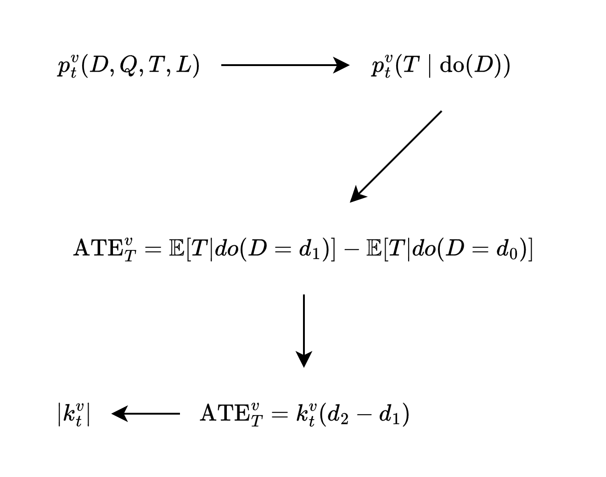
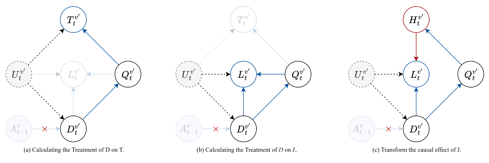

##### 节点状态建模

- DAG 说明: 注意, 不考虑拥堵以外的内容

  $U$: 混杂因素, 主要量化来自不可知的干扰指标, 随机向量, 不可观测

  $T$: 节点 P2P 时延, 指一个包从一个节点发射到被当前节点发射的时间差
  
  $Q$: 队列长度, 指一个包进入队列时, 队列的长度
  
  $D$: 路由需求, 指一个包进入队列时, 量化当前发送给该节点的路由需求
  
  $L$: 丢包速率, 指一个包在当前节点丢失的事件发生速率
  
  $A$: 邻居路由动作, 指邻居的路由行为对于当前节点的影响, 可以从数据包解析
  
  

##### 节点效应建模

- 下列假设用于对模型的相关变量进行规范

  1. **公理 1** [独立性假设]: 主要针对路由需求 $D$ 进行规范

     任意时刻某节点的路由需求 $D_t^v$ 和历史需求 $D^v_{<t}$ 无关, 任意不重叠时间区间内的路由需求 $D^v_{t-I: t}$ 相互独立
     $$
     D_t^v \perp D^v_{\lt t} \mid \forall t
     $$
  
  2. **公理 2** [模型效应假设]: 主要对时延 $T$ , 丢包量 $L$ 进行规范
  
     任意时刻, 同一节点的 P2P 时延受队列的影响, 一部分是通过 D 的线性作用进行
     $$
     ATE_{D^v \rarr T^v} =  \mathbb{E}[T \mid do(D = d_2)] -  \mathbb{E}[T \mid do(D = d_1)] = k^v_t(d_2 - d_1)
     $$
  
     $$
     T_t^v = T^v_t(Q_t^v , U_t^v) + e^v = F^v_t(Q_t^v)+ \delta^\tau U_t^v +k^v_t D^v_t  + e^v \\
     $$
  
     任意时刻, 同一节点丢包速率, 正比于需求量
     $$
     L^v_t= L^v_t(D^v_t, Q^v_t, U^v_t)  + e^v = D^v_t \cdot [H^v_t(Q^v_t) +  \delta^\ell U_t^v] + e^v
     $$
     
  3. **公理 3** [零均值假设]: 主要对噪声 $e$ 进行规范
  
     任意时刻, 某节点的附加噪声分布未知, 但总是零均值的
     $$
     \mathbb{E}[e^v_t \mid D^v_t, Q^v_t, T^v_t, U^v_t, L^v_t] = 0
     $$
  

- 为引进因果推断框架, 需要附加因果推断的一些假设

  > **公理 1** [因果忠实性假设]
  >
  > 如果在给定变量集 V 的前提下, 变量 $X$ 和 $Y$ 互相独立或条件独立, 那么在由变量及其之间因果依赖关系组成的因果关系网络图 $G$ 中, $X$ 和 $Y$ 之间的所有路径被变量集 V 中合适的变量 d-分离
  > $$
  > X \perp Y \mid Z \Lrarr X \perp_{G} Y \mid Z
  > $$
  > **公理 2** [因果马尔科夫性假设/操纵定理]
  >
  > 对于具有因果充分性的变量集而言, 如果父节点已知, 则节点总独立于全图
  > $$
  > p_\tilde{G}(X_i|PA_i) = p_G(X_i|PA_i)
  > $$

- 使用 $\abs{k_t^v}$ 作为拥堵效应量化

  从因果图可以看出, 在节点 $v$ 内, 时延的效应是线性增加的, 这种线性关系意味着，每增加一个单位的路由需求，时延将增加 $\abs{k_t^v}$ 

  推导路线:

  

  

  

##### 节点内的干预分布推断

###### 推导路由需求对时延的干预效应

$$
p(T^v \mid \text{do}(D^v))
$$
具体推导过程见 [系统性学习](D:\MyMedia\@Caches\TyporaDocs\系统性学习\07 因果推断.md)
$$
\begin{aligned}
p(t \mid do(d)) &= \sum_{q} p(t \mid do(d), q)p(q \mid do(d)) &&(\text{全概率公式}) \\
&= \sum_{q} p(t \mid do(d), q)p(q \mid d) &&(\text{操纵定理}) \\
&= \sum_{q} p(t \mid do(d), do(q))p(q \mid d) &&(\text{干预转换}) \\
&= \sum_{q} p(t \mid do(q))p(q \mid d) &&(\text{干预删除}) \\
&= \sum_{q} p(q \mid d) \sum_{d'}p(t \mid q, d')p(d') &&(\text{后门调整展开}) \\
\end{aligned}
$$

- 上述公式, 可以训练两个模型 $p_{\theta_2}(t| q, d)$, $p_{\theta_1}(q \mid d)$, 进行干预分布的计算
  $$
  p(T \mid do(d)) = \sum_{q} p_{\theta_1}(q \mid d) \sum_{d'}p_{\theta_2}(T \mid q, d') \cdot p(d')
  $$

- 计算好干预分布后, 可以计算 ATE

$$
\begin{aligned}
&\begin{aligned}
\text{ITE}_{D^v \rarr T^v} = \mathbb{E}[T|do(D)] &= \sum_t t \cdot p(t\mid do(d)) \\
&= \sum_q p_{\theta_1}(q \mid d) \cdot \sum_{d'} p(d') \cdot \underbrace{\sum_t t \cdot p_{\theta_2}(t \mid q, d')}_{\mathbb{E}[T \mid Q = q, D = d']} \\

\end{aligned} \\

&\text{ATE}_{D^v \rarr T^v} = \text{ITE}_{D^v \rarr T^v} - \text{ITE}_{D^v \rarr T^v} = k^v_t(d_2 - d_1)
\end{aligned}
$$

- 从而得到拥堵效应 $|k^v_t|$, 每个节点维护自身当前的拥堵效应

###### 推导路由需求对丢包量的干预效应

推导需求对丢包率量的干预作用

- 存在多个效应影响丢包率, 但如图 (c) 将丢包率拆分为`丢包率函数`, 那么它只被混淆因素和队列 $Q^v_t$ 影响

$$
\begin{aligned}

ITE_{D^v \rarr H^v} &= \mathcal{H}(d) = \mathbb{E}[H|do(D=d)] \\
&= \sum_h h \cdot p(h\mid do(d)) \\
&= \sum_q p_{\theta_1}(q \mid d) \cdot \sum_{d'} p(d') \cdot \underbrace{\sum_h h \cdot p_{\theta_3}(h \mid q, d')}_{\mathbb{E}[H \mid Q = q, D = d']} \\
&= \sum_q p_{\theta_1}(q \mid d) \cdot \mathbb{E}_{D' \sim p^G}[\mathbb{E}[H \mid Q = q, D']] \\
&= \sum_q p_{\theta_1}(q \mid d) \cdot H_q \\

\end{aligned}
$$

​	其中, $ H_q = \mathbb{E}_{D' \sim p^G}[\mathbb{E}[H \mid Q = q, D']] $ 和变量 $d$ 无关

- 根据模型效应假设, 得到丢包量的表达
  $$
  \begin{aligned}
  
  ITE_{D^v \rarr L^v} &= \mathbb{E}[L|do(D=d)]   \\
  &= d \cdot \mathbb{E}[H|do(D=d)] 
  
  \end{aligned}
  $$

- 推导丢包量的平均干预效应
  $$
  \begin{aligned}
  
  ATE_{D^v \rarr L^v} &= \mathbb{E}[L|do(D=d_2)] - \mathbb{E}[L|do(D=d_1)] \\
  &=  d_2 \cdot \mathbb{E}[H|do(D=d_2)] -   d_1 \cdot \mathbb{E}[H|do(D=d_1)]  \\
  &= d_2 \cdot \mathcal{H}^v_t(d_2) - d_1 \cdot \mathcal{H}^v_t(d_1)  
  \end{aligned}
  $$
  其中, $\mathcal{H}^v_t(d) = \mathbb{E}[H^v_t|do(D^v_t=d^v_t)]  $

##### 动作的反事实推断

此目的为在基于已有轨迹情况下, 考虑 **目标节点 $v$ 对邻居节点 $v'$ 作用**, 推断 **邻居节点** 的反事实分布

解释: 

- $A^v$: 邻居收到数据包后, 从数据包中解析得到的动作
- $D^{v'}$: 当前时刻的路由需求, 本质而言, 无论选择哪个动作, 都是通过影响路由需求间接影响其他结果

###### 动作干预对于 $D$ 的干预分布和反事实推断

一般来说, 我们认为动作的干预是一种分布替换(**软干预**)
$$
do(A) := \pi \rarr \omega
$$
考虑节点 $v$ 对邻居节点的影响, 根据是否向某一个邻居 $v'$ 作用, 作二元处理 $A^{v}=\{0,1\}$

对于策略 $\pi^{v}$, 有如下规则

- 节点向邻居作用: $p(A^v=1) = \pi^v(A^v=a_{v'}) = \pi$
- 节点不向邻居作用: $p(A^v=0) = 1- \pi$

> **定理** [ATE 的观测-反事实分解定理]
>
> 动作分布对于邻居需求的因果效应
> $$
> ATE_{A^{v} \rarr D^{v'}} = \pi \cdot \mathbb{E}[D^{v'} | A = 1]  + (1-\pi) \cdot \mathbb{E}[D^{v'}(1) | A = 0] - \pi \cdot \mathbb{E}[D^{v'}(0) | A = 1] - (1-\pi) \cdot \mathbb{E}[D^{v'} | A = 0]
> $$

关键在于其中两个反事实计算

- 没有向邻居作用情况下, 假如作用了的邻居需求分布: $\mathbb{E}[D(1) | A = 0]$
- 向邻居作用的情况下, 假如没有作用的邻居需求分布: $\mathbb{E}[D(0) | A = 1]$

由于节点作用迅速, 我们认为, 作用与否直接影响的是均值

> **公理** [ATE 均值干预作用假设]
>
> 当前节点对邻居作用效应等同于均值偏移
> $$
> \begin{aligned}
> \mathbb{E}[D^{v'}(1) | A^{v} = 0] = \mathbb{E}[D^{v'} | A^{v} = 0] + \omega \mathbb{E}[D^{v}|A^{v}= 0] \\
> \mathbb{E}[D^{v'}(0) | A^{v} = 1] = \mathbb{E}[D^{v'} | A^{v} = 1] - \omega \mathbb{E}[D^{v}|A^{v}= 1] \\
> \end{aligned}
> $$

将其带入到原式:
$$
\begin{aligned}
ATE_{A^{v} \rarr D^{v'}} &=  (1-\pi) \omega \cdot \mathbb{E}[D^{v} | A^v = 0] + \pi \omega \cdot \mathbb{E}[D^{v} | A^v = 1] \\
&= \omega \cdot \mathbb{E}_{A \sim \pi, D \sim p^G}[ D^{v}] \\
&\approx \omega \cdot \frac{1}{n}\sum_{i = 1}^n d^{v}_i
\end{aligned}
$$

- 上述公式的重大意义在于, **无所谓数据集采样的策略分布 $\pi$, 只需要对其进行统计即可**

  - 将轨迹评估任务 $G^{\omega(a|s)}(\tau_i)$ 视作一种干预作用下的均值估计

- 其中, $\omega(A|S)$ 表示干预后动作分布, 然而, 其中 $\omega = \omega(A^v=a_{v'} \mid S)$ 表示当前节点对邻居作用的概率 

- 这和节点作用转移的直觉相同: 即, 节点按照新的概率转移了部分需求

  记作:
  $$
  \Delta^v_t = d^{v'}_{t} - d^{v'}_{t-1} = \omega \cdot \mathbb{E}_{A \sim \omega, D \sim p^G}[ D^{v}_t]
  $$
  

###### 动作干预对于 $T$ 的作用

$$
ATE_{A^v \rarr T^{v'}} = k^{v'}(d^{v'}_{t} - d^{v'}_{t-1}) = k^{v'} \cdot \Delta^v_t
$$
- 直觉上, 因为动作干预被转移的这部分流量产生了新的时延

###### 动作干预对于 $L$ 的作用

$$
\begin{aligned}

ATE_{A^v \rarr L^v} &=d^{v'}_{t} \cdot \mathcal{H}^{v'}_t(d^{v'}_t) -  d^{v'}_{t-1} \cdot \mathcal{H}^{v'}_t( d^{v'}_{t-1}) \\
&=( d^{v'}_{t-1} +\Delta^v_t)  \mathcal{H}^{v'}_t(d^{v'}_{t-1} +\Delta^v_t) - d^{v'}_{t-1} \cdot \mathcal{H}^{v'}_t( d^{v'}_{t-1}) \\
&\approx \Delta^v_t \cdot \left[ \mathcal{H}^{v'}_t( d^{v'}_{t-1})  +  d^{v'}_{t-1} \nabla_d \mathcal{H}^{v'}_t( d^{v'}_{t-1})  \right] 

\end{aligned}
$$

- 直觉上, 因为动作干预被转移的部分流量通过丢包率函数产生新丢包, 并附加因为流量变化导致的其他丢包

- 上式中只含有干预增量 $\Delta^v_t$, 以及干预前的观测值 $ d^{v'}_{t-1}$
  
  我们不希望计算干预后的 $\mathcal{H}^{v'}_t(d^{v'}_{t-1} +\Delta^v_t)$
  
- 其中, $\nabla_d \mathcal{H}^{v'}_t( d^{v'}_{t-1}) $ 表示节点 $v'$ 当前需求下的丢包敏感度, 同 $k^v_t$ 可以由节点维护

  由于 $\nabla p = p \nabla \ln p$, 即`REINFORCE技巧`, 有:
  $$
  \begin{aligned}
  \nabla_d \mathcal{H}(d) &=  \nabla_d  \mathbb{E}[H|do(D=d)] \\
  &=  \sum_q \nabla_d~ p(q \mid d) \cdot H_q \\
  &=  \sum_q p(q \mid d) \cdot \nabla_d \ln p(q \mid d) \cdot H_q \\
  &= \mathbb{E}_{q \sim p(q | d)}[\nabla_d \ln p(q \mid d) \cdot H_q] \\
  &= \mathbb{E}_{q \sim p_{\theta}(q | d)}[\nabla_d \ln p_{\theta}(q \mid d) \cdot \mathbb{E}_{d' \sim p^G}[\mathbb{E}[H \mid Q=q, D=d']]] \\ 
  \end{aligned}
  $$

​	实际可从 $p_{\theta_2}(q | d)$ 采样以估计梯度, 利用自动微分搜集梯度样本

需要建模的部分
- $p_{\theta_1}(Q \mid D)$: 路由需求对队列转移分布
- $p_{\theta_2}(T \mid Q, D)$: 路由需求, 队列长度对时延转移分布
- $p_{\theta_3}(H \mid Q, D)$: 路由需求, 队列长度对丢包率函数转移分布

注意, 上述部分模型并不需要完全数据驱动, 可根据泊松过程等进行低参数建模

##### 离线策略反事实规划

可考的 AI 建模两例:

- [AI 强化学习建模-20250909-171117.pdf](..\..\..\AssemblyBoard\05 AI生成内容\AI强化学习建模-20250909-171117.pdf) 
- [AI 强化学习建模-20250909-165116.pdf](..\..\..\AssemblyBoard\05 AI生成内容\AI强化学习建模-20250909-165116.pdf) 

问题归化:

- 给定数据集 $\mathcal{D}$, 该数据集可根据需要的指标进行抽取, 假设其包含所有可观测的指标
  - 这是一个时序的数据集, 即可以根据时间步 $t$ 查阅整个节点网络的动作和状态
  - 一些不可观测的指标不存在于数据集 $\mathcal{D}$ 中
  - 可观测的因果变量一定存在于数据集中
- 数据集 $\mathcal{D}$ 的规划器不可知, 即, 不清楚产生数据集的策略分布 $\pi_\beta$
  - 数据集允许我们从状态变量计算奖励
  - 这意味着, 一些基于重要性采样的方法失效
  - 如何评估一条轨迹, 是一个重要的问题
- 需要利用数据集 $\mathcal{D}$ 进行反事实推断
  - 这意味着, 需要从已经发生过了的事情中计算反事实分布

> **定理** [观测-干预无偏性定理]
>
> 当因果关系是可识别的, 且能利用观测数据通过恢复或绕过混淆变量以识别干预时 , 利用观测数据 $\hat{X}$ 估计出因果变量 $X$ 的干预分布是无偏的
> $$
> p(x \mid do(x_t = t)) = \mathbb{E}_{\hat{x} \sim p^{G}(x)}[p(x \mid do(x_t = t), \hat{x}) ]
> $$

- 上述定理意义在于, 利用观测数据估计反事实因果量是无偏的
- 如果能将轨迹评估 $G(\tau_i)$ 表述为反事实查询, 则不需要重要性采样方法

**证明:**

从有效调整集或是截断因子分解定理出发都可以证明

- 根据截断因子分解定理和操纵定理, 非干预变量的分布在给定父节点的情况下不变
  $$
  p^G(x \mid do(x_t = t)) = p^{\tilde{G}: do(X_t)}(x \mid do(x_t = t)) = \prod_{i \neq t}p^G(x_i \mid PA_i)
  $$

- 上述不变分布在干预前的 SCM 中对应, 因此父节点可以由观测数据估计
  $$
  \begin{aligned}
  p(x \mid do(x_t = t)) &= \prod_{i \neq t} \left[ \sum_j p(x_i \mid PA_i, \hat{x}_j)p(\hat{x}_j) \right] \\
  &= \sum_j \left[   \prod_{i \neq t} p(x_i \mid PA_i, \hat{x}_j) \right]p(\hat{x}_j) \\
  &= \mathbb{E}_{\hat{x} \sim p^G} \left [   \prod_{i \neq t} p(x_i \mid PA_i, \hat{x}_j) \right] \\
  &= \mathbb{E}_{\hat{x} \sim p^G} \left [   \prod_{i \neq t} p(x_i \mid \hat{PA}_i, \hat{x}_j) \right] \\
  &= \mathbb{E}_{\hat{x} \sim p^G} \left [  p(x \mid do(x_t = t), \hat{x}) \right] \\
  \end{aligned}
  $$

- 实际上, 如果因果查询 $do(T=t)$ 具有有效调整集, 或是其子集都可以通过有效调整集计算, 记为 $U$

  根据后门调整定理
  $$
  p(x \mid do(t)) = \sum_u p(x \mid t, u)p(u)
  $$

- 上述右侧分布都是干预前的分布, 即原始 SCM, 因此引入观测以估计有效调整集
  $$
  \begin{aligned}
  p(x \mid do(t)) &= \sum_u p(x \mid t, u) \sum_i p(u \mid \hat{x}_i)p(\hat{x}_i) \\
  &= \sum_i p(\hat{x}_i) \cdot [\sum_u p(x \mid t, u) \cdot p(u \mid \hat{x}_i)] 
  \end{aligned}
  $$

- 仍然可以导出相同结论
  $$
  \begin{aligned}
  p(x \mid do(t)) &= \sum_i p(\hat{x}_i) \cdot [\sum_u p(x \mid t, u) \cdot p(u \mid \hat{x}_i)]  \\
  &= \mathbb{E}_{\hat{x} \sim p^G}[\sum_u p(x \mid t, u) \cdot p(u \mid \hat{x}_i)] \\
  &= \mathbb{E}_{\hat{x} \sim p^G}[p(x \mid do(t), \hat{x})] \\
  \end{aligned}
  $$

- 上述论证的关键在于 $p(u \mid \hat{x}_i)$, 即我们能否通过观测数据恢复或者绕过混淆变量

- 在先前的论述中, 我们可以通过观测来绕过混淆变量以估算干预分布

