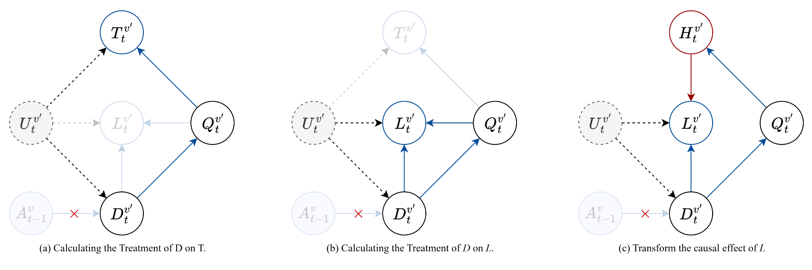
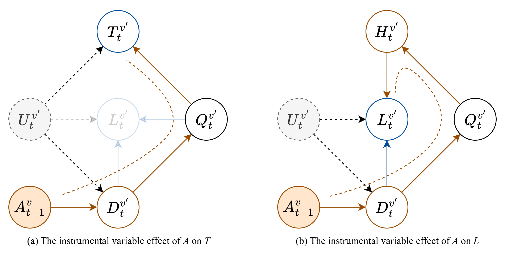
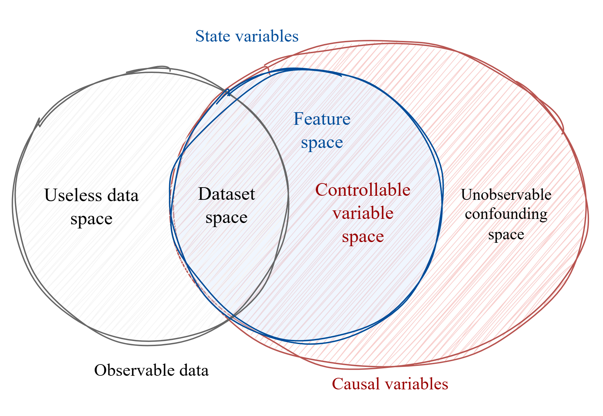

# 线性效应假设下的建模

##### 节点状态建模

- DAG 说明: 注意, 不考虑拥堵以外的内容

  $U$: 混杂因素, 主要量化来自不可知的干扰指标, 随机向量, 不可观测

  $T$: 节点 P2P 时延, 指一个包从一个节点发射到被当前节点发射的时间差
  
  $Q$: 队列长度, 指一个包进入队列时, 队列的长度
  
  $D$: 路由需求, 指一个包进入队列时, 量化当前发送给该节点的路由需求
  
  $L$: 丢包速率, 指一个包在当前节点丢失的事件发生速率
  
  $A$: 路由动作, 指邻居的路由行为对于当前节点的影响, 可以从数据包解析
  

> **公理** [因果基本假设 - 因果机制不变性假设]
>
> 因果推断框架的本质在于`反事实推断`, 而反事实推断的本质则是`想象`
>
> 所谓想象, 即为通过已经发生过的数据, 根据给定的因果图估计因果机制, 而后通过改变参数, 用估计的方法得到改变后的值
>
> 这要求了, **因果机制是不变的** , 即, 允许我们通过变化的数据得到不变的机制, 再从不变的机制预测变化的数据

##### 节点效应建模

- 下列假设用于对模型的相关变量进行规范

  1. **公理 1** [独立性假设]: 主要针对路由需求 $D$ 进行规范

     任意时刻某节点的路由需求 $D_t^v$ 和历史需求 $D^v_{<t}$ 无关, 任意不重叠时间区间内的路由需求 $D^v_{t-I: t}$ 相互独立
     $$
     D_t^v \perp D^v_{\lt t} \mid \forall t
     $$
  
  2. **公理 2** [模型效应假设]: 主要对时延 $T$ , 丢包量 $L$ 进行规范, 其中, 混淆子 $U$ 符合加性假设
  
     任意时刻, 同一节点的 P2P 时延满足线性作用
     $$
     ATE_{D^v \rarr T^v} =  \mathbb{E}[T \mid do(D = d_2)] -  \mathbb{E}[T \mid do(D = d_1)] = k^v_t(d_2 - d_1)
     $$
  
     $$
     T_t^v = T^v_t(Q_t^v , U_t^v) + e^v = f^v_t(Q^v_t, U^v_t) +  k^v_t D^v_t  + e^v \\
     $$
  
     任意时刻, 同一节点丢包量, 正比于需求量, $H$ 称`丢包率函数`, 描述需求-丢包量的转移
     $$
     L^v_t= L^v_t(D^v_t, Q^v_t, U^v_t)  + e^v = D^v_t \cdot H^v_t(Q^v_t) + \delta^\ell U_t^v  + e^v
     $$
     
  3. **公理 3** [零均值假设]: 主要对噪声 $e$ 进行规范
  
     任意时刻, 某节点的附加噪声分布未知, 但总是零均值的
     $$
     \mathbb{E}[e^v_t \mid D^v_t, Q^v_t, T^v_t, U^v_t, L^v_t] = 0
     $$
  

- 为引进因果推断框架, 需要附加因果推断的一些假设

  > **公理 1** [因果忠实性假设]
  >
  > 如果在给定变量集 V 的前提下, 变量 $X$ 和 $Y$ 互相独立或条件独立, 那么在由变量及其之间因果依赖关系组成的因果关系网络图 $G$ 中, $X$ 和 $Y$ 之间的所有路径被变量集 V 中合适的变量 d-分离
  > $$
  > X \perp Y \mid Z \Lrarr X \perp_{G} Y \mid Z
  > $$
  > **公理 2** [因果马尔科夫性假设/操纵定理]
  >
  > 对于具有因果充分性的变量集而言, 如果父节点已知, 则节点总独立于全图
  > $$
  > p_\tilde{G}(X_i|PA_i) = p_G(X_i|PA_i)
  > $$

- 使用 $\abs{k_t^v}$ 作为拥堵效应量化

  从因果图可以看出, 在节点 $v$ 内, 时延的效应是线性增加的, 这种线性关系意味着，每增加一个单位的路由需求，时延将增加 $\abs{k_t^v}$ 

  推导路线:

  

  

##### 节点内的干预分布推断

###### 推导路由需求对时延的干预效应

$$
p(T^v \mid \text{do}(D^v))
$$
具体推导过程见 [系统性学习](D:\MyMedia\@Caches\TyporaDocs\系统性学习\07 因果推断.md)
$$
\begin{aligned}
p(t \mid do(d)) &= \sum_{q} p(t \mid do(d), q)p(q \mid do(d)) &&(\text{全概率公式}) \\
&= \sum_{q} p(t \mid do(d), q)p(q \mid d) &&(\text{操纵定理}) \\
&= \sum_{q} p(t \mid do(d), do(q))p(q \mid d) &&(\text{干预转换}) \\
&= \sum_{q} p(t \mid do(q))p(q \mid d) &&(\text{干预删除}) \\
&= \sum_{q} p(q \mid d) \sum_{d'}p(t \mid q, d')p(d') &&(\text{后门调整展开}) \\
\end{aligned}
$$

- 上述公式, 可以训练两个模型 $p_{\theta_2}(t| q, d)$, $p_{\theta_1}(q \mid d)$, 进行干预作用量的计算
  

$$
\begin{aligned}
\text{ITE}_{D^v \rarr T^v} = \mathbb{E}[T|do(D)] &= \sum_t t \cdot p(t\mid do(d)) \\
&= \sum_q p_{\theta_1}(q \mid d) \cdot \sum_{d'} p(d') \cdot \underbrace{\sum_t t \cdot p_{\theta_2}(t \mid q, d')}_{\mathbb{E}[T \mid Q = q, D = d']} \\

\end{aligned}
$$

- 由于需求 $D$ 对于研究时隙内设为恒定, 即对于某节点 $D$ 在固定的一个时隙内, 应当是恒定的

  这要求: 
  $$
  \begin{aligned}
  ITE_{D^v \rarr T^v} &= \sum_q p_{\theta_1}(q \mid d) \cdot \sum_t t \cdot p_{\theta_2}(t \mid q, d_t) \\
   &= \sum_q p_{\theta_1}(q \mid d) \cdot \mathbb{E}[T \mid Q = q, D = d_t]
   
  \end{aligned}
  $$

  - 其中, $d_t$ 为当前时隙内回归到的需求量, 而 $d$ 为干预后的假设需求

  - 通过观测数据学习队列模型 $p_{\theta_1}(q \mid d)$, **并遍历可能出现的 $q$** (此时, 已经通过观测控制 $d_t$, 遍历 $Q$ 是一种后门调整的操作)
    $$
    \begin{aligned}
    ATE_{D^v \rarr T^v} &= \sum_q [p_{\theta_1}(q \mid d_2) - p_{\theta_1}(q \mid d_1)] \cdot  \mathbb{E}[T \mid Q = q, D = d_t^v] \\
    &= k_t^v(d_2 - d_1) \\
    \end{aligned}
    $$
    

- 从而得到拥堵效应 $|k^v_t|$, 每个节点维护自身当前的拥堵效应
  $$
  k_t^v = \frac{\sum_q [p_{\theta_1}(q \mid d_2) - p_{\theta_1}(q \mid d_1)] \cdot  \mathbb{E}[T \mid Q = q, D = d_t^v] }{d_2 - d_1}
  $$
  
  - 其中, $ \mathbb{E}[T \mid Q = q, D = d_t]$ 在 M/M/1 排队分析中**具有闭式解**

###### 推导路由需求对丢包量的干预效应

推导需求对丢包率量的干预作用

- 存在多个效应影响丢包量, 但如图 (c) 将丢包量拆分为`丢包率函数`, 那么它只被混淆因素和队列 $Q^v_t$ 影响
  $$
  p(h \mid do(d)) = \sum_q p(h \mid q) p(q \mid d)
  $$
  推导作用量, 需求效应通过 $Q$ 传导
  $$
  \begin{aligned}
  
  ITE_{D^v \rarr H^v} &= \mathbb{E}[H|do(D=d)] \\
  &= \sum_h \sum_q p(h \mid q) p(q \mid d) \\
  &= \sum_q  p(q \mid d) \sum_h h \cdot  p(h \mid q) \\
  &= \sum_q  p(q \mid d) \cdot \mathbb{E}[H \mid Q=q] \\
  
  \end{aligned}
  $$
  当给定 $Q=q$ 时, 丢包率函数实际上是固定的
  $$
  \mathbb{E}[H \mid Q=q] =
  \left \{
  \begin{aligned}
  1, \quad q \gt q_\max \\
  0, \quad q \le q_\max \\
  \end{aligned}
  \right.
  $$
  即规定了, 队列对于丢包的影响仅仅是溢出效应

- 根据模型效应假设, 得到丢包量的表达
  $$
  \begin{aligned}
  
  ITE_{D^v \rarr L^v} &= \mathbb{E}[L|do(D=d)]   \\
  &= \mathbb{E}[ D \cdot H(Q) +  \delta^\ell U \mid do(D=d)]  \\
  &= d \cdot  P(q \gt q_\max \mid d) +  \delta^\ell \mathbb{E}[U \mid d]
  
  \end{aligned}
  $$
  其中 $P(q \gt q_\max \mid d)$ 为机理 $p_{\theta_1}(q \mid d)$ 下的队列溢出稳态分布, $d$ 为干预假设值
  
  由于混淆作用 $ \mathbb{E}[U \mid d]$, 不能草率假设需求 $D$ 的干预和噪声 $U$ 独立, 因此在没有更多条件情况下, 该推导为最终形式
  $$
  \begin{aligned}
  
  ATE_{D^v \rarr L^v} &= \mathbb{E}[L|do(D=d_2)] -  \mathbb{E}[L|do(D=d_1)]   \\
  &= d_2\cdot  P(q \gt q_\max \mid d_2) - d_1\cdot  P(q \gt q_\max \mid d_1)  +  \delta^\ell [\mathbb{E}[U \mid d_2] - \mathbb{E}[U \mid d_1] ]
  
  \end{aligned}
  $$
  

##### 动作的反事实推断

此目的为在基于已有轨迹情况下, 考虑 **目标节点 $v$ 对邻居节点 $v'$ 作用**, 推断 **邻居节点** 的反事实分布

解释: 

- $A^v$: 邻居收到数据包后, 从数据包中解析得到的动作
- $D^{v'}$: 当前时刻的路由需求, 本质而言, 无论选择哪个动作, 都是通过影响路由需求间接影响其他结果
- $H^{v'}$: 当前节点的丢包率函数, 描述需求量到丢包量的传递作用

###### 基于工具变量的核心范式

本质而言, 动作 $A^v$ 对于 $v'$ 的因果关系而言是一种`工具变量`

因此, 动作干预的本身通过 $D$ 作用于其它变量, 本身也是一种工具作用的体现

> **假设 1** [工具变量相关性假设]
>
> 工具变量 Z 应当对 T 有一个因果效应
>
> **假设 2** [工具变量排他性假设]
>
> 工具变量 Z 对 Y 的影响应当完全经过 T
>
> **假设 3** [工具变量无混淆假设]
>
> 工具变量 Z 对 Y 的所有后门路径都应当可以被阻断

- 在工具变量作用下, 混淆不会受工具变量干预影响
- 建立工具变量干预和处理变量干预的关系以识别参数

###### 动作 $A^v$ 干预对于 $D^{v'}$ 的干预分布和作用量

一般来说, 我们认为动作的干预是一种分布替换, 即`软干预`
$$
do(A) := \pi \rarr \omega
$$
考虑节点 $v$ 对邻居节点的影响, 根据是否向某一个邻居 $v'$ 作用, 作二元处理 $A^{v}=\{0,1\}$

**定义:** [动作干预效应]  动作的干预效应指的是在新的策略下, **做出动作**和**未做出动作**的处理结果**差量**

对于策略 $\pi^{v}$, 有如下规则

- 节点向邻居作用: $p(A^v=1) = \pi^v(A^v=a_{v'}) = \pi$
- 节点不向邻居作用: $p(A^v=0) = 1- \pi$

> **定理** [ATE 的观测-反事实分解定理]
>
> 动作分布对于邻居需求的因果效应
> $$
> ATE_{A^{v} \rarr D^{v'}} = \pi \cdot \mathbb{E}[D^{v'} | A = 1]  + (1-\pi) \cdot \mathbb{E}[D^{v'}(1) | A = 0] - \pi \cdot \mathbb{E}[D^{v'}(0) | A = 1] - (1-\pi) \cdot \mathbb{E}[D^{v'} | A = 0]
> $$

关键在于其中两个反事实计算

- 没有向邻居作用情况下, 假如作用了的邻居需求分布: $\mathbb{E}[D(1) | A = 0]$
- 向邻居作用的情况下, 假如没有作用的邻居需求分布: $\mathbb{E}[D(0) | A = 1]$

由于节点作用迅速, 我们认为, 作用与否直接影响的是均值

> **公理** [ATE 均值干预作用假设]
>
> 当前节点对邻居作用效应等同于均值偏移
> $$
> \begin{aligned}
> \mathbb{E}[D^{v'}(1) | A^{v} = 0] = \mathbb{E}[D^{v'} | A^{v} = 0] + \omega \mathbb{E}[D^{v}|A^{v}= 0] \\
> \mathbb{E}[D^{v'}(0) | A^{v} = 1] = \mathbb{E}[D^{v'} | A^{v} = 1] - \omega \mathbb{E}[D^{v}|A^{v}= 1] \\
> \end{aligned}
> $$

将其带入到原式:
$$
\begin{aligned}
ATE_{A^{v} \rarr D^{v'}} &=  (1-\pi) \omega \cdot \mathbb{E}[D^{v} | A^v = 0] + \pi \omega \cdot \mathbb{E}[D^{v} | A^v = 1] \\
&= \omega \cdot \mathbb{E}_{A \sim \pi, D \sim p^G}[ D^{v}] \\
&\approx \omega \cdot \frac{1}{n}\sum_{i = 1}^n d^{v}_i
\end{aligned}
$$

- 上述公式的重大意义在于, **无所谓数据集采样的策略分布 $\pi$, 只需要对其进行统计即可**

  - 将轨迹评估任务 $G^{\omega(a|s)}(\tau_i)$ 视作一种干预作用下的均值估计

- 其中, $\omega(A|S)$ 表示干预后动作分布, 然而, 其中 $\omega = \omega(A^v=a_{v'} \mid S)$ 表示当前节点对邻居作用的概率 

- 这和节点作用转移的直觉相同: 即, 节点按照新的概率转移了部分需求

  记作:

  
  $$
  \Delta^v_t = d^{v'}_{t} - d^{v'}_{t-1} = \omega \cdot \mathbb{E}_{A \sim \pi, D \sim p^G}[ D^{v}_t]
  $$

  ----

###### 动作 $A^v$ 干预对于 $T^{v'}$ 的干预分布和作用量

$$
ATE_{A^v \rarr T^{v'}} = k^{v'}(d^{v'}_{t} - d^{v'}_{t-1}) = k^{v'} \cdot  \omega \cdot \mathbb{E}_{A \sim \pi, D \sim p^G}[ D^{v}_t]
$$
---

- 直觉上, 因为动作干预被转移的这部分流量产生了新的时延
- 此处使用了`模型效应假设`, 以及`ATE均值干预作用假设`

###### 动作 $A^v$ 干预对于 $L^{v'}$ 的干预分布和作用量

丢包量是较为复杂作用的综合结果, 且存在 $U^{v'}$ 作用于 $D^{v'} \rarr L^{v'}$ 的后门路径无法阻断

借助 $A^{v}$ 工具变量效应, 可消除混淆
$$
\begin{aligned}
\mathbb{E}[L^{v'} \mid do(A^v)] &=\mathbb{E}[D^{v'} \cdot H^{v'}(Q^{v'})  \mid A^{v}]  + \delta^\ell \mathbb{E}[U^{v'}]\\
 &=\mathbb{E}[D^{v'} \cdot  P(q \gt q_\max \mid D^{v'}) \mid A^{v}]  + \delta^\ell \mathbb{E}[U^{v'}]\\
\end{aligned}
$$
- 上式根据工具变量无混淆性假设, 消除 $A$ 对噪声 $U$ 的影响

  

> **公理** [丢包率函数平稳分布假设]
>
> 设需求干预作用量 $\Delta^v_t = d^{v'}_{t} - d^{v'}_{t-1} = \omega \cdot \mathbb{E}_{A \sim \pi, D \sim p^G}[ D^{v}_t]$, 丢包率函数 $H^{v'}_t = p(q \gt q_\max \mid d^{v'}_t)$
>
> 则在干预邻域内 $d^* \in \left( d^{v'}_t - \Delta^{v}_t, d^{v'}_t + \Delta^{v}_t \right)$, 丢包率函数保持不变
> $$
> p(q \gt q_\max \mid d^{v'}_t) =p(q \gt q_\max \mid d^*) , \quad d^* \in \left( d^{v'}_t - \Delta^{v}_t, d^{v'}_t + \Delta^{v}_t \right)
> $$

- 这是一种不太严谨的假设, 考虑单节点队列的迟滞效应, 可以假设其连续

  

计算因果作用量, 设 $L^{v'}(a) =  \mathbb{E}[L^{v'} \mid do(A^v=a)]$ 为反事实推断
$$
\begin{aligned}
ATE_{A^v\rarr L^{v'}} &=  \pi \cdot \mathbb{E}[L^{v'} | A = 1]  + (1-\pi) \cdot \mathbb{E}[L^{v'}(1) | A = 0] - \pi \cdot \mathbb{E}[L^{v'}(0) | A = 1] - (1-\pi) \cdot \mathbb{E}[L^{v'} | A = 0] \\
&=  \pi \cdot \mathbb{E}[D^{v'}H  | A = 1]  + (1-\pi) \cdot \mathbb{E}[(D^{v'} + \Delta^v)H | A = 0] - \pi \cdot \mathbb{E}[(D^{v'} - \Delta^v)H | A = 1] - (1-\pi) \cdot \mathbb{E}[D^{v'}H | A = 0] \\
&= \pi \cdot \mathbb{E}[\Delta^v \cdot p(q \gt q_\max \mid D^{v'}) \mid A^v = 1] + (1-\pi) \cdot \mathbb{E}[\Delta^v \cdot p(q \gt q_\max \mid D^{v'}) \mid A^v = 0] \\

&=\omega \cdot \mathbb{E}_{A \sim \pi, D \sim p^G}[ D^{v}_t] \cdot
\mathbb{E}_{A \sim \pi, D^v \sim p^G}[p(q \gt q_\max \mid D^{v'})]

\end{aligned}
$$

- 在给定目标节点需求 $D^{v}$ 情况下, 邻居节点干预和目标节点丢包率函数独立
- 每个节点都需要维护自身丢包率函数 $H^{v'}_t = \mathbb{E}_{A \sim \pi, D^v \sim p^{G_t}}[p(q \gt q_\max \mid D^{v'})]$

##### 离线策略反事实规划

问题归化:

- 给定数据集 $\mathcal{D}$, 该数据集可根据需要的指标进行抽取, 假设其包含所有可观测的指标
  - 这是一个时序的数据集, 即可以根据时间步 $t$ 查阅整个节点网络的动作和状态
  - 一些不可观测的因果变量不存在于数据集 $\mathcal{D}$ 中, 称为`混淆集`
  - 可观测的因果变量一定存在于数据集中, 这些又称为`可控集`
- 数据集 $\mathcal{D}$ 的规划器不可知, 即, 不清楚产生数据集的策略分布 $\pi_\beta$
  - 数据集允许我们从状态变量计算奖励
  - 这意味着, 一些基于重要性采样的方法失效
  - 如何评估一条轨迹, 是一个重要的问题
- 需要利用数据集 $\mathcal{D}$ 进行反事实推断
  - 这意味着, 需要从已经发生过了的事情中计算反事实分布

> **定理** [观测 -干预无偏性定理]
>
> 利用观测数据 $\hat{X}$ 估计出因果变量 $X$ 的干预分布是无偏的, 当且仅当因果关系是可识别的,  即可控集能通过后门调整等方法绕过混淆集
> $$
> p(x \mid do(t)) = \mathbb{E}_{\hat{x} \sim p^{G}(x)}[p(x \mid do(t), \hat{x}) ]
> $$

- 上述定理意义在于, 利用观测数据估计反事实因果量是无偏的
- 如果能将轨迹评估 $G(\tau_i)$ 表述为反事实查询, 则不需要重要性采样方法

**证明:**

从有效调整集或是截断因子分解定理出发都可以证明

- 根据截断因子分解定理和操纵定理, 非干预变量的分布在给定父节点的情况下不变
  $$
  p^G(x \mid do(t)) = p^{\tilde{G}: do(t)}(x \mid do(t)) = \prod_{i \neq t}p^G(x_i \mid PA_i)
  $$

- 上述不变分布在干预前的 SCM 中对应, 因此父节点可以由观测数据估计
  $$
  \begin{aligned}
  p(x \mid do(t)) &= \prod_{i \neq t} \left[ \sum_j p(x_i \mid PA_i, \hat{x}_j)p(\hat{x}_j) \right] \\
  &= \sum_j \left[   \prod_{i \neq t} p(x_i \mid PA_i, \hat{x}_j) \right]p(\hat{x}_j) \\
  &= \mathbb{E}_{\hat{x} \sim p^G} \left [   \prod_{i \neq t} p(x_i \mid PA_i, \hat{x}_j) \right] \\
  &= \mathbb{E}_{\hat{x} \sim p^G} \left [   \prod_{i \neq t} p(x_i \mid \hat{PA}_i, \hat{x}_j) \right] \\
  &= \mathbb{E}_{\hat{x} \sim p^G} \left [  p(x \mid do(t), \hat{x}) \right] \\
  \end{aligned}
  $$

- 实际上, 如果因果查询 $do(t)$ 具有有效调整集, 或是其子集都可以通过有效调整集计算, 记为 $U$

  根据后门调整定理
  $$
  p(x \mid do(t)) = \sum_u p(x \mid t, u)p(u)
  $$

- 上述右侧分布都是干预前的分布, 即原始 SCM, 因此引入观测以估计有效调整集
  $$
  \begin{aligned}
  p(x \mid do(t)) &= \sum_u p(x \mid t, u) \sum_i p(u \mid \hat{x}_i)p(\hat{x}_i) \\
  &= \sum_i p(\hat{x}_i) \cdot [\sum_u p(x \mid t, u) \cdot p(u \mid \hat{x}_i)] 
  \end{aligned}
  $$

- 仍然可以导出相同结论
  $$
  \begin{aligned}
  p(x \mid do(t)) &= \sum_i p(\hat{x}_i) \cdot [\sum_u p(x \mid t, u) \cdot p(u \mid \hat{x}_i)]  \\
  &= \mathbb{E}_{\hat{x} \sim p^G}[\sum_u p(x \mid t, u) \cdot p(u \mid \hat{x}_i)] \\
  &= \mathbb{E}_{\hat{x} \sim p^G}[p(x \mid do(t), \hat{x})] \\
  \end{aligned}
  $$

- 上述论证的关键在于 $p(u \mid \hat{x}_i)$, 即我们能否通过观测数据恢复或者绕过混淆变量

- 在先前的论述中, 我们可以通过观测来绕过混淆变量以估算干预分布

> **定理** [掺杂定理]
>
> 用观测数据和反事实推断生成的数据合成的新数据去计算干预结果, 如果因果建模对于是忠实于观测数据的, 则总体估计结果仍然是无偏的, 但会随着掺杂的比例增大方差, 随掺杂比例平方增加
> $$
> p(x \mid do( t)) = \mathbb{E}_{\hat{x} \in D^\text{obs} \cup D^\text{cf}}[p(x \mid do( t), \hat{x}) ]
> $$

**证明:**

- 考虑数据集分布展开, 其中 $\hat{x}_2$ 的抽样分布由 $\hat{x}_1$ 估计而来
  $$
  \begin{aligned}
  \mathbb{E}_{\hat{x} \in D^\text{obs} \cup D^\text{cf}}[p(x \mid do( t), \hat{x}) ]
  
  &= p(\hat{x}_1)\mathbb{E}_{\hat{x}_1 }[p(x \mid do( t), \hat{x}_1) ] 
  +  p(\hat{x}_2)\mathbb{E}_{\hat{x}_2 }[p(x \mid do( t), \hat{x}_2) ] \\
   
  &= p(\hat{x}_1)\mathbb{E}_{\hat{x}_1 }[p(x \mid do( t), \hat{x}_1) ] 
  +  p(\hat{x}_2)\mathbb{E}_{\hat{x}_1 }[\mathbb{E}_{\hat{x}_2}[p(x \mid do( t), \hat{x}_1, \hat{x}_2) ] ] \\
  
  &= \mathbb{E}_{\hat{x}_1 } \left[
  	p(\hat{x}_1)p(x \mid do( t), \hat{x}_1) 
  	+ p(\hat{x}_2)\mathbb{E}_{\hat{x}_2}[p(x \mid do( t), \hat{x}_1, \hat{x}_2) ]
  	
  \right] \\
  \end{aligned}
  $$

-  由于 $\hat{x}_2 \in D^\text{cf}$ 的数据本身就是在对 $\hat{x}_1$ 进行无偏估计, 因此
  $$
  \mathbb{E}_{\hat{x}_2}[p(x \mid do( t), \hat{x}_1, \hat{x}_2) ] = p(x \mid do( t), \hat{x}_1)
  $$
  因此, 
  $$
  \begin{aligned}
  \mathbb{E}_{\hat{x} \in D^\text{obs} \cup D^\text{cf}}[p(x \mid do( t), \hat{x}) ]
  
  &= \mathbb{E}_{\hat{x}_1 } [
  	p(\hat{x}_1)p(x \mid do( t), \hat{x}_1) 
  	+ p(\hat{x}_2)p(x \mid do( t), \hat{x}_1)  ]\\
  	
  &= \mathbb{E}_{\hat{x}_1 } [ p(x \mid do( t), \hat{x}_1) ] \\
  &= p(x \mid do( t))
  
  
  \end{aligned}
  $$
  
- 分析方差, 设 $\alpha = p(\hat{x}_2)$ 为生成数据的比例
  $$
  \begin{aligned}
  
  \hat{p}(x \mid do( t)) &= \mathbb{E}_{\hat{x} \in D^\text{obs} \cup D^\text{cf}}[p(x \mid do( t), \hat{x}) ] \\
  
  &=  p(\hat{x}_1)\mathbb{E}_{\hat{x}_1 }[p(x \mid do( t), \hat{x}_1) ] 
  +  p(\hat{x}_2)\mathbb{E}_{\hat{x}_2 }[p(x \mid do( t), \hat{x}_2) ] \\
  
  &= (1- \alpha) \cdot \hat{p_\text{obs}} + \alpha \cdot \hat{p}_\text{cf}
  
  \end{aligned}
  $$
  根据方差加权和公式
  $$
  \begin{aligned}
  Var(\hat{p}(x \mid do( t)) ) &= (1- \alpha)^2 \cdot Var(\hat{p_\text{obs}}) +\alpha^2 \cdot Var(\hat{p}_\text{cf}) + 2\alpha(1-\alpha) \cdot Cov(\hat{p_\text{obs}}, \hat{p}_\text{cf})
  \end{aligned}
  $$
  展开协方差余项
  $$
  \begin{aligned}
   Cov(\hat{p_\text{obs}}, \hat{p}_\text{cf}) 
   
   &= \mathbb{E}[\hat{p}_\text{obs} \cdot \hat{p}_\text{cf}] - \mathbb{E}[\hat{p}_\text{obs} ]\mathbb{E}[ \hat{p}_\text{cf}] \\
   
   &= \mathbb{E}[\hat{p}_\text{obs} \cdot \mathbb{E}[ \hat{p}_\text{cf} \mid  \hat{p}_\text{obs}]] - \mathbb{E}[\hat{p}_\text{obs} ]\mathbb{E}[ \hat{p}_\text{cf}] \\
   
   &= \mathbb{E}[\hat{p}^2_\text{obs}] - \mathbb{E}[\hat{p_\text{obs}} ]\mathbb{E}[ \hat{p}_\text{cf}] \\
   
   &= \mathbb{E}[\hat{p}^2_\text{obs}] - \mathbb{E}^2[\hat{p_\text{obs}} ] \\
   
   &= Var(\hat{p_\text{obs}})
   
  \end{aligned}
  $$
  上式结果并不令人惊讶, 因为 $\hat{p}_\text{cf}$ 本身就是由观测数据生成对 $\hat{p}_\text{obs}$ 的无偏估计

  带入协方差余项
  $$
  \begin{aligned}
  Var(\hat{p}(x \mid do( t)) ) &= (1- \alpha)^2 \cdot Var(\hat{p}_\text{obs}) + \alpha^2 \cdot Var(\hat{p}_\text{cf}) + 2\alpha(1-\alpha) \cdot Var(\hat{p}_\text{obs})  \\
  
  &= Var(\hat{p}_\text{obs})  + \alpha^2 [Var(\hat{p}_\text{cf}) - Var(\hat{p}_\text{obs})]   \\
  &= \sigma^2_\text{obs} + \alpha^2 [\sigma^2_\text{cf} - \sigma^2_\text{obs}],  \quad \sigma^2_\text{cf} \ge \sigma^2_\text{obs}
  
  \end{aligned}
  $$
  

###### 反事实策略评估

上述推导大量的关于动作对其他变量的反事实作用量, 目的就是为了进行反事实策略评估

即: 在当前时刻, 若采用另一种动作, 则会发生什么

另外, 由于因果查询的无偏性, 我们可以在废除重要性采样的基础上应用离线强化学习, 因为一个重要前提是: 我们不清楚规划器的策略分布

##### REF

https://scholar.google.com/scholar?q=related:-lrcMgPiicQJ:scholar.google.com/&scioq=Low+Earth+orbit+satellite+switching+and+recovery+method+based+on+generic+congestion+control+algorithm&hl=zh-CN&as_sdt=0,5

