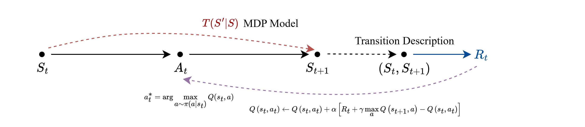
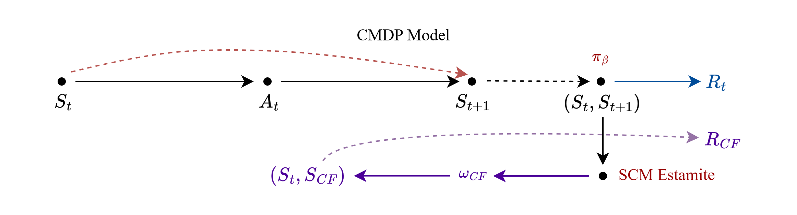

# 数据搜集结构

##### 前言

本篇定义对于数据的搜集, 以实现在搜集的数据集上进行离线强化学习训练

本质而言, 我们需要用数据来让智能体理解MDP的过程, 这含一个 $(S, A,R,S')$ 元组

- 具体而言, 奖励 $R$ 并非由动作或状态描述, 而是由 $(S, S')$ 这样的转移行为所描述
- 虽然由动作驱动转移, 但是奖励评估的是**在当前状态下做出决策后, 是否转移到更好的状态**, 因此, 奖励由`转移描述`生成

因此, MDP的最小单元由如下过程描述:

由于数据是离线搜集的, 我们并不知道先前的策略 $\pi$, 我们只有利用 $\pi$ 搜集的数据, 并且要估计当策略变为 $\omega$ 后, 能够得到多少奖励

- 上述, 通过未知的策略搜集的数据以估算**策略不变的因果参数**
- 这种因果参数可以支撑**假象策略改变后的奖励估算**, 称为反事实推断

##### 数据结构定义

    {
        "MicroTime Stamp":"float, ms",
        "Center Route":"str",
        
        "Origin Gate":"G0",
        "Target Gate":"G2",
        "Current Observation":{  //进入C队列时, 进行观测
            "C":{
                "D Estamited":"float", //定义: 泊松分布的到达率 \lambda
                "Q Current":"int",
                "H Estamited":"float",
    
            },
            "N":{...},
            "S":{...},
            "W":{...},
            "D":{...},
    
        },
        "Router Action":"N,S,W,D",
        "Transition Observation":{  //进入邻居队列时, 进行观测
            "C":{...},
            "N":{...},
            "S":{...},
            "W":{...},
            "D":{...},
        },
        "Transition Description":{
            "L":"bool",
            "T":"float",
            "TTL":"int",
            "Loop":"int",
            "Done":"bool",
    
        }
        
    },

注:

- 上述只是单次跳转时的数据
- 一个数据集中, 有多个单次跳转, 同一个包的编号相同
- 在转发前, 搜集一次, 并在转发后, 再搜集一次, 形成该数据并记录

###### 内部机理建模:2025-09-24, 一定要区分时隙 $\tau$, 以此作为状态转移的划分

D 由泊松分布建模, 考虑到泊松分布中, 相邻时间的间隔是独立且服从
$$
f(\Delta t) = \lambda e^{- \lambda \Delta t}
$$

- 数学期望为: $\mathbb{E}[\Delta T] = \frac{1}{\lambda}$, 方差 $Var[\Delta T] = \frac{1}{\lambda^2}$

- 极大似然估计:  **统计一个数据到达到下一个数据到达的间隔分布**
  $$
  \hat{\lambda} = \frac{1}{\bar{\Delta \hat{t}}}
  $$
  

非齐次特性: 由于卫星需求会变化, 以时间 t 作为划分, 在时隙 $\tau$ 内, 视作到达率不变, 不同时隙内, 到达率变化
$$
P(N(t_{i+1}) - N(t_i)=k) = \frac{(\lambda_i \tau)^k}{k!}e^{-\lambda \tau}
$$

- 到达率 $\lambda_t$ 将是一种`状态`

Q 由排队论 M/D/1 建模

- 在时隙 $t_i$ 到下一个时隙 $t_{i+1} = t_i + \tau$ 过程中,

  由于服务时间根据测定, 其为极小方差的分布, 因此近似固定服务时间 $\mathbb{E}[S] = t_s < \tau$

  节点可以处理的包数量 $N_s = \frac{\tau}{t_s} = \mu_t \tau$, 到达的包为 $N_a$ ,则到下一状态的转移方程为
  $$
  Q_{t+1}=
  \left \{
  \begin{aligned}
  &Q_t -N_s + N_a &, Q_t \ge N_s \\
  &N_a &,  Q_t \lt N_s\\
  \end{aligned}
  \right.
  $$

- 则在一个时隙内, 到达数据包的数量服从泊松分布, 注意, 不刻意声明时隙序号时, 用`t` 下标区分状态

  $$
  k_t(n) = P(N_a=n) = \frac{(\lambda_t \tau)^n}{n!}e^{-\lambda_t \tau}
  $$
  定义累加分布函数
  $$
  k_t^-(q) = P(N_a \le q) = \sum_{i=0}^q k_t(i)
  $$
  误差分布函数
  $$
  k_t^+(q) = P(N_a \gt q) = 1-\sum_{i=0}^q k_t(i) = 1- k_t^-(q)
  $$

  > **推论** [泊松截断期望]
  >
  > 泊松分布的阶段期望性质
  > $$
  > \begin{aligned}
  > E[X \mid X<x_0] &= \sum_{i=0}^{x_0} i \cdot \frac{\lambda^i}{i!}e^{-\lambda} \\
  > &= \lambda \sum_{i=1}^{x_0}  \frac{\lambda^{i-1}}{(i-1)!}e^{-\lambda} \\
  > &= \lambda \sum_{j=0}^{x_0-1} \frac{\lambda^i}{i!}e^{-\lambda} \\
  > &= \lambda P(X \lt x_0) = \lambda P(X \le x_0-1)
  > \end{aligned}
  > $$

- 得到马尔科夫转移矩阵, 这是一个无限矩阵
  $$
  P_t = [p_{ij}]_t = P(Q_{t+1} = j \mid Q_t = i) = 
  \left \{
  \begin{aligned}
  &k_t(j-i+N_s), && i  \ge N_s, j \ge i-N_s \\
  & k_t(j), && i \lt N_s \\
  &0, &&\text{other}
  \end{aligned}
  \right.
  $$
  
  ---
  
  

L 的**队列丢包**部分, 根据转移方程, 即下一部分

- 下一状态的队列满足
  $$
  Q_{t+1}=
  \left \{
  \begin{aligned}
  &Q_t -N_s + N_a &, Q_t \ge N_s \\
  &N_a &,  Q_t \lt N_s\\
  \end{aligned}
  \right.
  $$
  定义丢包量为
  $$
  L_t = Q_t - q_\max
  $$
  记一个**和当前时间有关的状态变量 $\Delta_q$**, 其中, $N_s = \mu_t \tau$
  $$
  \Delta_q = \left \{
  \begin{aligned}
  &q_\max - q + \mu_t \tau, & q \ge \mu_t \tau\\
  &q_\max, & q \lt \mu_t \tau\\
  \end{aligned}
  \right.
  $$
  
  则丢包概率为
  $$
  \begin{aligned}
  l_{t+1}=P(L \gt 0 \mid Q_t=q) &= \sum_{j=q_\max +1}^{\infty}P(Q_{t+1} = j \mid Q_t = q) \\
  &= 1- k_t^-(\Delta_q)
  \end{aligned}
  $$

- 丢包数量期望 

  $$
  \begin{aligned}
  \mathbb{E}[L_{t+1} \mid Q_t = q] &=  \sum_{j=q_\max +1}^{\infty}(j - q_\max)P(Q_{t+1} = j \mid Q_t = q) \\
  &= \sum_{k=\Delta_q + 1}^{\infty}(k - \Delta_q) \frac{(\lambda \tau)^k}{k!}e^{-\lambda \tau} \\
  &= \sum_{k=\Delta_q + 1}^{\infty}k \frac{(\lambda \tau)^k}{k!}e^{-\lambda \tau}  - \Delta_q \sum_{k=\Delta_q + 1}^{\infty} \frac{(\lambda \tau)^k}{k!}e^{-\lambda \tau}\\
  &= (\lambda_t \tau - \Delta_q)(1- k_t^-(\Delta_q)) + \lambda_t \tau k_t(\Delta_q)
  \end{aligned}
  $$
  
  ---
  
  

逗留时延 T 计算, 根据当前观测状态的转移分布进行

- 观测到 $Q_t = q, \lambda_t, \mu_t$, 推导数据包送到后, 平均逗留时间

  在这里应当引入一个约定, 即时隙长度 $\tau$ 应当能够覆盖一个数据包送达的时间 $\tau \ge \max\{t_a, t_s\}$, 因此, 到达后的延迟估计为
  $$
  T_{t+1} = Q_{t+1} \cdot \mathbb{E}[S] + \mathbb{E}[R_t]
  $$
  其中, $R_t$ 为数据包到达时, 服务中包的剩余服务时间, 其在到达观测时服从 $R_t \sim U(0, t_s)$ 的均匀分布

- 根据观测到的条件期望, 对时延期望进行展开
  $$
  \begin{aligned}
  \mathbb{E}[T_{t+1} \mid Q_t = q] &= \sum_{j=0}^{\infty}\mathbb{E}[T_{t+1} \mid Q_t = q, Q_{t+1}=j]P(Q_{t+1} = j \mid Q_t = q) \\
  &= \sum_{j=0}^{q_\max}\mathbb{E}[T_{t+1} \mid Q_t = q, Q_{t+1}=j]P(Q_{t+1} = j \mid Q_t = q) + \infty\\
  \end{aligned}
  $$
  由于超出 $q_\max$ 部分发生丢包, 不能计算时延, 因此先进行丢包分析

**仅以概率 $1- l_{t+1}$ 地接受如下结果**
$$
\begin{aligned}
\mathbb{E}[T_{t+1} \mid Q_t = q] &= \sum_{j=0}^{q_\max}\mathbb{E}[T_{t+1} \mid Q_t = q, Q_{t+1}=j]P(Q_{t+1} = j \mid Q_t = q) \\
&= \sum_{j=0}^{q_\max}t_s(j + \frac{1}{2})P(Q_{t+1} = j \mid Q_t = q) \\

\end{aligned}
$$

- 当 $q \lt N_s$ 时, 得到
  $$
  \mathbb{E}[T_{t+1} \mid Q_t = q] = t_s\lambda \tau k_t^-(q_\max -1)   +\frac{1}{2} t_s k_t^-(q_\max)
  $$

- 当 $q \ge N_s$ 时, $P(Q_{t+1} = j \mid Q_t = q) = k_t(j-q+N_s)$ 要求 $j \ge q - N_s$, 否则转移概率为0 (泊松过程计数是增量过程)

  通过变量替换, 记 $\Delta_q = q_\max - q + N_s$
  $$
  \mathbb{E}[T_{t+1} \mid Q_t = q] = t_s\lambda \tau k_t^-(\Delta_q -1)  + t_s(q - N_s + \frac{1}{2})k_t^-(\Delta_q)
  $$

- 当 $q \lt N_s$ 时, 记 $\Delta_q = q_\max$, 则 $q-N_s = q_\max - \Delta_q = 0$, 则可以统一期望公式
  $$
  \mathbb{E}[T_{t+1} \mid Q_t = q] = t_s\lambda \tau k_t^-(\Delta_q -1)  + t_s(q_\max - \Delta_q + \frac{1}{2})k_t^-(\Delta_q)
  $$

  ---

  

  

  

