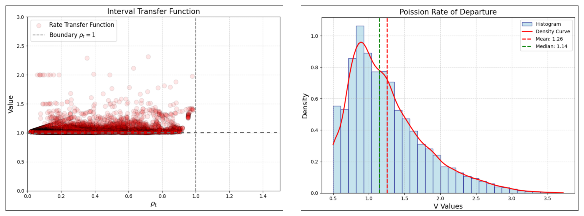
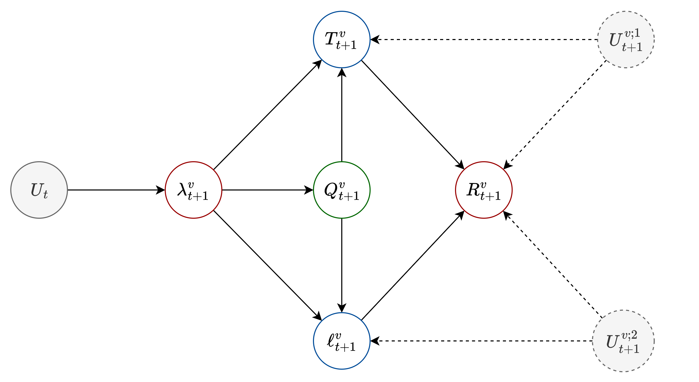
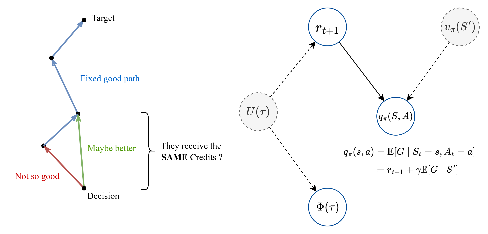

# 新的想法(2025-09-25)

##### 模型定义

符号列表

|   符号   |   含义   |                             说明                             |
| :------: | :------: | :----------------------------------------------------------: |
|  $\tau$  |   时隙   |           一个时隙是时间上离散化状态空间的最小单元           |
|  $N_a$   | 到达数量 |                    时隙内到达数量, $N_a$                     |
|  $N_s$   | 服务数量 |          时隙内被处理数据包数量, $N_s = \mu_t \tau$          |
|  $U_t$   | 混杂因素 | 主要量化来自不可知的干扰指标, 随机向量, 不可观测, 对各种指标产生不可控干扰 |
|  $T_t$   | 逗留时间 |                    个体在系统中的逗留时间                    |
|  $Q_t$   | 队列长度 |              当前时隙内, 一个节点的缓存队列长度              |
| $\rho_t$ |   负载   |  $\rho=\lambda t_s$, 正比于到达率, 在M/D/1中, 等价于到达率   |
|  $L_t$   |  丢包量  |          单跳发生丢包的数量, 其正向概率分布为丢包率          |
|          |          |                                                              |

##### 机理建模

本章节对可控部分进行预测, 在观测到系统状态后, 对下一个状态进行预测

###### 流量需求 D 的建模

D 由泊松分布建模, 考虑到泊松分布中, 相邻时间的间隔是独立且服从
$$
f(\Delta t) = \lambda e^{- \lambda \Delta t}
$$

- 数学期望为: $\mathbb{E}[\Delta T] = \frac{1}{\lambda}$, 方差 $Var[\Delta T] = \frac{1}{\lambda^2}$

- 无记忆性: $ \mathbb{E}_{X \sim E(\lambda)}[X \mid X \gt t_s] = t_s + \frac{1}{\lambda} $

- 极大似然估计:  **统计一个数据到达到下一个数据到达的间隔分布**
  $$
  \hat{\lambda} = \frac{1}{\bar{\Delta \hat{t}}}
  $$

非齐次特性: 由于卫星需求会变化, 以时间 t 作为划分, 在时隙 $\tau$ 内, 视作到达率不变, 不同时隙内, 到达率变化
$$
P(N(t_{i+1}) - N(t_i)=k) = \frac{(\lambda_i \tau)^k}{k!}e^{-\lambda \tau}
$$

- 到达率 $\lambda_t$ 将是一种 *状态*

> **推论** [泊松截断期望]
>
> 泊松分布的截断期望性质, 提出 $\lambda$ 相当于截断-1
> $$
> \begin{aligned}
> E[X \mid X \le x_0] &= \sum_{i=0}^{x_0} i \cdot \frac{\lambda^i}{i!}e^{-\lambda} \\
> &= \lambda \sum_{i=1}^{x_0}  \frac{\lambda^{i-1}}{(i-1)!}e^{-\lambda} \\
> &= \lambda \sum_{j=0}^{x_0-1} \frac{\lambda^i}{i!}e^{-\lambda} \\
> &= \lambda P(X \le x_0 -1)
> \end{aligned}
> $$
>
> $$
> \begin{aligned}
> E[X \mid X \ge x_0] &= \sum_{i=x_0}^{\infty} i \cdot \frac{\lambda^i}{i!}e^{-\lambda} \\
> &= \lambda \sum_{i=x_0}^{\infty}  \frac{\lambda^{i-1}}{(i-1)!}e^{-\lambda} \\
> &= \lambda \sum_{j=x_0-1}^{\infty} \frac{\lambda^i}{i!}e^{-\lambda} \\
> &= \lambda P(X \ge x_0 -1)
> \end{aligned}
> $$

###### M/D/1排队网络的离开过程和传递过程

考虑相邻两个个体离开的时间间隔期望

- 总体来看, 根据流量守恒
  $$
  \mathbb{E}[D] =	\frac{1}{\lambda}
  $$
  是必然的, 可以根据
  $$
  \begin{aligned}
  \mathbb{E}[D] &= \mathbb{E}[D \mid W=0]P(W=0) + \mathbb{E}[D \mid W>0 ]P(W >0) \\
  &= (\mathbb{E}[I]+t_s)(1- \rho) +t_sP(W >0) \\
  &=  \mathbb{E}[I](1- \rho) + t_s \\
  \end{aligned}
  $$
  在 M/D/1 排队系统中, 闲时 $I$ 服从 $\lambda$ 指数分布
  $$
  \mathbb{E}[D] = \frac{1}{\lambda}(1- \rho) + t_s  = \frac{1}{\lambda} = \mathbb{E}[A]
  $$
  

> **定律** [M/D/1 到达-离开间隔传递定律]
>
> M/D/1排队系统到达稳态时, 其离开过程的平均时间间隔等于到达过程的到达时间间隔, 但离开过程不一定服从泊松过程

> **定律** [M/D/1 到达-离开间隔分布定律]
>
> 通过观测表明, 在M/D/1排队网络中, 当节点接受多个邻居的随机流量时, 其到达行为近似服从泊松过程, 然而, 离开过程一般不服从泊松过程; 而是泊松过程和定长过程的混合分布, 其泊松比在0.5到1之间

随机打靶实验表明, 有理由认为在稳态M/D/1排队网络中, 离开率等于到达率

###### 队列长度 Q 的建模

Q 由排队论 M/D/1 建模

> **[2025-10-20_131813] 深刻理解状态下标 t 的含义**
>
> 我对于所谓状态的理解就是错的! 
>
> 不过这并没有什么, 很多论文对于状态的理解也是错的, 下面我将阐述真正的状态和转移的意义
>
> **In a nutshell: t 下标和时间无关, 也不属于另一个智能体**
>
> 1. **每个节点都是一个智能体**, 维护其自身的状态 $S_i$, 此处我不再使用 t 下标, 因为它和确切的时间/时隙等概念无关
>
>    实际上, 状态就是智能体的一个*阶段*, 这个阶段和传统DFS, DP等算法中的阶段别无二致
>
>    强化学习本身就是一种动态规划算法, 只是利用估计的方法替代模型
>
> 2. 在阶段 i, 智能体做出动作 $A_i$, 随后变成状态 $S_{i+1}$ ?
>
>    这是错误的
>
>    我们忽略了一个重要的观点: 动作到状态转移, **这一步并非由智能体执行, 而是环境执行的**
>
>    
>
>    - 如图, 在状态 $S_i$, 智能体根据自身状态执行动作 $A_i$, 随后, 环境输出 $S_{i+1}$
>
>    - 这一步环境的输出, 对应 **一切的变化**, 其中包含输入过程, 类比状态空间方程
>      $$
>      \dot{x} = Ax + Bu
>      $$
>      环境的作用就是如此, 其包含了输入 $u$, 以及状态转移 $\dot{x}$
>
> 3. 强调**输入**, 目的是为了表明, 状态转移是一个**异步过程**
>
>    即: 并不是做出动作 $A_i$ 就产生了状态转移, 而是
>
>    1. 智能体向环境输入了动作 $A_i$, 随后进入**等待**
>    2. 环境接受动作, 并产生一系列同步或异步的变化, 随后产生转移信号
>    3. 智能体接受转移信号, 发生转移
>
>    当环境也是由智能体组成时, 称为多智能体强化学习(Multi-agent Reinforcement Learning, MARL)
>
>    对于一个智能体来说, 其根据当前状态 $S_i$ 做出动作 $A_i$, 这个是同步的, 即, 它一定根据状态做出动作 $\pi(A_i \mid S_i)$
>
>    随后, 对于其他智能体, 作为环境视角, 收到动作影响后, 发生状态转移
>
> 4. 对于M/D/1排队网格系统, 举例如下
>
>    智能体C根据当前状态, 做出路由转发动作 $A_i$
>
>    该数据包转发时, 目标邻居状态为 $S_i-O_i$, 经过 $\tau$ 时间后, 数据包到达, 此时邻居状态 $S_i \rarr S_{i+1}$
>
>    这个状态转移时相对于智能体C而言的, 而不是对于邻居, 因为, 是C的动作在为数据包的转发情况负责, 如果该数据包发送出去后发生拥堵丢包, 那么受到惩罚的是C
>    
>     数据包到达后, 目标智能体的观测状态变为 $S_{i+1}$, 以此评估奖励 $R_{i+1}$

数据包从中心节点发送到达目标节点的 $\tau$ 时间内, 节点可以处理的包数量 $N_s = \mu_t \tau$, 到达的包为 $N_a \sim P(\lambda \tau)$, 则当数据包到达后, 目标节点的队列观测状态实际发生转移 $S_t \rarr S_{t+1}$
$$
Q_{t+1}=
\left \{
\begin{aligned}
&Q_t - N_s + N_a &, Q_t \ge N_s\\
&N_a &,  Q_t \lt N_s\\
\end{aligned}
\right.
$$

- 其中

  $$
  p_t(n) = P(N_a=n) = \frac{(\lambda_t \tau)^n}{n!}e^{-\lambda_t \tau}
  $$
  定义累加分布函数, 同理, 上标可以更换为 $\lt, \ge , \gt...$
  $$
  p_t^\le(q) = P(N_a \le q) = \sum_{i=0}^q p_t(i)
  $$
  
- 得到马尔科夫转移矩阵, 这是一个无限矩阵
  $$
  P_t = [p_{ij}]_t = P(Q_{t+1} = j \mid Q_t = i) = 
  \left \{
  \begin{aligned}
  &p_t(j-i+ N_s), && i  \ge N_s, j \ge i-N_s \\
  &p_t(j), && i < N_s\\
  &0, &&\text{other}
  \end{aligned}
  \right.
  $$

  转移矩阵形态为: 第一行为完整的 $k_t(j), ~~ j=0,1,...$, 往后每增加一行, 元素往前位移一列
  $$
  P_t = 
  \left(
  \begin{matrix}
  \text{i=0}&k_t(0) & k_t(1) & k_t(2) & \cdots \\
  \text{i=1}&k_t(0) & k_t(1) & k_t(2) & \cdots  \\
  ...&k_t(0) & k_t(1) & k_t(2) & \cdots  \\
  \text{i=}N_s&k_t(0) & k_t(1) & k_t(2) & \cdots  \\
  ...&0 & k_t(0) & k_t(1) & \cdots  \\
  ...&0 & 0 & k_t(0) & \cdots  \\
  ...&0 & 0 & 0 & \cdots  \\
  \end{matrix}
  \right)
  $$
  上述推导给予了**预知下一时隙队列长度分布**的能力, 在观测到队列 $Q_t=q$ 情况下, 唯一参量就是 $\rho_t$, 上述矩阵的含义是: **在给定当前队列 $Q_t = q$ 情况下, 则对于 $\tau$ 时间后的队列长度预测**

   
  
- 队列长度的期望分布为
  $$
  \begin{aligned}
  \mathbb{E}[Q_{t+1} \mid Q_t=q, \lambda_t] &=  q - \frac{\tau}{t_s} + \lambda_t \tau \\
  \end{aligned}
  $$
  
  

###### 丢包量 L 和概率分布建模

预测转移该数据包的 $\tau$ 后, 到达时被丢弃的概率

- 下一状态的队列满足
  $$
  Q_{t+1}=
  \left \{
  \begin{aligned}
  &Q_t - N_s + N_a &, Q_t \ge  N_s \\
  &N_a &,  Q_t < N_s\\
  \end{aligned}
  \right.
  $$
  我们的数据包便混在 $N_a$ 中, 排列随机

  定义丢包量为
  $$
  L_{t+1} = Q_{t+1} - q_\max
  $$
  记**状态变量 $\Delta_q$**, 其中, $N_s = \mu_t \tau_A$
  $$
  \Delta_q = \left \{
  \begin{aligned}
  &q_\max - q +  N_s, && q \ge N_s, q \le q_\max\\
  &q_\max, && q <  N_s \\
  \end{aligned}
  \right.
  $$

  则丢包概率分布
  $$
  \begin{aligned}
  P(L_{t+1} \gt 0 \mid Q_t=q) &= \sum_{j=q_\max +1}^{\infty}P(Q_{t+1} = j \mid Q_t = q) \\
  &= 1- p_t^\le(\Delta_q)
  \end{aligned}
  $$

- 计算丢包期望
  $$
  \begin{aligned}
  \mathbb{E}[L_{t+1} \mid Q_t = q, \lambda_t ] &=  \sum_{j=q_\max +1}^{\infty}(j - q_\max)P(Q_{t+1} = j \mid Q_t = q) \\
  &= \sum_{k=\Delta_q + 1}^{\infty}(k - \Delta_q) \frac{(\lambda \tau)^k}{k!}e^{-\lambda \tau} \\
  &= \sum_{k=\Delta_q + 1}^{\infty}k \frac{(\lambda \tau)^k}{k!}e^{-\lambda \tau}  - \Delta_q \sum_{k=\Delta_q + 1}^{\infty} \frac{(\lambda \tau)^k}{k!}e^{-\lambda \tau}\\
  &= \underbrace{\lambda_t \tau p_t^\ge(\Delta_q)}_\text{load effect} - \underbrace{\Delta_q p_t^\gt(\Delta_q)}_\text{queue effect}
  \end{aligned}
  $$
  表明, 个体到达目标节点后, 溢出队列的期望

  本应当到达的数据包数量为
  $$
  \mathbb{E}[N_a \mid Q_t=q, \lambda_t ] = \lambda_t \tau
  $$
  因此, 个体在随机排列情况下, 被丢弃的概率为
  $$
  \begin{aligned}
  \mathbb{E}[L_{t+1} \mid Q_t = q, \lambda_t ] 
  &= \underbrace{\lambda_t \tau p_t^\ge(\Delta_q)}_\text{load effect} - \underbrace{\Delta_q p_t^\gt(\Delta_q)}_\text{queue effect}
  \end{aligned}
  $$

$$
\left \{
\begin{aligned}
\mathbb{E}[Q_{t+1} \mid Q_t=q, \lambda_t] &=  q - \frac{\tau}{t_s} + \lambda_t \tau \\
\mathbb{E}[L_{t+1} \mid Q_t = q, \lambda_t ] 
&=\lambda_t \tau p_t^\ge(\Delta_q) - \Delta_q p_t^\gt(\Delta_q) \\
\mathbb{E}[T_{t+1} \mid Q_t = q, \lambda_t] &=  \rho_t \tau p_t^\lt(\Delta_q) +t_s(q_\max - \Delta_q + \frac{1}{2})p_t^\le(\Delta_q) \\
\end{aligned}
\right.
$$

###### 滞留时间 T 建模

滞留时间 T 计算, 根据当前观测状态的转移分布进行

- 观测到 $Q_t = q, \lambda_t$ 时, 对到达数据包的逗留时间进行估计

  $$
  T_{t+1} = Q_{t+1} \cdot \mathbb{E}[S] + \mathbb{E}[R_t]
  $$
  其中, $R_t$ 为数据包到达时, 服务中包的剩余服务时间, 其在到达观测时服从 $R_t \sim U(0, t_s)$ 的均匀分布

- 根据观测到的条件期望, 对时延期望进行展开
  $$
  \begin{aligned}
  \mathbb{E}[T_{t+1} \mid Q_t = q] &= \sum_{j=0}^{\infty}\mathbb{E}[T_{t+1} \mid Q_t = q, Q_{t+1}=j]P(Q_{t+1} = j \mid Q_t = q) \\
  &= \sum_{j=0}^{q_\max}\mathbb{E}[T_{t+1} \mid Q_t = q, Q_{t+1}=j]P(Q_{t+1} = j \mid Q_t = q) + \infty\\
  \end{aligned}
  $$
  由于超出 $q_\max$ 部分发生丢包, 不能计算时延

**仅以概率 $1- l_{t+1}$ 地接受如下结果**
$$
\begin{aligned}
\mathbb{E}[T_{t+1} \mid Q_t = q] &= \sum_{j=0}^{q_\max}\mathbb{E}[T_{t+1} \mid Q_t = q, Q_{t+1}=j]P(Q_{t+1} = j \mid Q_t = q) \\
&= \sum_{j=0}^{q_\max}t_s(j + \frac{1}{2})P(Q_{t+1} = j \mid Q_t = q) \\

\end{aligned}
$$

- 当 $q \lt N_s$ 时, 得到
  $$
  \mathbb{E}[T_{t+1} \mid Q_t = q] = t_s \lambda_t \tau p_t^\lt(q_\max)   +\frac{1}{2} t_s p_t^\le(q_\max)
  $$

- 当 $q \ge N_s$ 时, $P(Q_{t+1} = j \mid Q_t = q) = p_t(j-q+N_s)$ 要求 $j \ge q - N_s$, 否则转移概率为0 (泊松过程计数是增量过程)

  通过变量替换, 记 $\Delta_q = q_\max - q +N_s $
  $$
  \begin{aligned}
  \mathbb{E}[T_{t+1} \mid Q_t = q] &= t_s \lambda_t \tau p_t^\lt(\Delta_q)  + t_s(q - N_s + \frac{1}{2})p_t^\le(\Delta_q) \\
  &= t_s \lambda_t \tau p_t^\lt(\Delta_q)  + t_s(q_\max - \Delta_q + \frac{1}{2})p_t^\le(\Delta_q) \\
  \end{aligned}
  $$

- 当 $q \lt N_s$ 时, 记 $\Delta_q = q_\max$, 则 $q-N_s = q_\max - \Delta_q = 0$, 则可以统一期望公式
  
  $$
  \mathbb{E}[T_{t+1} \mid Q_t = q] =   \underbrace{\rho_t \tau p_t^\lt(\Delta_q)}_\text{load part}  + \underbrace{t_s(q_\max - \Delta_q + \frac{1}{2})p_t^\le(\Delta_q)}_\text{queue part} \\
  $$
  
  

##### 因果建模

###### 状态的反事实推断

设中心节点在 $t$ 阶段对邻居节点(包含目标节点 $O_k^t$)做出观测 $O_t = [O_1, O_2, O_3, O_4]_t$, 随后做出路由动作 $A_t^v=a_t$, 作空间为 $\mathcal{A}$ 对于每个节点都是适用的, **当发送出的路由数据包到达后, 目标节点实际状态为 $O^{t+1}_k$,** 环境评估此步转移 $O_k^{t} \rarr O_{k}^{t+1}$ 并给出回报 $R_{t+1}$

首先明确: 因果建模的目的 — 进行反事实推断, 以达成全动作估计器的目的

随后, 我们应当有一个全局的信息, 即 Critic, **用来评判数据包在某一个节点处, 能被送达目的地的奖励值**

根据 A-star的思想, Critic的输入维度应当包含: {中心经纬度, 目的地经纬度, 邻居链路状态, 邻居路由负载, 邻居队列长度}, 它的目的类似于启发函数, 预测数据包到达中心节点后, 直到被送达目的节点的折扣奖励积累

- 我们无法实际预测这个值, 尤其是对于数据缺失的节点, 一个包从源路由到目的路由, 只会经过有限路径
- 但是, 这种启发是具有**全局性泛化**的(A-star思想), 即, 理论来说, 只需要知道中心和目的地的经纬度, 就可以完成启发
- 然而, 由于我们的启发还需要完成更多的目的(比如实现负载均衡), 因此需要输入更多的信息

###### 联想迁移

在数据集中, 可能会遇到节点没有任何数据或节点的邻居没有任何数据的情况

针对上述两种, 提出如下估计方法

1. 节点观测时, 某一邻居没有数据 $O_i^t$

   一般来说, 我们需要邻居经纬度, 以及邻居的节点状态

   此时我们将赋予邻居节点等同于中心节点的负载, 并估算其稳态分布时的状态

   相当于将负载特征抹除

2. 节点计算奖励时, 本身没有数据

   如果其邻居有数据, 则利用邻居数据联想迁移

   如果四个邻居都没有数据, 则直接利用A*给出下一跳, 即完全模型主义联想迁移

###### 路径的反事实推断

考虑在中心节点C处做出动作 $A_t =a_t$ 后, 对当前选择路径以及后续路径积累总回报为
$$
q_\pi(s, a) = \mathbb{E}[G_t \mid S_t=a, A_t=a] = r_{t+1} + \gamma v_\pi(s_{t+1})
$$
这个公式表明, 当前动作的价值=*做出动作得到的环境响应*+**下一跳的平均响应**

关于强化学习的部分, 还没有打通

$v_\pi$, $q_\pi$, 全动作估计器, 单动作估计器, 这些的关系是怎么样的, 阅读论文

考虑这个图, 我们实际上是多智能体强化学习的范畴

中心节点C做出动作后, 环境会根据转移给予奖励 $R_{t+1}$, 这部分完全由 $\pi(A|S)$ 决定, 然而, 后续路径回报则是由其他智能体得到的

这出现了一个混淆: 如果C做出的动作没那么好, 但是后续智能体的修正使其仍然完成了任务, 那么, C获得的回报
$$
\mathbb{E}[G \mid S=s, A=a] = q_\pi(s,a)
$$
实际上是高估了的

在线环境下, 我们无法区分属于其他智能体的回报, 但是离线环境却可以, 因为我们清楚地知道后续发生了什么

反事实RL的思想告诉我们, 只要能找到一个独立于动作A的未来信号 $\Phi$, 通过改变基线以修正
$$
\nabla_\theta E[G] = E \left[ \sum_t \gamma^t \nabla_\theta \ln \pi_\theta \left( G_t - V(S_t, \Phi_t) \right) \right] \tag{3}
$$
仍然如图, 信号 $\Phi$ 是由轨迹提炼出的, 它和单步奖励 $r_{t+1}$ 都由一个隐变量生成, 这表明, 在系统自由演化的情况下, 信号 $\Phi$ 和单步奖励有关, 即和动作 $A_t$ 有关

但是, 当控制隐变量时, 即控制 $U(\tau)$后, 动作和信号将独立, 如果将系统演化由一个因果模型描述, 则 $U(\tau)$即为从轨迹中计算出的噪声信号, 而 $\Phi$ 可以是任何由轨迹中提取的信号

> 后见之明网络的构成
>
> - **后见之明网络：** 使用一个后见之明网络 $\phi$ ，其参数为 $\theta_{hs}$ 。 该网络计算后见之明统计量 $\Phi_t = \phi((X, A, R))$ ，该统计量可能取决于观测值、智能体状态和动作向量，尤其可以取决于时间步 $t' \ge t$ 的观测值。 后见之明统计量 $\Phi_t $ 包含了在时间 $t$ 之后才能获得的轨迹信息。 
> - **价值网络：** 使用一个 **未来条件价值网络** (Future-Conditional Value Network, FC-PG) $V_{\theta_V}(X_t, \Phi_t)$ ，其参数为 $\theta_V$ 。 该价值网络以当前状态 $X_t$ 和后见之明统计量 $\Phi_t $ 作为输入，用于估计在给定状态和后见之明信息下的预期回报。 
> - **后见之明预测器：** 使用一个概率预测器 $h_\omega$ ，其参数为 $\omega$ 。 该预测器以 $X_t$ 和 $\Phi_t $ 作为输入，输出关于动作 $A_t$ 的分布，用于实施独立性条件。 独立性条件确保后见之明信息不会受到智能体当前动作的影响，从而避免偏差。

###### 论断-CAF方法

单动作估计器中的基线部分, 其实就是在计算动作对于回报的ATE
$$
\begin{aligned}
ATE_{A \rarr G} = \mathbb{E}[G \mid do(A=a_1)] - \mathbb{E}[G \mid do(A=a_0)]
\end{aligned}
$$
考虑到动作并不是二元处理, 因此用平均动作处理效应来代替, 设原先使用的动作为 $a_t$, 则定义ATE
$$
\begin{aligned}
ATE_{A \rarr G} = \mathbb{E}_{A \sim \pi(A|S_t)} \left[\mathbb{E}[G \mid do(A_t=a_t)]  - \mathbb{E}[G \mid do(A_t=A)]\right] 
\end{aligned}
$$
下面论证, $\mathbb{E}[G \mid do(A_t=A)]$ 是可识别的,

设SCM是对MDP的无偏建模, 因此轨迹和回报是噪声的确定函数, 确切来说, 单步转移也是噪声的确切函数
$$
S_{t+1}, R_{t+1} = f(S_t, A(U_t)) = g(S_t, U_t)
$$
即表明, 给定 $S_t$后, 噪声只通过影响动作 $A_t$ 来干预转移和后续回报, 因此$\mathbb{E}[G \mid do(A_t=a)]$ 是可识别的,          
$$
\mathbb{E}[G \mid do(A_t=a), S_t=s] = q_\pi(s, a)
$$
计算**个体治疗效应, ITE**, 即划分实验组($A_t = a_t$) 和对照组( $A_t=a_i, i \neq t$), 计算每组的干预效应

其中, $ \mathbb{E}[G \mid do(A_t = a_i)], i \neq t$ 是对动作干预的*反事实查询*
$$
\begin{aligned}
ITE_{A \rarr G} &= \mathbb{E}[G \mid do(A_t = a_t)] - \mathbb{E}[G \mid do(A_t = a_0)]\\
ITE_{A \rarr G} &= \mathbb{E}[G \mid do(A_t = a_t)] - \mathbb{E}[G \mid do(A_t = a_1)] \\
...\\
ITE_{A \rarr G} &= \mathbb{E}[G \mid do(A_t = a_t)] - \mathbb{E}[G \mid do(A_t = a_t)] \\
...\\
ITE_{A \rarr G} &= \mathbb{E}[G \mid do(A_t = a_t)] - \mathbb{E}[G \mid do(A_t = a_n)]
\end{aligned}
$$
将上述项按照动作出现的概率加权求和, 得**到平均治疗效应, ATE**
$$
\begin{aligned}
ATE_{A \rarr G} &= \mathbb{E}_{A \sim \pi(A|S_t)} \left[\mathbb{E}[G \mid do(A_t=a_t)]  - \mathbb{E}[G \mid do(A_t=A)]\right] \\ 
&= \mathbb{E}_{A \sim \pi(A|S_t)} [q_\pi(S_t, a_t) - q_\pi^\text{CF}(S_t, A) ]\\
&= q_\pi(S_t, a_t) - \sum_{a \in \mathcal{A}}\pi(a \mid S_t) q_\pi^\text{CF}(S_t, a)  \\
&= q_\pi(S_t, a_t) - v_\pi^\text{CF}(S_t)  \\
&= r_{t+1} + \gamma v_\pi(S_{t+1}) - v_\pi^\text{CF}(S_t) \\
\end{aligned}
$$
上述公式称「反事实优势函数, CAF」, 反事实优势函数实际上就是动作对最终回报的ATE, 表明动作真正对轨迹回报 

 

