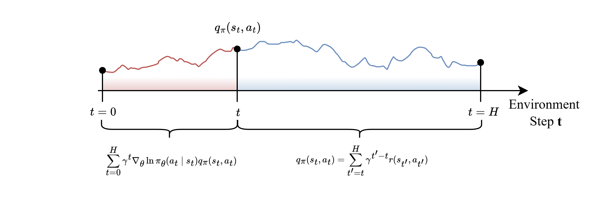
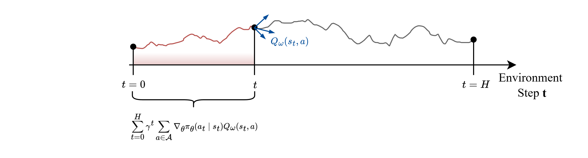
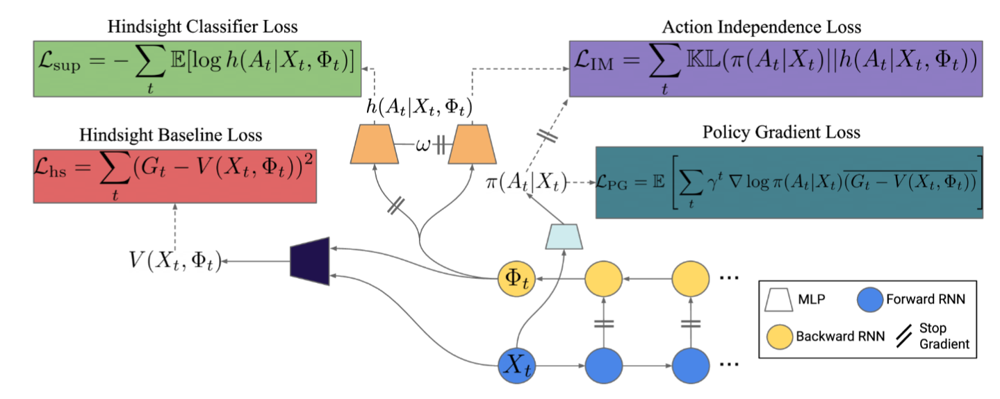
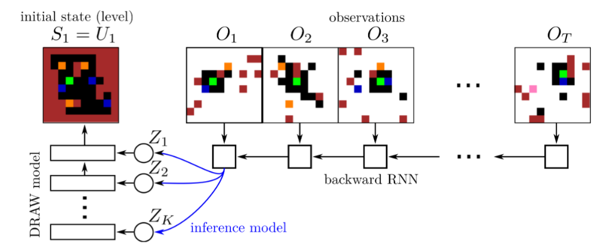
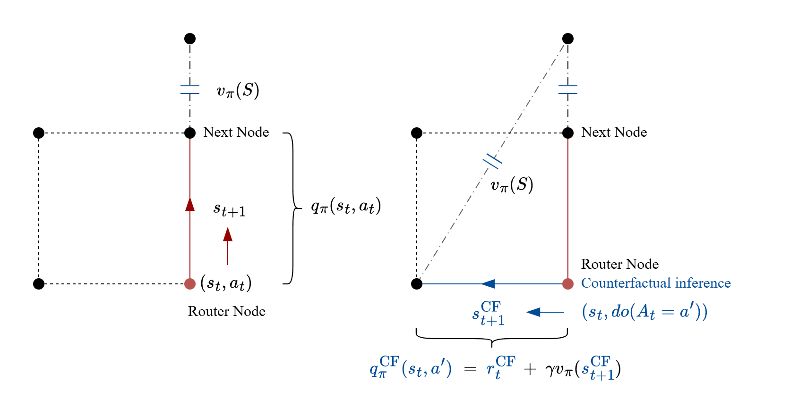
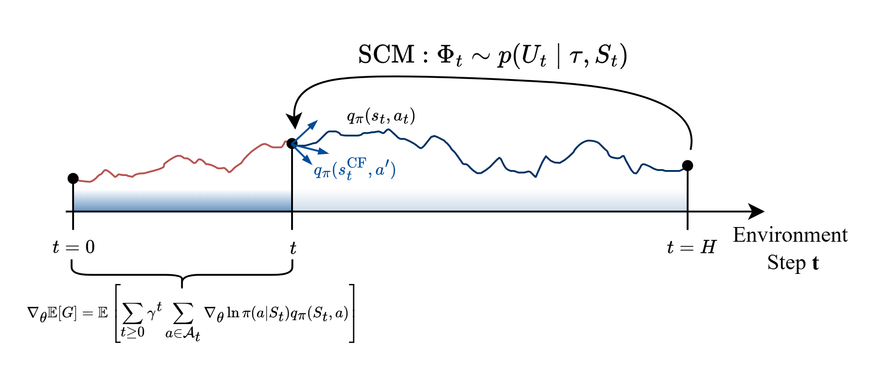

##### 前言

细读论文: Counterfactual Credit Assignment in Model-Free Reinforcement Learning

回溯列表

https://scholar.google.com/scholar?cites=5699933776164693919&as_sdt=2005&sciodt=0,5&hl=zh-CN

##### 信用分配问题

本文将强化学习中的奖励评估问题阐述为`信用分配, (Credit Assignment, CA)`, 预测**动作对未来的影响**

- 具体而言, 如果智能体采取了不同的行动，结果会如何变化。通过这种方式，我们可以更好地理解特定行动的实际影响
- 需要区分干预的因果作用和运气的成分, 即, 尽管达成了目标, 可能是噪声的积累引发

###### 强化学习和信用分配问题

- 强化学习通过**最大化奖励信号**来优化策略

  如果将奖励视作信用分配, 其不过是为每一个动作分配一个Credit值

  而Credit又是人为地根据目标赋予, 因此可以理解为如下规则:

  *“强化学习过程是在理解干预和结果之间因果作用的过程”*

  这是显而易见的, 对于一个动作, 其可能一定程度上能优化指标, 但是运气成分不可忽视, 那么获得的信用回报是低且不稳定的, 当智能体发现了能够保持高回报的方法时, 也等价于其掌握了改善指标的根本原因

- **无模型强化学习** (Model-Free Reinforcement Learning)算法执行简单的基于时间的信用分配

  其将动作执行后发生的事件和产生的信用回报都归功于动作的执行

  其并没有识别出其中动作真正产生的因果作用部分, 以及运气部分(噪声作用)

  现有的无模型RL方法不具备轨迹上的反事实推断能力(具体见 [关于反事实推断](D:\MyMedia\@Caches\TyporaDocs\杂项和阅读\06 因果; CRL; C-Routine\2025-10-10-反事实推断.md))

- **信用分配**是解决强化学习痛点的关键

  强化学习后期无法学习的原因在于, 智能体没有显式地探寻因果关系, 其动作对环境的影响越来越小, 获得的信用回报趋于无规则噪声

  Counterfactual Credit Assignment, CCA 利用事后信息隐式地执行反事实评估: 估计未被选择的行为的回报

  通过**估计未被选择的行为的回报**。 这些反事实回报可以通过构建未来条件基线来形成策略梯度的无偏和低方差估计

###### 轨迹评估

策略梯度定理指出, 评估策略的方法只需要去模拟它, 然后搜集轨迹 $\tau_i = \{ (s_t^i, a_t^i, r_t^i, s_{t+1}^i) \}_{t=0}^{H}$, 随后计算如下均值
$$
\nabla_\theta \mathbb{E}[G] = \mathbb{E}_{\tau \sim p_\pi}[ \sum_{t=0}^H \gamma^t \nabla_\theta \ln \pi_\theta(a_t \mid s_t) q_\pi(s_t,a_t) ]
$$

- 需要注意, $q_\pi(s_t,a_t) $ 并不能简单访问, 它也是一个数学期望
  $$
  q_\pi(s_t,a_t)  = \mathbb{E}[G \mid S=s_t, A=a_t]
  $$

- 在轨迹长度有限的情况下, 用同一条轨迹来访问: $q_\pi(s_t,a_t)  = \sum_{t'=t}^H \gamma^{t'-t}r(s_{t'}, a_{t'})$

  或是计算广义优势估计: $A_\pi(s_t,a_t)  = \sum_{t'=t}^H \gamma^{t'-t}[r(s_{t'}, a_{t'}) - v_\pi(s_{t})]$

总得来说, 上述都称为`单动作估计器`, 特征就是, **每次只更新采取的动作 $a_t$**

- 一个细节是, 它实际上是对 $q_\pi(S,A) $ 的加权
- 在离线的语境下, 上述估计器实际上将t时刻后得到的全部影响都归功于t时刻选择的动作 $a_t$

其评估的印象为:

如果此时, 能够有一个函数 $Q_\omega(S,A)$ 以计算任意给定的 $(s_t, a_t)$, 那么在单步更新时, **就可以为所有动作提供学习信号**

此时的评估称`全动作估计器`
$$
\nabla_\theta \mathbb{E}[G] = \mathbb{E} \left[ \sum_{t \geq 0} \gamma^t \sum_{a \in A} \nabla_\theta \pi(a|S_t)Q_\omega(S_t, a) \right]
$$

- 这类似于 Q-Learning 的技巧, 只需要依赖当前信息即可给出学习信号
- 然而这需要 $Q_\omega(S,A)$ 能对未来做出一个良好的估计

> **小结**
>
> 1. $Q_\omega(S=s_t,A)$ 表明一种只根据当前信息给出动作的Credit的方法, **不一定**表示一个输入输出的函数, 也表示一种**手段**
> 2. 对于离线强化学习, $Q_\omega(S,A)$ 的责任不仅是对未来进行良好地估计, 也必须对过去进行良好地总结

###### 后见之明推理 

单步估计器将会把未来所有的影响归功于单步动作, 这是不合理的

因为后续的影响包含`运气`和`技能`两个部分, 即, 无法识别混淆因子对于后续影响的作用

`基线`方法如下
$$
\nabla_\theta \mathbb{E}[G] = \mathbb{E}_{\tau \sim p_\pi}[ \sum_{t=0}^H \gamma^t \nabla_\theta \ln \pi_\theta(a_t \mid s_t) \hat{A}_\pi(s_t,a_t) ]
$$
其中, $\hat{A}_\pi(s_t,a_t)= \sum_{t'=t}^H \gamma^{t'-t}[r(s_{t'}, a_{t'}) - v_\pi(s_{t})]$ 称为广义优势估计

- 其保证了梯度的估计是无偏的, 但是能够缩小方差
- 直观上来看, 基线提供了一个前提, 即“动作至少要达到这样的水平”以消除部分混淆因子的作用

全动作估计器的目的便是, 考虑所有的动作, 那么表现不佳的动作将不会获得积极的强化

本质来说, 我们需要一种对未来的估计手段, 假设已经知道在 t 时刻采取动作时, 未来会发生事件 $\Phi_t$, 那么在这个条件下去对动作进行评估

即, 现在引入一个来自未来的随机变量 $\Phi$ 来指导当前时步 t 的决策, 产生统计量 $\Phi_t$

对于单步估计器, 有
$$
\nabla_\theta \mathbb{E}[G] = \mathbb{E} \left[ \sum_{t \geq 0} \gamma^t \nabla_\theta \ln \pi(A_t|S_t) (G_t - \frac{\pi_\theta(A_t \mid S_t)}{p(A_t \mid S_t, \Phi_t)}V(S_t, \Phi_t)) \right]
$$
右侧重要性采样是为了满足充分条件
$$
\mathbb{E} \left[ \nabla_\theta \ln \pi(A_t|S_t) \frac{\pi_\theta(A_t \mid S_t)}{p(A_t \mid S_t, \Phi_t)}V(S_t, \Phi_t)\right]=0
$$
对于全动作估计器, 有如下推论
$$
\nabla_\theta \mathbb{E}[G] = \mathbb{E} \left[ \sum_{t \geq 0} \gamma^t \sum_{a \in A} \nabla_\theta \ln \pi(a|S_t)Q_\omega(S_t, \Phi_t, a)p(a \mid S_t, \Phi_t) \right]
$$

需要满足充分条件
$$
Q(S, a)=\mathbb{E}_{\Phi}[Q(S, \Phi, a)\frac{p(a \mid S, \Phi)}{\pi(a \mid S)}]
$$
进一步地, 上式表明必须满足 $\frac{p(a \mid S, \Phi)}{\pi(a \mid S)} \lt \infty$

> **特例** 事后经验回放 Hindsight Experience Replay, HER
>
> 事后经验回放将失败的目标也赋予一个启发值, 以促使智能体逼近真正的目标, 假设真正的目标为 $g$, 则
> $$
> r_g(s,a) = \mathbb{1}[s =g]r^+(s) + \mathbb{1}[s \neq g]r^-(s)
> $$
> 这样在较为庞大的状态空间中, 智能体都将不能有效学习, 因为达到目标对于初期学习的随机游走过程是相当困难的
>
> 那么此时, 如果设置奖励为
> $$
> r_g(s,a) = r(s,g)
> $$
>
> - 其由当前状态决定, 但同样也由一个来自未来的量进行启发
> - 以 $r_g(s,a)=- || s-g ||^2$ 为例, 智能体在学习初期会受到较大惩罚, 但由于该奖励告诉了优化的方向, 因此学习是更快的
> - 上述玩具例子也是**引入领域知识**的一种, 以下将提出不需要任何领域知识的方法
>
> 上述简单的例子并不能用于复杂案例, 考虑一个具有状态序列 $s_1, s_2,..., s_T$ 的MDP过程, 以及目标 $g$
>
> - 如果 $g \neq s, \forall s_{\le T}$, 那么每一步智能体都将得到奖励 $r^-$
>
> 方法的关键是: 关键思想是**用不同的目标重新检查这个轨迹**
>
> 虽然该轨迹不包含如何实现 $g$ 的信息, 但一定包含如何实现 $s'$ 的信息
>
> 轨迹信号 $\tau_i = \{ (s_t^i, a_t^i, r_t^i, s_{t+1}^i, g) \}_{t=0}^{T}$ 选择数条轨迹进行经验回放时, 选择其中的一个状态 $s'$, 将其映射为目标 $g'=f(s')$, 重新计算奖励并替换产生新的经验 $\tau' = \{ (s_t, a_t, r_t', s_{t+1}, g') \}_{t=0}^{T}$, 利用该经验更新智能体
>
> 对于算法中状态 $s'$ 的选择，HER 提出了 3 种不同的方案。
>
> - future： 选择与被改写的元组处于同一个轨迹并在时间上处于之后的某个状态作为 $s'$ 
> - episode： 选择与被改写的元组处于同一个轨迹的某个状态作为 $s'$ 
> - random： 选择经验回放池中的某个状态作为 $s'$ 
>
> 其中, future是实践中最好的方案, 这本质上, 考虑未来信号 $\Phi_t =S_{t+k}, t+k \le T$, 则
> $$
> \nabla_\theta \mathbb{E}[G] = \mathbb{E} \left[ \sum_{t \geq 0} \gamma^t \sum_{a \in A} \nabla_\theta \ln \pi(a|S_t)Q_\omega(S_t, S_{t+k}, a)p(a \mid S_t, S_{t+k}) \right]
> $$
> 就是HER的一个实现
>
> 检验
> $$
> \mathbb{E}_{S'}[Q(S, S' ,a)\frac{p(a \mid S, S')}{\pi(a \mid S)}]
> $$
>
> - 由于动作是由决策 $\pi(A \mid S)$ 做出的, 和 $S’$ 独立, 因此 $\frac{p(a \mid S, S')}{\pi(a \mid S)}=1$, 而 $S, S' \in \mathcal{S}$, 因此 $\mathbb{E}_{S'}[Q(S, S' ,a)]= Q(S, a)$

###### 反事实策略梯度

**反事实策略梯度** (CCA-PG, Counterfactual Policy Gradient)定理：如果给定当前状态 $S_t$ ，**当前动作 $A_t$ 与随机变量 $\Phi_t$ 相互独立**，则以下是对期望回报梯度 $\mathbb{E}[G]$ 的无偏单动作估计： (**少了一个 $p(A \mid S_t, \Phi_t)$**)
$$
\nabla_\theta \mathbb{E}[G] = \mathbb{E} \left[ \sum_t \gamma^t \nabla_\theta \ln \pi_\theta(A_t \mid S_t) \left( G_t - V(S_t, \Phi_t) \right) \right]
$$

表示的是一种策略梯度更新方法, 其中 $V(S_t, \Phi_t)$ 是在给定状态 $S_t$ 和未来信息 $\Phi_t$ 时的价值函数, 用于评估当前策略的好坏。 $G_t$ 是未来回报, $S_t$ 是得分函数。

成立的充分条件
$$
Q(s, a) = \mathbb{E}_{\Phi}[Q(S_t, \Phi_t, A_t) | S_t=s, A_t = a]
$$
如果智能体可以测量一个对回报有很大影响但与智能体动作 $A_t$ 不相关的量 $\Phi_t$ ，则学习 $Q(S_t, \Phi_t, a)$ 可能会更容易（也更节省数据）

> **实现** 生成式后验值函数
>
> 考虑感兴趣的变量 $Y_t$, 它是整条轨迹的函数, 因此是事后已知的
>
> 设含有潜在变量 $\epsilon_t$ 的模型来学习这个值
> $$
> p(Y_t|S_t, A_t) = \int_{\epsilon_t} p(\epsilon_t|S_t)p(Y_t|S_t, A_t, \epsilon_t) d\epsilon_t
> $$
> 则概率模型
> $$
> \int_{\epsilon_t} p(\epsilon_t|X_t)p(Y_t|X_t, A_t, \epsilon_t) d\epsilon_t \rarr p(\epsilon_t|X_t, A_t, Y_t)
> $$
> 导出一个后验分布, 描述潜在变量的建模, 将潜在变量视作 $\Phi$ 的一种实现, 那么, 从后验分布中采样一个潜在变量, 它和动作是独立的

> **推论** 依靠SCM的反事实策略梯度
>
> 假设MDP过程由一个潜在的因果模型支配, 尽管我们能观测的是 $p(s,a,r,s')$ 中进行采样的数据, 然而, 状态变量和动作变量(其各个维度)本身具有因果关系
>
> 全局上下文 $U$ 是混淆噪声和源噪声的总和, 它们在因果SCM中不具有父节点
>
> 可以理解为: 所有智能体和环境交互所产生的轨迹和回报, 都可以用全局上下文做映射
> $$
> S_t', G_t = f(s_t, a_t, U)
> $$
> 通过将反事实结果引入基线, 其相当于引入了未来信号 $\Phi$
>
> - 因果模型 可以形式化地定义反事实的概念。 
>
> - 给定一个观测轨迹 $\tau = (S_s, A_s, R_s)_{s \ge t}$ ，对于一个备选动作 $A'_t = a'_t$ ，反事实轨迹 $\tau'$ 的定义过程如下：
>
>   -  推断：根据实际观测推断外生噪声变量 $U$ 的值，即 $U \sim P(U|\tau)$ 
>   - 干预：将 $A'_t$ 的值固定为 $a'_t$ （切断传入的因果箭头）
>   - 预测：评估在固定值 $U$ 和 $A_t = a'_t$ 条件下的反事实结果 $\tau'$ ，得到 $\tau' = f(s_t, a'_t, U)$ 
>
>   上述三步, 都需要因果模型作为支撑

- 这些图太伟大了
- 反向! 反向! 然后提取“技能”信息, 是关键!
- 引入 $\Phi$ 的动机: 后见之明地区分当前动作哪些是技能, 哪些是运气
- 和因果的联系: 假设这条轨迹是干预得到的, 那么它也得到了回报和目标, 那么我们需要知道哪些动作是真正促使完成的

关于ATE: 

1. 计算的是: 采取动作动作对于对于回报变化的真正ate, 和当前状态有关
   $$
   ATE_{A_t \rarr G_t \mid S_t}
   $$

2. 由于模型是已知的, 因此利用模型是可以计算出这个ATE的

3. 但是, 模型的参数是根据轨迹调节的, 我们在实际使用中, 并不能直接计算ATE, 因此, 利用另一个模型来估计ATE

4. 对奖励进行修正: 以真正的ATE作为奖励

5. 注意未来并不一定指的是最后一个状态, 而是整条轨迹, 未来指的是在当前时刻 t 并不能直接得到的量, 不一定是未来状态

   整条轨迹的信息其中包含 t 时刻已经知道的事情, 但也包含不能知道的事情 $S_{\gt t}$, 因此也符合 $\Phi_t$ 的范畴

关于全动作估计器的思路

- 总体而言, 只要根据轨迹建模了SCM, 我们就是掌握了未来信息

- 由于全动作估计器是无偏的, 这是不得不承认的, 因此利用这个来减小方差

  - 注意, 全动作估计器本身是相当难以实现的, 因为实际数据智能体不可能对于一个状态做出所有动作, 并得到所有动作的轨迹
  - 需要明白, $q(S_t, A_t)$ 看似只利用 $(S_t, A_t)$ 访问, 但实际上它是对未来的总结, 是需要后面所有的演化的

- 我们能否有一种办法, 在 t 时刻“模拟” 全动作估计, 即反事实推断

  - 这相比于 *WOULDA, COULDA, SHOULDA  COUNTERFACTUALLY-GUIDED POLICY SEARCH* 中的策略干预是更加细粒度的
  - 策略干预方法比较粗糙, 它不能保证完成任务

  

- 上图中, 原始轨迹是由当前节点出发, 通过动作 $a_t$ 到达下一个节点, 当前节点完成状态更新

- 利用轨迹学习SCM后, 构建全局的因果模型

- 在 t 时刻, 做反事实推断: 假如采用动作 $A_t=a'$, 计算干预量:

  1. 根据贝尔曼方程, 该步反事实动作的动作值为 $q_\pi(s_t, a') = r_t + \gamma v_\pi(s')$

     其中, $r_t$ 和转移状态 $s'$ 由SCM给出, 因为我们失去了对环境演化的能力

     $v_\pi(s')$ 由模型给出, 表明在新的状态下, 能够完成任务的信用分配

  2. 对于轨迹上每一个点, 搜集全动作信用分配 $q_\pi(s_t, a), \forall a \in \mathcal{A_t}$

     计算全动作估计器
     $$
     \nabla_\theta \mathbb{E}[G] = \mathbb{E} \left[ \sum_{t \geq 0} \gamma^t \sum_{a \in \mathcal{A_t}} \nabla_\theta \ln \pi(a|S_t) q_\pi(S_t, \Phi_t, a) \right]
     $$

  3. 优化策略, 并利用同一条轨迹继续进行评估

- 上述行为的本质, 是将轨迹中所含有的未来信息(噪声 $U$)重新引入到了策略评估中

  这是一种隐式的 $\Phi_t$ 建模的方法

  在干预作用时, 需要考虑真正的奖励干预ITE
  $$
  r_t^\text{CF} = \mathbb{E}_{S_{t+1}}[\mathbb{E}_R[R_t \mid S_t=s_t, do(A_t=a'), S_{t+1}^\text{CF}]]
  $$

  - 即分清楚: 因果识别和因果演化, 因果识别对应干预作用量ITE, 需要进行识别和计算; 因果演化则是给出在干预作用下, 状态的改变

印象:

需要对状态进行完整建模, 因为需要 $S^\text{CF}$ 计算 $v_\pi(S^\text{CF})$, 如果维度不完整是无法计算的

###### 反事实推断的合法性

上述方法得到的实际上就是
$$
q_\pi^\text{CF}(S,A) = q(S,\Phi, A)
$$
需要验证:
$$
q_\pi(S, A) = \mathbb{E}_{\Phi}[q(S, \Phi, A) \mid S, A] \quad ?
$$
RHS它实际上等于
$$
\begin{aligned}
\mathbb{E}_{\Phi}[q(S, \Phi, A) \mid S, A] &= \mathbb{E}_{\Phi}[q_\pi^\text{CF}(S,A) \mid S, A] \\
&= \mathbb{E}_{\Phi}[R_t^\text{CF} + \gamma v_\pi(S_{t+1}^\text{CF}) \mid S, A] \\
\end{aligned}
$$

- 这隐含了 $\Phi_t $ 和 $A_t$ 是独立的, 尽管 $\Phi$ 以隐式方法加入推理, 但是它本质是SCM的噪声, 它是由轨迹得出, 和具体的一个动作取值无关

- $奖励实际上是状态$ $S$ 的静态映射
  $$
  R_t^\text{CF} = r(S_{t+1}^\text{CF})
  $$

 问题转化为: 反事实状态, 即利用SCM模型计算出的状态 $S_{t+1}^\text{CF}$ 是否能让动作值的估计无偏
$$
q_\pi(S, A) = \mathbb{E}_{\Phi}[r(S_{t+1}^\text{CF}) + \gamma v_\pi(S_{t+1}^\text{CF}) \mid S, A] \quad ?
$$
实际上, 就是要看 $S_{t+1}^\text{CF}$ 是否符合MDP的真实分布

假设我们的SCM是对MDP的无偏上层建模, 即, 转移和回报都可以通过SCM的噪声采样得到
$$
S_t', G_t = f^\mathcal{G}(s_t, a_t, U_t)
$$

- 注意此处 $G_t$ 并非奖励, 而是从当前状态和动作出发, 到系统演化结束后的折扣奖励总和
- 假设SCM可以给出精确的 $S_t'$, 即对MDP是无偏估计的, 则 $\Phi_t $ 以噪声 $U_t$的形态参与隐式运算

则
$$
\begin{aligned}
\mathbb{E}_{\Phi}[r(S_{t+1}^\text{CF}) + \gamma v_\pi(S_{t+1}^\text{CF}) \mid S_t, A_t] &= \int_{U_t} \left[ r(f^\mathcal{G}(S_t, u)) + \gamma v_\pi(f^\mathcal{G}(S_t, u)) \right]p(u)du \\
&= \int_{U_t} \left[ f_r^\mathcal{G}(S_t, u) + \gamma f_v^\mathcal{G}(S_t, u) \right]p(u)du \\
&= \mathbb{E}[R_t+ \gamma v_\pi(S_{t+1}) \mid S_t, A_t] \\
&= q_\pi(S_t, A_t)
\end{aligned}
$$
因此, 利用单步干预(甚至多步)来进行策略评估的结果是对动作的无偏估计

###### 反事实推断的无偏和掺杂性质

> **定理** [反事实分布的无偏性]
>
> 若MDP过程由SCM $\mathcal{G}$ 生成, 从其中采样轨迹 $\tau$, 并推断噪声的分布 $p(U \mid \tau)$; 假设对SCM进行干预后为 $\tilde{\mathcal{G}}$, 则利用轨迹 $\tau$ 估计的噪声用于 $\tilde{\mathcal{G}}$ 中计算的 $p^\tilde{\mathcal{G}}(X)$ 是无偏的
> $$
> p^\tilde{\mathcal{G}}(X) = \mathbb{E}_{\tau}[p^{\tilde{\mathcal{G} }\mid \tau}(X) ]
> $$
>  

**证明**

从定义出发
$$
\begin{aligned}
p^\tilde{\mathcal{G}}(X)  &= \int_U  p^\tilde{\mathcal{G}}(X \mid u)p^\tilde{\mathcal{G}}(u)du  \\
&=  \int_U  p^\tilde{\mathcal{G}}(X \mid u)p^\mathcal{G}(u)du  \\
&=  \int_U  p^\tilde{\mathcal{G}}(X \mid u) \left( \int_\tau  p^\mathcal{G}(u, \tau)d\tau \right) du  \\
&=  \int_U \int_\Tau p^\tilde{\mathcal{G}}(X \mid u)    p^\mathcal{G}(u \mid \tau) p^\mathcal{G}(\tau)d\tau du  \\
&= \int_\Tau \left[ \int_U  p^\tilde{\mathcal{G}}(X \mid u)    p^\mathcal{G}(u \mid \tau) p^\mathcal{G}(\tau) du \right]  d\tau \\
&= \mathbb{E}_\tau[ \int_U  p^\tilde{\mathcal{G}}(X \mid u)    p^\mathcal{G}(u \mid \tau) p^\mathcal{G}(\tau) du] \\
&= \mathbb{E}_{\tau}[p^{\tilde{\mathcal{G} }\mid \tau}(X) ]
\end{aligned}
$$

- 第一二行利用**操纵定理**, 由于噪声无父节点, 因此干预后分布不变
- 三四行利用轨迹将观测噪声展开, 此处需要保证轨迹能够对噪声进行良好的估计
- 调整积分顺序, 表明利用观测轨迹对干预后模型的估计仍是无偏估计
- 上述证明的核心在于, 如果轨迹能够对噪声进行良好估计, 则由于其分布不变, 其能够在干预图中生成无偏结果

> **定理** [反事实分布的掺杂性]
>
> 若MDP过程由SCM $\mathcal{G}$ 生成, 从其中采样轨迹 $\tau$, 并推断噪声的后验分布 $p(U \mid \tau)$ 并从中采样部分后验噪声集合 $u_\text{CF}$, 同时在搜集轨迹时, 得到一些噪声的先验样本 $u_\text{PR}$, 则其掺杂后 $u = u_\text{CF} \cup u_\text{PR} $ 计算 $p^\tilde{\mathcal{G}}(X)$ 仍然是无偏的
> $$
> p^\tilde{\mathcal{G}}(X) = \frac{1}{N(u)} \sum_{u_i \in u} p^{\tilde{\mathcal{G} }}(x; u_i)
> $$

**证明**

由于因果查询依旧是MDP状态和噪声的静态映射 $X = f(S, U)$, 因此根据大数定律
$$
p^\tilde{\mathcal{G}}(X) = \frac{1}{N(u)} \sum_{u_i \in u} \mathbb{E}_{\tau}[p^{\tilde{\mathcal{G} }}(x; u_i)]
$$
而噪声由于不具有父节点, 则无论在哪个图进行采样, 都是无偏的

##### 答疑解惑

1. 我设想的场景是离线数据, 且并非从agent搜集而来, 我不知道它的策略分布 $\pi(a \mid s)$, 这表明, 我们无法计算
   $$
   \nabla_\theta \mathbb{E}[G] = \mathbb{E} \left[ \sum_{t \geq 0} \gamma^t \sum_{a \in \mathcal{A_t}} \nabla_\theta \ln \pi(a|S_t) q_\pi(S_t, \Phi_t, a) \right]
   $$
   以更新策略, 该怎么办

- 回答

  这时候就需要因果工具了, 假设策略是由一个噪声引起的确定性函数的结果, 即
  $$
  A_t = f_A(S_t, U^A_t)
  $$
  在POMDP过程中, $S_t$ 则代表过去的观测经验

  在上下文恢复的过程中, 我们通过生成式方法恢复这个噪声并模拟动作

2. 因果模型和排队论模型的联系不够紧密

- 回答

  排队论作用有两点

  1. 提供至少一跳的反事实推断, 即它能够在恢复现场噪声和状态的情况下, 合成不同动作下的状态转移
  2. 提供星座路由最优状态的理论分布, 即最优分布定理, 以提供优化方向

3. 后见之明体现的不明显. 尽管我们以噪声和SCM的形式引入了未来信号, 但是它并没有很明显地体现在梯度公式或是建模中, 这或许会成为可以诟病的点

- 回答

  很好的批判, 实际上观察公式
  $$
  \nabla_\theta \mathbb{E}[G] = \mathbb{E} \left[ \sum_{t \geq 0} \gamma^t \sum_{a \in \mathcal{A_t}} \nabla_\theta \ln \pi(a|S_t) q_\pi(S_t, \Phi_t, a) \right]
  $$
  会发现不同就在于 $q_\pi(S, \Phi, A)$ 就是通过 $\Phi$ 来告诉智能体当前步的动作实际上产生了多少效益, 并排除运气成分

  噪声作为一种 $\Phi$, 或是其一部分, 确实能够作为未来信号, 但是没有显式区分动作的“技能\运气”的收益, 因此希望在这里再加一些东西

  要求:

  1. 独立性: $\Phi_t \perp A_t, \forall t\ge 0$
  2. 无偏性: $q_\pi(s, a) = \mathbb{E}_{\Phi}[q_\pi(S_t, \Phi_t, A_t) | S_t=s, A_t = a], \quad \Phi_t \perp A_t, \forall t\ge 0$

  

