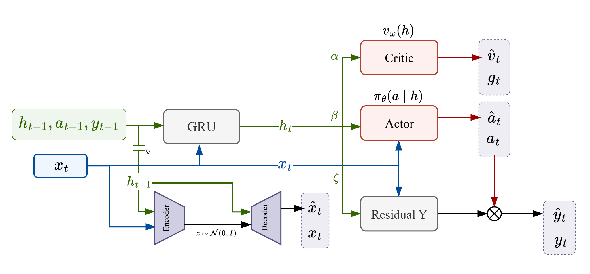
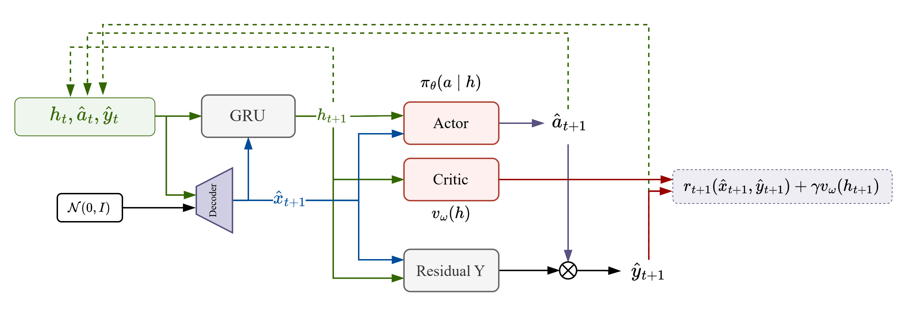

##### 前言

“当年他说: 要引入领域知识”

**反事实优势函数(Counterfactual Advantage Function, CAF)**, 从理论层面给出了如何将因果推断应用于离线强化学习中, 其本质在于CAF的计算

关于CAF的计算, 现在提出两个学说:

> **假设 1** [给定动作的修正]
>
> 其本质为**广义后见之明推理**, 通过先验SCM因果结构以及已知的离线轨迹, 推断出在阶段 t 时的噪声分布, 从而指示了动作 $a_t$ 对于轨迹回报 $G(\tau)$ 的真正影响(Average Treatment Effect, ATE)
>
> 他的推导过程为
>
> - 列出当前动作 $A_t = a_t$ 下的**个体处理效应**
>
> $$
> \begin{aligned}
> ITE_{A \rarr G} &= \mathbb{E}[G \mid do(A_t = a_t)] - \mathbb{E}[G \mid do(A_t = a_0)]\\
> ITE_{A \rarr G} &= \mathbb{E}[G \mid do(A_t = a_t)] - \mathbb{E}[G \mid do(A_t = a_1)] \\
> ...\\
> ITE_{A \rarr G} &= \mathbb{E}[G \mid do(A_t = a_t)] - \mathbb{E}[G \mid do(A_t = a_t)] \\
> ...\\
> ITE_{A \rarr G} &= \mathbb{E}[G \mid do(A_t = a_t)] - \mathbb{E}[G \mid do(A_t = a_n)]
> \end{aligned}
> $$
>
> - 根据策略 $\pi(A|S)$ 加权得到ATE, 得到反事实优势函数
>   $$
>   ATE_{a_t \rarr G(\tau)} = R_{t+1} + \gamma v_\pi(S_{t+1}) - v_\text{CF}(S_t)
>   $$
>
> 这种意图在学习一个基线方法, 从而降低给定动作的评估方差

这是相当优雅的导出, 最根本而言, 这都是**基线学习方法**, 旨在降低估计的方差, 如**单动作估计器**所示

$$
\nabla_\theta \mathbb{E}[G] = \mathbb{E} \left[ \sum_t \gamma^t \nabla_\theta \ln \pi_\theta(A_t \mid S_t) \left( G_t - V(S_t, \Phi_t) \right) \right]
$$

##### 全工作流程

接下来将整理目前的理论, 并阐述如何部署CAF方法

###### 数据搜集

搜集离线数据, 环境执行静态路由算法并产生决策转发数据, 包含以下结果

> 编号部分
>
> - 记录编号:节点编号+经手包编号, 用于追溯查询
> - 经手包编号: 该记录被处理的包的编号, 由毫秒戳+随机HEX随包生成
> - 节点编号: S+数字用于标记具体卫星节点
> - 目标节点编号: G+数字标记包需要到达的地面网关
>
> 用于追溯, 给出记录编号, 在一个节点查询到下一跳, 可以根据下一跳编号+记录编号查询得到决策信息

> 时间部分
>
> - 到达时间: ms, 记录数据包到达时的时间戳
> - 决策时间: ms, 记录决策的时间戳
> - 离开时间: ms, 记录包实际离开时的时间戳
>
> 上述三个时间戳都是配合编号追溯, 以计算包在节点间的时延
>
> - 到达间隔: ms, 包在到达时, 距离上一个包到达经过的时间
> - 服务间隔: ms, 包被路由决策所经历的时间
> - 离开间隔: ms, 包离开时, 距离上一个包离开所经过的时间
> - 滞留间隔: ms, 包从进入队列到离开节点所经过的时间, ≥ 服务间隔 $q t_s + t_s$
>
> 上述间隔用于统计节点在阶段内的随机过程参数(PSP)

> 中心节点状态部分
>
> - 节点经纬度: degree, lon lat
> - 目的节点经纬度: degree, lon lat
>
> 上述目的是希望模型至少做到类似A-star的寻路效果, 根据经纬度进行引导
>
> - 跳数: 包到达队列时, 已经积累的跳数
> - 到达队长: 包到达队列时, 观测到自己的队列长度, 主要服务于其他节点计算反事实转移
> - 决策队长: 包在路由决策($t_s$前夕)观测到自己的队列长度, 意义不大

> 邻居节点状态部分
>
> - 节点编号: S+数字表示邻居是哪一颗卫星
> - 经纬度: degree, lon lat
> - 决策队长: 中心节点决策时, 观测到邻居队列长度, 用于决策分析
> - 链路状态部分
>   - 物理距离: km, 中心节点距离邻居的距离
>   - 物理延迟: ms, 距离除以光速
>   - 信道延迟: ms, 转发该包需要的服务时间
>   - 通断情况: bool, 是否有连接
>
>
> 邻居的流量指标可以在同时隙内计算到达间隔平均, 如果邻居节点没有数据, 则直接使用周围节点数据进行联想迁移

> 转移部分
>
> - 下一跳编号: S+数字, 同卫星编号
> - 下一跳索引: 0123, 表示N, S, W, E卫星, 用于训练模型
> - 状态: DONE, LOST, NEXT
>
> 如果该卫星和目标地面网关直连, 则决策下一跳索引为-1, 下一跳编号为地面网关编号, 状态为DONE
>
> 如果包到达下一跳节点后丢失, 则该状态被修改为LOST, 默认为NEXT
>
> 因此, 状态信号是一种非因果信号, 它相当于对未来进行了记录

搜集好的数据, 根据一个包的产生到结束(生灭过程)作为一个**轨迹**

##### 建模

一切语境都基于「LEO星座路由-负载均衡问题」

在此问题中, 具有如下假设

1. 在每一帧, 全体智能体按照「观测-决策-奖励反馈-转移」时序同步进行, **不存在异步动作**

2. 在每一帧, 一个智能体**只对队列中一个数据包负责**, 将其发送给邻居或地面网关作为下一跳, 因此具有有限四维的动作空间

   不同数据包之间是独立的, 因此**动作之间也是独立的, 动作只由当前观测诱导出**

3. 在每一帧, 全体智能体以及数据包的位置构成状态空间

###### POMDP决策过程

对于全局状态 $S_t^\mathcal{G}$, 智能体只能通过一个无记忆信道进行观测 $X_t \sim \Phi(X \mid S_t^\mathcal{G})$, 得到局部状态信息

该观测信息诱导出动作分布
$$
A_t \sim \pi(A \mid X_t)
$$
全局状态 $S_t^\mathcal{G}$ 下, 做出动作 $A_t$, 智能体将为该动作产生的影响负责, 定义「历经信息」

> 定义 [历经信息]
>
> 历经信息 $Y_{t}$ 表示智能体在当前观测 $X_t$ 所诱导的动作 $A_t$ 下, 所感受到的状态转移信息
>
> 历经可以是一个序列, 例如, 从时步 $t$ 到轨迹终止 $T$ 的全部历经 $Y_{t:T}$

- 历经信息是唯一可以进行反事实推断的信息: 包被转移到下一个智能体所经历的期望值
- 历经信息能够导出奖励信号, 而奖励信号则是轨迹反事实推断的依据

智能体收到的奖励, 假设和当前观测以及历经有关
$$
r_t = r(X_t, Y_t)
$$
在观测 $X_t$ 时, 智能体从轨迹中搜集的奖励为
$$
v_\tau(y_{t:T}) = \mathbb{E}[\sum_{k=t}^T \gamma^{k-t} r(x_k, y_k) ]
$$
这暗含了: 总奖励函数对于历经信息而言是线性的
$$
G(\tau) = G(\sum_{t=0}^TX_t) = \sum_{t=0}^T G(X_t) 
$$
当第一个动作确定时, 得到轨迹动作值函数
$$
q_\tau(y_{t:T}, a_t) = r(x_t, y_t) + \gamma v_\tau(y_{t+1:T})
$$

###### 反事实推断

上节表明了, 值函数本质是在预测时步 $t$ 之后的全部历经信息

考虑动力学系统
$$
\left \{
\begin{aligned}
X_t &= \Phi(S_t) \\
Y_t &= \Psi[S_t, A_t(X_t)] \\
S_{t+1} &= T[S_t, \vec{A}_t]
\end{aligned}
\right.
$$
其具有全局状态变量 $S$, 则

- 观测信息是智能体通过无记忆信道 $\Phi$ 对 $S$ 的获取
- 历经信息是智能体对 $T$ 输入动作 $A$ 得到的输出

因此, 信息集合 $\{(X, A, Y)\}$ 以蕴含动力学系统 $T$ 的全部信息, 定义知识

> 定义 [知识]
>
> 在时步 $t$, 做如下整合
> $$
> H_t = f(H_{t-1}, A_{t-1}, Y_{t-1}, X_{t})
> $$
> 称为当前时步的「知识」, 其能够对后续的转移做出预测

定义值函数
$$
v_\pi(h_t) = \mathbb{E}_{\tau \sim p(\tau \mid h_t)}[\sum_{k=t}^\infty \gamma^{k-t}r_k \mid H=h_t]
$$
表明, 在具有知识 $h_t$ 时,  对后续所可能产生的轨迹进行预测, 得到的轨迹回报的期望值

当第一个动作确定, 这表明, 动作可以由知识诱导, 定义动作值函数
$$
\begin{align*}
q_\pi(h_t, a_t) &=r_t + \mathbb{E}_{\tau \sim p(\tau \mid h_t)}[\sum_{k=t+1}^\infty \gamma^{k-t}r_k \mid H=h_{t+1}] \\
&= r_t + \gamma v_\pi(h_{t+1})
\end{align*}
$$
由于第一步奖励 $r_t = r(x_t, y_t)$, 包含如下两个意思

- 知识可以诱导动作分布
- 知识可以诱导历经分布

因此, 这是反事实推断的基础, 即知识可以作为值函数的锚点, 那么我们将可以访问反事实范围内的节点的值函数

在具有知识 $h_t$ 时, 做出反事实动作 $a_t$后, 可以根据观测信息 $x_t$ 推断反事实历经信息 $\hat{y}_t$

从而形成反事实知识
$$
\hat{h}_{t+1} = f(h_t, \hat{a}_t, \hat{y_t}, \hat{x}_{t+1})
$$
+ 关键在于观测 $x_{t+1}$, 是无法通过已有信息进行反事实推断的, 因为它是独立的

- 考虑在时隙内, 全局状态没有较大变化, 因此利用噪声对观测建模

  记「知识过渡态」
  $$
  \hbar_{t+1} =f(h_t, \hat{a}_t, \hat{y_t})
  $$
  将其和噪声做条件变分, 得到下一跳的观测预期

$$
\hat{x}_{t+1} = \Phi(s_{t+1}) =  g(h_t, \hat{a}_t, \hat{y_t}, u_t) = g(\hbar_{t+1}, u_t)
$$
可以计算下一个节点处的反事实值函数
$$
v_\pi(\hat{h}_{t+1})
$$
利用反事实历经信息, 可以得到每一个反事实动作的奖励函数, 从而得到反事实动作值函数
$$
q_\pi(h_t, \hat{a}_t) = r_{t}(x_{t}, \hat{y}_{t}) + \gamma v_\pi(\hat{h}_{t+1})
$$
全动作估计器为
$$
\nabla_\theta \mathbb{E}[G] =\mathbb{E}[\sum_{t\ge 0} \gamma^t \sum_{a\in \mathcal{A}} \nabla_\theta \pi_\theta(a \mid h_t) q_\pi(h_t, \hat{a}_t)]
$$
这样可以访问每一个动作分布, 我们只对一个噪声进行了建模就是观测 $X_t$

我们以知识为锚点, 认为其诱导出后续所有历经 $Y_{t:T}$, 以及当前动作 $\pi(A \mid H_t)$

###### 模型清单

**模仿学习阶段**

- 知识整合单元: GRU

  输入 $h_{t-1}, a_{t-1}, y_{t-1}$, 以及当前时步的观测 $x_t$, 得到整合输出 $h_t$

  整合输出将需要被执行多个下游任务

- Actor-Critic

  以整合知识 $h_t$作为诱导, 输入当前观测 $x_t \in \mathbb{R}^{B \times 4}$

  利用MLP+softmax架构输出动作的概率分布 $\pi_t  \in \mathbb{R}^{B \times 4}, \sum_{a \in \mathcal{A}} \pi_t(a \mid h_t, x_t) = 1$

  Critic 输出实数以表征后续的奖励之和

- 观测-历经推断单元: Residual

  输入当前观测以及知识整合, 经过残差结构, 利用知识整合和基线预测加性噪声, 并和基线叠加形成输出

- 知识-观测推断单元: VAE

  以整合前知识 $h_{t-1}$ 作为条件, 输入独立正态噪声 $n_t \sim \mathcal{N}(0, I_4)$, 对当前时步的观测信息 $x_t$ 进行编码

**反事实推断阶段**

- 搜集上一时步的反事实经验: 假设做出不同动作 $\hat{a}_t$

  根据 $h_t, \hat{a}_t, \hat{y}_t$ , 采样噪声得到下一跳观测预期 $\hat{x}_{t+1}$

  同时输入GRU得到下一跳诱导经验 $h_{t+1}$

- 根据下一跳诱导经验, 得到AC值

- 根据奖励模型以及AC值, 得到反事实动作的动作值函数查询

  应用全动作估计器, 对当前时步的策略进行优化

