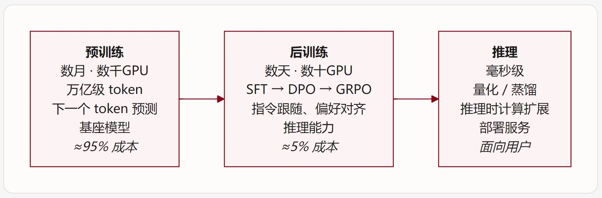

# 后训练与强化学习 (一)

* 大模型训练的流程
* 几种典型模型的训练标准化流程
  * Tülu 3 开源标准
  * Qwen3 技术标准
  * DeepSeek R1 后训练标准


## 大模型的训练流程

大模型作为语言模型, 其训练阶段分为三部分:

### **预训练阶段**

预训练是 LLM 的基础。在这一阶段，模型在**万亿级 token** 的大规模语料上进行下一个 token 预测（next-token prediction），学习语言知识和世界知识。

在这个阶段, 大量的知识被塞入LLM中, LLM学会了从一个给定上下文预测下一个token的能力, 然而, 它并不能很好地按照**人类价值观/具体任务需求/具体格式**等生成回复, **仅能从海量知识的先验分布中生成回答**

* **计算量**：极其巨大，通常需要数千张 GPU 训练数周到数月

* **优化目标:** 最大化下一个token的似&#x7136;**「怎么说话」**&#x20;
  $$
  \mathcal{L}_{\text {pre }}=-\sum_{t=1}^{T} \log P_{\theta} (x_{t} \mid x_{<t} )
  $$

**==马尔可夫决策过程==**

在后训练阶段, 不同于预训练中的最大似然优化, 后训练根据目标的不同, 常赋予模型一定的探索能力. 我们不再给出明确的监督目标, 而是对于其每一步输出赋予一个奖励信号, LLM在后训练中的目标即最大化奖励积累, 被称为强化学习任务

后训练的核心目&#x6807;**「说什么话」**

* **状态:** 当前上下文+提示词: $s_t = \{c_{t-1}, x_t\}$
* **动作:** 选择下一个**token**或是一整句**序列**输出
  根据目标的不同, 被称为「token级训练」和「序列级训练」

但实际上, 如果设选择下一个token的概率为$\pi_\text{token}(a_t| s_t)$, 那么, 一整个序列的概率就等于连续乘积, 即从开始到结束的完整输出序列 $\tau = (a_1, a_2, \dots, a_T)$，我们可以通过条件概率的链式法则来构建：

$$
\pi_\text{seq}(\tau | s_0) = \prod_{t=1}^{T} \pi_\text{token}(a_t | s_t)
$$

* **奖励模型(RM):** $r_\phi(s_t, a_t)$被用于评估一个动作的合理性, 一般由人类偏好数据训练出, 或是由可验证任务反馈
* **转移模型:** 上述的状态和动作构成一个马尔科夫链, 具体而言, 对于一个状态$s_t$, 当模型选择一个动作(以一个序列$y_t$为例), 那么, 生成的序列和$s_t$会构成新的上下文:

$$
s_{t+1} = \{y_t\} \cup \{c_{t-1}, x_t\}
$$

而下一步动作只和$s_{t+1}$有关, 这被称为**马尔科夫的**

**==上下文老虎机==**

最开始的后训练考虑到显存等现实问题, 常采用**一步MDP**范式

* **目标:** 多步MDP具有trajectory(轨迹)的概念, 并在每一步积累奖励, 目标为最大化奖励积累

$$
\arg \max_\pi \mathbb{E}[\sum_{t=0}^\infty \gamma^t r_t(s_t, a_t) \mid S_0]
$$

然而, 单步MDP中, 每执行一个动作所获得的奖励即为全部奖励, 目标为最大化这个奖励

$$
\arg \max_\pi \mathbb{E}[r \mid S_0]
$$

* **上下文:** 在这种单步MDP中进行优化的称为多臂老虎机(MABandit), 其目的是找到一个关于动作的静态分布, 平均而言可以拿到最大的奖励期望

然而, 这样会损失很多信息, 因此我们允许每次拉下老虎机时, 可以观测一个上下文$s_t$ , 这被称为上下文老虎机(CBandit), 其目的是找出一个动态的分布, 在$\mathcal{S} \times \mathcal{A}$的平均上而言拿到最大的奖励期望

因此, 从这个角度而言, LLM后训练过程就是一个老虎机, 目的是**教大模型如何选择该说的话**

**​**

### **推理部署阶段**

模型部署后的优化和扩展阶段：

* **部署优化**：量化（INT8/INT4）、蒸馏、剪枝等方法减少模型体积和推理成本
* **推理时计算扩展**：思维链（Chain-of-Thought）、best-of-N 采样、树搜索等方法在推理时分配更多计算资源




### 后训练的核心方法总结

后训练的方法诸多, 且学术前沿还在不断提出新的后训练方法, 但概括地, 主要是四个目的

1. **==对齐/跟随/SFT==**

SFT 使用高质量的 `(指令, 回复)` 对来训练模型。模型学习的是：给定一个指令，如何生成符合期望的回复。这是后训练的**第一步**，也是其他所有方法的基础。

* 输入：`"用三句话介绍量子计算"`
* 期望输出：`"量子计算利用量子力学原理进行信息处理..."`

2. **==偏好/约束/DPO/RLHF==**

这个阶段的后训练目的是让模型针对任务或人类价值观选择合适的发言

SFT 后的模型可能生成多种回复，但并非所有回复都同样好。偏好对齐通过**人类偏好数据**（"回复 A 优于回复 B"）来教模型区分好坏：

* **RLHF**（Reinforcement Learning from Human Feedback）：训练奖励模型 + PPO 优化
* **DPO**（Direct Preference Optimization）：直接在偏好对上训练，无需奖励模型

3. **==探索/推理/反思/GRPO/PPO==**

**教模型"怎么思考"**——发展逐步推理和自我验证能力。

这是 2024-2025 年最激动人心的进展。通过**可验证奖励**（如数学答案的正确性），模型在纯强化学习中自发涌现出推理能力：

* **GRPO**（Group Relative Policy Optimization）：DeepSeek 提出的高效 RL 算法
* **RLVR**（RL with Verifiable Rewards）：使用确定性奖励函数代替人类标注

4. **==拓展/适配==**

这个阶段根据应用场景扩展模型能力：

* **工具使用**：学会调用 API、函数调用（Function Calling）
* **多模态理解**：视觉-语言对齐（VLM）
* **领域知识注入**：医疗、法律、金融等垂直领域微调


## 几种典型模型的训练标准化流程

### Tülu 3：开源后训练标准

Tülu 3 是由艾伦人工智能研究所（Ai2）开源的后训练（Post-Training）技术方案与模型系列（基于 Llama 3.1 架构，涵盖 8B、70B 与 405B）

它被学术界与工业界誉为“开源后训练的黄金标准”**，原因在于它打破了闭源模型对对齐工艺的黑盒垄断，首次完整、透明地公开了从基础底模（Base Model）演化为顶级对话/推理模型所需的**完整训练配方（Recipe）、全流程数据组合、训练代码、清洗工具以及评估基准。

| **阶段**             | **核心方法与技术**                                                         | **目标与解决的痛点**                                                          |
| ------------------ | ------------------------------------------------------------------- | --------------------------------------------------------------------- |
| **1. 数据工程与去污染**    | 严苛的数据清洗与 Benchmark Decontamination                                  | 解决训练集对评测集的“数据泄漏”，确保评测分数的真实泛化能力。                                       |
| **2. 监督微调 (SFT)**  | 针对核心能力（推理、编码、遵循指令、数学）的精选数据混合                                        | 激活底模的基础指令理解与多轮对话格式输出能力。                                               |
| **3. 偏好调整 (DPO)**  | **On-Policy DPO**（基于模型自身生成的响应构建偏好对）                                 | 缓解分布偏移（Distribution Drift），提升模型在安全性、有用性上的对齐度。                         |
| **4. 强化学习 (RLVR)** | **RLVR**（Reinforcement Learning with Verifiable Rewards，可验证奖励的强化学习） | 放弃容易被“奖励黑客”（Reward Hacking）攻击的神经判别器，改用单元测试、精确答案匹配等确定性验证器，大幅强化代码与数学推理。 |

**==On-Policy DPO==**

[后训练与强化学习 (二)](http://ima.qq.note/note.com)​


**==RLVR vs RLHF==**

RLVR(可验证奖励强化学习)区别于人类反馈强化学习, 不需要训练复杂的奖励函数, 而是通过数学/代码等可以运行/可以获得结果的形式来给出反馈信号

奖励函数 $R(x, y)$ 是离散或规则化的，典型公式为：

$R(x, y) = \begin{cases} 1.0 & \text{if } \text{Verify}(y, y^*) = \text{True} \\ 0.0 & \text{if } \text{Verify}(y, y^*) = \text{False} \\ -\alpha & \text{if Format Broken} \end{cases}$​

在此基础上，通常加入 KL 散度惩罚防止策略漂移：

$R_{\text{total}} = R(x, y) - \beta \cdot D_{\text{KL}}\left(\pi_\theta(y\vert{}x) \,\Vert{}\, \pi_{\text{ref}}(y\vert{}x)\right)$​

```
[Prompt 输入] ──> [LLM Policy 生成 Rollout (包含思维链 + 最终答案)]
                          │
                          ▼
            [确定性验证器 (Rule/Sandbox)]
             ├── 格式提取: 解析 \boxed{} 或 代码块
             ├── 执行验证: pytest / SymPy 符号比对 / 约束检查
             └── 奖励分配: R ∈ {0, 1} - 格式惩罚
                          │
                          ▼
             [策略梯度更新 (PPO / GRPO / REINFORCE)]
```

RLVR 的难点:

1. **信用分配/稀疏奖励问题:** RLVR常常在最后一步进行奖励, 称为**终端奖励模型ORM**, 这种范式使得信用分配问题尤为突出(具体而言, 最后一步错误推导常会否定整个推理过程), 目前学术界正研究更细粒度的**过程奖励模型PRM,** 并使用诸如GAE等分配每一步推理的奖励程度(信用)
2. **长度作弊（Length Hacking）问题:** 模型可能发现“只要把推理写得极长，碰巧猜对的概率更高”，从而无意义地复读废话。
3. **冷启动陷阱（Cold-Start Problem）:** 若模型基础能力太弱，在难题上采样 $K$ 次的通过率全为 0（即全部 $R=0$），梯度将失去方差导致无法学习。
   解决方案：先经过严格的 SFT（监督微调）打底，或在训练中按照难易安排 Curriculum Learning（课程学习）。


### Qwen3 技术标准

千问3的创新在于思考/非思考模式的融合, 其使用了如下几个步骤完成基座模型的后训练

**==阶段 1：长思维链冷启动 SFT（Long-CoT Cold Start）==**

* **核心目的不仅是格式，而是提供“探索先验”**：纯 RL 在面对复杂数学/竞赛级代码时，如果**初始通过率（Pass\@1）接近 0**，GRPO 等算法因采样不到正样本而无法计算优势函数（冷启动失败）。冷启动 SFT 的本质是**为后续的强化学习赋予初始的探索分布**。
* **数据构成关键**：除了强模型蒸馏外，通常会引入严格结构化的反思模式（例如包含 `Wait, let me double check...`、`Alternatively, we could...` 等显式回溯标记），以诱导模型形成分支探索能力。

**==阶段 2：推理 RL（Reasoning Reinforcement Learning）==**

* **奖励函数设计（Reward Engineering）**：
  * **准确率奖励**：通过沙盒与符号计算给出 $0/1$ 奖励。
  * **格式奖励**：若 `<think>` 标签未闭合或输出损坏，施加硬性惩罚。
* **抑制“长度作弊（Length Hacking）”**：模型在单纯追求正确率时容易通过“无意义复读废话”碰巧猜对答案。在此阶段需配合**长度惩罚（Length Penalty）或动态截断策略**，确保推导链的有效信息密度。

**==阶段 3：思考模式融合（Thinking Mode Fusion）==**

* **解决“过思考税（Overthinking Tax）”与“推理退化”**：
  * 若模型回答任何日常闲聊（如“你好”、“翻译一句话”）都强制吐出上千字 `<think>`，会严重破坏交互体验并浪费推理算力。
* **具体实现机制**：
  * **拒绝采样（Rejection Sampling, RS）**：用 Stage 2 的推理模型对海量题库进行多路采样，通过验证器筛选出高分 Long-CoT 轨迹。
  * **数据混合重训**：将筛选出的高质量 Long-CoT 数据（开启思考）与通用聊天/指令数据（关闭思考/标准 Short-CoT）按比例混合，进行第二轮多任务 SFT。
  * **可控门控（Gating/Routing）**：通过 System Prompt（如 `enable_thinking: true/false`）或特殊 Token 显式控制模型是否进入深度思考模式。

**==阶段 4：通用 RL（General Reinforcement Learning）==**

* **多目标奖励聚合（Multi-Reward Aggregation）**：
  * **规则验证器**：针对指令遵循基准（如 IFEval 的字数限制、JSON 格式约束）。
  * **神经偏好模型（Neural RM）**：针对主观体验（对话流畅度、文采、多语言表达）。
  * **安全分类器**：针对拒答策略与合规性。
* **防止“灾难性遗忘（Catastrophic Forgetting）”**：在提升通用安全和主观对齐时，必须保留一定比例的数学/代码任务作为 **Anchor（锚点）**，或引入针对阶段 2 策略的 KL 散度约束，避免通用对齐削弱已获得的深度推理上限。


### DeepSeek R1 后训练标准

| **阶段**                                                 | **核心任务与数据**                                                  | **关键算法 / 机制**                            | **目标与解决问题**                                                                                                     |
| ------------------------------------------------------ | ------------------------------------------------------------ | ---------------------------------------- | --------------------------------------------------------------------------------------------------------------- |
| **阶段 1：冷启动 SFT**_(Cold-Start)_                    | 数千条精选 Long-CoT 数据（少样本提示、强提示合成、人工精修 R1-Zero 输出）               | 标准交叉熵微调（基于 DeepSeek-V3-Base）             | 规范 `<think>...</think>` 结构，解决初始探索时的语言混杂和格式混乱，为 RL 提供高质量探索起点。 |
| **阶段 2：推理 RL**_(Reasoning RL)_                    | 数学、代码、逻辑等具有明确真值的确定性任务                                        | **GRPO** + 规则奖励（准确性） + 语言一致性奖励           | 激发深度思考、自主反思、回溯与自我纠错能力，沉淀出高强度推理检查点（Checkpoint）。                                                                  |
| **阶段 3：拒绝采样与全场景 SFT**_(Rejection Sampling & SFT)_ | **\~600k 推理数据**（Stage 2 模型拒绝采样筛选）+ **\~200k 通用数据**（写作、问答、安全） | 多任务混合 SFT（微调 DeepSeek-V3-Base 2 个 Epoch） | 统一 System 1（直接回答）与 System 2（深度推理），消除简单任务的“过思考”，补齐通用能力。                                                          |
| **阶段 4：全场景偏好 RL**_(All-Scenario RL)_              | 推理任务 + 通用多轮对话 + 安全合规任务                                       | **GRPO** + 规则奖励（推理） + 神经 RM 偏好奖励（通用/安全）  | 兼顾极致推理与人类偏好（有用性与无害性），产出满血版 DeepSeek-R1。                                                                         |

**==核心技术==**

**1. GRPO（Group Relative Policy Optimization）**

DeepSeek 摒弃了传统 PPO 中必须常驻且占用等量显存的价值网络（Critic Model）：

* 对每个 Prompt 采样一组回答 $G = \{y_1, y_2, \dots, y_q\}$。
* 通过组内计算均值 $\mu$ 与标准差 $\sigma$，直接计算各回答的相对优势值（Advantage）：$A_i = \frac{R_i - \mu}{\sigma}$
* 大幅降低训练显存占用（约 40% 以上），使千亿级 MoE 模型能够进行高并发采样与长序列更新。

**2. 复合奖励设计（Multi-Reward Modeling）**

* 推理任务（规则验证）：
  * 准确性奖励（Accuracy）：代码运行通过单元测试、数学公式通过符号系统（如 `SymPy`）精确匹配标答，赋予 $0/1$ 硬奖励。
  * 语言一致性奖励（Language Consistency）：针对 Long-CoT 中出现的英汉夹杂现象，计算推理链中目标语言 Token 的占比作为正则项。
* 通用任务（双粒度评估）：
  * 有用性（Helpfulness）：仅评估最终给出的结论部分，避免奖励模型误判内部复杂的思维链路径。
  * 无害性（Harmlessness）：评估包括思维链和最终结论在内的整段生成轨迹，杜绝在 `<think>` 中暗藏越狱或偏见内容。


