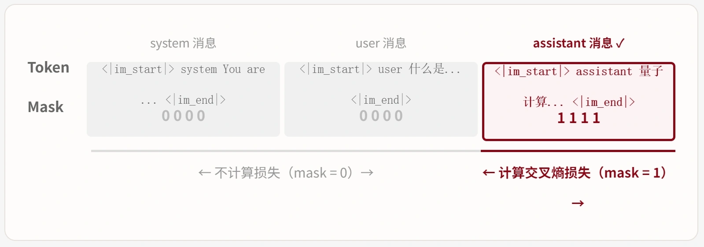
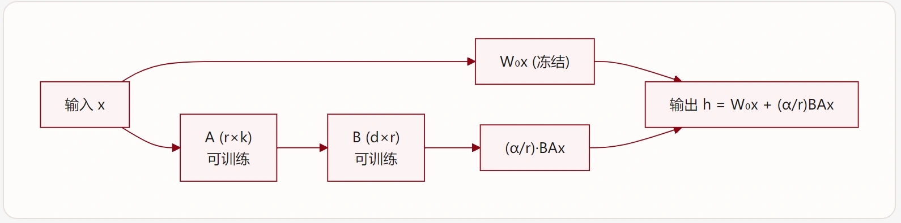

# 后训练与强化学习 (二)

* Supervised Fine-Tuning(SFT)
  * LIMA 表层对齐假说
  * LoRA
* Direct Preference Optimization (DPO)
  * DPO 进阶
* 一些思考

## SFT 监督微调

SFT 的训练目标是**仅在 assistant token 上计算交叉熵损失**

$\mathcal{L}_\text{SFT} = - \sum_{t=1}^T \log P_\theta(x_t \mid x_{<t})$​

但在实际构建训练集时, 第一步是将指令-回复对格式化为模型能理解的输入格式。不同模型家族使用不同的聊天模板

* Qwen3/Llama 使用不同的模版, 一般而言使用 Hugging Face Transformers 提供的 apply\_chat\_template 方法可以自动处理格式转换
* 使用掩码损失（Masked Loss）: 该掩码保证了损失函数仅在LLM生成回答的部分起作用
  Hugging Face TRL 库的 `SFTTrainer` 通过 `DataCollatorForCompletionOnlyLM` 自动实现掩码损失

**==表层对齐假说==**

SFT 的一个关键发现是：精选少量高质量数据往往优于大量低质量数据。

**LIMA（Zhou 等，2023）:**

* 仅使用 **1,000 条**精心挑选的指令-回复对进行 SFT
* 在人类评估中，效果接近甚至超过使用 50,000+ 条数据训练的模型（如当时的 GPT-4 Alpaca）
* 提出了 **"Superficial Alignment Hypothesis"**（表层对齐假说）：模型的知识和能力主要来自预训练，**SFT 的作用仅仅是教会模型使用正确的输出格式和风格**

**==LoRA：低秩适配==**

[LoRA](https://arxiv.org/abs/2106.09685)（Low-Rank Adaptation，Hu 等，2021）基于一个关键假设：**预训练模型在微调时的权重更新具有低秩结构**。

对于预训练权重矩阵 $\mathit{W}_{0} \in \mathbb{\mathit{R}}^{d \times k}$，LoRA 不直接更新 $\mathit{W}_{0}$，而是将权重更新分解为两个低秩矩阵的乘积：

* 实际训练时, 仅有两个矩阵参与训练 A, B
* 前向传播: 冻结原有参数, 仅有低秩矩阵参与运算

$h = W_0x + \Delta Wx = (W_0 + \frac{\alpha}{r}BAx)$​

其中 $𝛼$ 是缩放因子（scaling factor），$\frac{𝛼}{r}$控制了 LoRA 更新的幅度。

LoRA 可以应用于 Transformer 中的不同线性层：

| **层**       | **说明**    | **优先级** |
| ----------- | --------- | ------- |
| `q_proj`    | Query 投影  | 高       |
| `k_proj`    | Key 投影    | 高       |
| `v_proj`    | Value 投影  | 高       |
| `o_proj`    | Output 投影 | 高       |
| `gate_proj` | FFN 门控层   | 中       |
| `up_proj`   | FFN 上投影   | 中       |
| `down_proj` | FFN 下投影   | 中       |

**推荐**：应用到**所有线性层**（all linear layers），即同时覆盖注意力层和 FFN 层。Qwen3 的实验表明，覆盖所有线性层的效果最好。

## DPO 直接偏好优化

DPO提供了一种训练范式, 在以往的RL后训练过程中, 奖励函数RM是相当关键的

但是, 奖励函数有诸多问题:

* **显存占用:** 首先, RM本身是一个神经网络, 需要占用显存, 另外, 奖励函数一般和PPO搭配, 需要四个模型(Actor, Critic, RM, RefActor), 这对显存是灾难性的
* **模式坍缩:** RM一般是对人类偏好的拟合, 然而, 这会触发Goodhart 定律, 即利用这种统计规律作为训练指标本身会导致策略崩溃. 奖励黑客是一种现象, 典型表现是回复变得冗长、堆砌排版、绕圈子不直接给结论
* **泛化不足:** RM本身是一种反事实, 在分布外（OOD）场景下泛化能力有限. 一旦智能体探索出新策略或遇到训练分布外的状态，奖励信号的准确性会显著下降
* **颗粒度问题:** 良好的奖励函数需要细粒度的人类偏好数据, 这对于工程而言是相当昂贵的, 我们最希望的是人类可以仅通过「点赞/点踩」的形式来提供信号

DPO首先提供了一步MDP的闭式解. 多臂老虎机/上下文老虎机理论认为, 一步MDP是具有闭式解的:

$\pi^*(y|x) = \frac{1}{Z(x)}\pi_\text{ref}(y|x)\exp(\frac{r(x,y)}{\beta})$​

* 其中, $Z(x)$用于归一化概率, 表示$\int_y \pi_\text{ref}(y|x)\exp(\frac{r(x,y)}{\beta})$, 这要遍历所有回答

它表明, 一步MDP的奖励和策略本身是可以相互对应的

$r_\phi(y|x) = \beta \log \frac{\pi_\phi}{\pi_\text{ref}}+\beta \log Z(x)  \Leftrightarrow \pi_\phi(y|x)$&#x20;

**==Bradley–Terry 模型==**

DPO引入了一个关键假设: 其认为, **一个样本**$y_1$**比另一个样本**$y_2$**好的概率, 和其成绩之差**$r_1-r_2$**有关系**

$P(y_1 > y_2) = \sigma (r_1-r_2)$​

它是对人类偏好数据生成过程的概率建模假设

将上面推导出的一步MDP隐式奖励带入, 得到:

$P(y_1 > y_2) = \sigma (\beta \log \frac{\pi_\phi(y_1|x)}{\pi_\text{ref}(y_1|x)}-\beta \log \frac{\pi_\phi(y_2|x)}{\pi_\text{ref}(y_2|x)})$​

* 这将**一步强化学习任务**转换为了**监督学习任务**, 进一步地, 这是一个**二分类任务**
* 人类反馈只需要为样本$y$标注标签$0/1$(点踩/点赞), 即可进行训练
* 它是一个**离线强化学习**, 具有较高的数据利用率

**==对比学习==**

相比于强化学习常常将奖励/奖励积累最大化的范式, DPO是一种对比学习

* 它最大化了$r_1-r_2$, 即点赞/点踩的反馈之差, 而不是奖励本身, 通过$\sigma$约束优化
* 底层仍然是一个自回归语言模型, 通过自注意力完成token级的信用分配

### DPO的理论缺陷

作为一种离线强化学习, 它具有Offline-RL的全部潜在缺陷

1. **==BT 假设不一定总成立/混淆因素/辛普森悖论==**

人类的点赞/点踩作为最终偏好, 然而, 它会受到多种因素影响

> * 序列性质: 语气、长度、格式规范、用词用语
> * 内容性质: 是否合理、是否有错/乱码、是否合乎价值观
> * 标注员性质: 标注员是否具有理性判断其对错、标注员的心情、标注员个人的喜好
> * 不可观测噪声: 当天的天气、数据部门的氛围、有没有点错

这些因素作为后门混淆因子, 直接作用于最终结果「点赞/点踩」, 如果 chosen 和 rejected 差别不明确，或者 chosen 本身质量很差，DPO 会忠实地学习错误偏好

2. **==DPO具有严重的分布偏移问题/OOD问题==**

DPO在已有的$(x,\hat{y}, y_\text{ref})$数据集上进行训练, 然而, 真实部署的是$\pi_\theta$, 它经过训练, **数据生成分布已经偏移数据集**

**Prompt分布偏移**

如果用户实际问的问题和训练数据差异很大，DPO 学到的偏好可能无法泛化

例如, 数据集中大量提问的点赞回答引导LLM回复 _"遇到商品咨询时，引导用户留下联系方式。"_

* 提问道"帮我解释一下高速高频 PCB 的工艺难点。", 极有可能回复: "帮我解释一下高速高频 PCB 的工艺难点。"

**Response 分布偏移**

DPO只进行局部 pair 约束, 这是一种偏序排列, 并不具备全序性质, 即: **偏好可能不满足传递性**

那么, 当遇到分布外的生成回复, LLM不知道是否该输出, 导致原本质量较高的回复被抛弃/概率性接受

随着训练进行，$\pi_{\theta}$会越来越偏离参考模型。

但是训练数据中的 rejected/chosen 很多可能来自原始模型、SFT 模型、人工模板或另一个模型，而不是来自当前 $\pi_{\theta}$**。**

**策略导向分布偏移**

DPO的一个关键假设为: $\forall y \in Y, \pi_\text{ref}(y|x) > 0$​

然而, 实际上的LLM生成的样本不一定在$\pi_\text{ref}$的支撑集中, 这导致分布偏移, 监督信号减弱或高方差

3. **==奖励黑客和模式坍缩==**

数据中的捷径特征会被放大: 如果 chosen 总是更长、更礼貌、更模板化，rejected 总是更短、更直接，DPO 可能学到捷径：

* 越长越好；
* 多说客套话越好；
* 总是加“您好”；
* 总是索要联系方式；
* 总是避免明确回答；
* 拒绝直接说“不知道”。

这会导致模型生成空洞、啰嗦、模板化的回答, 参考上述混淆因子问题

如果 chosen 分布高度相似，模型会学出模板化策略。模型会更倾向于少数高频安全模板，而不是产生多样化、上下文相关的回答

## 一种多目标帕累托DPO的构想

