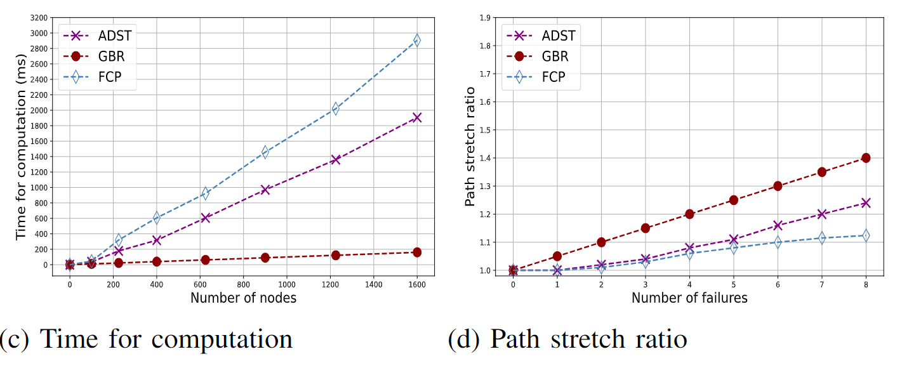
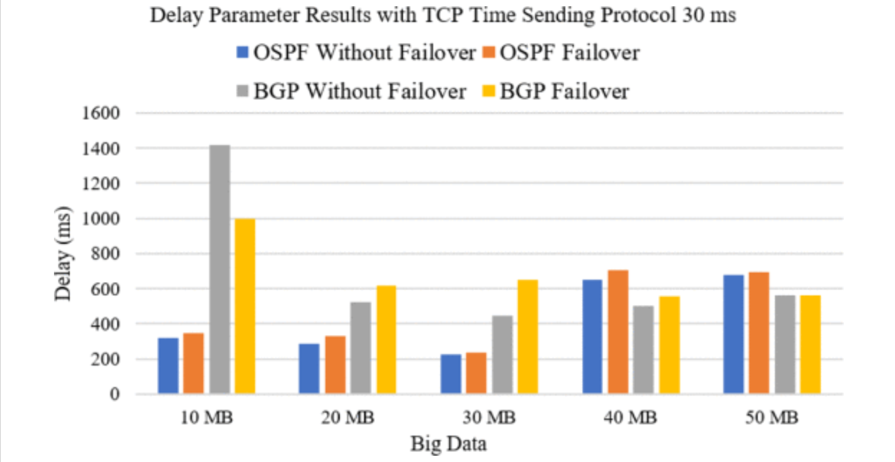
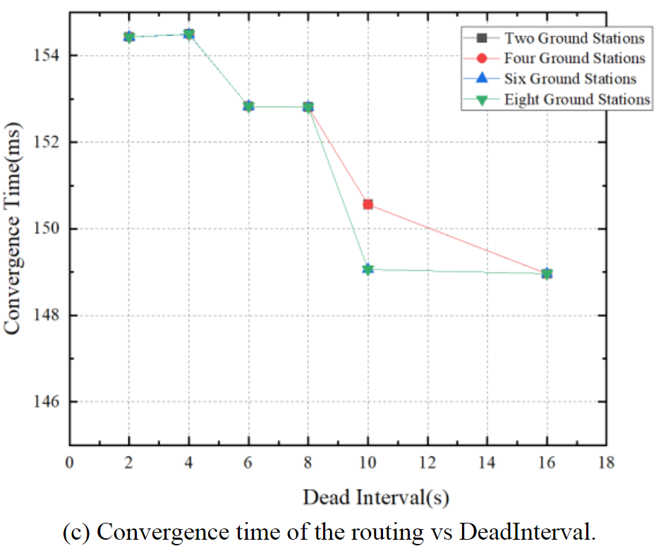
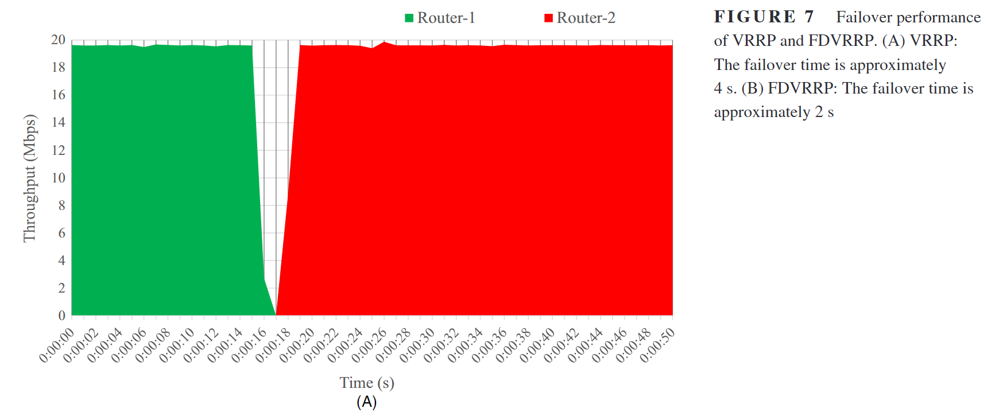
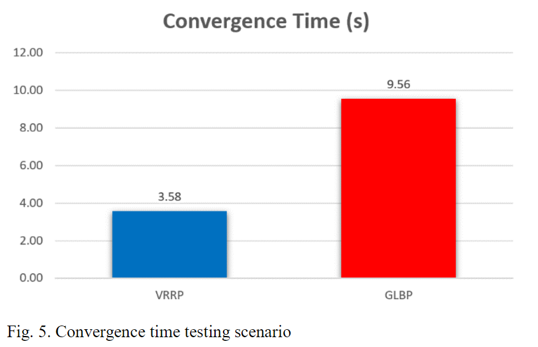

# 卫星链路切换/恢复时延

##### 概览

###  卫星链路切换/恢复时延对比报告

以下是基于不同文献中提到的卫星链路切换/恢复时延的详细对比表格：

| **文献来源**                 | **方法/协议**         | **恢复/切换时间** | **性能指标**                     | **备注**                              |
| ---------------------------- | --------------------- | ----------------- | -------------------------------- | ------------------------------------- |
| Chen et al.                  | 未优化的GCC算法       | ~3200ms           | 中断率6.48%，吞吐量降至257 kb/s  | 卫星通信切换场景                      |
| Chen et al.                  | 优化后的GCC算法       | ~1800ms           | 中断率2.13%，吞吐量降至2017 kb/s | 显著改善恢复时间和性能                |
| Zhang et al.                 | GBR (网格旁路路由)    | ≤200ms            | 拉伸比优于ADST和Plinko/FCP       | 支持多链路故障恢复（8个故障同时发生） |
| Ridwan et al. / Surya et al. | VRRP + EIGRP          | <150ms            | 延迟符合ITU-T G.114标准          | 优于HSRP和GLBP                        |
| Lu et al.                    | 快速路由响应算法      | ~150ms            | 路由开销低，收敛时间稳定         | 不受终端数量和HELLO消息间隔影响       |
| Lee et al.                   | 传统VRRP              | ~4000ms           | 带宽20 Mbps                      | 故障切换时间较长                      |
| Lee et al.                   | FDVRRP (快速检测VRRP) | ~2000ms           | 带宽20 Mbps                      | 切换时间缩短50%                       |
| Wibowo et al.                | VRRP (DMVPN网络)      | 3.58s             | 收敛速度快                       | 星型拓扑，双中心冗余                  |
| Wibowo et al.                | GLBP (DMVPN网络)      | 9.56s             | 收敛速度慢                       | 星型拓扑，双中心冗余                  |

###### 结论：

1. **优化算法显著提升性能**：优化后的GCC算法和GBR算法能大幅降低恢复时间（从3200ms降至1800ms或200ms）。
2. **协议选择影响时延**：VRRP结合EIGRP或快速路由算法可实现150ms以下的低延迟，优于传统VRRP（4000ms）或GLBP（9.56s）。
3. **多链路故障恢复能力**：GBR算法在极端情况下（8个故障）仍能保持高效，拉伸比仅增加0.17~0.28。
4. **网络拓扑与场景适配**：DMVPN网络中VRRP的收敛速度（3.58s）优于GLBP（9.56s），但卫星网络更需专用算法（如GBR或优化GCC）。

###### 应用场景：

- **高实时性需求**：优先选择GBR（≤200ms）或快速路由响应算法（150ms）。
- **冗余与负载均衡**：VRRP + EIGRP（<150ms）适合地面网络，FDVRRP（2000ms）可替代传统VRRP。
- **卫星网络多故障恢复**：GBR算法是当前最优解。

##### 具体内容

> [1] Chen H, Yu H, Zhang H, et al. Low Earth orbit satellite switching and recovery method based on generic congestion control algorithm[J]. Scientific Reports, 2025, 15(1): 25341.

- 未优化的 GCC 算法的恢复时间约为 3200ms。
- 优化后的 GCC 算法在约 1800ms 后显示出恢复时间和性能的显著改善
- 当卫星通信发生切换时，最高的通信中断率达到 6.48%，网络吞吐量从约 3000 kb/s 降至最低 257 kb/s
- 最高的通信中断率仅为 2.13%，最低的网络吞吐量仅降至 2017 kb/s

> [2] Zhang Z, Zhao K, Li W, et al. Fast Recovery from Multiple Link Failures in LEO Satellite Networks[C]//2023 IEEE 34th Annual International Symposium on Personal, Indoor and Mobile Radio Communications (PIMRC). IEEE, 2023: 1-6.

- 针对无线信道中断、卫星高速移动和通信距离长等原因导致的星间链路 ( **ISL** , Inter-Satellite Links) 频繁中断问题，提出了一种基于 **IPFRR** (IP Fast Reroute) 的多链路故障恢复机制，称为网格旁路路由 (GBR)。
- GBR算法由于其局部性模式，性能更好，可以在不超过200毫秒的时间内为1600个节点提供备份路由
- 即使在八个故障同时发生时，GBR的拉伸比也仅比ADST高0.17，比Plinko/FCP高0.28

> [3] Ridwan A, Syahputra R, Pramawahyudi P. Performance analysis of first hop redundancy protocols on computer networks based in star topology[J]. Fountain of Informatics Journal, 2023, 8(2): 41-51.
>
> [4] Surya C, Laksana P, Cornelius Y, et al. VRRP Failover Effects on OSPF and BGP Performance in VyOS Environments[C]//2025 IEEE 15th Symposium on Computer Applications & Industrial Electronics (ISCAIE). IEEE, 2025: 60-65.

- 研究分析了三种 FHRP 协议的实验结果:
  - **热备份路由协议** (HSRP, Hot Standby Router Protocol).
  - **虚拟路由冗余协议** (VRRP, Virtual Router Redundancy Protocol).
  - **网关负载平衡协议** (GLBP, Gateway Load Balancing Protocol).
- 实验结果表明, VRRP 结合 EIGRP 路由在输出参数方面优于其他方法:
  - **FHRP** 在结合 **EIGRP** (Enhanced Interior Gateway Routing Protocol, 增强内部网关路由协议)时，相比 **OSPF** (Open Shortest Path First, 开放最短路径优先)具有更小的延迟
  - 当主路由器R3断开连接，网络功能由R2接管时，所有方法的延迟都会增加, 平均延迟均低于150ms，符合ITU-T G.114标准。

> [5] Lu Z, Zhi R, Ma W. Quick routing response to link failure in low-earth orbit satellite networks[C]//2022 IEEE 8th International Conference on Computer and Communications (ICCC). IEEE, 2022: 690-695.

- 该算法同时提供最短路由路径和备用路径。当一个卫星检测到链路故障时，会向其邻居发送通知包，以调整到备用路由路径。通知包也会被发送到头节点，以重新计算路由表
- 随着HELLO消息发送间隔的增加， **路由开销** 迅速降低，然后减缓并趋于稳定, **路由收敛时间** 基本不受终端数量和HELLO消息发送间隔的影响，稳定在约150ms。

> [6] Lee C, Kim S, Ryu H. FDVRRP: Router implementation for fast detection and high availability in network failure cases[J]. ETRI Journal, 2019, 41(4): 473-482.

- 提出了一种快速检测 **虚拟路由器冗余协议** (VRRP, Virtual Router Redundancy Protocol) 的路由器实现方案, 旨在提高网络故障情况下的可用性和快速检测能力
- 断开前所有流量通过Router-1，总带宽约为20 Mbps。断开后，流量被阻塞，直到Router-2接管成为主路由器。
  - 虚拟路由冗余协议(VRRP)配置下的故障切换时间约为4秒
  - 快速虚拟路由冗余协议(FDVRRP)配置下的故障切换时间约为2秒

> [7] Wibowo F N, Yulianto F A, Nuha H H. Performance Comparison Analysis of Virtual Router Redundancy Protocol (VRRP) with Gateway Load Balancing Protocol (GLBP) on a DMVPN Network[C]//2023 11th International Conference on Information and Communication Technology (ICoICT). IEEE, 2023: 499-504.

- 测试在星型拓扑结构的 **DMVPN** 网络中使用 **VRRP** 和 **GLBP** 两种 **FHRP** 协议，采用双中心 (Dual HUB) 变体来测试网络冗余
- 虚拟路由冗余协议(VRRP, Virtual Router Redundancy Protocol)和网关负载均衡协议(GLBP, Gateway Load Balancing Protocol)的收敛时间对比结果表明，VRRP的配置收敛速度更快，为3.58秒，而GLBP的配置收敛速度为9.56秒。

