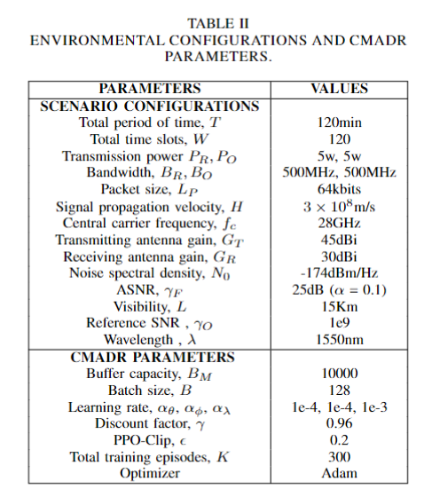

# LEO星座仿真开发

##### 卫星参数设置

###### 场景配置参数

用于控制仿真场景的一些物理参数

- 总仿真时间 $T=120 \text{min}$
- 总时隙数量 $W = 120$, 单时隙长度 $T_W = 1 \text{min}$
- 传输发射和接收功率 $P_R, P_O = 5 \text{w}$ 
- 传输发射和接收带宽 $B_R, B_O = 500\text{MHz}$
- 数据包大小 $L_P=64\text{kb}$
- 光速(真空传输速度) $c = 3 \times 10^8 \text{m/s}$
- 载波频率 $f_c = 28\text{GHz}$
- 发射天线增益 $G_T=45\text{dBi}$
- 接收天线增益 $G_R = 30\text{dBi}$
- 噪声谱密度 $N_0 = -174\text{dBm/Hz}$
- 平均信噪比, ASNR $\gamma_F = 25\text{dB},~~ \alpha = 0.1$
- 可视距离 $L = 15\text{km}$
- 参考信噪比 $\gamma_R = 1e9$
- 信号波长 $\lambda = 1550 \text{nm}$

##### 仿真流程设置

