# README

##### 前言

本文档主要用于介绍实习期间所完成工作“基于深度学习的屏幕渲染异常检测”的相关`部署`, `训练`, `推理`等内容, 以期后续该项目能够得到更好的发展. 

PPT中已经包含理解本项目所需要的理论知识和相关架构内容, 本文档主要用于解释项目的代码结构以及部署调试的问题

###### 运行平台

- 操作系统: Windows 10/11  Linux  等可以运行python的环境
- 编程语言: Python ≥ 3.10
- 硬件要求: 为适应工程需要, 根据环境是否具备英伟达显卡, 可适当添加cuda选项


##### 一. 部署

###### 环境部署

需要安装python以运行该项目

- 请在官方网站 https://www.python.org/downloads/ 下载最新版本python或至少具备 Python ≥ 3.10
- 安装完成后, 于 cmd 运行`python` 后观察是否弹出对应版本的python终端界面

- 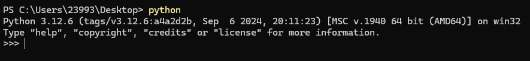

- 另外, pip包管理器一般是随python进行安装, 需要检查pip是否完成安装
  - 在cmd运行 `pip --version` 检查是否弹出pip版本, 及其是否匹配python版本, 如弹出则完成安装
  - 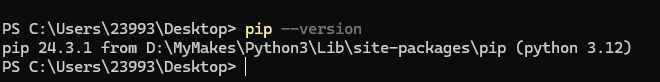


###### 仓库克隆以及相关包安装

请克隆本项目仓库于本地

- 请在Gitee中克隆develop分支: https://gitee.com/g00db0y2025/ScreenAnomalyDetection/tree/develop/


克隆后, 在本地路径`ScreenAnomalyDetection`中, 执行以下操作以安装库:

- 在本地路径中, 打开cmd, 确保cmd在当前目录

+ 执行 `pip install pipenv` 以安装pip虚拟环境管理器

- 安装完成后, 执行 `pipenv shell`, 只要没有报错, 就成功进入了pipenv环境

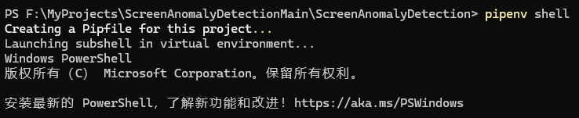

- 在pipenv环境中, 执行`pip install -r requirements.txt` 会自动安装项目所需库

- 需要注意, 在后续执行项目python代码或是vscode中调试, 都需要选择该虚拟环境 (即先执行`pipenv shell`或是在vscode中会有提示)


###### 运行项目

上述操作完成后, 请于pipenv虚拟环境中直接运行 `DefeatMain.py` 看是否跑通

- `DefeatMain.py`并没有在GPU上运行, 因此理论上可以直接跑通
- 如遇到问题, 请优先检修环境相关


##### 元任务模型训练和测试

###### 数据集制作

`\ScreenAnomalyDetection\dataset\dataset_generator.py`中的`SplitDataset`类和`MixtureSplitDataset`类是负责生成数据集的功能类, 使用方法如下:


###### 单类样本制作 - SplitDataset

`SplitDataset`类负责使用**一种缺陷样例**和**正常屏幕图像**相互融合以得到切片数据集

首先准备正常屏幕图像, 由于后续缺陷样例图样的尺寸和屏幕要保持一致, 为了避免不必要的麻烦, 请保证正常屏幕图像尺寸都一致, 您可以从自己手机屏幕上截屏, 将正常屏幕图像以`.jpg`格式存于`\ScreenAnomalyDetection\screen_images`

其次准备缺陷样例, 需要会一定的图像编辑技术如Photoshop

- 根据工程需要绘制缺陷样例, 将**可能出现的形态**绘制在一张**和正常屏幕同尺寸的白色画布**上, 如下图所示

- <div style="display: flex; 
              justify-content: space-around; /* 均匀分布图片 */
              align-items: center; 
              width: 100%; /* 占据整个可用宽度 */
              max-width: 1200px; /* 可选：设置最大宽度限制 */
              margin: 0 auto;">
      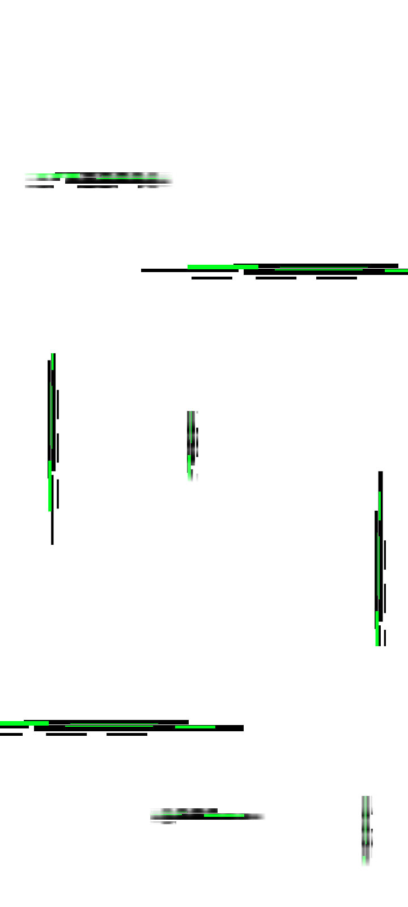
      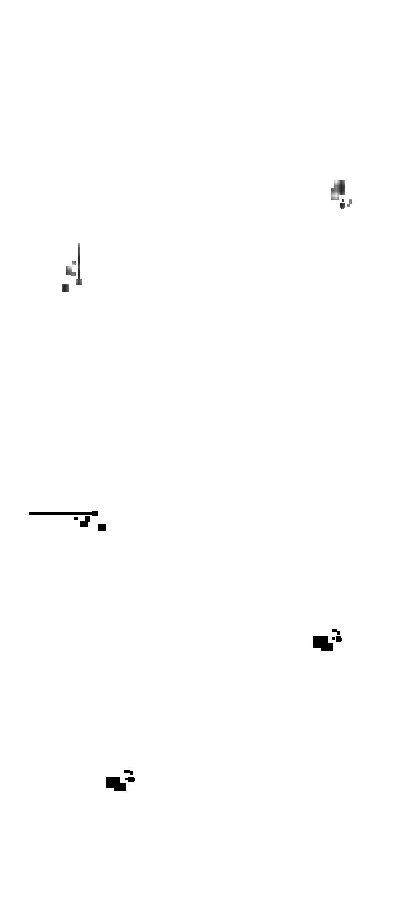
      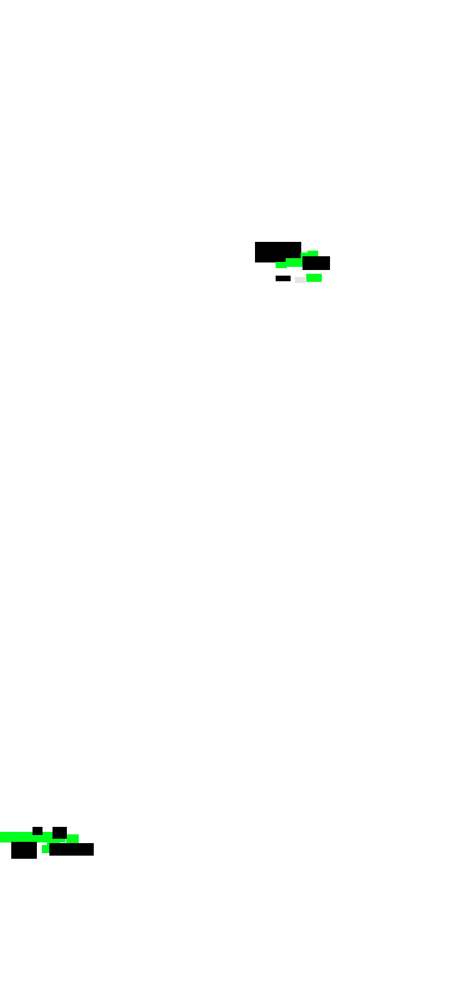
  </div>

- 假设这三张都是同一类缺陷图样, 将其放入一个文件夹中以供后续使用
- 这样设计的初衷是: 提升样本制作效率, 实际切片时, 程序层会再进行一次随机旋转位移变换, 以产生更多信息的样本
- 必须为`白色背景`, 程序会自动生成指示缺损位置的`掩码`

生成样本, python中进行

```python
from dataset.dataset_generator import SplitDataset
# 初始化数据集对象
dataset_manager = SplitDataset(
    r".\screen_images",
    r".\defeat_items1"
)
tails = dataset_manager.create_split(256, 128, 30)  #生成数据集
mask_tensor, norm_tensor, defeat_tensor, label_tensor = SplitDataset.create_tensor(tails, device='cpu')  #生成张量
```

- 第1行为导入该模组
- 第3-6行产生一个数据集对象, 第一个参数为`正常屏幕图像集合`路径, 第二个参数为`黑花闪样例集合路径`
- 第7行产生一组切片, 三个参数为: `切片大小`$W_0$, `输出大小`$W$, `批量大小`$B$, 即上述代码按照256x256切片后缩放至128x128输出
- 第8行生成张量, 张量是可用于pytorch框架的一种数据结构, 记`B`为批量大小
  - mask_tensor: 监督信号掩码张量 $B \times 1 \times W \times W$,  其中 1 表示通道数, **pytorch框架将通道数置于尺寸之前, 需要特别注意**
  - norm_tensor: 正常图像的切片 $B \times 3 \times W \times W$  其中 3 表示通道数, 下述同理
  - defeat_tensor: 和缺损合成后的屏幕切片  $B \times 3 \times W \times W$  
  - label_tensor: 是否有缺损的标签   $B \times 1$  
  - 注意, 程序会保证一个批量中阳性样本和阴性样本的比例是1:1, 因此存在填入批量B为奇数, 返回数目为偶数的情况

- 根据硬件环境, 可按需设置`device='cuda'`, 若如此, 后续所有模型和全部张量数据结构都需要放置在cuda上 


###### Meta-Tasking Model 训练

`net_unet_workbench.ipynb` 提供了训练一个Meta-Tasking Model 的标准化流程

- 第一格为导入相关的库
- 第二格, 利用如上介绍的数据集生成方法, 创建了一个数据集对象, 并产生一组数据以测试比例, 定义了一些训练参数
- 第三格, 训练`UNet模型`, 在每一轮训练过程的都会调用`dataset_manager.create_split()`以产生批量样本
  - 训练好的参数储存在`./parameters/DefeatModel_best_{train_ts1}.pth`中, 注意, `train_ts1`是一个时间戳, 由于ipynb格子会暂时记忆变量, `train_ts1`用于下格联合训练`GateNet`时读取参数
- 第四格, 训练`GateNet模型`, 首先会创建`UNet`并加载参数, 用到了上格的`train_ts1`, 也可以自行手填入参数路径
  - 训练好的参数储存在`./parameters/Gate_best_{train_ts2}.pth`中, 其中`train_ts2`同理, 用于下格测试
- 第五格, 程序加载两个模型参数, 自动化生成批量进行测试, 并输出混淆矩阵和准确度
- 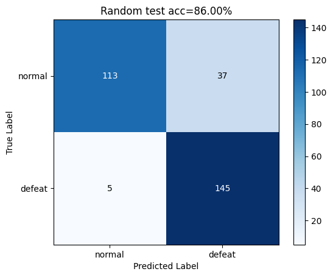

以上, 您训练好了一组 Meta-Tasking Model, 它们以两个`.pth`文件形式存在, 将训练的较好的一组参数重命名以便后续加载

```python
unet = UnetDefeat().cuda()
unet.load_state_dict(torch.load(f"./parameters/DefeatModel_best_4.pth", map_location=device))
gate_net = Gate().cuda()
gate_net.load_state_dict(torch.load(f"./parameters/Gate_best_4.pth", map_location=device))
```

- 这便是在加载一个针对 缺陷4 的 Meta-Tasking Model

```python
y_hat, f_hat = unet(1.0-defeat_tensor)
p_hat, _ = gate_net(f_hat)
```

- 这便是在使用一个 Meta-Tasking Model 进行推理
- 推理接受一个 $B \times 3 \times W \times W$ 的张量组, 根据实际任务 $B$ 可以为任意正整数
- 您需要对张量尺寸非常敏感, 输出 y_hat 为 $B \times 1 \times W \times W$, 语义投射 f_hat 为 $B \times 512 \times 8 \times 8$ , 逻辑投射 p_hat 为 $B \times 1$
- 没有指明的尺寸, 如 $W$ 可以根据实际需要调整, 但是必须保证训练推理一致, 除非模型具有**空间无关性**
- 推理的联合工作流于ppt中已经说明, 主要是利用unet的语义f_hat输出再交付gate_net进行逻辑输出, y_hat是掩码指示输出
- 注意, **由于多数黑花闪是黑色主体的**, 在训练时使用了`1.0-defeat_tensor`**反相**以突出黑花闪, 也可以不需要这一步


###### 在 DefeatMain.py 中使用 Meta-Tasking Model 进行整屏幕识别

在`DefeatMain.py`中, 定义了输入整个屏幕进行识别的工作流程

使用如下方法利用训练好的Meta-Tasking Model进行识别

```python
if __name__ == '__main__':
    detector = DefeatDetect()
    detector.detect_meta(
        r".\mixtures\mixture4.png"
        ,class_index=1
    )
```

- 上述, 首先创建了一个`detector`对象, 随后利用`detect_meta()`成员方法进行模型推理
- 第一个参数填写被检测屏幕图像, 第二个参数填写缺陷类型(1,2,3,4), 也可以填写自行训练好参数的**时间戳** (如 `Gate_best_1755227648275`中的`1755227648275`) 

- 执行代码, 将看到输出内容以及输出图像

  ```
  Screen tiles generated: torch.Size([21, 3, 128, 128])
  Detect(META Mode) finished in: 334.436 ms
  Tiles Creating: 16.428 ms
  Model Reasoning:318.008 ms
  ```

  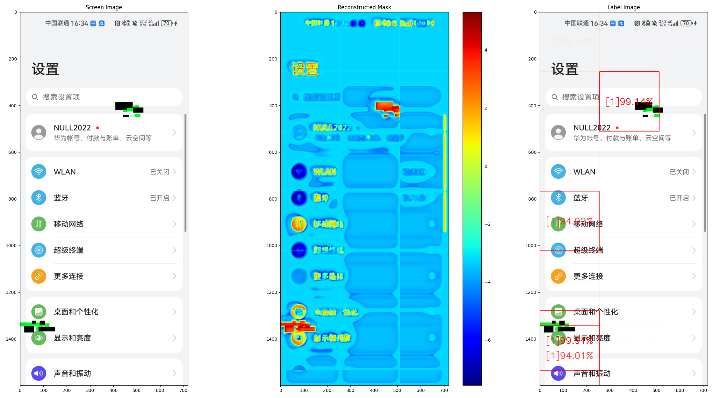

- 可以看到, Meta-Tasking Model 推理耗时达到了**318ms**, 并不适合工程应用, 这也是下一张进行**知识蒸馏**的主要动机
- 图中给出第一张为输入的屏幕图像, 第二张为输出掩码概率分布, 第三张为缺陷目标框选, 可以看到模型产生了一个误判


##### 知识蒸馏以加速推理

###### ResNet50 知识蒸馏训练

知识蒸馏是一种训练技术, 和上述将样本直接投喂模型不同, 知识蒸馏利用置信度较高但规模庞大的模型的输出结果, 直接投喂给另一个轻量化且推理速度较快的模型以学习, 即直接让学生模型学习教师模型的投射思维, 以达到快速训练和压缩模型的目的

辛顿于2015年提出了这个想法, 实验证实知识蒸馏除了可以提高速度, 还能提供一定的泛化能力

`net_distill_workbench.ipynb`中提供了利用知识蒸馏训练`ResNet50`的标准流程, `ResNet50`是一种利用残差连接提升网络深度和推理速度的优秀模型

- 第一格: 导入相关库, 新增`from model.ResNet import Bottleneck, ResNet, ResNet50`

- 第二格: 和先前介绍的元模型训练没有区别, 只是在这里加入了`target_class`变量以指明后续对哪一个元模型进行蒸馏

- 第三格: 加载元模型参数, 创建`model = ResNet50(2).to(device)`, 参数“2”表示输出分类为2分类one-hot编码

  - 解释: 一般来说只需要一位输出即可进行二分类任务, 然而知识蒸馏的`温度理论`要求我们需要输出独热编码, 即每一位需要指示每一类的概率, 所有位概率之和为1, 因此二分类需要两位
  - 训练循环中, 可以发现`SplitDataset.create_tensor(tails, onehot=True, device=device)`加入了`onehot=True`, 该参数将label输出改为独热编码, 即: `0 = [1,0]`, `1=[0,1]`
  - 训练参数: `alpha`表示接受教师模型的知识比例, `temperature`表示接受教师模型的软化程度
  - 蒸馏好的参数储存在`./parameters/ResNet_best_{train_ts1}.pth`

- 第四格, 自动化测试流程

  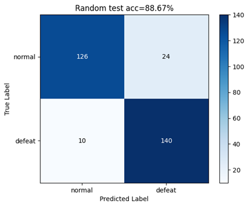

  - 知识蒸馏可以取得相当好的准确度, 不亚于元模型, 然而如果直接训练ResNet50, 并不会取得这么好的结果, 在后续强化学习监督微调中您会再次见识到这一个现象


###### ResNet50 用于整屏幕识别

`DefeatMain.py`提供了利用蒸馏好的模型进行整屏幕快速识别的标准流程

使用如下方法利用训练好的 ResNet50 进行识别

```python
if __name__ == '__main__':
    detector = DefeatDetect()

    detector.detect_fast(
        r".\mixtures\mixture4.png",
        tile_size=64,
        class_index=1
    )
```

- 和前章类似, `detect_fast`是成员方法,
- 多了一个参数`tile_size`是控制输入张量的尺寸, 由于ResNet50的**空间无关性**, 可通过缩小输入尺寸以提高推理速度, 这和训练时用的尺寸**可以不一样**, 此处使用 $B \times 3 \times 64 \times 64$ 尺寸进行推理
- `class_index`仍然可以填写时间戳

执行代码, 得到如下结果

```
Detect(FAST Mode) finished in: 120.529 ms
Tiles Creating: 49.990 ms
Model Reasoning:70.539 ms
```

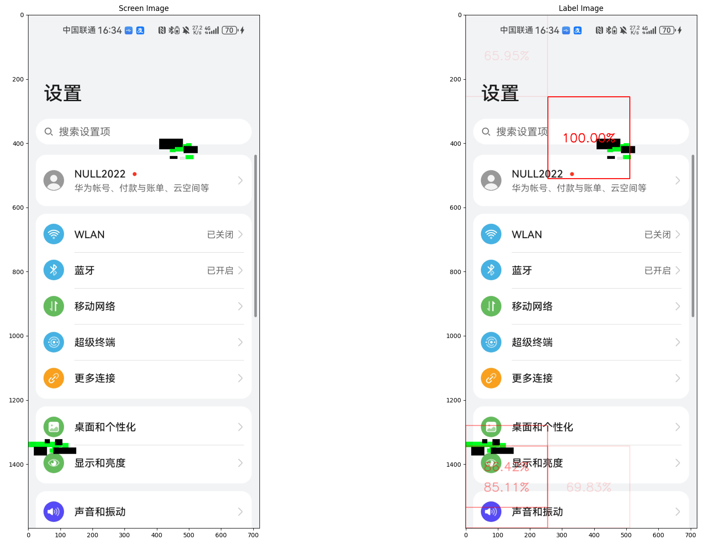

- 可以看到, 单张推理时间已经减少到了 `70.5ms`, 和元模型相比提升`77.8%`

- 可以看到, 模型准确地框出了图中的缺陷, 识别能力不亚于元模型
- 为了**提高速度**, 利用`detect_fast`进行整屏识别将**不再输出掩码指示**


##### 路由网络的训练, 监督微调和使用

###### 路由网络的训练

这是个实验功能, 换言之其效果并不是很好, 动机是为了一种更加自动化的流程, 希望对整屏进行多种黑花闪的同时识别

然而, 根据工程需求, 似乎不需要识别多种黑花闪, 因此该部分仅简述设计思想

`net_classify_workbench.ipynb`中定义了多分类网络的训练步骤

- 它的训练过程和上述别无二致
- 需要注意, 数据集生成选择了 `dataset_manager = MixtureSplitDataset()` 这是唯一的区别
- 生成数据切片: `MixtureSplitDataset.create_tensor_oneHot(states, device=device)` 产生切片的独热编码标签
- 程序会保证四类缺陷加正常样本一共五类具有相同的比例
- 训练好的模型参数储存于`./parameters/Classify_best_{train_ts}.pth`

将您训练结果较好的参数重命名为`./parameters/Classify_best_SFT.pth`, SFT意思是“监督微调”, 由于该网络训练过于粗糙, 多种缺陷同时识别会导致严重的特征混叠(过拟合退化), 该网络作为一个预训练网络, 需要后续元模型的监督进行微调


###### 使用强化学习PPO进行监督微调

`ppo_classify_workbench.ipynb`中定义了使用PPO进行监督微调的标准流程

- 第一格: 引入相关库
- 第二格: 定义策略网络和价值网络
- 第三格: 定义PPO强化学习流程, 包括做出动作`action`和更新参数`update`
- 第四格: 引入元模型
- 第五格: 定义奖励函数
- 第六格: 进行训练
- 第七格: 测试

训练好的参数储存为: `./parameters/{save_path}_actor.pth`, `save_path`也是一个时间戳

该参数和`ClassifyNet`通用


###### 使用路由网路进行整屏识别

`DefeatMain.py`提供了利用蒸馏好的模型进行整屏幕快速识别的标准流程

利用如下方法进行整屏幕识别

```python
if __name__ == '__main__':
    detector = DefeatDetect()
    detector.detect_total(r".\mixtures\mixture1.png")
```

可以看到, 输出如下内容

```
Detect(ROUTER Mode) finished in: 1077.276 ms
Tiles Creating: 23.766 ms
Model Reasoning:1053.510 ms
```

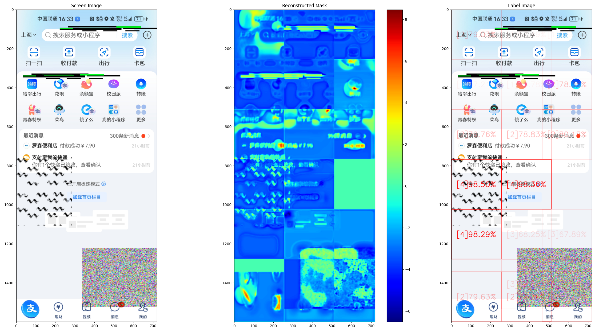

- **识别准确度不高, 耗费较多时间**
- 然而可以从现象中认识到这种方法的可取之处: 其基本具备了识别多种缺陷的可能性


