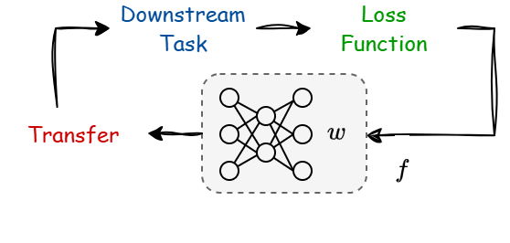
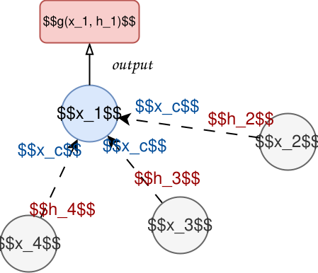
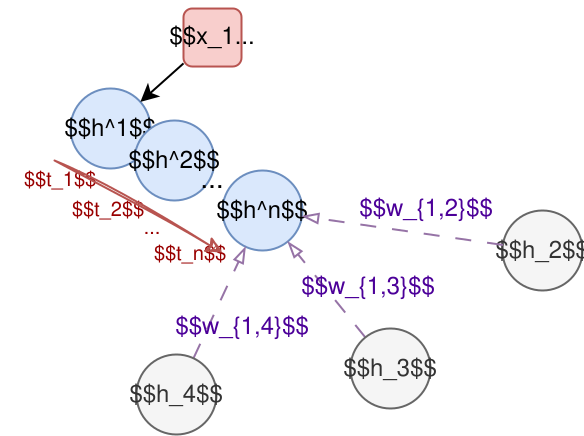
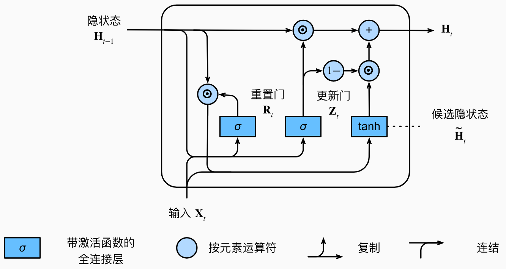
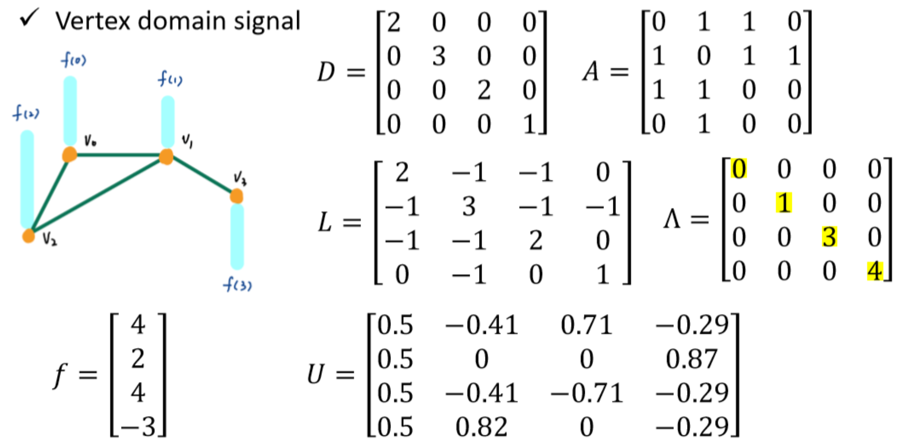
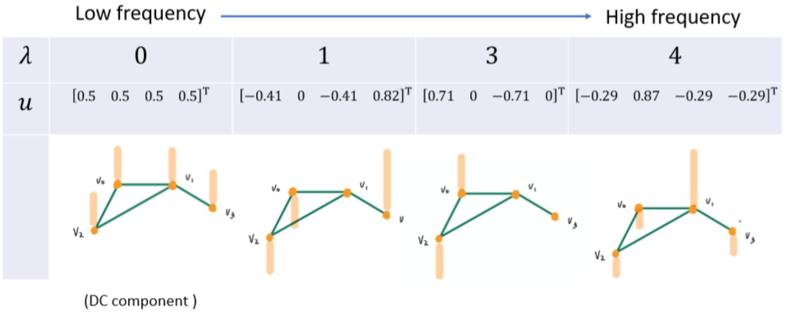
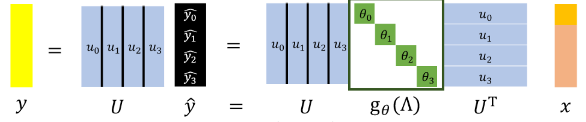

# 图神经网络

### Chapter 1 图神经网络

参考：https://www.cnblogs.com/SivilTaram/p/graph_neural_network_1.html

发展历史：

- 最早的GNN主要解决的还是如分子结构分类等严格意义上的图论问题
- 实际上，欧氏空间或其他的序列都可以建立成图问题
- 图神经网络与图表示学习(Represent Learning for Graph)的发展历程也惊人地相似。2014年，在word2vec的启发下，Perozzi等人提出了DeepWalk，开启了深度学习时代图表示学习的大门

###### 理论基础：不动点理论

- 图建模为：节点和边
  - 节点和边都有自己的状态 $x$，其中，**节点具有自己的隐藏状态** $h$

- 过程：状态更新

  图神经网络通过对邻居节点和邻边进行迭代，更新自己的隐藏状态
  $$
  \mathbf{h}_{v}^{t+1}=f\left(\mathbf{x}_{v}, \mathbf{x}_{c} , \mathbf{h}_{n}^{t} , \mathbf{x}_{n} \right),
  $$
  表明：$h_v^{t+1}$ 的状态更新由：邻居节点的状态和隐藏状态 $\mathbf{h}_{n}^{t} , \mathbf{x}_{n}$，邻边的状态 $ \mathbf{x}_{c}$，自己的状态 $\mathbf{x}_{v}$ 共同计算得到，其中 $f$ 为**局部转移函数**(local transaction function)

  深度学习的一大逻辑：**动力学函数 = 损失函数 + 神经网络**

  - 更新的逻辑

    不同的下游任务有不同的目标（即对图的演化过程和结果的要求） ，以此产生**损失函数**，

    即可使用神经网络来拟合这一个转移函数

  

- **过程：状态输出**

  对于一个节点，其具有状态和隐藏状态，需要另一个函数将其投射到所需的输出维度
  $$
  o_v = g(\mathbf{h}_v, \mathbf{x}_v)
  $$
  称为：**局部输出函数**

  

基于上述知识，我们对**图神经网络**进行描述：

【图神经网络是一种基于图结构的输入和状态描述，学习数据分布的转移动力学并最终得到输出的一类拟合器】

- 图神经网络的学习

  图神经网络主要利用转移函数进行迭代更新，可抽象表示为：
  $$
  H^{t+1} = f(H^t, X)
  $$
  如果想要 $H$ 收敛，要求 $f$ 是一个 **压缩映射**

  即：$d(f(x), f(y)) \le \alpha d(x,y)$ ，在某种度量 $d$ 下，映射后像空间小于原空间

- 压缩映射的方法

  通过添加转移函数对隐藏状态导数的罚项来限制：
  $$
  \left\|f^{\prime}(x)\right\|=\left\|\frac{\partial f(x)}{\partial x}\right\| \leq \alpha
  $$
  转为无约束优化：
  $$
  J=\mathcal{L}+\lambda \cdot \max \left(\frac{\|\partial f\|}{\|\partial \mathbf{h}\|}-\alpha, 0\right), ~~ \alpha \in(0,1)
  $$

图神经网络是 **拓扑泛化** 的，即，我们可能仅在图的某些节点做标签，称为 **监督信号**，而图神经网络能推断出其他节点的状态

###### 门控图神经网络（GGNN）

由于GNN和RNN具有相似性，基于RNN的自身迭代性质，提出了门控神经网络
$$
\mathbf{h}_{v}^{t+1}=\operatorname{GRU}\left(\mathbf{h}_{v}^{t}, \sum_{u \in n e[v]} \mathbf{w}_{u} \mathbf{h}_{u}^{t}\right)
$$
门控神经网络把邻居结点的信息视作输入，结点本身的状态视作隐藏状态。节点特征 $x$ 被作为初始值，自身迭代若干步后，进行局部输出并反向传播

其中，GRU指门控循环单元，其接受一个隐藏态H和自变量X输入，输出新的隐藏态

$$
\mathbf{H}_{t}=\mathbf{Z}_{t} \odot \mathbf{H}_{t-1}+\left(1-\mathbf{Z}_{t}\right) \odot \tilde{\mathbf{H}}_{t}
$$
GGNN特点：

- 不再以不动点理论作为基础，不需要迭代收敛，而是固定步长迭代

- 其本质仍然是从**图数据结构的数据集**上进行学习

- 由于具有GRU性质，其能在图数据集上进行**时间序列学习**

为什么GGNN放弃了不动点理论：

- 本质来说，图神经网络是一种利用动力学函数 $f$ 将图样的分布演化映射到输出分布
- GNN采用不动点理论，是希望输出分布的稳定，然而它导致所有节点都是稳定的，这在空域分布上过于光滑，以至于收敛后几乎所有节点的状态都几乎一样，这样严格的要求会限制其使用范围，以及引入过多的计算需求
- GGNN利用时间展开特性，仍然能保证输出的稳定性，而不再追求全局节点的稳定性
  - 即：对于不同的输入，其各个节点的状态可能很不一致，然而输出是稳定的

###### 图卷积神经网络（GCN）

参考：https://www.cnblogs.com/SivilTaram/p/graph_neural_network_2.html

- 空域卷积

  其将空域卷积分为两个步骤：**消息传递**、**消息更新**
  
  > 原文：
  >
  > The message passing phase runs for T time steps and is defined in terms of message functions $M_t$ and vertex update functions $U_t$. During the message passing phase, hidden states $h_v^t$ at each node in the graph are updated based on messages $m_v^{t+1}$ according to
  > $$
  > \begin{aligned}
  > m_{v}^{t+1} & =\sum_{w \in N(v)} M_{t}\left(h_{v}^{t}, h_{w}^{t}, e_{v w}\right) \\
  > h_{v}^{t+1} & =U_{t}\left(h_{v}^{t}, m_{v}^{t+1}\right)
  > \end{aligned}
  > $$
  
  其中 $t$ 表示卷积次数，其和GGNN很相似，其区别如下：
  
  - GGNN在时间上捕获信息，信息在动态的时间上，在静态的拓扑上传递
  - GCN在空间上捕获消息，其通过空域卷积将信息聚合到个别节点，最后聚合到目标节点

- 大规模图中的邻居采样（**GraphSage**）

  

  1. 其首先对于目标节点进行邻居采样，可能会包括二阶、三阶邻居，其数目固定

  2. 随后，进行信息聚合操作，其目的就是希望利用目标节点聚合后的信息来表示这么一些邻居的信息（降维）

  3. 计算采样结点处的损失。如果是无监督任务，我们希望图上邻居结点的编码相似；如果是监督任务，即可根据具体结点的任务标签计算损失。

  状态更新公式如下：
  $$
  \mathbf{h}_{v}^{l+1}=\sigma\left(\mathbf{W}^{l+1} \cdot \operatorname{aggregate}\left(\mathbf{h}_{v}^{l},\left\{\mathbf{h}_{u}^{l}\right\}\right), \forall u \in n e[v]\right)
  $$
  主要设计就是 aggregate 函数，其可以是动态的，也可以是静态的

  本质而言，GraphSage 就是将图分解为 **子任务**，学习到的是 **随机变量的期望**

###### 图结构序列化（PATCHY-SAN）

由于图是非欧结构，不能应用传统的卷积范式

- 欧氏结构的邻居数目是固定的，卷积核是固定大小的
- 非欧结构的邻居数目不固定，卷积是抽象的

PATCHY-SAN 将图序列化后，形成了欧氏结构，并直接应用卷积

###### 图频域卷积（Spectral Convolution）

参考:https://www.cnblogs.com/lemonzhang/p/13168669.html

- 图信号的卷积

  什么是 **图信号**

  - 一种具有拓扑关系的信号 $f$，其 $f(n)$ 表明节点n的值，其连接关系由 **度矩阵(D)** 和 **邻接矩阵(A)** 描述

  - 图信号卷积的前提：结构是无向图，即其 **L = 度矩阵(D) - 邻接矩阵(A)** 应当是一个 **对称矩阵**

    

  为什么 $L$ 就是图的 **拉普拉斯算子**？

  - 给定图信号 $f$，则 $Lf = Df - Af$ 表示【某节点的节点值和其邻居值的差之和】，

  - 拉普拉斯算子在物理上表示**梯度的散度**，因此 $L$ 即为图的拉普拉斯算子的定义

    

  
  
  对称矩阵可作 **酉变换**，得到：$L=U \Lambda U^{\mathrm{T}} = \sum_{i} \lambda_i u_i u_i^T$

  - 拉普拉斯矩阵的特征值承担 **频点**/**频率位** 的作用，也表明 **节点的度**
  - 拉普拉斯矩阵的特征向量承担了 **正交基** 的作用
  - 信号的频率组成由其分布决定；信号的频率幅度大小由其值决定
  
  
  
  存在 **图的傅里叶变换** ：
  $$
   F(\lambda_k) = \sum_{i=1}^n f(i)u^T_k(i)
  $$
  逆变换：
  $$
  f(i) = \sum_{k=1}^n F(\lambda_k)u_k(i)
  $$

###### 频域卷积网络(Spectral CNN)

频域卷积：其中 $g_\theta$ 是可学习的
$$
f *g = U g_\theta U^T f = g_\theta(L)f
$$

即：卷积核的作用就是调整了频点分布和大小，学习复杂度 $O(N)$

> 原文：https://arxiv.org/abs/1312.6203
>
> With these in hand, we can now define the $k$-th layer of the network. We assume without loss of generality that the input signal is a real signal defined in $\Omega_0$, and we denote by $f_k$ the number of “filters” created at each layer $k$. Each layer of the network will transform a $f_{k−1}$-dimensional signal indexed by $\Omega_{k-1}$ into a $f_k$-dimensional signal indexed by $\Omega_k$, thus trading-off spatial resolution with newly created feature coordinates.
>
> More formally, if $x_k = (x_{k,i}; ~i=1,2,...,f_{k-1})$ is the $d_{k-1} \times f_{k-1}$ is the input to layer $k$, its the output $x_{k+1}$ is defined as:
> $$
> x_{k+1, j}=L_{k} h\left(\sum_{i=1}^{f_{k-1}} F_{k, i, j} x_{k, i}\right) \quad\left(j=1 \ldots f_{k}\right),
> $$

