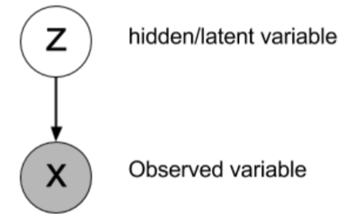
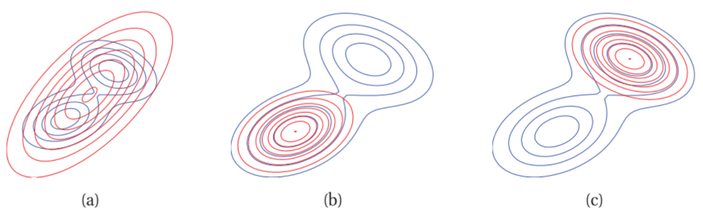
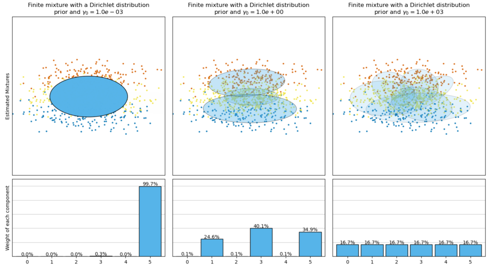
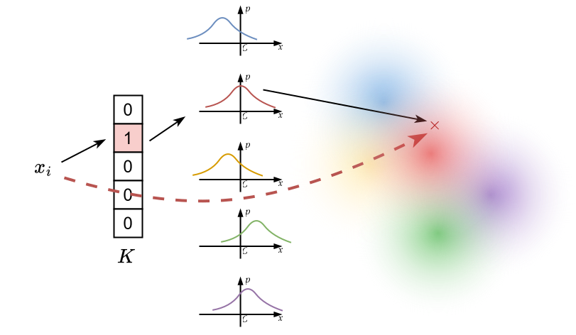
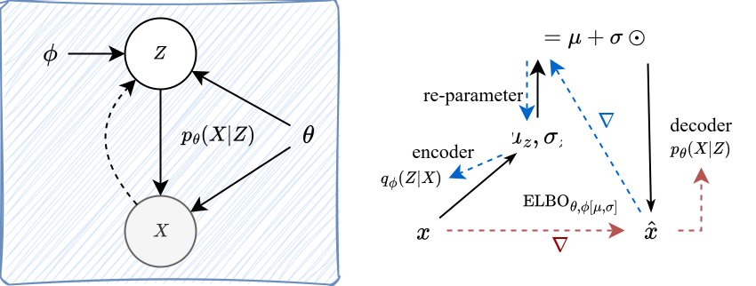

# 变分推断  Variational inference

参考：

- [An Introduction to Variational Inference](https://arxiv.org/abs/2108.13083)
- [Variational Inference: A Review for Statisticians](https://arxiv.org/abs/1601.00670)

### Chapter 1 变分推断（VI）

什么是变分推断：**逼近复杂的概率密度**是现代统计学的核心问题。变分推断使用**优化技术**来估计复杂的**概率密度**

**隐变量推断**

观测变量 X 依赖于**隐变量 Z**，如下所示的有向图，其中 X 和 Z 分别代表观测变量和隐变量。从 Z 到 X 的箭头表示条件概率密度 $p(X|Z)$，被称为**似然**

我们希望推断，在观测到 $X$ 后，其隐变量 $Z$ 出现的概率是多少 $p(Z|X)$，由贝叶斯公式得：
$$
p(Z|X) = \frac{p(X|Z)p(Z)}{p(X)} = \frac{p(X|Z)p(Z)}{\int_{z \in \mathcal{Z}}p(X|z)p(z)dz}
$$
这个边缘概率密度是**证据**，$p(Z)$被称为**先验**，因为它捕获了关于Z的先验信息。对于许多模型，这个证据积分取决于所选模型，并且要么没有闭式解，要么需要指数时间来计算

> 我仍然不能很好地理解 **似然** 以及 **推断**，举一个简单例子：
>
> 一个人是否去运动的随机变量X服从0-1分布，隐变量Z是天气：
> $$
> p(\text{去运动} | \text{晴天}) = 0.9 \\
>     p(\text{去运动} | \text{雨天}) = 0.2
> $$
> 而天气的先验知识假设已经由某种统计模型 $M_\theta$ 推断而出：
> $$
> p(\text{晴天}) = 0.7 \\
>     p(\text{雨天}) = 0.3
> $$
> 进而**推断**，当我们看到一个人去运动后，则晴天的概率为：
> $$
> p(Z = \text{晴天} | X = \text{去运动}) = \frac{(0.9)(0.7)}{0.69} = \frac{0.63}{0.69} \approx 0.913
> $$

**变分推断** 能够有效地计算边际概率密度（即**证据**）的**下界**。其核心思想是：更高的边际似然表明所选统计模型更好地拟合了观测数据

**KL散度**

KL散度表明两个概率分布之间的 **距离**：
$$
D_\text{KL}(P||Q) = \int_{-\infty}^{+\infty} p(x) \frac{p(x)}{q(x)}dx = \mathbb{E}_{x \sim P}\left[\log(\frac{p(x)}{q(x)}) \right]
$$
变分推断（VI）的目标是从一个**易于处理的概率密度函数族 Q** 中选择一**个近似概率密度 q**。每个 $q(Z) ∈ Q$ 都是对真实后验概率的一个候选近似。目标是找到最佳候选者，即具有**最小 KL 散度**
$$
q^{*}(Z)=\arg \min_{q(Z) \in \mathcal{Q}} ~ D_{\mathrm{KL}}(P(Z | X) \| Q(Z)) \tag{P1}
$$
大多数时候，选择 **指数族** 作为候选，因为其具有共轭性质

**前向KL散度 和 逆向KL散度**

KL散度承接两个分布作为参数，作为函数，其两个位置参数交换后，值并不相同
$$
D_\text{KL}(P||Q) \neq D_\text{KL}(Q||P)
$$
计算问题 P1 是困难的，因为关于P的期望计算是难以处理的，可以用一些随机估计方法；此外，计算 P1 中的正向KL散度项需要我们知道后验 $P(Z | X)$

我们使用逆向KL散度作为代替，由于分布 $q$ 是预先选择的，因此期望很好处理：
$$
q^{*}(Z)=\arg \min _{q(Z) \in \mathcal{Q}} D_\text{KL}(Q(Z) || P(Z|X)) \tag{P2}
$$
逆向KL散度会 **低估**，即总是**小于**原始分布 $P$，在概率 $p(x) \rarr 0$ 的地方，必须强迫 $q(x)=0$.

前向KL散度会 **高估**，下图 (a) 为前向KL计算的结果，倾向于覆盖原始分布，而后两个模式为逆向KL计算结果，倾向于锁定其中的一个峰

- 原生VAE编码器会因为锁定分布模式，导致输出质量较低

  

**ELBO：证据下界**

P2的问题在某些情况下仍然是无法计算的，因为证据函数 $P(Z|X)$ 难以获取，改写：
$$
\begin{aligned}
D_\text{KL}(Q(Z)||P(Z|X)) &= \mathbb{E}[\log q(z)] - \mathbb{E}[\log p(z|x)] \\
&=\mathbb{E}[\log q(z)] - \mathbb{E}[\log \frac{p(z,x)}{p(x)}] \\
&=\mathbb{E}[\log q(z)] - \mathbb{E}[\log p(z,x)] + \mathbb{E}[\log p(x)]
\end{aligned} \tag{P3}
$$
P3 中所有的期望都是从 $q$ 采样的，因此对于 $p(x)$ 在期望下是一个常数，另外，我们总能观测到**似然** $p(x|z)$，以及采样 $p(z) \approx q(z)$，所以 $p(z,x) = p(z)p(x|z)$ 是可以计算的，我们最终得到一个方程： 
$$
\text{ELBO}(Q) = -D_\text{KL} + \log p(x) = \mathbb{E}[\log p(z,x)] - \mathbb{E}[\log q(z)]
$$
上式称为 **证据下界ELBO**，只需要**最大化证据下界**，即相当于**最小化KL散度**：
$$
q^{*}(Z)=\arg \max _{q(Z) \in \mathcal{Q}} \text{ELBO}(q)
$$

> 因此，ELBO 是数据期望对数似然与先验和近似后验概率密度之间的 KL 散度的总和。期望对数似然描述了所选统计模型对数据的**拟合程度**。**KL 散度**促使变分概率密度**接近实际先验**。因此，ELBO 可以被看作是对数据的**正则化拟合**
>
> **Source**: 
>
> Thus, the ELBO is the sum of the expected log likelihood of the data and the KL-divergence between the prior and approximated posterior probability density. The expected log likelihood describes how well the chosen statistical model fits the data. The KL-divergence encourages the variational probability density to be close to the actual prior. Thus, the ELBO can be seen as a regularised fit to the data.
> $$
> \begin{aligned}
> \operatorname{ELBO}(Q) & =\mathbb{E}[\log p(z, x)]-\mathbb{E}[\log q(z)], \\
> & =\mathbb{E}[\log p(x \mid z)]+\mathbb{E}[\log p(z)-\log q(z)], \\
> & =\mathbb{E}[\log p(x \mid z)]-D_{\mathrm{KL}}(Q(Z) \| P(Z)) .
> \end{aligned}
> $$
> 

 Jordan 等人 (1999) 证明了 ELBO 对于证据对数似然的下界约束性质，即：$\log p(x) \ge \text{ELBO}(Q)$

### Chapter 2 高斯混合模型

**定义**

高斯混合模型试图利用多个不同参数的高斯密度函数拟合一个复杂分布

利用最小化期望来实现
$$
X \sim p(x) = \sum_{i=1}^N c_i \phi_i(x)
$$
上式将一个复杂分布视作多个高斯分布的 **线性叠加**，其中：$\phi_i(x) = \dfrac{1}{\sqrt{2\pi} \sigma_i}e^{-\dfrac{1}{2}(\dfrac{x-\mu_i}{\sigma_i})^2}$，成为 **混合高斯分布**

- 缺陷
  - 在高维度情况下表现不好
  - 取用多少高斯分布来拟合，是不确定的
- 优势
  - 是混合模型学习算法中**最快的算**法
  - GMM属于生成模型（generative model），**生成模型能够比判别模型更快达到渐进误差**
  - 能够用于模拟（即生成）模型中任意变量的分布情况，更容易扩展至无监督学习

**平均场变分族**

平均场变分族是一类 **联合分布**
$$
q(Z) = q(Z_1, Z_2,...,Z_m) = q(Z_1)q(Z_2|Z_1)q(Z_3|Z_1,Z_3)...q(Z_m|Z_1,Z_2,...Z_{m-1})
$$
上述为一般的联合分布展开，而平均场变分足具有一个良好的假设性质：**所有 $Z_i$ 之间都是统计独立的**
$$
q(Z) = q(Z \mid X)=\prod_{j=1}^{m} q_{j}\left(Z_{j}\right)
$$

- 一般联合分布 $q(Z)$ 可能包含复杂的条件依赖（如马尔可夫链），但平均场强制所有条件简化为完全因子化的形式

> **Source**：
>
> We briefly, introduce the mean field variational family for VI, where the latent variables are assumed to be mutually independent—each governed by a distinct factor in the vari- ational probability density (see Bishop, 2006, for a more detailed explanation). This assumption greatly simplifies the complexity of the optimization process. A generic member of the mean field variational family is
> $$
> q(Z) = q(Z \mid X)=\prod_{j=1}^{m} q_{j}\left(Z_{j}\right) \tag{15}
> $$
> where m is the number of latent variables. The observed data X does not appear in Equation 15, therefore any prob- ability density from this variational family is not a model of the data. Instead, it is the ELBO, and the corresponding KL-divergence minimization problem, which connects the fitted variational probability density to the data and model
>
> **Note**：
>
> - 公式中 $q(Z|X)$ 的写法可能稍显误导。实际上，平均场变分分布 $q(Z)$ **不是数据的生成模型**（即不直接建模 $X$），而是对**隐变量后验 $p(Z|X)$ 的近似**。
> - 观测数据 $X$ 的影响是通过**优化过程**间接体现的：变分推断通过优化 $q(Z)$ 使其逼近真实后验 $p(Z|X)$，而 $p(Z|X)$ 作为固定条件出现在优化目标（如ELBO）中。

**高斯混合模型**

- 概率密度相乘——联合分布
- 概率密度相加——混合分布

文中假设采样服从 $K$ - 高斯混合模型，采样 $N$ 个数据：
$$
x_{i} \sim \mathcal{N}\left(c_{i}^{T} \mu, 1\right)  ~~ \forall i=1,2, \ldots N
$$
其中:

- 潜在变量 $\mu$ 从高斯分布中采样：$\mu_{j} \sim \mathcal{N}\left(0, \sigma^{2}\right) ~~\forall j=1,2, \ldots, K$
- 加权系数 $c_i$ 是 $K$ 维独热的，即：$c_j \sim \mathcal{C}(K) ~~\forall j=1,2, \ldots, N$，即每个数据都是从混合模型的其中一个高斯采样

该分布被明确表示为：
$$
q(\mu, c)=\prod_{j=1}^{K} q_{m_{j}, s_{j}^{2}}\left(\mu_{j} \right) \prod_{i=1}^{N} q_{\phi_{i}}\left(c_{i}\right)
$$
其中：

- **这是联合分布**，表示隐变量 $\mu$ 和 $c$ 的独立性假设（平均场）

- 其中分布下标位置的参数是控制分布的，可以学习

  > **Source**：
  >
  > We assume the approximate posterior probability density to be from the mean-field variational family (Section 4). Thus, the variational parameterization is given by, 
  > $$
  > q(\mu, c)=\prod_{j=1}^{K} q\left(\mu_{j} ; m_{j}, s_{j}^{2}\right) \prod_{i=1}^{N} q\left(c_{i} ; \phi_{i}\right)
  > $$
  > Each latent variable is governed by it’s own variational factor (Blei et al., 2017). Here, the mixture components are Gaussian with variational parameters (mean mk and variance s2 k) specific to the k-th cluster. The cluster as- signments are categorical with variational parameters (K- dimensional cluster probabilities φi vector) specific to the i-th data point
  >
  > **Note:**
  >
  > - 此处表示参数的方法为：$q(x;\theta)$, 即分号表示

变分推断的优化目标为
$$
\mathrm{ELBO}_{m, s^{2}, \phi}  =\mathbb{E}[\log p(x, \mu, c)] -\mathbb{E}[\log q(\mu, c)]
$$

- 其中，观测数据-参数的联合分布为：
  $$
  p(x,μ,c)=p(x|μ,c)p(μ)p(c)
  $$
  在这种分解情况下，右边第一项称为观测数据的 **似然**，可以由混合模型定义得到：
  $$
  x_i | \mu, c_i \sim \mathcal{N}(c_i^T \mu, 1)~~ \Rarr~~ p(x_i | \mu, c_i) = \frac{1}{\sqrt{2\pi}} \exp\left( -\frac{(x_i - c_i^T \mu)^2}{2} \right)
  $$
  Note：所谓 **似然**，就是**利用建模来描述真实世界采样的概率**

### Chapter3 一些应用

**VAE**

VAE 由 Kingma 和 Welling (2013) 提出，是一种统计模型，本质上是一种随机变分推理算法，

它是一种神经网络，旨在学习或编码**高维数据**（例如图像）的**有意义的（低维）表示**

- 与输入图像相比，它们生成的图像往往质量降低。 这是最小化反向KL散度的结果，这导致近似分布被锁定到其中一个模式
- 通过重参数化变分下界，产生一个可以使用标准随机梯度方法优化的下界估计器
- 理解VAE的关键在于，要将概率密度函数理解为生成模型，而非简单的函数

该模型中有 N 个观测数据点。实线表示**生成模型**，虚线表示对难处理的**后验密度的变分近似**。变分参数 φ 与生成模型参数 θ 联合学习 (Kingma and Welling, 2013)

- 彩色部分，虚线表示梯度传播途径

> Source：
>
> ELBO to a Stochastic Gradient Variational Bayes (SGVB) estimator
> $$
> \mathcal{L}_{\phi, \theta, x^{(i)}} \simeq-\mathcal{D}_{Z, X, \phi, \theta}+\frac{1}{L} \sum_{l=1}^{L} \log p_{\theta}\left(x^{(i)} \mid z^{(i, l)}\right) \tag{25}
> $$
> We re-parameterize the variational lower bound in terms of a deterministic random variable which enables us to use gradient based optimizers on mini-batches of data. This further enables the optimization of the parameters of the distribution while still maintaining the ability to randomly sample from that distribution (Doersch, 2016).
>
> In order to simplify the calculations, we assume the variational approximate posterior to be a **multi-variate Gaussian with diagonal co-variance structure** (Kingma and Welling, 2013). As for the prior we assume a multivariate Gaussian N (z; 0, I) where,
> $$
> \begin{aligned}
> \log q_{\phi}\left(z \mid x^{(i)}\right) & =\log \mathcal{N}\left(z ; \mu^{(i)},\left(\sigma^{(i)}\right)^{2} \mathbf{I}\right), \\
> p_{\theta}(z) & =\mathcal{N}(z ; 0, \mathbf{I}), \\
> z^{(i)} & =\mu^{(i)}+\sigma^{(i)} \odot \epsilon, \\
> \epsilon & \sim \mathcal{N}(0, \mathbf{I}) .
> \end{aligned}
> $$
> 

##### 小结：

- **VAE的数学框架是分布无关的**

  只要隐变量分布满足变分推断的基本条件（可采样、可优化），任何分布均可使用

  VAE的核心思想就是假设数据的观测**由一个隐分布控制**，这个隐分布是**低维的**，我们如果能知晓隐分布，就能更好地生成数据

- **一个分布建模表示可以采样和优化**

  一个参数控制的分布函数表示我们建模了一个随机变量

  其最大的作用便是采样，无论是重参数化方法还是蒙特卡洛方法

  从环境中得到的真实样本 $x$，利用模型可以知道其出现的**概率（密度**）$p_\theta(x)$，称为 **似然**

  上述大费周章的数学部分，目的就是**让优化目标和实际数据概率密度无关**

  

  

