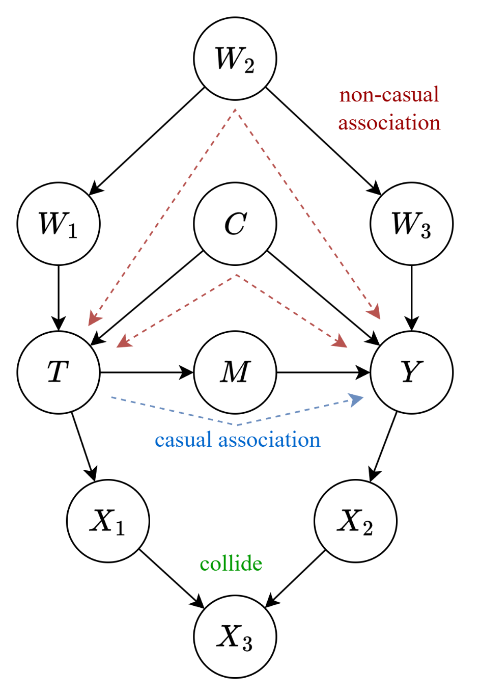
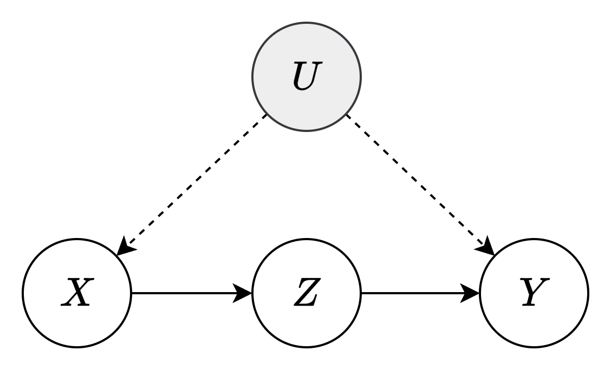
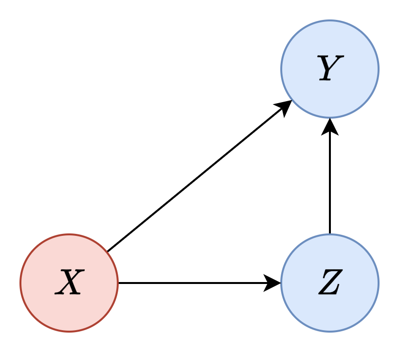
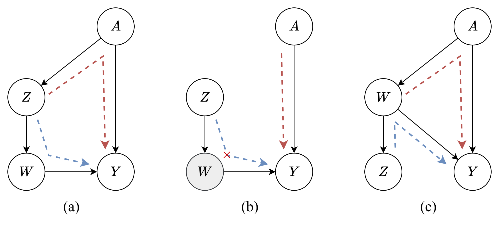
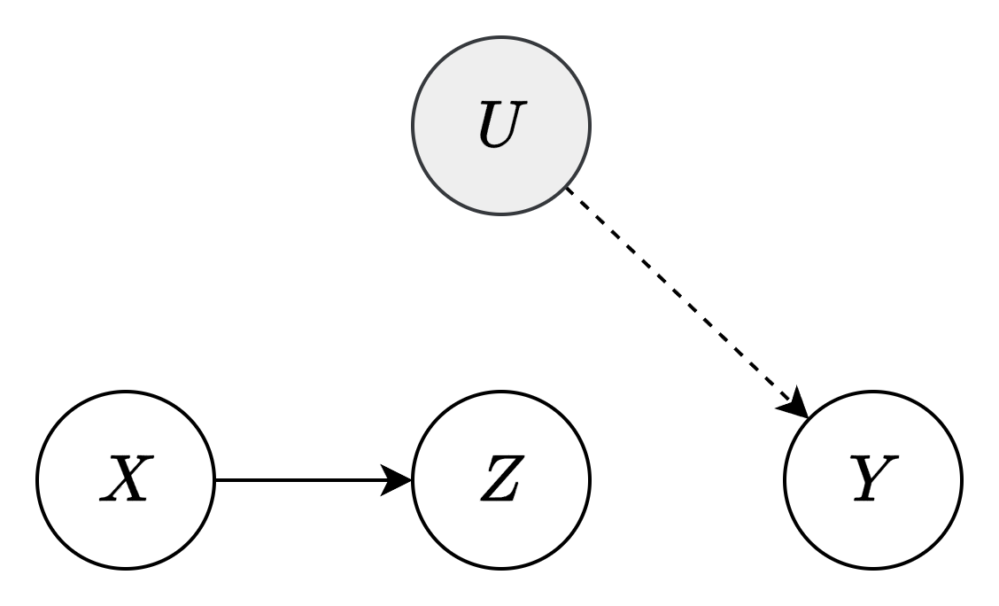
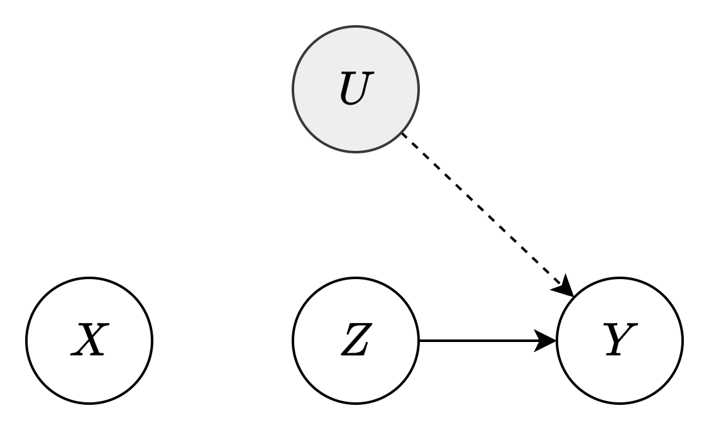
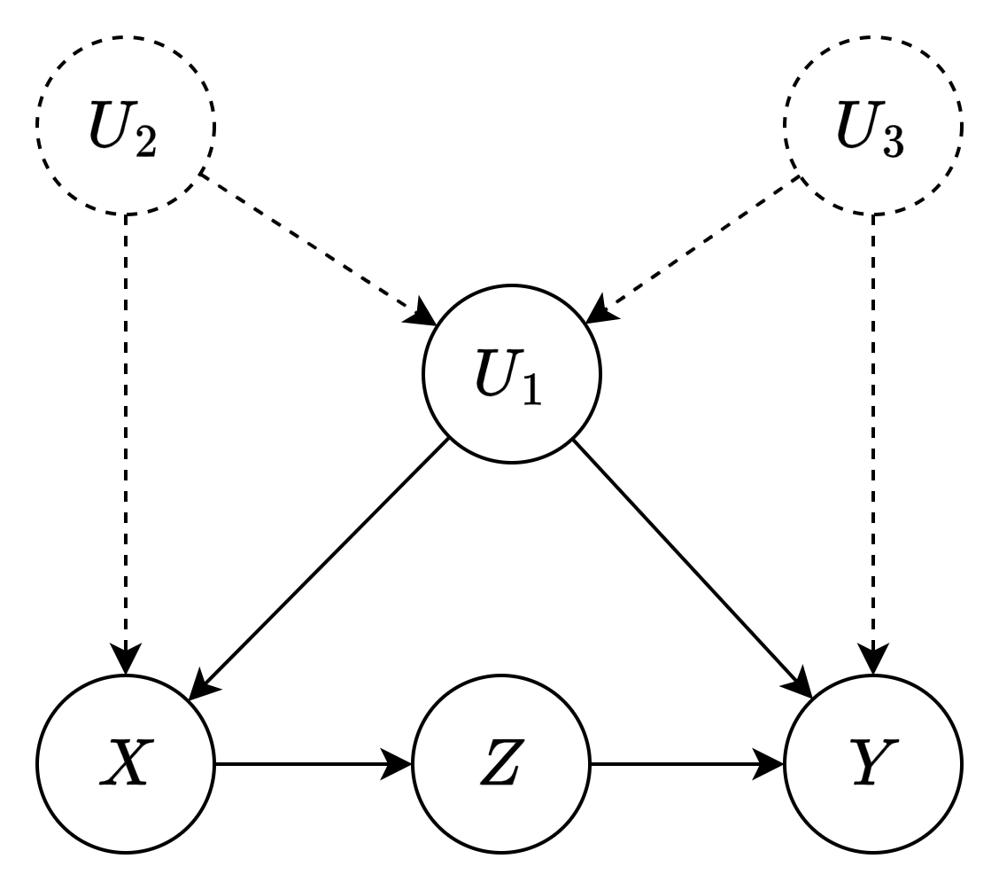
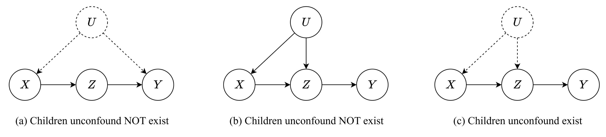

# 因果推断

##### Introduction

https://www.joshua-entrop.com/post/the_3_rules_of_do_calculus.html

https://causalai.net/

因果推断是利用 `已有的因果结构` 进行应用

- 反事实查询
- 干预查询
- 因果效应量化

> **定义** [因果的识别]
>
> 因果的识别就是根据已有观测数据, 或是已知的概率分布来对干预分布进行计算的过程
>
> 因果的可识别性, 即能否完成上述过程的判别

什么时候需要用到因果推断? https://www.inference.vc/untitled/

- 当任务仅仅是预测时, 只需要 $p(y|x)$ 就够了

- 当任务是希望对目标变量的控制情况, 需要用到 $p(y|do(x))$

##### 后门调整规则

###### 三种控制结构

因果关系中, 有三种结构, 表明在控制某些变量后, 可以使另一些变量 `d-分离`/`条件独立`

考虑 SCM-DAG 中的节点 T → Y 的关系

上图中存在一些节点, 具有因果性质, 分类如下:

- **直接关系**: T → M → Y, 此类链式结构又称为 `前门路径`, 能够通过直接作用的方式传递因果关系

  > 该结构上, 干预分布等价于条件分布

- **混淆关系**: T ← W → Y, 此类叉式结构又称为 `后门路径`, 通过间接方式传递因果

  > 该结构上, 干预分布不等于条件分布, 产生辛普森悖论

- **对撞关系**: T → X ← Y, 此类结构是因果的终结, 在该结构上不能传递因果, 因素相互独立

  > 该结构上, 因素相互独立

上述结构揭示了三种基本的因果结构及其性质如下:

- **链式结构**: X → Z → Y, 该结构下控制 Z(即确定 Z 的观测值)会使原本有关联的 X 和 Y 变得 `独立`
- **叉式结构**: X ← Z → Y, 该结构下控制 Z 会使原本有关联的 X 和 Y 变得 `独立`
- **对撞结构**: X → Z ← Y, 该结构下控制 Z 会使原本独立的 X 和 Y 通过 Z 变得 `相关`

> 如果 **干预分布和条件分布相同**, 我们称因果效应是 `不混淆` 的. 实际上, 对于一些节点 $Y \neq X$ 进行干预后, 对于另一些节点 $X$, 在给定父节点 $PA_X$ 时, 这些节点的分布仍然等同于 $Y$ 赋值后的条件分布, 称 X 及其父节点 $PA_X$ 是 `自治` 或是 `不变` 的
>
> **定理** [操纵定理 / 因果马尔科夫性假设, Spirtes .etc, 2000]
>
> 给定 SCM $\mathcal{G}$, 节点 $X_i$ 及其父节点 $PA_i$, 对节点 $X_j, j \neq i$ 进行 `干预` 以改变结构得到图 $\tilde{\mathcal{G}}$, 则:
> $$
> p_\tilde{\mathcal{G}}(X_i|PA_i) = p_\mathcal{G}(X_i|PA_i)
> $$
> - 上式表明, 父节点给定的情况下, 节点总是独立于全图
>
> - 当干预节点是 $X_k$ 的父节点时, 则有如下推论
>   $$
>   p(X_i|PA_i, do(X_k = x \in PA_i)) = p(X_i| PA_i, X_k = x)
>   $$
>
>
> **定理** [贝叶斯网络基本定理]
>
> 贝叶斯网络通过一个有向无环图来阐述变量间的独立性关系, 但并不阐述生成关系, 仅用概率表示
>
> 给定概率分布 $P$ 和有向无环图(DAG) $G$ ， $P$ 按照 $G$ 分解，如果满足以下公式
> $$
> P(X_1, ..., X_n) = \prod_{i} P(X_i | PA_i)
> $$
> **定理** [截断因子分解定理]
>
> 在贝叶斯网络因子分解的基础上，若对节点集合 $S$ 进行干预, 则相当于修改了集合 $S$ 的父节点并将其设为常量, 则其概率为 1; 而其余节点根据操纵定理, 其分布不变, 因此有如下表述
> $$
> P(X_1, ..., X_n | do(S = s)) = \prod_{i \notin S} P(X_i | PA_i)
> $$

###### 有效调整集

我们希望控制一些变量, 使得计算干预分布时能够消除干预的影响, 从而仅使用条件分布(即观测数据)就可以得到干预分布

这要求必须控制后门路径以减少混淆

> **定理** [后门调整定理]
>
> 给定 SCM $\mathcal{G}$, 节点集合 W 称为 T → Y 的 `有效调整集`, 当且仅当
>
> - W 阻止所有从 T 到 Y 的后门路径
> - W 不是任何 T 的 `后代`
>
> 则有:
> $$
> p(y|do(t))= \sum_w p(y|t, w)p(w)~~~~  \forall w \in \mathcal{R}(W)
> $$

- 上述定理中, 第一条为了保证阻断混淆关系, 以确保 T 和 Y 被 W d-分离, 以消除第一部分条件中的 do 算子
  $$
  \begin{aligned}
  p(y|do(t)) &= \sum_w p(y|do(t), w)p(w|do(t)) \\ 
  &=\sum_w p(y|t, w)p(w|do(t))  \quad \text{if} \quad Y \perp T | W
  \end{aligned}
  $$

- 第二条为了保证没有任何 T 的出边和 W 产生混淆关系, 只要 W 不含 T 的子代, 则两者最终以对撞结束, 以消除第二部分条件中的 do 算子
  $$
  \begin{aligned}
  p(y|do(t)) &= \sum_w p(y|do(t), w)p(w|do(t)) \\ 
  &=\sum_w p(y|t, w)p(w|do(t))  \quad \text{if} \quad Y \perp T | W \\
  &=\sum_w p(y|t, w)p(w) \quad \text{if} \quad T \perp W 
  \end{aligned}
  $$

- 该定理和操纵定理自洽, 子节点和父节点的因果关联总是被空集 $\empty$ 阻断

  

###### 和 d-分离的关系

后门调整定理可以被 d-分离 重新表述, d-分离是有效调整集的数学前提

直接因果关系不影响干预分布, 只需要 **阻断任何 T 到 W 的混淆**, 因此定义 $G_\underline{T}$ 表示 **删除 T 的所有出边**

则后门规则等同于在该图上的 d-分离 情况, 有效调整集相当于 d-分离 的阻断集合
$$
p(y|do(t))= \sum_w p(y|t, w)p(w) \quad \text{if} \quad T \perp_{} Y | W \in G_\underline{T}
$$

##### 前门调整规则

后门调整的本质在于阻止混淆因果关系, 所谓阻止就是“给定和调整”后门变量, 以消除 do 算子

当出现 **无法观测的混淆变量** 时, 无法直接应用后门调整, 这需要我们沿着 **存在的前门路径** 进行一步一步计算

###### 例题

求 $p(y|do(x))$ 的具体分布

虽然 U 在 X → Y 的后门路径上作有效调整集, 然而由于其不在观测数据中, 我们无法直接使用 U

因此, 只能希望沿着前门路径一步一步进行, 首先计算 $p(z|do(x))$, 由于没有 X → Z 的后门路径, 因为 X → U → Y 和 Z → Y 终结于对撞结构, 因此可以直接写出: 
$$
p(z|do(x)) = p(z|x)
$$
随后, 计算 $p(y|do(z))$, 由于 Z → Y 存在后门路径 Z →X →U→Y, 且 X 可以作为有效调整集, 故
$$
p(y|do(z)) = \sum_x' p(y|z, x')p(x')
$$
以下, 导出总因果关联即 $p(y|do(x))$ **, 后续将会解释以下组合公式 (1)**
$$
p(y|do(x)) = \sum_z p(y|do(z))p(z|do(x)) \tag{1}
$$
因此, 总因果关系为
$$
\begin{aligned}
p(y|do(x)) &= \sum_z p(y|do(z))p(z|do(x)) \\
&= \sum_z p(z|x) \sum_x' p(y|z, x')p(x')
\end{aligned}
$$

> **证明** [公式 (1), 干预组合]
> $$
> p(y|do(x)) = \sum_z p(y|do(z))p(z|do(x))
> $$
>
> 贝叶斯基本定理
> $$
> p(x, y, z, u) = p(x|u)p(y|z, u)p(z|x)p(u)
> $$
> 由截断因子分解定理
> $$
> p(y, z, u|do(x)) = p(y|z, u)p(z|do(x))p(u)
> $$
> 边缘化以消除 Z 和 U
> $$
> \begin{aligned}
> p(y|do(x)) &= \sum_{z, u} p(y, z, u|do(x)) \\
> &=\sum_{z, u} p(y|z, u)p(z|do(x))p(u) \\
> &= \sum_{z} p(z|do(x)) \sum_u p(y|z, u)p(u)
> \end{aligned}
> $$
> 上式第二部分为全概率展开, 合并后得到
> $$
> p(y|do(x)) = \sum_{z} p(z|do(x)) p(y|z)
> $$
> 根据因果图, 由于没有从 X 到 Z 的后门路径, 故
> $$
> p(y|do(x)) = \sum_{z} p(z|do(x)) p(y|do(z))
> $$
>

> **定理** [前门调整定理]
>
> 若因果作用 (X, Z, Y) 满足前门调整,
>
> - Z 阻止所有 X 到 Y 的直接因果路径 (广义链式结构)
> - 从 X 到 Z 没有畅通无阻的后门路径
> - Z 到 Y 的所有后门路径都被 X 阻止
>
> 则:
> $$
> p(y|do(x)) = \sum_z p(z|x) \sum_x' p(y|z, x')p(x')
> $$
>

###### 关于前门准则一个我搞不懂的小题

从简单的定义出发 — 截断因子分解定理

计算 $p(y \mid do(x))$

由于没有任何后门路径, 因此不考虑do-演算, 但是 $p(y \mid do(x)) \neq p(y|x)$ 因为还有 Z 影响

根据贝叶斯基本定理: 
$$
p(X,Y,Z) = p(Y|X,Z) \cdot p(Z|X) \cdot p(X)
$$
根据截断因子分解定理:
$$
p(Y,Z \mid do(X)) = p(Y \mid do(X),Z) \cdot p(Z \mid do(X))
$$
根据操纵定理, 去除干预:
$$
p(Y,Z \mid do(X)) = p(Y \mid X,Z) \cdot p(Z \mid X)
$$
对Z进行边缘化:
$$
p(Y \mid do(X)) = \sum_z p(Y,z \mid do(X)) = \sum_z p(Y \mid X,Z) \cdot p(Z \mid X)
$$

##### do-calculus

**do-calculus [Pearl, 1995]** 是一套公理体系, 其通过 **完备的** 三个定理(操作)可以将符合特定条件的干预分布中的 do 算子去除, 使其可以通过观测数据计算(即将干预分布转换为条件分布), 这是一种比操纵定理更加推广的方法

> do-calculus 基于因果公理, 并推导出在概率论上解析 do 算子的方法
>
> **公理 1** [因果忠实性假设]
>
> 如果在给定变量集 V 的前提下, 变量 $X$ 和 $Y$ 互相独立或条件独立, 那么在由变量及其之间因果依赖关系组成的因果关系网络图 $G$ 中, $X$ 和 $Y$ 之间的所有路径被变量集 V 中合适的变量 d-分离
>
> **公理 2** [因果马尔科夫性假设/操纵定理]
>
> 对于具有因果充分性的变量集而言, 如果父节点已知, 则节点总独立于全图
> $$
> p_\tilde{G}(X_i|PA_i) = p_G(X_i|PA_i)
> $$

> **定理 1** [观测的插入和删除]
>
> 干预 T 后, 若 W 将 Y 和 Z d-分离, 则可删除或插入分离集另一侧的观测节点
> $$
> p(y|do(t), z, w)= p(y|do(t), w)  \quad \text{if} \quad Y \perp Z | T, W \in G_\overline{T}
> $$
> 

- 该定理实际上是 d-分离 性质在干预下的推广
  $$
  p(y|z, w) = p(y|w) \quad \text{if} \quad Y \perp Z | W \in G
  $$
  删除 T 的入边, 实际上就是对 T 进行干预的因果图体现

- 作为工具, 可根据需要删除的观测来 `尝试` 检查该节点是否和目标节点 d-分离
- 表明在切断 **直接因果关联** 情况下的分布变换

> **定理 2** [干预和观测的转换]
>
> 给定干预 T 下, 阻断干预 Z 可能的直接因果关联, 若观测 W 是干预节点 Z 到目标节点的有效调整集, 则可转换 do 算子
> $$
> p(y|do(t), do(z), w) = p(y|do(t), z, w) \quad \text{if} \quad Y \perp Z | T, W \in G_{\overline{T}, \underline{Z}}
> $$

- 该定理实际上是后门调整规则在干预下的推广
  $$
  p(y|do(z), w) = p(y|z, w)  \quad \text{if} \quad Y\perp Z |W \in G_\underline{Z}
  $$

- 由于干预 T 的加入, 因此需要先改变图结构, 再检验后门调整

- 作为工具, 仍然可以根据想要转换的干预来进行尝试, 检验其是否在调整后的图中和目标节点 d-分离

- 表明在切断 **混淆因果关联** 情况下的分布变换

> **定理 3** [干预的插入和删除]
>
> 给定干预 T 和 Z 下, 若 W 将 Y 和 Z d-分离, 则可以插入或删除另一侧的干预
> $$
> p(y|do(t), do(z), w) = p(y|do(t), w) \quad \text{if} \quad  Y \perp Z | T, W \in G_{\overline{T}, \overline{Z(W)}}
> $$
>
> - 其中, $\overline{Z(W)}$ 是 Z 节点的子集, 其表示不是 W 的任何祖先的 Z 节点
>

- 理解 $\overline{Z(W)}$ 的关键在于对撞结构, 如若考虑 
  $$
  p(y| do(z), w) = p(y|w) \quad \text{if} \quad Y \perp Z | W \in G_\overline{Z}
  $$
  这是充分的, 删除入边是干预操作的属性, 而干预对条件分布没有影响则是后门调整的属性

  然而, 对于图已知的情况, 即使 $Y \perp Z | W \in G_\overline{Z}$ 满足, 但不代表 $p(y|do(z), w)$ 的分布就不会改变, 以如下为例:
  
  
  
  - 该图 (a) 中, Z 和 Y 确实被 W 阻断, 然而, A 的存在表明 Z 通过另外的途径影响 Y
  - 当对 Z 进行干预, 即删除 Z 的入边后, A 和 Z 形成广义对撞, 即 A 在独立地影响着 Y, 这将不能保证 y 分布的不变性
  - 在图 (c) 中, Z 不是 W 的祖先, 这保证了如果 $Y \perp Z | W \in G_\overline{Z}$ 满足, Z 一定不能通过其他途径影响 Y

##### 例题

do-calculus 的目的就是要进行 `因果结构的识别`, 以 **利用观测数据来估计干预结果**

如图, 已知 `无法观测的` 混淆变量 U 影响 X 和 Y, 即观测数据是 X, Y, Z 的 `联合分布` $p(x,y,z)$ 采样的, 求 `利用观测数据` 判断 $p(y|do(x))$ 的分布

解析:

使用 do-calculus 的关键就是锚定 `目标变量` 以及 `调整变量`, 尝试三个法则中的调整方法(**删除入边, 删除出边, 删除非祖先入边**)后, 看是否有 `d-分离`

- 试图展开原始分布以引入 `冗余变量`, 利用全概率公式
  $$
  \begin{aligned}
  p(y|do(x)) &= \sum_z p(y|do(x), z)p(z|do(x)) &\quad &(\text{全概率公式}) \\
   &= \sum_z p(y|do(x), z)p(z|x) &\quad &(\text{操纵定理})
  \end{aligned}
  $$

- 上式第一个乘数由于 X 和 Y 在给定 Z 的时候仍通过 U 产生因果关联, 因此不能直接删去 do 算子

  尝试目标 Y, 调整 Z, 尝试 `干预的转换`, 考虑图 $G_{\overline{X}, \underline{Z}}$ , 由于 Z 和 Y d-分离, 故执行干预转换
  $$
  \begin{aligned}
  p(y|do(x)) &= \quad...\\
  &= \sum_z p(y|do(x), z)p(z|x) &\quad &(\text{操纵定理}) \\
  &= \sum_z p(y|do(x), do(z))p(z|x) &\quad &(\text{干预转换}) \\
  \end{aligned}
  $$
  

- 此时产生 `两个do算子`, 考虑 `干预删除`, 目标 Y, 调整 Z, Z 只是 Y 的祖先故可直接考虑干预删除
  
  考虑图 $G_{\overline{X}, \overline{Z}}$, 由于 X 和 Y 独立, 因此可以直接删除 do(x)
  $$
  \begin{aligned}
  p(y|do(x)) &= \quad...\\
  &= \sum_z p(y|do(x), do(z))p(z|x) &\quad &(\text{干预转换}) \\
  &= \sum_z p(y|do(z))p(z|x) &\quad &(\text{干预删除}) \\
  \end{aligned}
  $$
  
  
- 随后由于式中 `只有 do 算子`, 考虑 `后门调整定理`

  在原图 G 中, 由于 X 在 Z 到 Y 的后门路径中充当 `有效调整集`, 可对该干预公式进行调整展开
  $$
  \begin{aligned}
  p(y|do(x)) &= \quad...\\
  &= \sum_z p(y|do(z))p(z|x) &\quad &(\text{干预删除}) \\
  &= \sum_z p(z|x) \sum_{x'}p(y|z, x')p(x') &\quad &(\text{后门调整展开}) \\
  \end{aligned}
  $$

- 至此, 我们可以用全部的观测数据来预测干预分布, 即训练两个预测器 $p_\theta(z|x)$, $p_w(y|x,z)$, 即能够计算干预分布
  $$
  \begin{aligned}
  p(y|do(x)) &= \sum_z p(y|do(x), z)p(z|do(x)) &\quad &(\text{全概率公式}) \\
  &= \sum_z p(y|do(x), z)p(z|x) &\quad &(\text{操纵定理}) \\
  &= \sum_z p(y|do(x), do(z))p(z|x) &\quad &(\text{干预转换}) \\
  &= \sum_z p(y|do(z))p(z|x) &\quad &(\text{干预删除}) \\
  &= \sum_z p(z|x) \sum_{x'}p(y|z, x')p(x') &\quad &(\text{后门调整展开}) \\
  \end{aligned}
  $$
  

##### 因果可识别性

> **定理** [无混淆子节点准则]
>
> 对于变量 X → Y, 如果存在有效调整集阻断所有从 X 到其属于 Y 祖先的子节点的后门路径, 则因果关联是可识别的, 即 $p(Y|do(x))$ 是可计算的
>
> **必要非充分性质**
>
> 上述定理是可识别的必要定理, 然而, 满足无混淆子节点准则的图不一定可识别
>
> 
>
> - 该图中, X 到 Y 的后门路径有多条, 然而, 当以 $U_1$ 作为调整集时, 给定 $U_1$ 将解锁 $X \larr U_2 \lrarr U_3 \rarr Y$ 这条后门路径, 因此不可识别 

- X 的所有因果关联都必须通过子节点传递(无论是后门还是前门)
- 若 X 和其子节点没有混淆, 那么可以识别这种因果传递

其对于子节点不存在混淆, 则
$$
p(z|do(x)) = p(z|x)
$$

- (a) 中, X 到子节点 Z 的所有后门路径被空集 $\emptyset $ 阻断

- (b) 中, 后门路径被可观测节点 U 阻断

- **当 Z 又是 Y 的祖先时, X 又可以作为调整集传递因果效应, 因此整个因果效应是可识别的**

  

若存在混淆
$$
p(z|do(x)) = \sum_u p(z|x, u)p(u)
$$

- 上式, 在图 (c) 中我们无法识别干预分布, 因为总是无法观测变量 U 的任何数据
- 可以由操纵定理解释, 由于 Z 存在不可观测父节点 U, 因此其对干预无法独立于图

