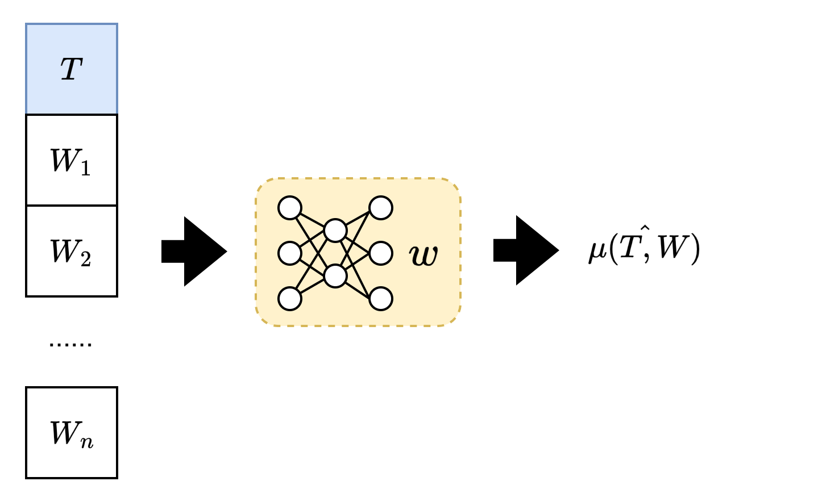
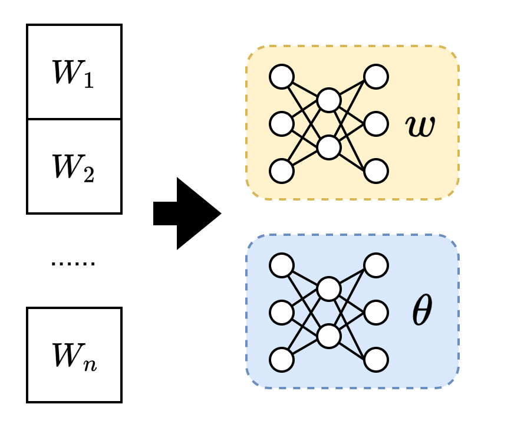
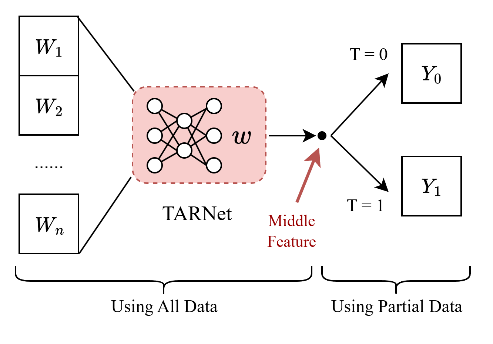
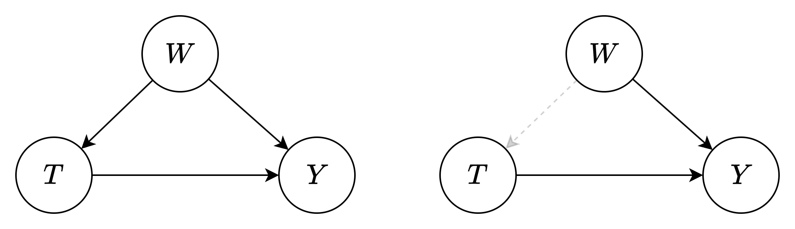
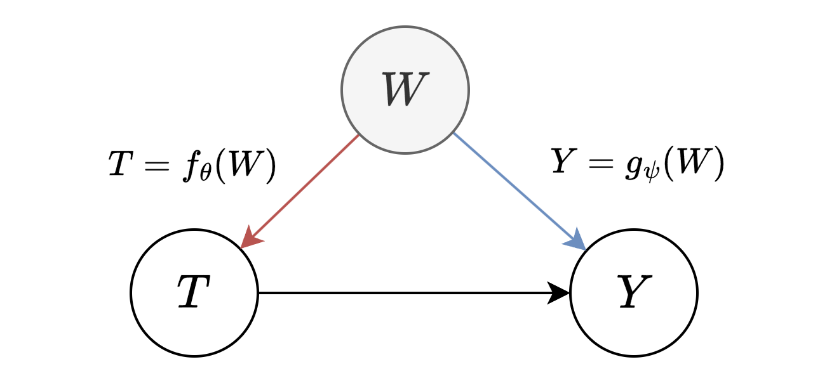
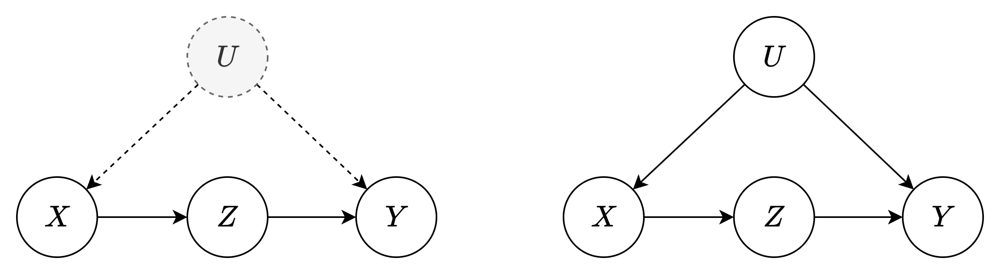

# 因果估计方法

##### Introduction

本章介绍对于因果作用量的估计

通过统计学方法计算因果指标

##### 条件潜在结果模型(COM)

平均治疗效果 `ATE` 是二元情况下对因果作用的计算

其中, W 为 `分组`, 或是一个 `有效调整集`
$$
\text{ATE} = \tau = \mathbb{E}_W [ \mathbb{E}[Y|T = 1, W] - \mathbb{E}[Y|T = 0, W] ]
$$
利用统计模型可以计算内部的两个期望, 称为 `个体治疗效果 ITE`, 以治疗和分组作为参数
$$
\text{ITE}=\mu(T, W) = \mathbb{E}[Y|T, W]
$$
则 ATE 可以计算为 ITE 的平均:
$$
\text{ATE}= \frac{1}{n}\sum_i (\underbrace{\hat{\mu}(1, w_i) - \hat{\mu}(0, w_i)}_\text{using model to estimate} )
$$

- 其中, 外层期望对有效调整集 W 的取值分布进行计算
- 该公式只考虑了单节点 W, 二元治疗的情况

条件平均治疗效果 `CATE` 是在 ATE 的基础上加入条件约束
$$
\begin{aligned}
\text{CATE}= \tau(x) = \mathbb{E}[ \mathbb{E}[Y|T = 1, X = x, W] - \mathbb{E}[Y|T = 0, X = x, W]  ]
\end{aligned}
$$

- 此处可以建立一个模型用于计算内部期望
  $$
  \mu(t, w, x) = \mathbb{E}[Y|T = t, W = W, X = x]
  $$
  因此 CATE 的估计量为
  $$
  \tau(x) = \frac{1}{n_x} \sum_{i: x_i = x} (\mu(1, w_i, x)-\mu(0, w_i, x))
  $$
  

###### COM 估计的问题 — 高维灾难

估计 ATE 或 CATE 中, 如果 W 是多节点(多维向量), 而 T 为一维标量

- 它们共同作为输入, 然而, W 的维度较大时, 可能会掩盖 T
- 这需要对 T 和 W 进行良好的权重分配, 然而, 有理由相信模型会忽略 T

​                                                                                                                                                                                                                                                                                                                                                                                                                                                                             

- **广义潜在结果估计(G-COM Estimator)** 解决这个问题

  定义两个神经网络, 分别估计 $T=0$, 和 $T=1$ 时的 $Y$ 的数学期望
  $$
  \text{ATE}= \frac{1}{n}\sum_i (\hat{\mu}_1( w_i) - \hat{\mu}_0(w_i))
  $$
  

  - 其中, 第一个网络称为 `实验组拟合`, 第二个为 `对照组拟合`
  - 当治疗非二元时, 这种方法需要多个神经网络

##### More Efficiency

###### TARNet  Shalit, 2017

为了避免治疗 T 被调整集数据 W 掩盖, 使用实验组网络和对照组网络分别拟合

- 这导致, 两个网络都使用了更少的数据进行学习
- 可能会使网络差异过大, 或没能学到正确的趋势

因此, 将使用一种混合架构, 使网络利用全部数据进行学习, 并能正确区分治疗 T

- 仍以 W 作为输入, 输出分为两个头
- 希望网络做出一个和 T 无关的中间表示, 随后分别为对照组和实验组输出结果

###### X-Learner  Kunzel, 2019

上述网络仍然在最后部分无法使用所有数据, X-Learner 进一步提升数据使用效率

1. 估计 ITE $\hat{\mu}_1(x)$ 和 $\hat{\mu}_0(x)$

2. 估计实验组 ITE:
   $$
   \text{ITE}_{1, i} = Y_i(1) - \hat{\mu}_0(x_i)
   $$

   - 其中, 在计算 ITE 时, 使用观察数据中的实验组数据, 并利用实验组数据估计对照组数据

3. 估计对照组 ITE
   $$
   \text{ITE}_{0, i} = \hat{\mu}_1(x_i) - Y_i(0)
   $$

4. 学习一个模型 $\hat{\tau}_1(x)$ 以估计 $\text{ITE}_{1,i}$, 同理, 也学习 $\hat{\tau}_0(x)$

5. 将上述两个模型加权以得到 ATE
   $$
   \hat{\tau}(x) = e(x)\hat{\tau}_1(x) + (1-e(x))\hat{\tau}_0(x)
   $$

   - 论文中提到, 使用倾向分数将是有效的
   - 该架构能够使用整个数据集以学习最终的模型, 其技巧便是利用类似插值的方法“补全”了另一个组

##### 逆概率加权

###### 倾向得分

倾向得分是一种因果指标, 表示在足够的调整集下, 实验组样本出现的概率
$$
e(W) = p(T = 1|W)
$$

> **定理** [倾向得分定理]
>
> 倾向得分 e(W)和有效调整集 W 对于条件独立的作用是等价的
> $$
> Y \perp T | W  \Lrarr Y \perp T|e(W)
> $$
>
> - 等价表述: $W$ 和 $e(W)$ 同时阻止所有从 T 到 Y 的后门路径, 并不是任何 T 的子代

- 该定理将倾向得分和有效调整集置于相同的地位
- 无论有效调整集的维度多大, 倾向得分总是一维向量, 这将大大提升其用处
- 使用的关键在于对 $e(w)$ 进行建模, 因为我们无法直接访问 $e(w)$
  - 然而, 不能用简单降维的视角来解决, 否则仍然无法摆脱 W 的高维灾难

小节: 提出倾向的分的科学意义

- 避免有效调整集的高维灾难, 倾向得分可以起到同等的条件独立效果
- 但是因为无法访问倾向得分, 估计其本身又是高维问题

###### 伪种群

核心思想

- 类似于重要性采样
- 是一种使分布均值不偏移的数学方法; 通过对每一个个体的值进行加权, 其效果等同于“混淆因子独立于变量”
- 加权值等于倾向的分的倒数

考虑一种基础的因果图, 按照一定分数加权可消除 W → T 的因果关系

> **定理** [条件加权定理]
>
> 按照 $\frac{1}{p(t \mid w)}$ 对随机变量 Y 进行加权, 等同于在图 $\mathcal{G}_{\overline{T}}$ 上进行采样
> $$
> \mathbb{E}[Y | do(t)] = \mathbb{E}\left [ \frac{ \mathbb{1}\{T = t\}Y  }{p(t \mid W)} \right]
> $$

**证明:**  

联系 `重要性采样` 手段就很好理解, 它只是一种保证数学期望不偏移的方法

- 根据后门调整定理
  $$
  p(y \mid do(t)) = \sum_w p(y \mid t, w)p(w)
  $$

- 在该情况下, 求数学期望
  $$
  \mathbb{E}[Y \mid do(t)] = \sum_w y \cdot p(y \mid t, w)p(w)
  $$

- 两边乘以 $\frac{p(t|w)}{p(t|w)}$ 作等价变化
  $$
  \begin{aligned}
  \mathbb{E}[Y \mid do(t)] &= \sum_w y \cdot p(y \mid t, w) \cdot \frac{p(t|w)}{p(t|w)} \cdot p(w)  \\
  &=\sum_w \frac{1}{p(t|w)} \cdot y \cdot p(y, t, w)  \\
  &= \sum_w \frac{1}{p(t|w)} \cdot y \cdot p(y) \cdot \mathbb{1}\{T = t\} \\
  &=\mathbb{E}\left [ \frac{ \mathbb{1}\{T = t\}Y  }{p(t \mid W)} \right]
  \end{aligned}
  $$
  
  - 重加权并不能改变概率, 只能改变均值
  
    

> 推论 [倾向得分逆加权定理]
>
> 对于 `二元` 处理, 加权分数就是倾向得分的倒数
> $$
> \begin{aligned}
> ATE &= \mathbb{E}[Y \mid T = 1] -  \mathbb{E}[Y \mid T = 0] \\ 
> &= \mathbb{E}\left [\frac{\mathbb{1}(T = 1) Y}{e(W)}\right]-\mathbb{E}\left [\frac{\mathbb{1}(T = 0) Y}{1-e(W)}\right] \\
> &\approx\frac{1}{n_{1}} \sum_{i: t_{i}= 1} \frac{y_{i}}{\hat{e}\left(w_{i}\right)}-\frac{1}{n_{0}} \sum_{i: t_{i}= 0} \frac{y_{i}}{1-\hat{e}\left(w_{i}\right)}
> \end{aligned}
> $$

证明:

- 在二元治疗的情况下, 倾向得分 $e(W) = p(T=1 \mid W)$ 即为实验组概率, 对照组概率则为: $p(T=0 \mid W) = 1-e(W)$ 

上述给出了在可以访问倾向得分估计的情况下, 如何估计 ATE

- 这仍然是一种根据 **统计数据** 计算 **干预值** 的技术

- **一些问题**
  1. 应当符合正性假设, 即倾向的分都是大于 0 的
  2. 对 **倾向得分** 的 **准确估计** 是关键
  3. IPW 的核心假设：**存在可观测的“充分调整集”W**  →  如果存在不可观测的混淆, 则无法使用 IPW
  4. 当出现接近于 0 或 1 的倾向得分, 会导致估计膨胀, 其方差会增大, 类似于重要性采样中的模型失配

本章小结

- 伪种群设计初衷为希望对随机变量进行加权以防止均值偏移
- 和 COM/GCOM 估计器直接对均值进行建模相比, IPW 估计器对倾向得分(概率)建模

##### 双重鲁棒方法

双重鲁棒方法同时对均值和倾向得分进行建模

- 原理: 如果将 $e(W)$ 视作由 $W$ 直接生成的一个因果节点, 那么它同样阻断后门路径

$$
\text{ATE}= \frac{1}{n}\sum_i (\underbrace{\hat{\mu}(1, \hat{e}(w_i)) - \hat{\mu}(0, 1-\hat{e}(w_i))}_\text{using model to estimate both} )
$$

- 其拥有更快的收敛速度

##### 双重机器学习 DML

训练两个模型以从 W 预测 T 和 Y

> **定理** [FWL 定理]
>
> 按照以下程序执行拟合:
>
> 1. 预测 $\hat{T}$, 预测 $\hat{e}_T = T-\hat{T}$
> 2. 预测 $\hat{Y}$, 预测 $\hat{e}_Y = Y-\hat{Y}$
> 3. 预测 $\hat{e}_Y = \eta\cdot \hat{e}_T$
>
> 当干预 T 对结果 Y 的影响是线性时, 即
> $$
> \left \{
> \begin{aligned}
> Y &= kT + f(W) + e_Y  \\
> T &= g(W) + e_T \\
> \end{aligned}
> \right.
> $$
> 则上述程序结束时, $\eta$ 应当等于因果效应 $k$

证明:

- 设干预 T 对结果 Y 的影响是线性的, 完成第一阶段预测
  $$
  \left \{
  \begin{aligned}
  \hat{Y} &= f_\theta(W)  \\
  \hat{T} &= g_\psi(w) \\
  \end{aligned}
  \right.
  $$
  
- 计算各自残差
  $$
  \left \{
  \begin{aligned}
  Y - \hat{Y} &= kT + f(W) + e_Y - f_\theta(W)  \\
  T - \hat{T} &= g(W) +  e_T - g_\psi(w) \\
  \end{aligned}
  \right.
  $$

- 上述过程, 模型可以很好地捕获有效调整集 W 对于因果变量的影响, 因此有:
  $$
  \left \{
  \begin{aligned}
  \hat{e}_Y = Y - \hat{Y}  \\
  \hat{e}_T = T - \hat{T}  \\
  \end{aligned}
  \right.
  $$

- 对残差进行线性拟合, 即
  $$
  \eta^* = \arg \min_\eta \mathbb{E}[(\hat{e}_Y - \eta \cdot \hat{e}_T)^2]
  $$
  
  可以证明, 当 $\eta = k$ 时, 上述目标最小化
  
  证明:
  $$
  \begin{aligned}
  \mathbb{E}[\hat{e}_Y - \eta \cdot \hat{e}_T] &= \mathbb{E}[kT + (f(W) - f_\theta(W)) + e_Y - \eta(g(W) - g_\psi(W)) - \eta e_T] \\
  &= \mathbb{E}[kT - \eta(g(W) + e_T) + (f(W) - f_\theta(W)) + \eta g_\psi(W) + e_Y] \\
  &= \mathbb{E}[ (f(W) - f_\theta(W)) + \eta g_\psi(W) + e_Y]  &\quad &\text{for} ~~ T = g(W)+e_T\\
  &= \mathbb{E}[  -kT + \eta g_\psi(W) + e_Y ] &\quad &\text{for} ~~ f(W) - f_\theta(W) \approx f(W)-\hat{Y}\\
  &\ge \mathbb{E}[e_Y] = 0, \quad k =\eta
  \end{aligned}
  $$

因此, 双重机器学习第一阶段作用在对 T 和 Y 的预测上, 第二阶段作用在对残差的预测上

使用的关键在于能否假设干预对结果的作用视作 `线性的`, 即是否满足 `FWL定理`

##### 小结

Q: 为什么常研究二元处理效应

- 因为即使有多元处理(例如: 离散的不同动作), 针对一个基线来说, 仍然可以划分为实验组和对照组, 因此, 二元的划分本质并不在于处理是否为二维离散, 而是在于如何划分实验组和对照组
- 针对每一对实验组-对照组, 都可以计算 ATE 以估算因果作用

Q: 如下问题中, 如何揭示 ATE 估计器和基于 do-calculus 计算 ATE 的本质关联

- 本质来讲, $ATE = \mathbb{E}[Y \mid do(x_1)] - \mathbb{E}[Y \mid do(x_0)] $, 这要求我们知道 **干预分布** $p(y \mid do(x))$
  - 干预分布一般无法观测, 尤其是对于已经发生过的事实, 其反事实分布更加难以得知
  - do-calculus **从理论上** 告诉我们, 这个干预分布是否可以识别
  - 若可从其他变量的观测分布计算干预分布, 称为`可识别`

- 当因果 **可以识别**(由 do-calculus 指出)时
  - 当混淆因子可以观测时, 使用 do-calculus 和使用估计器无本质区别, 其都是通过对概率或是均值进行直接建模和估计来计算 ATE
  - 当混淆因子不可观测时, 必须利用 do-calculus 进行 ATE 估计, 因为 COM/IPW 估计器都是基于观测的
- 当因果 **不可识别**(由 do-calculus 指出)时, **无论什么方法** 都不能准确估计 ATE

Q: 计算ATE的意义

- 这是个学习因果必然会思考的问题, 我们在一开始都容易将其作为一个没什么意义的指示量进行对待
- 实际上, **ATE和干预分布是一种相互的体现**, 就如同数学期望和概率分布的关系一样
- ATE从**数值上**指出因果关系, 干预分布从**概率上**指出因果关系
- 有些时候干预分布和ATE只有**其中之一**容易计算和估计

