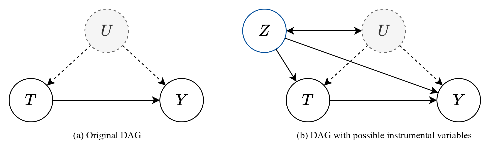
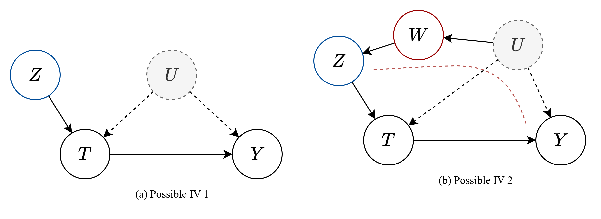
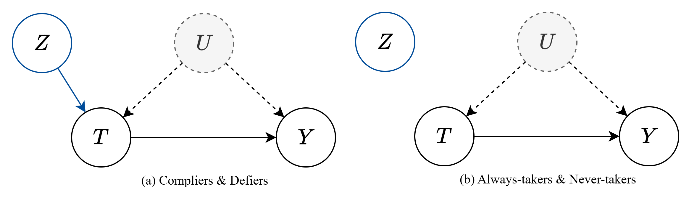

# 工具变量

##### 前言

存在不可观测的混淆变量时, 能否识别因果关系是一大难题

- 后门调整准则: 能否阻断 T 到 Y 祖先的全部后门路径
- 前门调整准则: 沿着 T 到 Y 的前门路径一步一步识别
- do-calculus: 三法则

上述三种方法都可以存在不可观测混淆时使用, 以识别因果关系, 并且, 即使无法识别, 也可以使用边界方法

**工具变量** 是处理不可观测的混淆变量的一种新方案

##### 线性参数识别

需要注意的是, 一旦引入工具变量, 意味着识别目标将不再是变量的分布或是作用量, 而是 SCM 方程中的参数

- 即: 工具变量方法基于 SCM 的参数, 它不做非参数的识别
- 非参数的识别: do-calculus, 通过观测数据直接计算干预分布/干预作用量

考虑以下图:

如图(a), 存在不可观测混淆因子 $U$, 由于不能阻断 $T\rarr Y$ 的后门路径, 因此该因果图不可识别

此时引入工具变量, 其具备三个假设

> **假设 1** [工具变量相关性假设]
>
> 工具变量 Z 应当对 T 有一个因果效应
>
> **假设 2** [工具变量排他性假设]
>
> 工具变量 Z 对 Y 的影响应当完全经过 T
>
> **假设 3** [工具变量无混淆假设]
>
> 工具变量 Z 对 Y 的所有后门路径都应当可以被阻断

- 以上三条规定了 Z 可能出现的形式: 1. 直接作用于 T, 且和 U 独立; 2. 直接作用于 T, U 通过可观测节点影响 Z

  

现在, 假设 T 对 Y 的因果作用是线性的, 遵循图(a)
$$
Y = \delta T + f(U) + \epsilon
$$
由于 Z 直接控制 T, 我们写出 Z 对 Y 的因果作用量
$$
\begin{aligned}
ATE_{Z \rarr Y} &= \mathbb{E}[Y \mid Z = 1 ] - \mathbb{E}[Y \mid Z = 0 ] \\ 
&= \mathbb{E}[ \delta T + f(U) + \epsilon \mid Z = 1 ] - \mathbb{E}[ \delta T + f(U) + \epsilon \mid Z = 1 ]  &&\text{排他性} \\
&= \delta( \mathbb{E}[ T \mid Z = 1 ] - \mathbb{E}[ T \mid Z = 0]) + (\mathbb{E}[f(U) \mid Z = 1 ] - \mathbb{E}[ f(U) \mid Z = 0])  &&\text{相关性} \\
&= \delta \cdot ATE_{Z \rarr T}   &&\text{无混淆性} \\
\end{aligned}
$$
可以看到, 我们识别的目标是 SCM 中的参数
$$
\delta = \frac{ATE_{Z \rarr Y} }{ATE_{Z \rarr T}} = \frac{\mathbb{E}[Y \mid Z = 1 ] - \mathbb{E}[Y \mid Z = 0 ] }{ \mathbb{E}[ T \mid Z = 1 ] - \mathbb{E}[ T \mid Z = 0]}
$$

> **定理** [连续变量线性识别]
>
> 在连续变量的情况下, 如果满足线性假设, 则由工具变量可以识别参数为
> $$
> \delta = \frac{Cov(Y, Z)}{Cov(T, Z)}
> $$

**证明:**

- 根据协方差公式
  $$
  \begin{aligned}
  Cov(Y, Z) &= \mathbb{E}[YZ] -  \mathbb{E}[Y]\mathbb{E}[Z] \\
  &= \mathbb{E}[( \delta T + f(U))Z] -  \mathbb{E}[ \delta T + f(U)]\mathbb{E}[Z]  \\
  &= \delta \mathbb{E}[TZ] + \mathbb{E}[f(U)Z] -  \delta \mathbb{E}[T]\mathbb{E}[Z] - \mathbb{E}[f(U)]\mathbb{E}[Z] \\
  &= \delta Cov(T, Z) + Cov(f(U), Z) \\
  &= \delta Cov(T, Z) \\
  \end{aligned}
  $$

- 需要注意的是, 遵循图(a)我们判定 Z 和 U 是独立的, 在无混淆假设的弱化形式下(图(b)), 上述式子将在给定 Z 到 Y 的有效调整集下成立

通过一种 **两阶段线性回归 (2SLS Estimator, KA Bollen, 1996)** 的方法即可计算该参数

1. 根据相关性假设, 对 Z 和 T 线性回归, 得到线性系数
2. 给定 Z 情况下, 完全控制 T, 得到 $\hat{T}$
3. 采样一些 $\hat{T}$, 回归 Y 和 $\hat{T}$, 计算相关系数
4. 计算 $\hat{\delta} = \frac{Cov(Y, \hat{T})}{Cov(T, Z)}$

##### 局部非参数识别

由于并非所有模型都可以很好地用线性描述, 因此上述结论并不是那么完备

根据工具变量 Z 对治疗 T 的影响, 并考虑到 U 的干扰, 将数据分为四组

1. 遵循者(Compliers): $T(Z=1) = 1, ~ T(Z=0)=0$
2. 违抗者(Defiers): $T(Z=1) = 0, ~ T(Z=0)=1$
3. 永受者(Always-takers): $T(Z=1) = 1, ~ T(Z=0)=1$
4. 永拒者(Never-takers): $T(Z=1) = 0, ~ T(Z=0)=0$

上述四种分组, 对应着 U 对 T 的锁定强度, 或者说, 在 U 的干扰下, 工具变量 Z 对 T 的影响强弱

为了进行进一步推导, 需要引入工具变量对治疗的单调性假设

> **公理** [工具变量的单调性假设]
>
> 我们假设工具变量对治疗引起一种单调的引导作用, 这种大小比较并不一定是数值意义上的, 但必须是有序的
> $$
> T_i(Z = 1) \ge T_i(Z = 0), \quad \forall i
> $$
>
> 假设的意义是消除了 `违抗者`, 即从实验设置层面消除了这种可能

设分组集合为 $C$
$$
\begin{aligned}
\mathbb{E}[Y(Z = 1) - Y(Z = 0)] &= \mathbb{E}_C [\mathbb{E}[Y(Z = 1) - Y(Z = 0) \mid C = c_i]] \\
&= \mathbb{E}[Y(Z = 1) - Y(Z = 0) \mid \text{Compliers}] \cdot p(\text{Compliers}) \\
&+\mathbb{E}[Y(Z = 1) - Y(Z = 0) \mid \text{Defiers}] \cdot 0  \\
&+\mathbb{E}[0 \mid \text{Always-takers}] \cdot p(\text{Always-takers})  \\
&+\mathbb{E}[0 \mid \text{Never-takers}] \cdot p(\text{Never-takers})  \\

\end{aligned}
$$

- 上述第二项为 0 是因为假设消除了违抗者
- 第三第四项为 0, 是因为这两组中, T 实际上独立于 Z, 因此条件不作用, 均值相同

因此, 有如下关系
$$
\mathbb{E}[Y(Z = 1) - Y(Z = 0) \mid T(1)= 1, T(0)= 0] 
= \frac{\mathbb{E}[Y(Z = 1) - Y(Z = 0)] }{p(T(1)= 1, T(0)= 0)}
$$
由于在该分组中, 治疗 T 服从工具变量 Z 的引导, 因此, 实际上这就等于 ATE
$$
\mathbb{E}[Y(T = 1) - Y(T = 0) \mid T(1)= 1, T(0)= 0] 
= \frac{\mathbb{E}[Y \mid Z = 1] - \mathbb{E}[Y \mid Z = 0]}{p(T(1)= 1, T(0)= 0)}
$$

- 上式称为 `局部平均治疗效应 Local Average treatment effect, LATE`
- 上式计算的是在遵循者分组中的 ATE
- 上式的 Z 干预效应改为了条件期望, 因为工具变量是无混淆的

另外, 注意到有如下关系
$$
\begin{aligned}
p(T(1)= 1, T(0)= 0) &= 1- p(T = 0 \mid Z = 1) - p(T = 1 \mid Z = 0) \\
&= 1- [1- p(T = 1 \mid Z = 1)] - p(T = 1 \mid Z = 0) \\
&= p(T = 1 \mid Z = 1) - p(T = 1 \mid Z = 0)
\end{aligned}
$$

- 由于消除了违抗者, 因此, 根据 $T(Z)$ 的分布可以唯一确定样本的分组
- $T=0 \mid Z=1$ 只能是 Never-takers, $T=1 \mid Z=0$ 只能是 Always-takers
- 当 $Z=1$ 时, 还可以根据 $T$ 唯一区分 Compliers 和 Never-takers

在二元作用的情况下, 可以将概率写作条件期望
$$
p(T = 1 \mid Z = 1) - p(T = 1 \mid Z = 0) = \mathbb{E}[T \mid Z = 1] - \mathbb{E}(T \mid Z = 0)
$$
得到 LATE 的二元治疗表达
$$
\mathbb{E}[Y(T = 1) - Y(T = 0) \mid T(1)= 1, T(0)= 0] 
= \frac{\mathbb{E}[Y \mid Z = 1] - \mathbb{E}[Y \mid Z = 0]}{\mathbb{E}[T \mid Z = 1] - \mathbb{E}(T \mid Z = 0)}
$$

- 上式右边为 **线性参数** 情况下的参数估计
- 表明: **遵循者** 分组表征着治疗对于结果 **产生线性影响** 的部分
- 换句话说: 线性参数假设实际上假设了所有样本都是遵循者
- 也可以理解为: 遵循者描述了因果效应中, **因果 = 相关** 的部分

##### 广义加性识别

考虑如下 `广义加性模型`
$$
Y = f(T, W) + U
$$

> [1] Hartford J, Lewis G, Leyton-Brown K, et al. Deep IV: A flexible approach for counterfactual prediction [C]//International Conference on Machine Learning. PMLR, 2017: 1414-1423.
>
> [2] Xu L, Chen Y, Srinivasan S, et al. Learning deep features in instrumental variable regression [J]. arXiv preprint arXiv: 2010.07154, 2020.

- 其中, 具体的函数 $f$ 可能是一种神经网络
- **噪声**以相加的形式对结果进行干扰, **且不可观测**

###### 反事实推断函数

定义反事实推断函数:
$$
h(t, w) = \mathbb{E}[Y \mid do(T=t), W=w] = f(t, w) + \mathbb{E}[U \mid do(T=t), W=w]
$$

- 需要估计的结构方程为 $f(\cdot)$

- 条件平均处理效应: 
  $$
  \begin{aligned}
  CATE &= \mathbb{E}[Y \mid T=t_2, W=w] - \mathbb{E}[Y \mid T=t_1, W=w] \\
  &= f(t_2, w) -  f(t_1, w)
  \end{aligned}
  $$

- 上式假设了处理不会影响噪声

但是实际上, 当 T 和 Y 的后门路径并不能完全阻断, 即在给定 W 时, 并不能看作 U 对 Y 不再产生影响
$$
\begin{aligned}
CATE &= \mathbb{E}[Y \mid T=t_2, W=w] - \mathbb{E}[Y \mid T=t_1, W=w] \\
&= f(t_2, w) -  f(t_1, w) + (\mathbb{E}[U \mid T=t_2, W=w] - \mathbb{E}[U \mid T=t_1, W=w])
\end{aligned}
$$
使用工具变量 $Z$ 以消除这种差异, 满足三个假设的称为工具变量

1. **假设 1** [工具变量相关性假设]:  工具变量 Z 应当对 T 有一个因果效应

2. **假设 2** [工具变量排他性假设]:  工具变量 Z 对 Y 的影响应当完全经过 T

3. **假设 3** [工具变量无混淆假设]:  工具变量 Z 对 Y 的所有后门路径都应当可以被阻断

$$
\begin{aligned}
CATE_{Z \rarr Y} &= \mathbb{E}[Y \mid Z=z_2, W=w] - \mathbb{E}[Y \mid Z=z_1, W=w] \\
&= \mathbb{E}[f(T, W) + U \mid Z=z_2, W=w] - \mathbb{E}[f(T, W) + U \mid Z=z_1, W=w] \\
&= \mathbb{E}[f(T, w)\mid Z=z_2] - \mathbb{E}[f(T, w) \mid Z=z_1]\\
\end{aligned}
$$

- 上式消除了 $U$ 的影响, 因为无混淆性假设, 在给定Z时, Y的影响完全被确定
- 工具变量将对结果Y的影响, 转换为对处理T的影响, 从而识别参数

问题转换为, 对以下作用量的识别
$$
\begin{aligned}
\mathbb{E}[y \mid z, w]   &= \mathbb{E}[f(T, w) \mid z, w] + \mathbb{E}[U \mid w]    \\ 
&= \int h(t, w)  p(t \mid w, z)dt
\end{aligned} \tag{E.1}
$$

- 上式中, $h(t, w) $​ 为反事实预测函数, $p(t \mid w,z)$ 为条件处理分布函数
- 上式使用了工具变量的三条假设
- 上式实际上定义了一个 $h(t,w)$ 的估计问题: 因为 $\mathbb{E}[y \mid z, w]$ 和 $p(t \mid w, z)$ 都是可观测的

###### 利用神经网络估计反事实推断函数

直接优化结构方程 $\hat{h}$ 的估计, 最小化 $l_2$ 损失，目标是求解以下公式
$$
\min_{\hat{h} \in H} \sum_{i=1}^{n} \left( y_i - \int_{t} \hat{h}(p, x_t) p(t \mid w_i, z_i)dt \right)^2
$$
此处处理分布 $p_{\theta}(t \mid w_i, z_i)$ 需要从数据中学习

**第一阶段:** 学习处理分布  $p_{\theta}(t \mid w_i, z_i)$

**第二阶段:** 利用学习好的处理分布, 学习反事实分布

