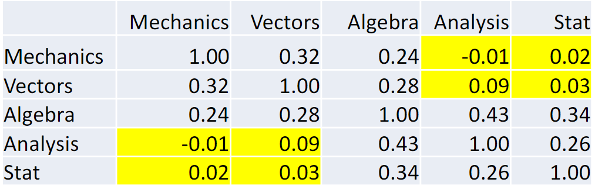
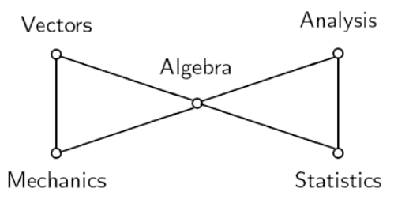
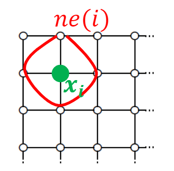
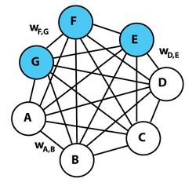

# 马氏随机场-伊辛模型

##### 简述

概率图模型关注一个多元随机变量, 或称随机向量 $\mathbf{x}$

- 这些变量从根本上而言服从一个联合分布 $p(\mathbf{x})$
- 不能单独考察单独某些分量 $x_i, i\in S$ 的分布, 应当以 **条件分布** 为前提

固定其他分量, 考察剩余分量的分布称为条件分布, 具有以下记号
$$
x_{-S} := \{x_i \mid i \notin S \}
$$
对应的分布为: **固定其他分量情况下的条件分布**
$$
p(x_S \mid x_{-S})
$$

###### 多元正态分布 multivariate normal distribution (mvnd)

> **引理1** [多元正态分布规范]
>
> 随机向量同时满足以下性质, 当且仅当其为多元正态分布
>
> 1. 球面对称性: 累积分布仅和模长有关
>    $$
>    \int_{\ge 0} p(\mathbf{x}) = \int_{\ge 0} e^{-||\mathbf{x}||^2}d\mathbf{x} = \iint_{\ge 0} e^{-r^2}r^{n-1}dr d\sigma
>    $$
>
> 2. 分量独立性: 每个分量可拆分, 即累积分布可拆分为n个积分
>    $$
>    \int_{\ge 0} p(\mathbf{x}) = \int_{\ge 0} e^{-||\mathbf{x}||^2}d\mathbf{x} = (\int_{\ge 0} e^{-x^2}dx)^n = \pi^{\frac{n}{2}}
>    $$

协方差矩阵定义并构造了mvnd的形状, 其逆矩阵称为精度矩阵
$$
\begin{align*}
p( \mathbf{x}) &= \frac{1}{(2\pi)^{\frac{p}{2}}|\Sigma|^{\frac{1}{2}}}e^{-\frac{1}{2}\mathbf{x}^T\Sigma^{-1}\mathbf{x}}\\
& \propto |\Omega|^{\frac{1}{2}} e^{-\frac{1}{2}\mathbf{x}^T\Omega\mathbf{x}}
\end{align*}
$$

- 其中, $\Sigma= \mathbb{E}[xx^T] >0$, 而 $\Omega = \Sigma^{-1}$
- **分量之间的相关性**和**协方差矩阵**有关
- 固定其中某些分量而考察其他分量的**条件相关性**时, 它由**协方差矩阵的逆**决定

> **定理1** [精度矩阵和条件相关性]
>
> 考虑一个多元正态分布 $\mathbf{x} \sim \mathcal{N}(0, \Omega^{-1})$, 其中 $[\omega_{ij}] = \Omega$, 则条件相关性等价于精度矩阵的非零性质
> $$
> x_i \perp x_j \mid \mathbf{x}_{-(i,j)} \Lrarr \omega_{ij} =0
> $$

上述定理可以通过求条件相关系数得到, 即:
$$
\rho_{x_i, x_j|\mathbf{x}_{-(i,j)}} = -\frac{\omega_{ij}}{\sqrt{\omega_{ii}\omega_{jj}}}
$$

- 其等价于, 当精度矩阵某位置为0时, 则指数上二次型没有该分量的交叉量

- 所有位置的条件偏相关系数矩阵可以由精度矩阵得到
  $$
  R_p = 2I_n - D^{-\frac{1}{2}} \Omega D^{-\frac{1}{2}},~ D=\text{diag}(\Omega)
  $$
  其中, $- D^{-\frac{1}{2}} \Omega D^{-\frac{1}{2}}$ 就是计算 $-\frac{\omega_{ij}}{\sqrt{\omega_{ii}\omega_{jj}}}$ 的过程

###### 马尔科夫随机场 MRF

由上述, 精度矩阵可以度量两个随机分量之间的条件相关性质, 假设分量下标在顶点集合 $V=\{1,2,3,...,n\}$ 中, 则精度矩阵充当路由矩阵的性质, 定义出一个无向图

例如: 五门课的条件相关性矩阵如下

可以看到, 其中有四对近似独立的关系, 因此, 可以绘制如下的无向图

这种图阐述了随机分量的条件分布, 仅和它的邻居节点有关, 因此称其为 **马尔科夫性**的
$$
x_i \perp x_{-(i, ne_i)} | x_{ne_i} \Leftrightarrow p(x_i | x_{-i}) = p(x_i | x_{ne(i)})
$$

###### Hammersley-Clifford 定理

上述论述都是根据实际分布来得到潜在的变量结构, 然而, 更加常见的是其逆问题:

- 即, 当我们根据实际问题背景的时间或空间结构定义马尔科夫条件
  $$
  p(x_i | x_{-i}) = p(x_i | x_{ne(i)})
  $$
  时, 其背后蕴含的整体的联合分布是如何的

HC定理描述了MRF的联合概率分布可以表示为一种指数形式，其中指数部分由所有最大团的势函数之和构成。

> **定理** [HC定理]
>
> 如果 **马尔可夫随机场** (MRF)的联合分布 $p(\mathbf{x}) > 0$ （未必正态），那么它具有如下 Boltzmann 分布形式： 
> $$
> p(\mathbf{x}) = \frac{1}{Z} \exp(-H(\mathbf{x}))
> $$
> 其中, $H(\mathbf{x})$ 称哈密顿能量函数

其特殊形式: 当随机变量之间的关系构成网格时, 即单个节点仅和周围四个邻居具有相关性时, 其能量函数具有简单的形式
$$
p(\mathbf{x}) = \frac{1}{Z}e^{-\sum_{(i,j)}\phi_{ij}(x_i, x_j)}
$$

- 其中, $(i,j)$ 表示任意相邻的格点对

当随机变量的取值只有两个态时(如±1), 则能量函数必然具有简单形式:
$$
\phi_{ij}(x_i, x_j)= a_{ij} + b_ix_i + c_jx_j + d_{ij}x_ix_j
$$
这被称为 **Ising模型** , 其最初定义在外加磁场作用下的磁针联合分布, 在邻居耦合参数 $J$ 和外加磁场 $H$ 的作用下, 在温度 $T$时, 哈密顿能量函数形式为:
$$
H(\mathbf{x}) =-\frac{1}{T}(J\sum_{i,j}x_i x_j + H\sum_i x_i)
$$
这种联合分布描述了网格状态的变化, 当温度到达某一临界时, 会有大片的磁针趋于同一状态, 此时物质体现出磁性, 这一温度称为 **居里温度** $T_C$

##### MRF理论的应用

MRF理论从上层意义上讲, 它从一个局部的视角研究一个高维的随机向量的演化规则

因此, 任何具有如下特征的工程问题, 都可以尝试使用MRF理论建模

- 问题是大规模的, 状态或决策变量的维度很高
- 问题中, 单次无法获得全局的信息, 只能得到局部
- 问题中, 分量之间通过交互作用进行影响

###### 玻尔兹曼机-随机伊辛模型

注意, 玻尔兹曼分布的形式背后实际上是一个连续乘法的分布
$$
\prod p(x_i) = \prod e^{\ln p(x_i)} = e^{\sum \ln p(x_i)}=e^{\sum \phi(x_i)}
$$
由于概率函数总是 $p(x) \gt0$, 因此变换 $\phi(x)=\ln p(x) \in \mathbb{R}$ 对任意分布成立, 但需要注意, 这段推导的大前提是, $x_1, x_2,..., x_n$ 构成联合分布, 因此应满足约束
$$
\sum p(x_!, x_2,...,x_n)=1
$$
为了满足这个约束, 必须在指数变换后, 除以归一化系数
$$
Z = \sum e^{\phi(x_i)}
$$
这实际上和机器学习的softmax归一化是一样的公式

从上述对于ising模型的变换过程可以看出, 神经网络多分类的最终softmax输出, 反映的就是最后一层神经元相互之间的交互作用综合结果

- 它们并不是通过空间上的邻居关系交互, 而是一种时间上的交互关系
- 最后一层神经元因为先前层的神经元的信息传递, 使其在时间上产生了交互关系
- 最后一层神经元在MRF构型上, 每个随机分量之间都会产生连接, 单论其一层, 称 **玻尔兹曼机**

*输入-输出过程*

玻尔兹曼机的结构为: 由各个单元(分为可见类和不可见类)之间通过权重相互连接, 在可见类中, 每个时刻接受输入 $\mathbf{x}$, 随后, 联合系统的不可见类(隐藏神经元) $\mathbf{h}$ 根据联合分布:
$$
p(\mathbf{x}, \mathbf{h}) = \frac{1}{Z} e^{-\sum_{i,j}w_{ij}s_is_j - \sum_i \theta_i s_i}, s_i \in \mathbf{x} \cup \mathbf{h}
$$
进行采样, 得到需要生成的总体变量 $\hat{\mathbf{y}} \sim p(\mathbf{x}, \mathbf{h})$

需要注意, 经典的玻尔兹曼机的输入-输出-状态全都是 **±1** 二项分布, 称 **正相** 和 **负相**, 在每一时刻, 输入过程即将可见神经元需要输入的位置数据固定为正相, 而其他神经元的值均需要根据上一时刻的概率分布进行采样得到

*训练过程*

玻尔兹曼机的训练通过对比KL-散度进行
$$
\mathcal{L}=D_{KL}( P^{+}(v) ||  P^{-}(v))=\sum_{v} P^{+}(v) \ln \left(\frac{P^{+}(v)}{P^{-}(v)}\right)
$$
玻尔兹曼机训练涉及两个交替的阶段。一个是“正”阶段，其中可见单元的状态被钳制到从训练集中采样的特定二进制状态向量。另一个是“负”阶段，网络可以自由运行，即只有输入节点的状态由外部数据决定，而输出节点可以浮动。

关于给定权重的梯度由以下公式给出
$$
\frac{\part \mathcal{L}}{\part w_{ij}}=-\frac{1}{R}\left[p_{i j}^{+}-p_{i j}^{-}\right]=-\eta[<s_i, s_j>_\text{data}-<s_i, s_j>_\text{model}]
$$

- $<s_i, s_j>_\text{data}$：正相中单元 i 和 j 在**数据分布**下的共激活概率。
- $<s_i, s_j>_\text{model}$：负相中单元 i 和 j 在**模型分布**下的共激活概率。

这个结果源于一个事实：在热平衡状态下，当网络自由运行时，任何全局状态 $\mathbf{s}$ 的概率都由玻尔兹曼分布给出。

- 这意味着每个神经元的状态和局部关联的神经元构成ising模型, 体现在玻尔兹曼分布的交叉项中 (宏观)
- 其具有马尔科夫性, 因此梯度更新时, 它只和局部邻居的状态有关系 (微观)

*生物和物理一致性*

这个学习规则在生物学上是合理的，因为改变权重所需的唯一信息是由**“局部”信息**提供的。

也就是说，连接（在生物学上是突触）**不需要关于它所连接的两个神经元之外的任何信息**。这比许多其他神经网络训练算法（如反向传播）中连接所需的信息更符合生物学实际。

在BP神经网络中, 以多分类任务为例, 我们实际上是通过层层传递的方式, 从最后一层的softmax输出得到了全局的玻尔兹曼分布, 从而可以采样全局状态, 其更新的链式法则表明, 时间上越靠前的神经元, 其更新需要后续神经元的全部信息

- 这在生物学和物理学上是不合理的, 因为对于时间上靠前的神经元, 它的更新动作是一个非因果的动作
- 这阻碍了流式的学习, 即在不清楚最终输出时, 我们无法更新神经元

许多问题中, 我们在每一时刻都只能得到模型的局部数据:

- 时间上, 我们没有能力搜集全局数据, 它们是分布式的
- 空间上, 我们只能得到交互信息, 而无法建模整体信息

在这些性质的约束下, 隐式借鉴玻尔兹曼机的思想就比较合理

*玻尔兹曼机的缺点*

玻尔兹曼机的尺寸一旦增大, 就会停止学习正确模式, 其原因包含如下:

1. 基于玻尔兹曼分布的前提是机器达到热平衡状态, 这要求搜集平衡后的统计信息, 而搜集的时间复杂度随结构规模呈现指数性质
2. 玻尔兹曼机的可塑性过强, 当规模增大时, 噪声的干扰会使信号不断游走直至饱和

###### 基于局部Ising交互的路由模型

*Ising 理论构造*

考虑二维格点晶格构造, 每个格点具有四个指向构型 $v\in \{N,S,W,E\}$

 设 $v_i$ 表示格点i构型指向的单位矢量, $v_h$ 表示外加单位矢量, 则哈密顿量:
$$
\mathcal{H} = J \sum_{<i,j>} v_i \cdot v_j + H \sum_i v_i \cdot v_h
$$
其构型的联合概率分布服从
$$
P(v) = \frac{1}{Z} e^{-\frac{1}{T} \mathcal{H}}
$$
当该分布取最大时, 可以正确描述外加指向时的构型分布, 其中, $Z$ 为分配函数, 表示所有构型的指数形态求和, 复杂度 $4^N$
$$
v^* = \arg \max_v P(v)
$$

*路径理论构造*

考虑路由请求, 在 $t$ 时刻发起从起点 $a$ 到终点 $b$ 的下一跳请求, 网格拓扑

考虑可能的路径 $L$, 有指标
$$
\mathcal{L}[L] = - \int_L (J\sum_{<i,j> \in Ne(x)}v_i \cdot v_j + H v_i \cdot v_x ) \cdot dl
$$

- 第一项, 表示所经过格点的局部相互作用, 局部构型越整齐, 则能量越低
- 第二项, 表示经过格点的路径依赖性, 路径和格点指向平行, 则能量越低

当这个指标最小化时, 根据上述分析, 其产生的路径满足如下性质:

1. 路径应当和格点分布对齐, 即沿着格点指向运行
2. 路径应当经过格点构型均匀分布的区域, 即不混乱的部分

